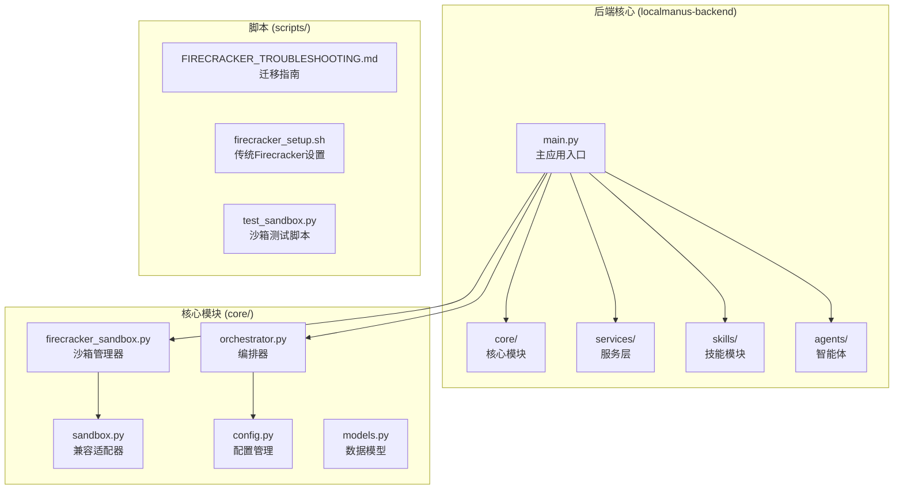
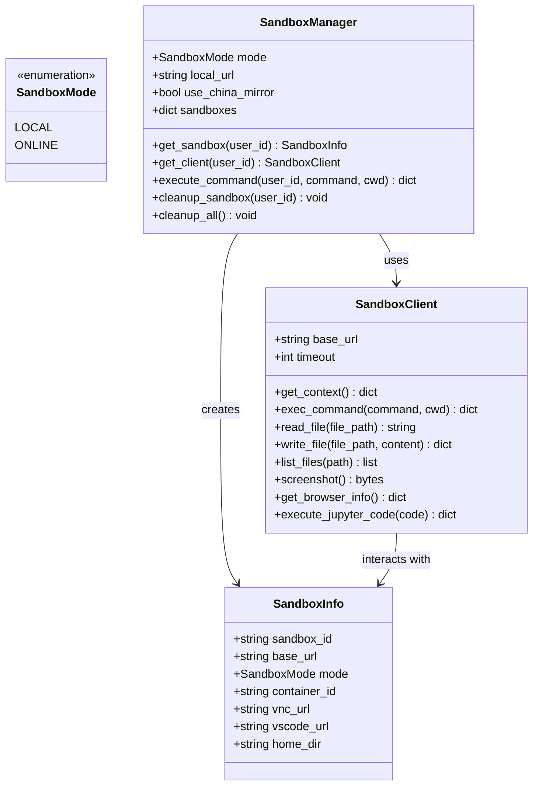
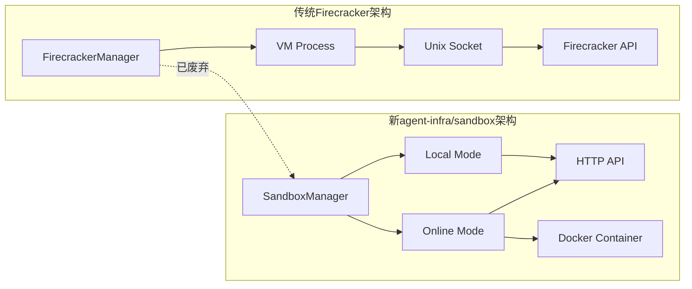
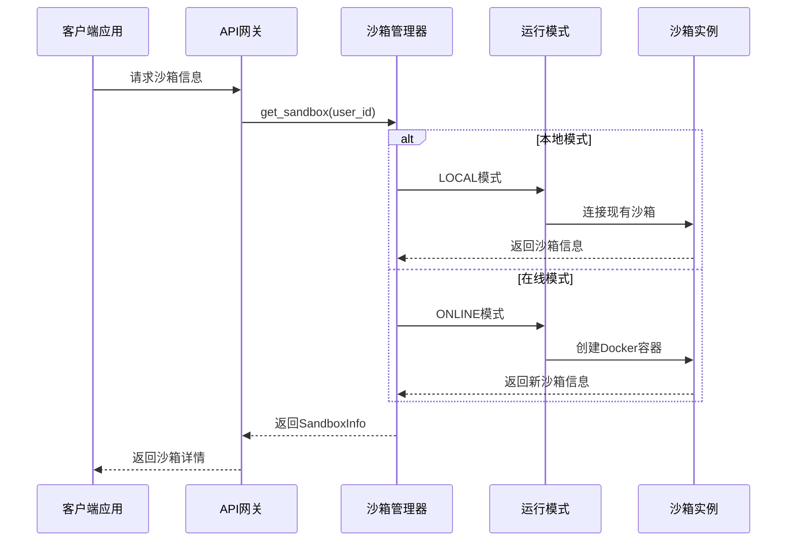
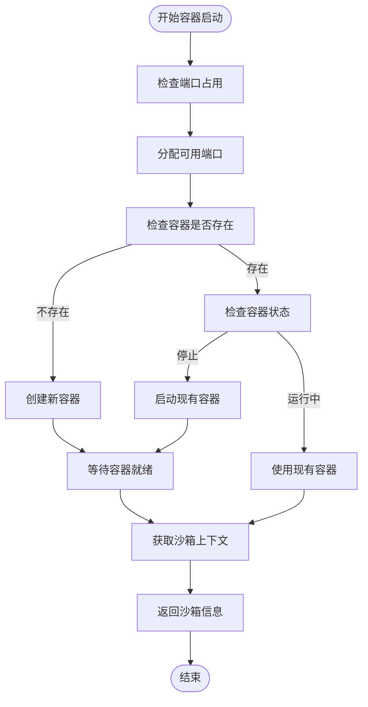
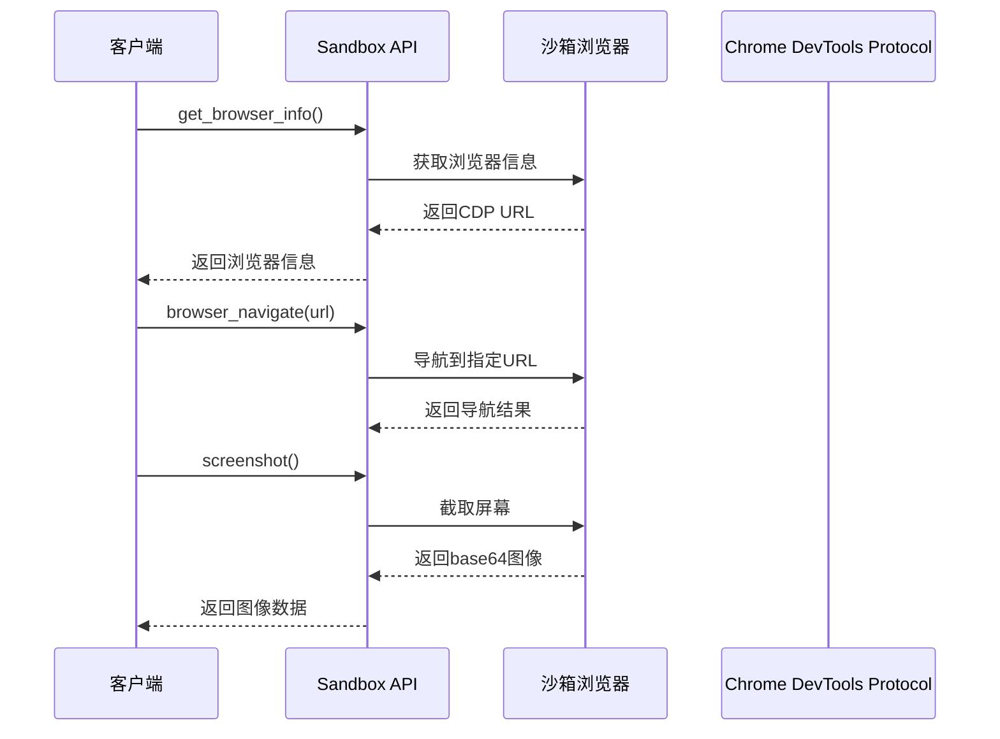
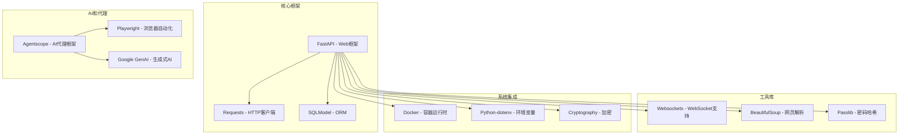
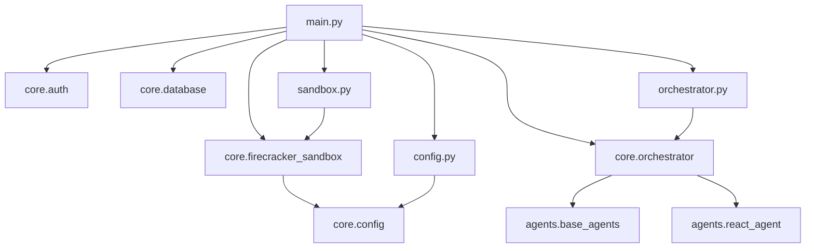

# Firecracker沙箱安全权限增强

<cite>
**本文档引用的文件**
- [firecracker_sandbox.py](file://localmanus-backend/core/firecracker_sandbox.py)
- [sandbox.py](file://localmanus-backend/core/sandbox.py)
- [FIRECRACKER_TROUBLESHOOTING.md](file://localmanus-backend/scripts/FIRECRACKER_TROUBLESHOOTING.md)
- [firecracker_setup.sh](file://localmanus-backend/scripts/firecracker_setup.sh)
- [test_sandbox.py](file://localmanus-backend/scripts/test_sandbox.py)
- [main.py](file://localmanus-backend/main.py)
- [config.py](file://localmanus-backend/core/config.py)
- [requirements.txt](file://localmanus-backend/requirements.txt)
- [orchestrator.py](file://localmanus-backend/core/orchestrator.py)
- [base_agents.py](file://localmanus-backend/agents/base_agents.py)
</cite>

## 目录
1. [简介](#简介)
2. [项目结构](#项目结构)
3. [核心组件](#核心组件)
4. [架构概览](#架构概览)
5. [详细组件分析](#详细组件分析)
6. [安全权限增强分析](#安全权限增强分析)
7. [依赖关系分析](#依赖关系分析)
8. [性能考虑](#性能考虑)
9. [故障排除指南](#故障排除指南)
10. [结论](#结论)

## 简介

LocalManus项目中的Firecracker沙箱安全权限增强是一个重要的系统重构，旨在提供更安全、灵活且功能丰富的沙箱执行环境。该项目从传统的Firecracker微虚拟机架构迁移到基于Docker容器的agent-infra/sandbox架构，实现了以下关键改进：

- **双模式支持**：本地共享模式和在线隔离模式
- **增强的安全性**：通过Docker容器实现进程级隔离
- **丰富的开发工具**：内置浏览器自动化、VSCode服务器、Jupyter内核
- **简化部署**：无需复杂的内核编译和根文件系统配置
- **灵活的配置**：支持环境变量驱动的配置管理

## 项目结构

LocalManus项目采用模块化架构设计，主要包含以下核心目录和文件：



**图表来源**
- [main.py:1-524](file://localmanus-backend/main.py#L1-L524)
- [firecracker_sandbox.py:1-313](file://localmanus-backend/core/firecracker_sandbox.py#L1-L313)
- [FIRECRACKER_TROUBLESHOOTING.md:1-304](file://localmanus-backend/scripts/FIRECRACKER_TROUBLESHOOTING.md#L1-L304)

**章节来源**
- [main.py:1-524](file://localmanus-backend/main.py#L1-L524)
- [requirements.txt:1-18](file://localmanus-backend/requirements.txt#L1-L18)

## 核心组件

### 沙箱管理器 (SandboxManager)

沙箱管理器是整个系统的核心组件，负责管理用户沙箱实例的生命周期。它支持两种运行模式：

#### 本地模式 (LOCAL Mode)
- 连接到现有的共享沙箱实例
- 使用HTTP API与沙箱通信
- 适用于开发和测试环境
- 共享资源，无容器开销

#### 在线模式 (ONLINE Mode)
- 为每个用户动态启动Docker容器
- 实现完全的进程级隔离
- 适用于生产环境和多用户场景
- 容器启动时间约3秒

### 沙箱客户端 (SandboxClient)

沙箱客户端提供了与沙箱API交互的统一接口，支持以下功能：

- **命令执行**：在沙箱环境中执行shell命令
- **文件操作**：读取、写入和列出文件
- **浏览器控制**：Playwright/CDP支持，截图和页面操作
- **Jupyter集成**：Python代码执行
- **上下文查询**：获取沙箱环境信息

### 数据类定义

系统使用Python数据类来标准化沙箱信息：



**图表来源**
- [firecracker_sandbox.py:15-313](file://localmanus-backend/core/firecracker_sandbox.py#L15-L313)

**章节来源**
- [firecracker_sandbox.py:31-313](file://localmanus-backend/core/firecracker_sandbox.py#L31-L313)

## 架构概览

### 传统Firecracker架构 vs 新架构



**图表来源**
- [FIRECRACKER_TROUBLESHOOTING.md:15-25](file://localmanus-backend/scripts/FIRECRACKER_TROUBLESHOOTING.md#L15-L25)

### 双模式运行架构



**图表来源**
- [firecracker_sandbox.py:224-252](file://localmanus-backend/core/firecracker_sandbox.py#L224-L252)

**章节来源**
- [FIRECRACKER_TROUBLESHOOTING.md:27-40](file://localmanus-backend/scripts/FIRECRACKER_TROUBLESHOOTING.md#L27-L40)

## 详细组件分析

### 沙箱管理器实现

沙箱管理器是系统的核心协调者，负责处理用户请求并管理沙箱生命周期：

#### 关键特性

1. **模式切换**：根据配置在LOCAL和ONLINE模式间无缝切换
2. **资源管理**：自动创建、启动和清理Docker容器
3. **连接测试**：验证本地沙箱连接可用性
4. **错误处理**：完善的异常捕获和日志记录

#### 容器启动流程



**图表来源**
- [firecracker_sandbox.py:156-222](file://localmanus-backend/core/firecracker_sandbox.py#L156-L222)

**章节来源**
- [firecracker_sandbox.py:122-288](file://localmanus-backend/core/firecracker_sandbox.py#L122-L288)

### 沙箱客户端API

沙箱客户端提供了丰富的API接口，支持多种沙箱操作：

#### 文件操作API

| 方法 | 功能 | 参数 | 返回值 |
|------|------|------|--------|
| `get_context()` | 获取沙箱上下文 | 无 | 包含环境信息的字典 |
| `exec_command(command, cwd)` | 执行shell命令 | 命令字符串、工作目录 | 包含输出和退出码的结果 |
| `read_file(file_path)` | 读取文件内容 | 文件路径 | 文件内容字符串 |
| `write_file(file_path, content)` | 写入文件内容 | 路径、内容 | 操作结果 |
| `list_files(path)` | 列出目录内容 | 路径 | 文件列表 |

#### 浏览器操作API



**图表来源**
- [firecracker_sandbox.py:54-121](file://localmanus-backend/core/firecracker_sandbox.py#L54-L121)

**章节来源**
- [firecracker_sandbox.py:54-121](file://localmanus-backend/core/firecracker_sandbox.py#L54-L121)

### 兼容性适配器

为了保持向后兼容性，系统提供了兼容性适配器：

#### LegacySandboxAdapter

该适配器包装了新的沙箱管理器，将返回格式标准化为旧版本期望的格式：

```python
# 新格式
result = sandbox_manager.execute_command(user_id, command)
output = result['data']['output']
exit_code = result['data']['exit_code']

# 旧格式（通过适配器）
legacy_adapter = LegacySandboxAdapter()
result = legacy_adapter.execute_command(user_id, command)
stdout = result['stdout']
stderr = result['stderr']
exit_code = result['exit_code']
```

**章节来源**
- [sandbox.py:11-46](file://localmanus-backend/core/sandbox.py#L11-L46)

## 安全权限增强分析

### Docker安全配置

系统在Docker容器启动时采用了特定的安全配置选项：

#### Seccomp配置

```bash
--security-opt seccomp=unconfined
```

这个配置允许容器内的进程使用所有Linux系统调用，这对于沙箱功能的完整性至关重要，但同时也带来了安全风险。

#### 容器隔离机制

虽然启用了unconfined seccomp，但系统仍通过以下方式实现安全隔离：

1. **网络隔离**：每个容器运行在独立的网络命名空间
2. **文件系统隔离**：容器拥有独立的文件系统视图
3. **资源限制**：通过Docker资源限制控制CPU和内存使用
4. **端口映射**：仅映射必要的端口到主机

### 传统Firecracker安全架构

对于需要传统Firecracker微虚拟机的场景，系统保留了完整的设置脚本：

#### 系统要求

- Linux内核 4.14+
- KVM硬件虚拟化支持
- root权限
- 必需的系统工具包

#### 网络配置

系统自动配置桥接网络以实现微VM间的通信：

```bash
# 创建桥接网络
ip link add name br0 type bridge
ip addr add 172.16.0.1/24 dev br0
ip link set br0 up

# 启用NAT转发
sysctl -w net.ipv4.ip_forward=1
iptables -t nat -A POSTROUTING -o eth0 -j MASQUERADE
```

**章节来源**
- [firecracker_setup.sh:1-145](file://localmanus-backend/scripts/firecracker_setup.sh#L1-L145)

### 安全最佳实践建议

基于当前实现，以下是推荐的安全增强措施：

1. **实施资源配额**：为Docker容器设置CPU和内存限制
2. **启用用户命名空间**：减少特权提升风险
3. **使用只读文件系统**：限制容器内文件修改能力
4. **实施网络策略**：限制容器间和外部网络访问
5. **定期安全审计**：监控容器活动和资源使用情况

## 依赖关系分析

### 外部依赖

系统依赖于多个外部库和服务：



**图表来源**
- [requirements.txt:1-18](file://localmanus-backend/requirements.txt#L1-L18)

### 内部模块依赖



**图表来源**
- [main.py:1-524](file://localmanus-backend/main.py#L1-L524)
- [firecracker_sandbox.py:295-313](file://localmanus-backend/core/firecracker_sandbox.py#L295-L313)

**章节来源**
- [requirements.txt:1-18](file://localmanus-backend/requirements.txt#L1-L18)

## 性能考虑

### 模式选择对性能的影响

| 特性 | 本地模式 | 在线模式 |
|------|----------|----------|
| **启动时间** | 即时 | ~3秒 |
| **资源开销** | 无容器开销 | 容器启动成本 |
| **隔离性** | 共享环境 | 完全隔离 |
| **扩展性** | 受限 | 易于扩展 |
| **成本** | 低 | 中等 |

### 性能优化建议

1. **缓存策略**：复用沙箱实例以减少容器启动开销
2. **连接池**：重用HTTP连接减少API调用延迟
3. **异步处理**：使用异步I/O提高并发性能
4. **资源预热**：在高负载前预创建容器实例

## 故障排除指南

### 常见问题及解决方案

#### 本地沙箱连接失败

```bash
# 检查沙箱是否运行
curl http://192.168.126.133:8080/v1/sandbox

# 启动沙箱容器
docker run --security-opt seccomp=unconfined \
  --rm -it -p 8080:8080 \
  ghcr.io/agent-infra/sandbox:latest
```

#### Docker容器启动失败

```bash
# 检查Docker状态
docker ps
docker logs localmanus-sandbox-{user_id}

# 清理僵尸容器
docker ps -a | grep localmanus-sandbox | awk '{print $1}' | xargs docker rm -f
```

#### 端口冲突

```bash
# 查找占用端口的进程
lsof -i :8080

# 修改配置或释放端口
# 在.env文件中修改SANDBOX_LOCAL_URL
```

### 调试工具

系统提供了专门的测试脚本来帮助调试：

```bash
# 测试本地模式
python scripts/test_sandbox.py --mode local

# 测试在线模式  
python scripts/test_sandbox.py --mode online

# 直接测试客户端
python scripts/test_sandbox.py --mode client
```

**章节来源**
- [FIRECRACKER_TROUBLESHOOTING.md:262-292](file://localmanus-backend/scripts/FIRECRACKER_TROUBLESHOOTING.md#L262-L292)
- [test_sandbox.py:1-191](file://localmanus-backend/scripts/test_sandbox.py#L1-L191)

## 结论

LocalManus项目的Firecracker沙箱安全权限增强代表了一个成功的系统重构案例。通过从传统的Firecracker微虚拟机架构迁移到基于Docker的agent-infra/sandbox架构，系统实现了以下重要改进：

### 主要成就

1. **架构现代化**：采用REST API替代复杂的Unix套接字通信
2. **部署简化**：无需内核编译和根文件系统配置
3. **功能丰富**：内置浏览器自动化、开发工具集成
4. **灵活性增强**：支持双模式运行满足不同需求
5. **安全性提升**：通过容器隔离实现更好的资源控制

### 技术优势

- **双模式架构**：既支持开发环境的快速迭代，也支持生产环境的严格隔离
- **向后兼容**：通过适配器层确保现有代码无需修改
- **配置灵活**：环境变量驱动的配置管理便于部署和维护
- **监控完善**：详细的日志记录和错误处理机制

### 未来发展建议

1. **安全加固**：考虑在保证功能的前提下实施更严格的安全策略
2. **性能优化**：实现沙箱实例缓存和连接池以提高响应速度
3. **监控增强**：添加实时性能指标和健康检查功能
4. **文档完善**：补充更多使用示例和最佳实践指南

这个重构项目为类似的人工智能应用平台提供了宝贵的参考经验，展示了如何在保持功能完整性的同时显著提升系统的可维护性和安全性。