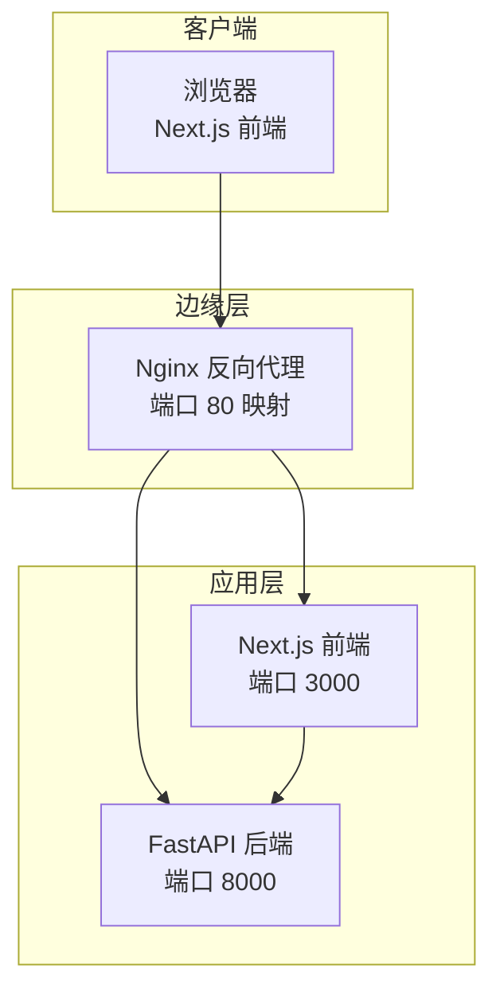
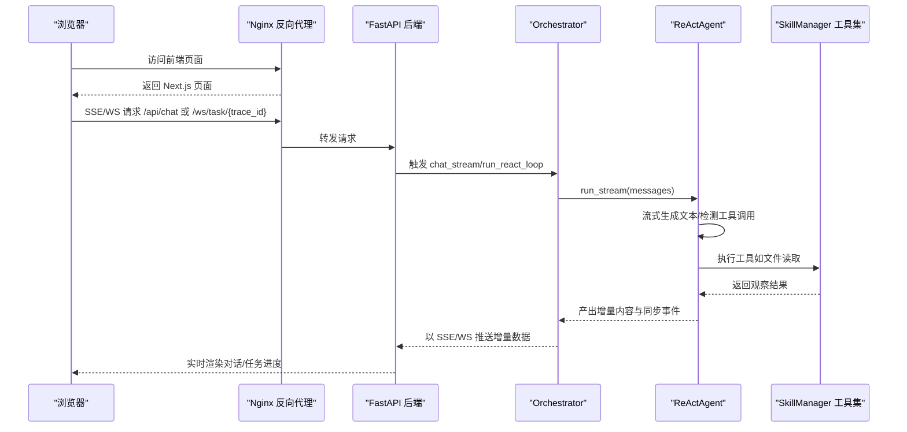
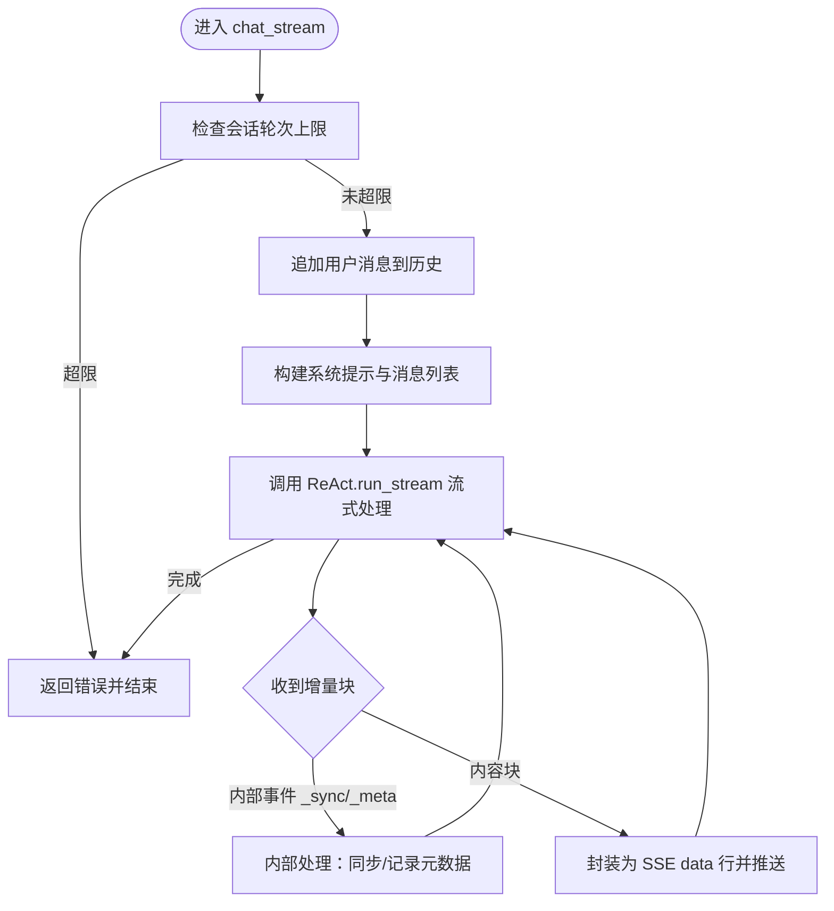
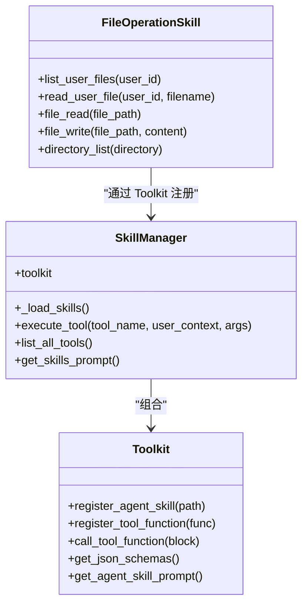
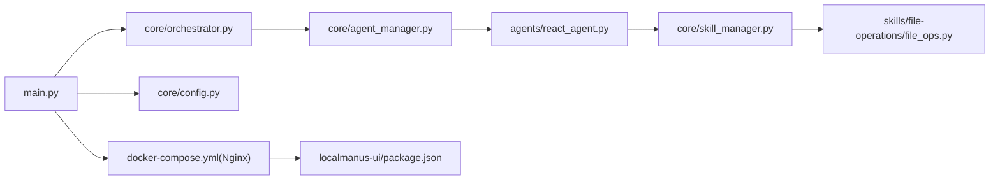

# VNC 可视化与代理

<cite>
**本文引用的文件**
- [main.py](file://localmanus-backend/main.py)
- [orchestrator.py](file://localmanus-backend/core/orchestrator.py)
- [agent_manager.py](file://localmanus-backend/core/agent_manager.py)
- [base_agents.py](file://localmanus-backend/agents/base_agents.py)
- [react_agent.py](file://localmanus-backend/agents/react_agent.py)
- [skill_manager.py](file://localmanus-backend/core/skill_manager.py)
- [prompts.py](file://localmanus-backend/core/prompts.py)
- [config.py](file://localmanus-backend/core/config.py)
- [file_ops.py](file://localmanus-backend/skills/file-operations/file_ops.py)
- [package.json](file://localmanus-ui/package.json)
- [docker-compose.yml](file://docker-compose.yml)
- [.env.example](file://localmanus-backend/.env.example)
</cite>

## 目录
1. [简介](#简介)
2. [项目结构](#项目结构)
3. [核心组件](#核心组件)
4. [架构总览](#架构总览)
5. [详细组件分析](#详细组件分析)
6. [依赖关系分析](#依赖关系分析)
7. [性能考量](#性能考量)
8. [故障排查指南](#故障排查指南)
9. [结论](#结论)
10. [附录](#附录)

## 简介
本技术文档围绕 Firecracker VNC 可视化系统的“代理与流媒体”能力展开，结合现有代码库中的 WebSocket、SSE（Server-Sent Events）与文件上传/下载等基础设施，系统阐述以下主题：
- VNC 代理服务器的启动与配置：基于 FastAPI 的服务端点、CORS 配置、健康检查与容器编排。
- WebSocket 协议转换与流式传输：以 SSE 与 WebSocket 为例，说明协议转换思路与数据流。
- 远程桌面访问的安全与认证：基于 JWT 的登录流程与用户会话管理。
- 监控指标与性能调优：通过日志、环境变量与容器健康检查进行观测与优化。
- 客户端连接与浏览器兼容性：前端 Next.js 应用的运行与 API 访问方式。

需要特别说明的是：当前仓库未包含 VNC 代理（如 websockify）或 VNC 图像编码/延迟控制的具体实现。本文在不虚构现有实现的前提下，提供可落地的工程化建议与最佳实践，帮助在现有基础上扩展 VNC 可视化能力。

## 项目结构
后端采用 FastAPI 提供 REST 与 SSE/WS 接口；前端采用 Next.js；Nginx 作为反向代理与健康检查入口；Docker Compose 编排三服务（Nginx、后端、前端）。下图展示服务间关系与端口映射：

图表来源
- [docker-compose.yml](file://docker-compose.yml#L1-L88)
- [package.json](file://localmanus-ui/package.json#L1-L34)

章节来源
- [docker-compose.yml](file://docker-compose.yml#L1-L88)
- [package.json](file://localmanus-ui/package.json#L1-L34)

## 核心组件
- FastAPI 应用与路由
  - 提供健康检查、认证（登录/注册）、文件上传/下载、项目管理、技能管理、聊天 SSE 与 WebSocket 等接口。
  - 关键端点与功能参见后续章节。
- Orchestrator 与 Agent 系统
  - 负责多轮对话、ReAct 循环、工具调用与消息历史管理。
- 技能与工具系统
  - 基于 Toolkit 的动态加载与注册，支持文件操作等工具函数。
- 配置与模型
  - 通过环境变量与配置模块注入模型参数与服务监听地址。

章节来源
- [main.py](file://localmanus-backend/main.py#L1-L477)
- [orchestrator.py](file://localmanus-backend/core/orchestrator.py#L1-L150)
- [agent_manager.py](file://localmanus-backend/core/agent_manager.py#L1-L49)
- [react_agent.py](file://localmanus-backend/agents/react_agent.py#L1-L349)
- [skill_manager.py](file://localmanus-backend/core/skill_manager.py#L1-L143)
- [prompts.py](file://localmanus-backend/core/prompts.py#L1-L75)
- [config.py](file://localmanus-backend/core/config.py#L1-L22)

## 架构总览
下图展示从浏览器到后端、再到 LLM 与工具链的整体调用序列，体现 SSE/WS 的数据流与 ReAct 的推理-行动循环：

图表来源
- [main.py](file://localmanus-backend/main.py#L392-L477)
- [orchestrator.py](file://localmanus-backend/core/orchestrator.py#L16-L96)
- [react_agent.py](file://localmanus-backend/agents/react_agent.py#L53-L215)
- [skill_manager.py](file://localmanus-backend/core/skill_manager.py#L90-L134)

## 详细组件分析

### FastAPI 应用与路由
- 启动与中间件
  - CORS 允许任意源访问，便于前端跨域。
  - 健康检查端点用于容器健康探测。
- 认证与用户
  - 登录返回 JWT，前端可缓存用于后续受保护请求。
- 文件管理
  - 支持上传、列出、下载、删除；文件存储在 uploads 目录，数据库记录元信息。
- 项目管理
  - 用户维度的项目 CRUD。
- 技能管理
  - 列出可用技能、更新技能配置与启用状态。
- 对话与任务
  - SSE 端点用于多轮对话流式输出。
  - WebSocket 端点用于任务执行流式反馈。
- 设置管理
  - 获取与更新系统配置（由 ConfigManager 提供）。

章节来源
- [main.py](file://localmanus-backend/main.py#L1-L477)

### Orchestrator 与 ReActAgent
- 会话与历史
  - 维护按会话 ID 分组的消息历史，限制最大轮次。
- SSE 协议
  - 使用 data: 行推送增量内容，结束标记 [DONE]。
  - 内部协议：_sync 用于同步消息至历史；_meta 用于运行元数据（不对外）。
- ReAct 循环
  - 优先尝试直接从模型流中提取 token 与工具调用；失败则回退完整响应再分字符流式输出。
  - 工具调用期间输出可视化提示，并将观察结果写入上下文。
  - 最终产出元数据与同步事件，确保前后端一致。

图表来源
- [orchestrator.py](file://localmanus-backend/core/orchestrator.py#L16-L96)
- [react_agent.py](file://localmanus-backend/agents/react_agent.py#L53-L215)

章节来源
- [orchestrator.py](file://localmanus-backend/core/orchestrator.py#L1-L150)
- [react_agent.py](file://localmanus-backend/agents/react_agent.py#L1-L349)

### 技能与工具系统
- 动态加载
  - 扫描 skills 目录，注册 AgentSkill 与 ToolFunction。
- 工具执行
  - 注入 user_id/user_context 参数，统一异步工具调用与响应收集。
- 文件操作工具
  - 列举用户文件、读取用户文件、读写通用文件、目录列举等。

图表来源
- [skill_manager.py](file://localmanus-backend/core/skill_manager.py#L1-L143)
- [file_ops.py](file://localmanus-backend/skills/file-operations/file_ops.py#L1-L165)

章节来源
- [skill_manager.py](file://localmanus-backend/core/skill_manager.py#L1-L143)
- [file_ops.py](file://localmanus-backend/skills/file-operations/file_ops.py#L1-L165)

### 认证与安全
- 登录流程
  - 使用 OAuth2 密码模式，验证用户名/密码后签发 JWT。
- 会话与权限
  - 通过依赖注入获取当前用户，所有受保护端点均需有效令牌。
- 建议
  - 在生产环境启用 HTTPS、设置安全的 Cookie 属性、缩短令牌有效期并支持刷新。
  - 对敏感操作增加二次校验或 MFA。

章节来源
- [main.py](file://localmanus-backend/main.py#L92-L110)

### 部署与网络
- Docker Compose
  - Nginx 暴露 80 端口，转发到 UI（3000）与 API（8000）。
  - 健康检查分别针对 Nginx 与后端健康端点。
- 环境变量
  - 模型名称、API Key、基础 URL、内存限制、上传大小限制等。
- 前端
  - Next.js 通过环境变量区分浏览器与 SSR 上下文下的 API 地址。

章节来源
- [docker-compose.yml](file://docker-compose.yml#L1-L88)
- [.env.example](file://localmanus-backend/.env.example#L1-L4)
- [package.json](file://localmanus-ui/package.json#L1-L34)

## 依赖关系分析
- 组件耦合
  - main.py 依赖 Orchestrator、SkillRegistry、ConfigManager 等，形成清晰的业务边界。
  - Orchestrator 依赖 AgentLifecycleManager 与 ReActAgent，ReActAgent 依赖 SkillManager。
  - SkillManager 通过 Toolkit 注册工具，工具函数来自 skills 目录。
- 外部依赖
  - FastAPI、Uvicorn、AgentScope、Pydantic、Websockets、SQLModel 等。

图表来源
- [main.py](file://localmanus-backend/main.py#L1-L477)
- [orchestrator.py](file://localmanus-backend/core/orchestrator.py#L1-L150)
- [agent_manager.py](file://localmanus-backend/core/agent_manager.py#L1-L49)
- [react_agent.py](file://localmanus-backend/agents/react_agent.py#L1-L349)
- [skill_manager.py](file://localmanus-backend/core/skill_manager.py#L1-L143)
- [file_ops.py](file://localmanus-backend/skills/file-operations/file_ops.py#L1-L165)
- [docker-compose.yml](file://docker-compose.yml#L1-L88)
- [package.json](file://localmanus-ui/package.json#L1-L34)

## 性能考量
- 流式传输
  - SSE/WS 已具备实时增量输出能力，建议保持低延迟发送节奏，避免过度频繁的小包。
- 工具调用
  - 工具执行为阻塞过程，建议对耗时工具增加超时与进度反馈。
- 内存与历史
  - 会话历史长度限制可防止内存膨胀；必要时引入分页或压缩策略。
- 并发与资源
  - 通过容器编排与 CPU/内存限额控制服务资源占用。
- 日志与可观测性
  - 结合容器日志与健康检查，定期评估吞吐与延迟。

[本节为通用指导，无需特定文件来源]

## 故障排查指南
- 健康检查失败
  - 检查 Nginx 是否正确转发到后端；确认后端健康端点可达。
- 认证失败
  - 核对用户名/密码；确认 JWT 令牌是否正确携带。
- 文件上传/下载异常
  - 检查 uploads 目录权限与磁盘空间；确认数据库记录与文件存在一致性。
- 工具执行报错
  - 查看工具注册日志与签名参数；确认 user_id/user_context 注入是否正确。

章节来源
- [docker-compose.yml](file://docker-compose.yml#L18-L54)
- [main.py](file://localmanus-backend/main.py#L112-L215)
- [skill_manager.py](file://localmanus-backend/core/skill_manager.py#L90-L134)

## 结论
当前代码库提供了完善的后端服务框架、对话与工具链集成以及前端与反向代理的部署方案。对于 VNC 可视化与代理，建议在此基础上：
- 引入 VNC 代理（如 websockify）与 WebSocket 协议转换，实现浏览器到 VNC 服务器的桥接。
- 将 VNC 流媒体数据通过 SSE/WS 下发，复用现有流式传输与会话管理机制。
- 强化安全：HTTPS、认证与授权、最小权限原则与审计日志。
- 优化性能：工具调用并发、缓冲与背压控制、CDN 加速与就近接入。
- 完善监控：指标采集、告警与故障自愈。

[本节为总结性内容，无需特定文件来源]

## 附录

### VNC 代理与流媒体扩展建议
- 代理服务器
  - 使用 websockify 将 TCP VNC 端口转换为 WebSocket，结合 Nginx 的 WebSocket 支持。
  - 端口映射策略：后端暴露 8000，Nginx 暴露 80；VNC 代理单独监听独立端口并通过反代转发。
- 协议转换
  - 基于现有 WebSocket 端点（/ws/task/{trace_id}）扩展 VNC 数据通道，复用认证与会话。
- 图像编码与延迟
  - 选择适合的编码（如 JPEG/PNG）与分辨率；通过节流与批量合并减少带宽占用。
- 安全与加密
  - 强制 TLS；在反代层启用 HSTS；对令牌与会话进行严格校验。
- 监控与调优
  - 指标：连接数、帧率、丢包率、延迟分布；调优：缓冲区大小、重传策略、自适应码率。
- 客户端配置
  - 浏览器兼容性：现代浏览器原生支持 WebSocket；对旧版浏览器提供降级方案。
  - 用户体验：加载指示、断线重连、画质切换、输入延迟补偿。

[本节为概念性建议，无需特定文件来源]