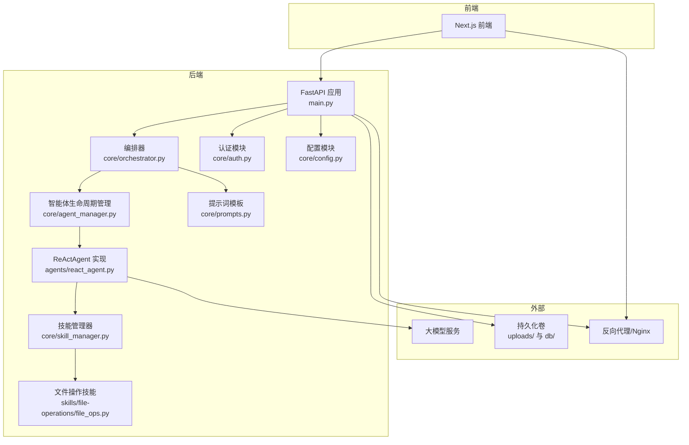
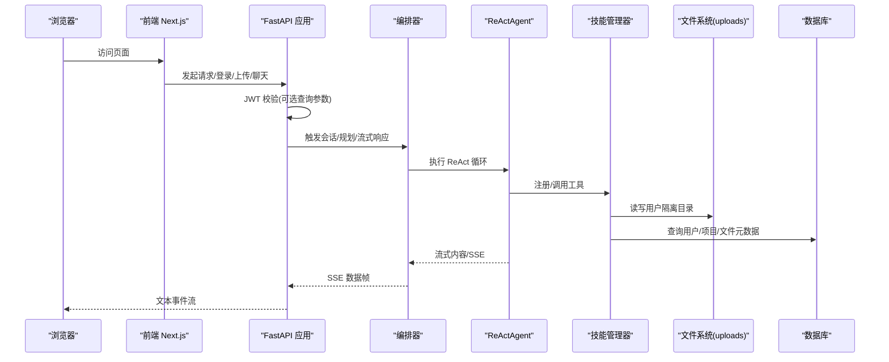
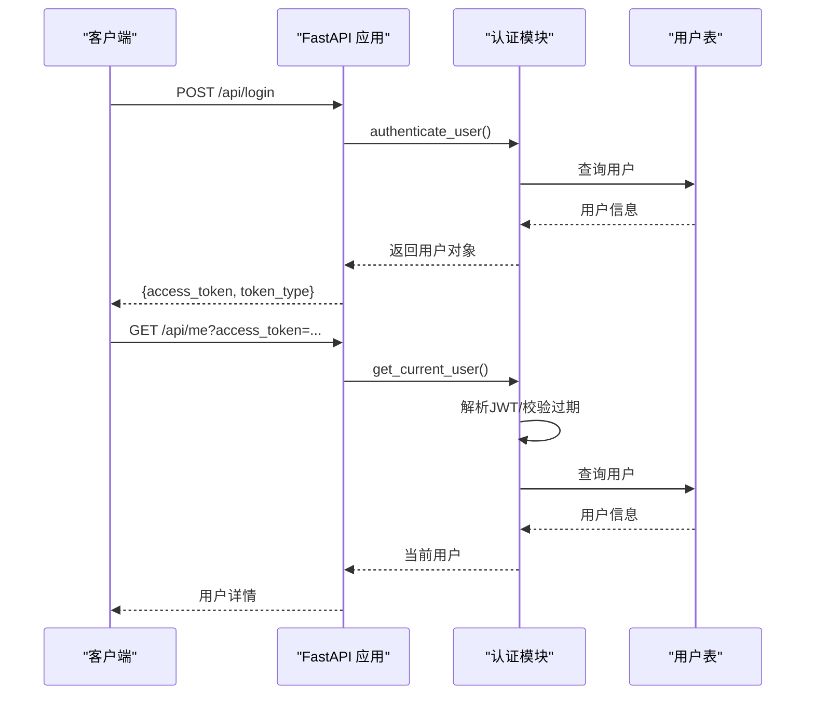
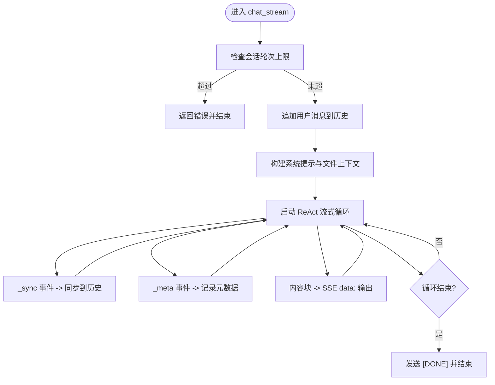
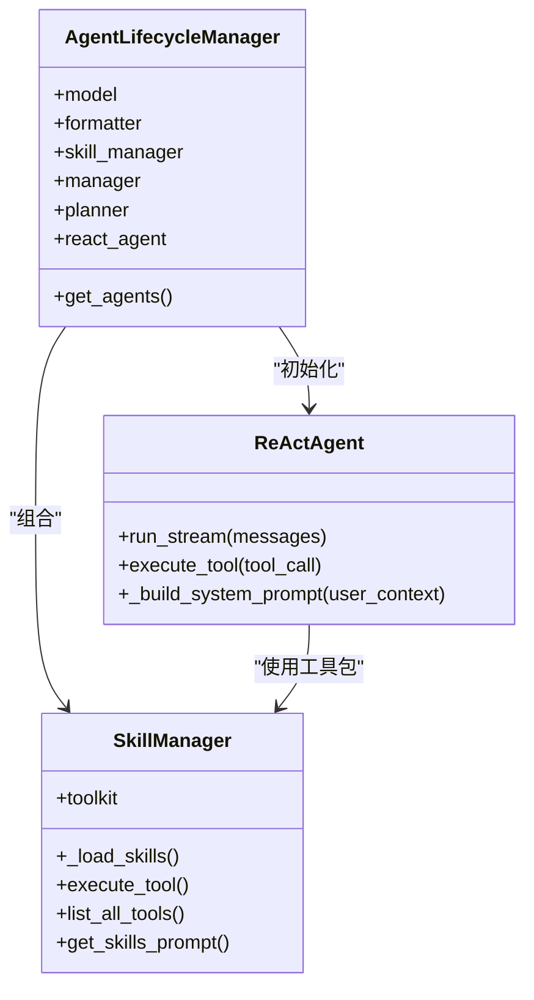
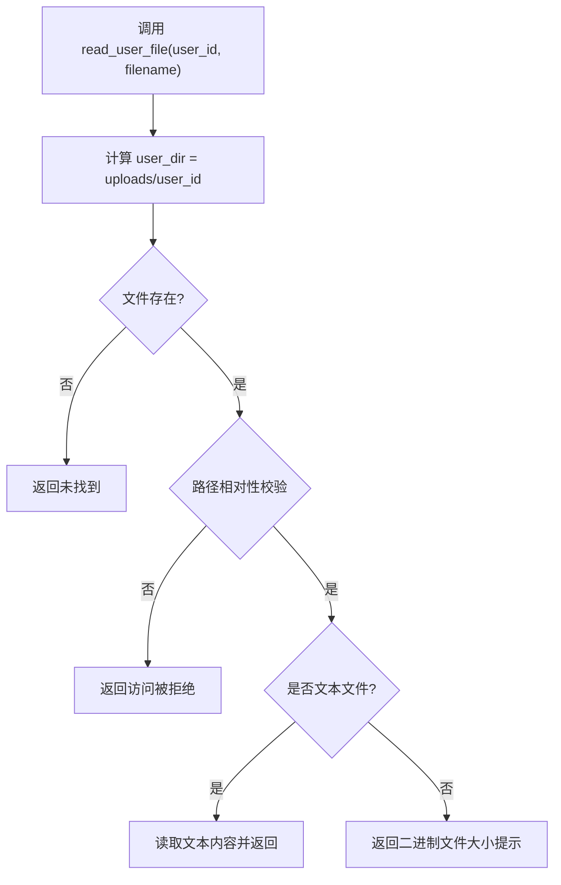
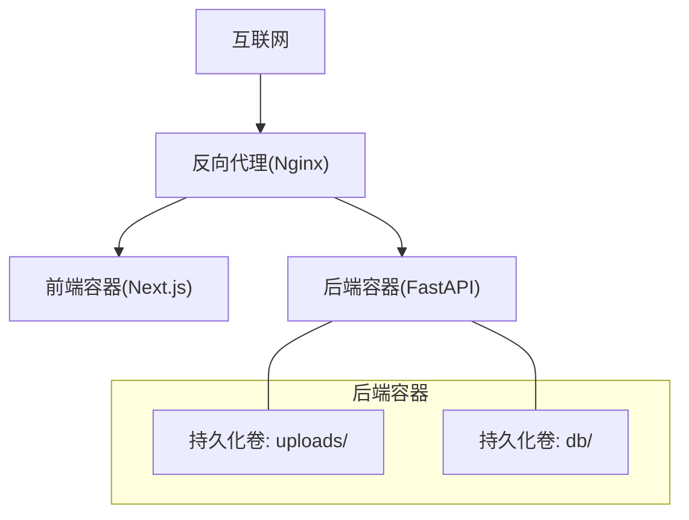
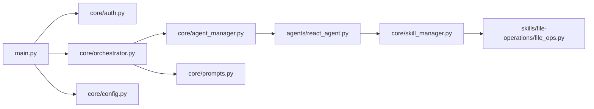

# 安全隔离与权限控制

<cite>
**本文引用的文件**
- [main.py](file://localmanus-backend/main.py)
- [orchestrator.py](file://localmanus-backend/core/orchestrator.py)
- [agent_manager.py](file://localmanus-backend/core/agent_manager.py)
- [react_agent.py](file://localmanus-backend/agents/react_agent.py)
- [skill_manager.py](file://localmanus-backend/core/skill_manager.py)
- [file_ops.py](file://localmanus-backend/skills/file-operations/file_ops.py)
- [auth.py](file://localmanus-backend/core/auth.py)
- [config.py](file://localmanus-backend/core/config.py)
- [prompts.py](file://localmanus-backend/core/prompts.py)
- [DOCKER_DEPLOYMENT.md](file://DOCKER_DEPLOYMENT.md)
- [PRODUCTION_DEPLOYMENT.md](file://PRODUCTION_DEPLOYMENT.md)
</cite>

## 目录
1. [简介](#简介)
2. [项目结构](#项目结构)
3. [核心组件](#核心组件)
4. [架构总览](#架构总览)
5. [详细组件分析](#详细组件分析)
6. [依赖关系分析](#依赖关系分析)
7. [性能考虑](#性能考虑)
8. [故障排查指南](#故障排查指南)
9. [结论](#结论)
10. [附录](#附录)

## 简介
本文件面向 LocalManus 后端的安全隔离与权限控制，聚焦于容器化运行环境下的安全边界、用户命名空间隔离、文件系统权限控制、网络访问限制、认证与授权、审计与日志、以及生产部署中的安全加固要点。本文不直接展示代码片段，而是通过“章节来源”与“图表来源”标注具体实现位置，帮助读者快速定位到仓库中的实际实现。

## 项目结构
后端采用 FastAPI 框架，结合 AgentScope 的智能体与工具体系，围绕“会话编排-规划-推理与行动（ReAct）-工具执行”的闭环工作流构建。上传文件位于独立目录，并通过工具层进行受限访问；认证采用 JWT；部署通过 Docker Compose 实现服务编排与持久化卷管理。

图表来源
- [main.py](file://localmanus-backend/main.py#L34-L477)
- [orchestrator.py](file://localmanus-backend/core/orchestrator.py#L11-L150)
- [agent_manager.py](file://localmanus-backend/core/agent_manager.py#L11-L49)
- [react_agent.py](file://localmanus-backend/agents/react_agent.py#L20-L349)
- [skill_manager.py](file://localmanus-backend/core/skill_manager.py#L18-L143)
- [file_ops.py](file://localmanus-backend/skills/file-operations/file_ops.py#L9-L165)
- [auth.py](file://localmanus-backend/core/auth.py#L1-L82)
- [config.py](file://localmanus-backend/core/config.py#L1-L22)
- [prompts.py](file://localmanus-backend/core/prompts.py#L1-L75)

章节来源
- [main.py](file://localmanus-backend/main.py#L34-L477)
- [DOCKER_DEPLOYMENT.md](file://DOCKER_DEPLOYMENT.md#L1-L309)
- [PRODUCTION_DEPLOYMENT.md](file://PRODUCTION_DEPLOYMENT.md#L1-L379)

## 核心组件
- 认证与授权：基于 JWT 的 OAuth2 密码流，支持查询参数传递令牌以兼容 SSE 场景。
- 编排与对话：会话管理、历史同步、SSE 流式输出、最大轮次限制。
- 智能体与工具：AgentScope ReActAgent，动态工具注册与调用，工具执行上下文注入。
- 文件操作：用户隔离的上传目录、相对路径校验、二进制文件处理。
- 部署与网络：Docker Compose 编排、反向代理、健康检查、持久化卷。

章节来源
- [auth.py](file://localmanus-backend/core/auth.py#L1-L82)
- [orchestrator.py](file://localmanus-backend/core/orchestrator.py#L11-L150)
- [react_agent.py](file://localmanus-backend/agents/react_agent.py#L20-L349)
- [skill_manager.py](file://localmanus-backend/core/skill_manager.py#L18-L143)
- [file_ops.py](file://localmanus-backend/skills/file-operations/file_ops.py#L9-L165)
- [DOCKER_DEPLOYMENT.md](file://DOCKER_DEPLOYMENT.md#L1-L309)
- [PRODUCTION_DEPLOYMENT.md](file://PRODUCTION_DEPLOYMENT.md#L1-L379)

## 架构总览
下图展示了从浏览器到后端 API、再到智能体与工具执行的完整链路，以及与持久化卷和反向代理的关系。

图表来源
- [main.py](file://localmanus-backend/main.py#L34-L477)
- [orchestrator.py](file://localmanus-backend/core/orchestrator.py#L16-L96)
- [react_agent.py](file://localmanus-backend/agents/react_agent.py#L53-L215)
- [skill_manager.py](file://localmanus-backend/core/skill_manager.py#L90-L135)
- [file_ops.py](file://localmanus-backend/skills/file-operations/file_ops.py#L24-L85)

## 详细组件分析

### 认证与授权（JWT）
- 登录接口使用 OAuth2 密码流生成访问令牌；会话依赖 SQLModel 用户表。
- 获取当前用户时支持从查询参数传入 access_token，用于 SSE/WebSocket 等场景。
- JWT 解码失败或用户不存在将抛出未授权异常。

图表来源
- [auth.py](file://localmanus-backend/core/auth.py#L47-L82)
- [main.py](file://localmanus-backend/main.py#L92-L110)

章节来源
- [auth.py](file://localmanus-backend/core/auth.py#L1-L82)
- [main.py](file://localmanus-backend/main.py#L92-L110)

### 会话编排与流式输出（SSE）
- 最大会话轮次限制，防止资源滥用。
- 内部协议：_sync 用于同步消息历史，_meta 用于元数据记录，内容块通过 SSE data: 输出。
- 支持 ReAct 循环中工具调用的实时反馈与结果拼接。

图表来源
- [orchestrator.py](file://localmanus-backend/core/orchestrator.py#L16-L96)

章节来源
- [orchestrator.py](file://localmanus-backend/core/orchestrator.py#L16-L96)

### 智能体生命周期与模型配置
- AgentLifecycleManager 初始化 AgentScope、模型、格式化器与内存，并注入 SkillManager。
- 模型配置来自环境变量与配置文件，支持本地或远程大模型服务。

图表来源
- [agent_manager.py](file://localmanus-backend/core/agent_manager.py#L11-L49)
- [skill_manager.py](file://localmanus-backend/core/skill_manager.py#L18-L143)
- [react_agent.py](file://localmanus-backend/agents/react_agent.py#L20-L349)

章节来源
- [agent_manager.py](file://localmanus-backend/core/agent_manager.py#L11-L49)
- [skill_manager.py](file://localmanus-backend/core/skill_manager.py#L18-L143)
- [react_agent.py](file://localmanus-backend/agents/react_agent.py#L20-L349)
- [config.py](file://localmanus-backend/core/config.py#L1-L22)
- [prompts.py](file://localmanus-backend/core/prompts.py#L54-L75)

### 文件操作与用户隔离
- 用户上传目录按 user_id 分隔，避免跨用户访问。
- 路径合法性检查：确保目标文件在用户目录内，拒绝越权路径。
- 二进制文件检测：无法直接读取二进制内容，返回字节大小提示。
- 工具注册：通过 SkillManager 动态扫描 skills 目录，注册函数与类方法为工具。

图表来源
- [file_ops.py](file://localmanus-backend/skills/file-operations/file_ops.py#L54-L85)

章节来源
- [file_ops.py](file://localmanus-backend/skills/file-operations/file_ops.py#L9-L165)
- [skill_manager.py](file://localmanus-backend/core/skill_manager.py#L29-L89)

### 部署与网络隔离（容器与反向代理）
- Docker Compose 提供前后端与持久化卷编排，健康检查与自动重启。
- 反向代理（Nginx）示例配置：开启/关闭缓冲、升级头、SSE 专用配置。
- 生产部署建议：固定端口映射、防火墙放行、HTTPS、日志轮转、备份策略。

图表来源
- [DOCKER_DEPLOYMENT.md](file://DOCKER_DEPLOYMENT.md#L1-L309)
- [PRODUCTION_DEPLOYMENT.md](file://PRODUCTION_DEPLOYMENT.md#L176-L218)

章节来源
- [DOCKER_DEPLOYMENT.md](file://DOCKER_DEPLOYMENT.md#L1-L309)
- [PRODUCTION_DEPLOYMENT.md](file://PRODUCTION_DEPLOYMENT.md#L1-L379)

## 依赖关系分析
- 组件耦合：主应用依赖认证、编排器、配置与技能管理；编排器依赖智能体生命周期；ReActAgent 依赖技能管理器与提示词模板。
- 外部依赖：AgentScope、FastAPI、SQLModel、JWT、Passlib、Uvicorn/Docker/Nginx。
- 潜在风险：工具函数动态加载需严格限制目录与文件类型；SSE/WS 需要严格的令牌校验与速率限制。

图表来源
- [main.py](file://localmanus-backend/main.py#L1-L40)
- [orchestrator.py](file://localmanus-backend/core/orchestrator.py#L1-L20)
- [agent_manager.py](file://localmanus-backend/core/agent_manager.py#L1-L10)
- [react_agent.py](file://localmanus-backend/agents/react_agent.py#L1-L20)
- [skill_manager.py](file://localmanus-backend/core/skill_manager.py#L1-L10)
- [file_ops.py](file://localmanus-backend/skills/file-operations/file_ops.py#L1-L10)
- [prompts.py](file://localmanus-backend/core/prompts.py#L1-L10)

章节来源
- [main.py](file://localmanus-backend/main.py#L1-L40)
- [orchestrator.py](file://localmanus-backend/core/orchestrator.py#L1-L20)
- [agent_manager.py](file://localmanus-backend/core/agent_manager.py#L1-L10)
- [react_agent.py](file://localmanus-backend/agents/react_agent.py#L1-L20)
- [skill_manager.py](file://localmanus-backend/core/skill_manager.py#L1-L10)
- [file_ops.py](file://localmanus-backend/skills/file-operations/file_ops.py#L1-L10)
- [prompts.py](file://localmanus-backend/core/prompts.py#L1-L10)

## 性能考虑
- SSE 流式输出：优先使用模型原生流式接口，回退到字符级流式，减少延迟。
- 工具调用：串行执行工具，避免并发写冲突；对 IO 密集型工具增加超时与重试。
- 会话轮次限制：防止长会话导致内存膨胀。
- 反向代理：SSE 关闭缓冲，避免中间节点缓存导致实时性下降。

章节来源
- [react_agent.py](file://localmanus-backend/agents/react_agent.py#L85-L162)
- [orchestrator.py](file://localmanus-backend/core/orchestrator.py#L34-L38)
- [DOCKER_DEPLOYMENT.md](file://DOCKER_DEPLOYMENT.md#L238-L266)

## 故障排查指南
- 认证失败：检查令牌签名密钥、算法与过期时间；确认查询参数 access_token 是否正确传递。
- SSE 连接问题：确认反向代理未启用缓冲；检查后端日志与健康检查。
- 文件访问异常：核对 uploads 目录权限与用户隔离路径；确认二进制文件不可读策略。
- 工具加载失败：检查 skills 目录结构与函数签名；确认文档中声明的工具描述存在。
- 生产部署：核对防火墙放行端口、Nginx 配置、日志轮转与备份脚本。

章节来源
- [auth.py](file://localmanus-backend/core/auth.py#L47-L82)
- [DOCKER_DEPLOYMENT.md](file://DOCKER_DEPLOYMENT.md#L176-L218)
- [PRODUCTION_DEPLOYMENT.md](file://PRODUCTION_DEPLOYMENT.md#L226-L379)
- [file_ops.py](file://localmanus-backend/skills/file-operations/file_ops.py#L64-L85)
- [skill_manager.py](file://localmanus-backend/core/skill_manager.py#L29-L89)

## 结论
LocalManus 后端通过 JWT 认证、容器化部署、用户隔离的上传目录与严格的路径校验，构建了基础的安全边界。结合 AgentScope 的工具体系与 SSE 流式输出，实现了可控的智能体能力开放与可观测的交互过程。生产部署建议进一步完善反向代理、日志与备份策略，并持续评估工具集的安全影响面。

## 附录

### 安全配置检查清单（生产）
- [ ] 使用强随机密钥配置 SECRET_KEY
- [ ] 将 CORS 允许源从通配符收紧为具体域名
- [ ] 开启 HTTPS 并配置 TLS 证书
- [ ] 防火墙仅开放必要端口（如 3000/1243）
- [ ] 反向代理启用 SSE 专用配置（关闭缓冲、升级头）
- [ ] 日志轮转与保留策略
- [ ] 定期备份 uploads 与 db 目录
- [ ] 工具函数最小权限原则与输入校验
- [ ] 会话轮次与速率限制策略
- [ ] 依赖版本更新与漏洞扫描

章节来源
- [DOCKER_DEPLOYMENT.md](file://DOCKER_DEPLOYMENT.md#L228-L237)
- [PRODUCTION_DEPLOYMENT.md](file://PRODUCTION_DEPLOYMENT.md#L345-L355)

### 渗透测试方法（建议）
- 认证绕过：尝试在 SSE/WS 中注入 access_token；验证令牌过期与篡改。
- 路径遍历：构造越权路径读取 uploads 外文件；验证 is_relative_to 校验。
- 工具注入：检查工具函数签名与参数注入点；限制危险函数暴露。
- 资源耗尽：压测会话轮次上限与并发 SSE 连接数。
- 静态分析：扫描 skills 目录与工具函数，识别潜在高危操作。

章节来源
- [file_ops.py](file://localmanus-backend/skills/file-operations/file_ops.py#L71-L72)
- [skill_manager.py](file://localmanus-backend/core/skill_manager.py#L64-L88)
- [orchestrator.py](file://localmanus-backend/core/orchestrator.py#L34-L38)

### 安全事件响应流程（建议）
- 快速定位：根据日志与健康检查状态判断事件范围。
- 隔离与降级：临时关闭高风险工具、限制会话轮次、暂停上传。
- 修复与验证：修复工具/路径/权限问题后进行回归测试。
- 复盘与加固：更新工具白名单、完善日志与告警策略。

章节来源
- [DOCKER_DEPLOYMENT.md](file://DOCKER_DEPLOYMENT.md#L132-L141)
- [PRODUCTION_DEPLOYMENT.md](file://PRODUCTION_DEPLOYMENT.md#L290-L305)