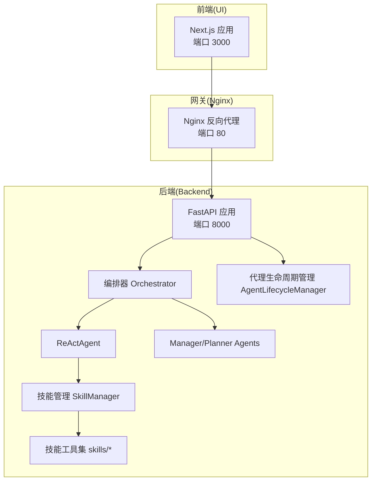
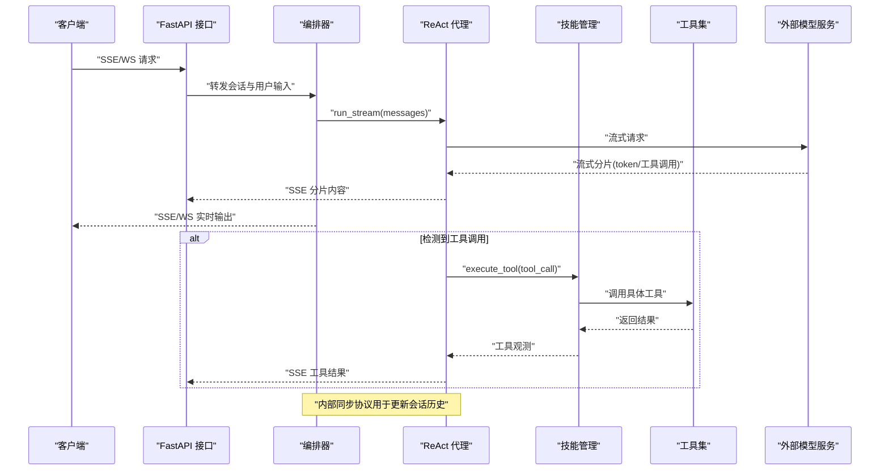
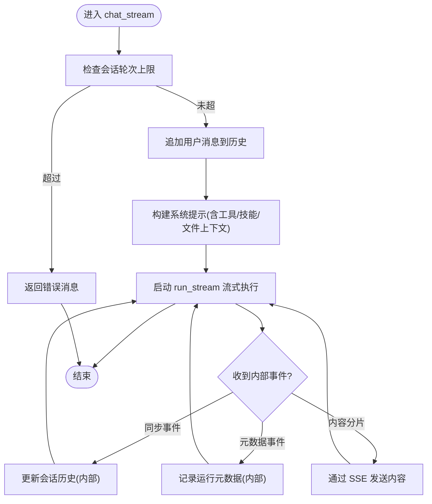
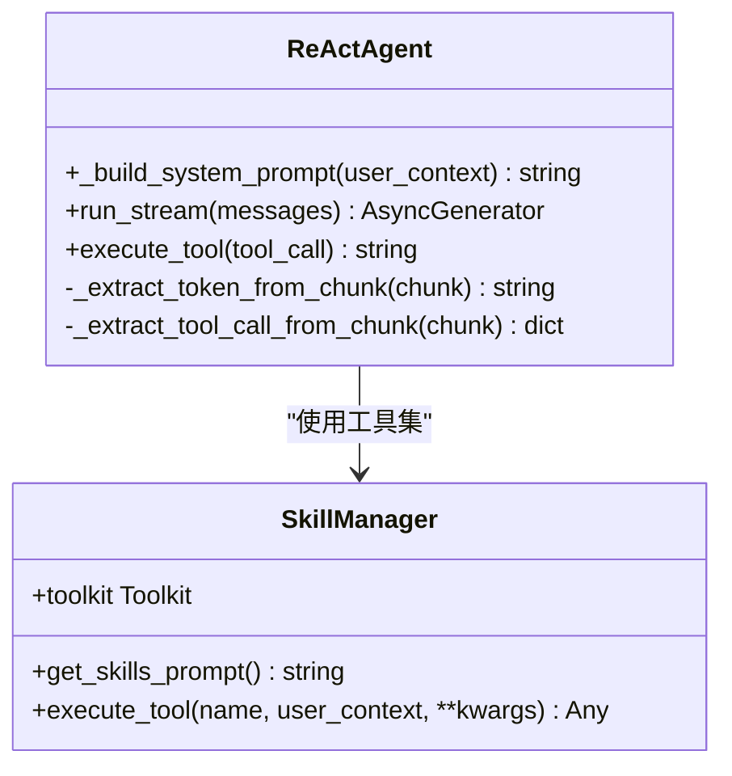
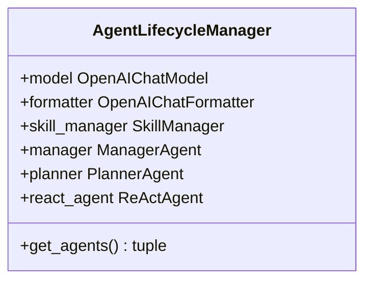
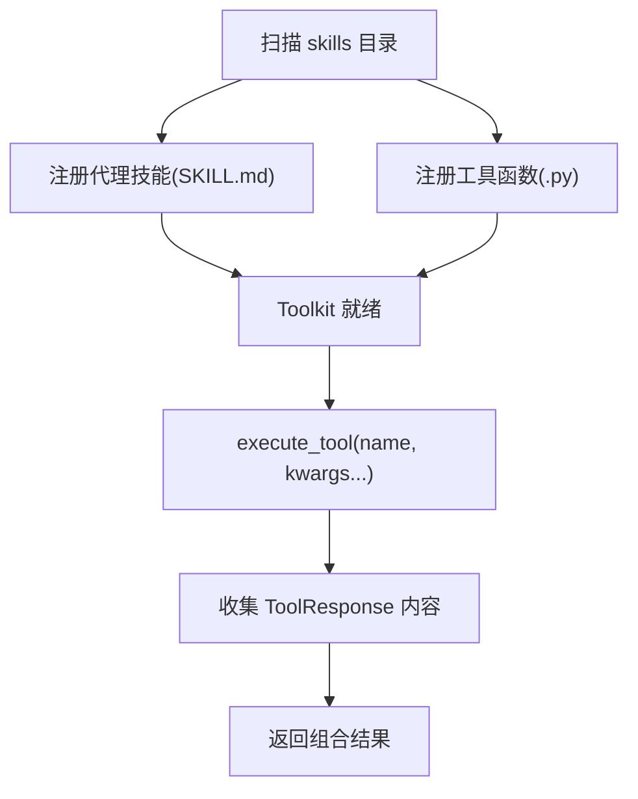
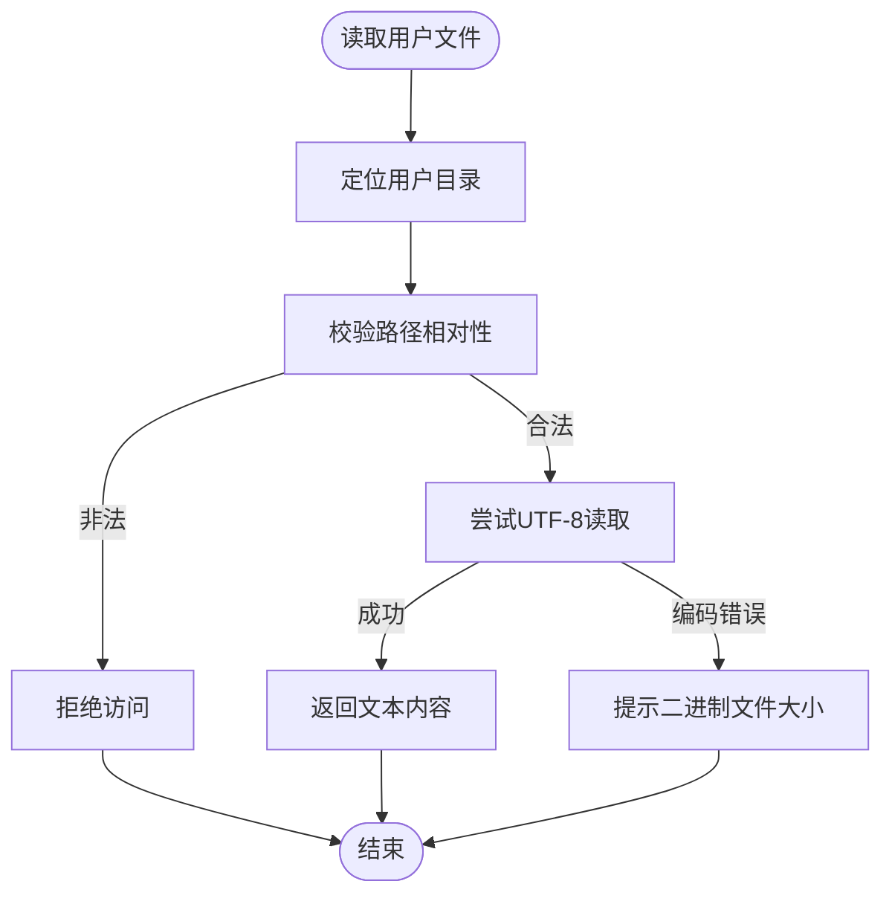
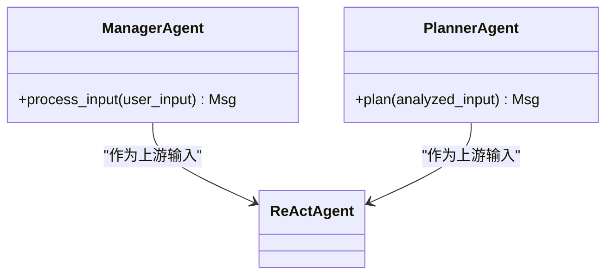
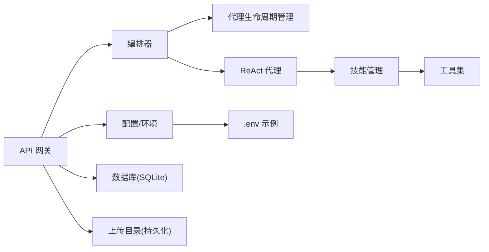

# 性能优化与资源管理

<cite>
**本文引用的文件**   
- [main.py](file://localmanus-backend/main.py)
- [orchestrator.py](file://localmanus-backend/core/orchestrator.py)
- [agent_manager.py](file://localmanus-backend/core/agent_manager.py)
- [skill_manager.py](file://localmanus-backend/core/skill_manager.py)
- [react_agent.py](file://localmanus-backend/agents/react_agent.py)
- [base_agents.py](file://localmanus-backend/agents/base_agents.py)
- [file_ops.py](file://localmanus-backend/skills/file-operations/file_ops.py)
- [config.py](file://localmanus-backend/core/config.py)
- [test_orchestration.py](file://localmanus-backend/scripts/test_orchestration.py)
- [.env.example](file://localmanus-backend/.env.example)
- [docker-compose.yml](file://docker-compose.yml)
- [requirements.txt](file://localmanus-backend/requirements.txt)
</cite>

## 目录
1. [简介](#简介)
2. [项目结构](#项目结构)
3. [核心组件](#核心组件)
4. [架构总览](#架构总览)
5. [详细组件分析](#详细组件分析)
6. [依赖关系分析](#依赖关系分析)
7. [性能考量](#性能考量)
8. [故障排查指南](#故障排查指南)
9. [结论](#结论)
10. [附录](#附录)

## 简介
本技术文档围绕 LocalManus 后端在“性能优化与资源管理”方面的设计与实现展开，重点覆盖以下方面：
- 微虚拟机（Firecracker）相关性能特征与资源开销：结合容器化部署与服务编排，说明 CPU、内存、I/O 的使用模式与优化点。
- 内存管理策略：基于进程内内存限制、会话历史长度控制、工具调用结果聚合等手段降低峰值内存占用。
- CPU 调度优化：通过异步流式响应、事件循环让出、并发工具执行等策略提升吞吐与交互延迟表现。
- I/O 性能提升：文件上传/下载、数据库访问、外部模型服务调用的缓冲与并发策略。
- 并发处理能力与资源竞争避免：基于 FastAPI 异步模型、WebSocket 流式传输、工具执行的同步化与消息同步协议。
- 性能监控指标、瓶颈识别方法与调优参数：结合日志、健康检查、环境变量与容器资源限制进行定位与优化。
- 基准测试方法、性能对比分析与生产部署建议：结合 docker-compose 编排与 Nginx 反向代理给出可操作建议。

## 项目结构
后端采用 FastAPI 提供 API 网关，内部通过“编排器 + 代理层 + 工具集”的架构组织业务流程；前端通过 Next.js 提供 UI，Nginx 作为反向代理统一入口。整体结构如下：

图表来源
- [main.py](file://localmanus-backend/main.py#L34-L477)
- [orchestrator.py](file://localmanus-backend/core/orchestrator.py#L11-L150)
- [agent_manager.py](file://localmanus-backend/core/agent_manager.py#L11-L49)
- [skill_manager.py](file://localmanus-backend/core/skill_manager.py#L18-L143)
- [react_agent.py](file://localmanus-backend/agents/react_agent.py#L20-L349)
- [base_agents.py](file://localmanus-backend/agents/base_agents.py#L6-L42)
- [docker-compose.yml](file://docker-compose.yml#L1-L88)

章节来源
- [main.py](file://localmanus-backend/main.py#L34-L477)
- [docker-compose.yml](file://docker-compose.yml#L1-L88)

## 核心组件
- API 网关（FastAPI）
  - 提供健康检查、认证、文件上传/下载、项目管理、聊天 SSE、任务计划与 ReAct 执行等接口。
  - 使用 WebSocket 支持实时任务流，SSE 支持多轮对话流式输出。
- 编排器（Orchestrator）
  - 维护会话历史、构建系统提示、协调 Manager/Planner/ReAct 代理协作、处理内部同步与元数据事件。
- 代理生命周期管理（AgentLifecycleManager）
  - 初始化模型、格式化器、内存与技能管理器，并实例化 Manager、Planner、ReAct 代理。
- 技能管理（SkillManager）
  - 动态加载技能目录中的工具函数与代理技能，支持注册、执行与提示生成。
- ReAct 代理（ReActAgent）
  - 实现真正的流式响应与工具调用检测，支持直接从流中提取工具调用并执行，同时提供消息同步协议。
- 基础代理（ManagerAgent/PlannerAgent）
  - 标准化输入与生成任务 DAG 的高层代理。
- 文件操作技能（file_ops）
  - 用户上传目录隔离、安全路径校验、文本/二进制文件读取、目录列举等基础能力。

章节来源
- [main.py](file://localmanus-backend/main.py#L61-L477)
- [orchestrator.py](file://localmanus-backend/core/orchestrator.py#L11-L150)
- [agent_manager.py](file://localmanus-backend/core/agent_manager.py#L11-L49)
- [skill_manager.py](file://localmanus-backend/core/skill_manager.py#L18-L143)
- [react_agent.py](file://localmanus-backend/agents/react_agent.py#L20-L349)
- [base_agents.py](file://localmanus-backend/agents/base_agents.py#L6-L42)
- [file_ops.py](file://localmanus-backend/skills/file-operations/file_ops.py#L9-L165)

## 架构总览
下图展示从客户端到后端再到外部模型服务与工具执行的整体链路，以及关键的性能优化点（异步、流式、同步工具执行、消息同步）：

图表来源
- [main.py](file://localmanus-backend/main.py#L392-L477)
- [orchestrator.py](file://localmanus-backend/core/orchestrator.py#L16-L96)
- [react_agent.py](file://localmanus-backend/agents/react_agent.py#L53-L215)
- [skill_manager.py](file://localmanus-backend/core/skill_manager.py#L90-L143)

## 详细组件分析

### 组件一：编排器（Orchestrator）
- 会话管理：按 session_id 维护消息历史，限制最大轮次，防止无限增长导致内存压力。
- 系统提示构建：动态注入时间、用户上下文、技能与工具元数据，确保 ReAct 代理具备最新上下文。
- 内部协议：支持“同步事件”和“元数据事件”，前者用于更新会话历史但不发送给前端，后者用于记录运行元信息。
- 工作流执行：通过 Manager/Planner 生成计划，附加 trace_id 便于追踪。

图表来源
- [orchestrator.py](file://localmanus-backend/core/orchestrator.py#L16-L96)

章节来源
- [orchestrator.py](file://localmanus-backend/core/orchestrator.py#L11-L150)

### 组件二：ReAct 代理（ReActAgent）
- 流式优化：优先尝试直接从模型流中抽取 token 与工具调用，若失败则回退到完整响应再逐字符流式输出。
- 工具调用检测：支持从流分片中解析工具调用，减少二次解析成本。
- 工具执行：阻塞等待工具完成，将结果以系统消息形式写入上下文，随后继续推理。
- 消息同步：在 finally 中发出“同步事件”，保证会话历史与前端状态一致。

图表来源
- [react_agent.py](file://localmanus-backend/agents/react_agent.py#L20-L349)
- [skill_manager.py](file://localmanus-backend/core/skill_manager.py#L18-L143)

章节来源
- [react_agent.py](file://localmanus-backend/agents/react_agent.py#L20-L349)

### 组件三：代理生命周期管理（AgentLifecycleManager）
- 模型初始化：从配置或环境变量读取模型名称、API Key、基础地址，启用流式响应。
- 代理实例化：创建 Manager、Planner、ReAct 代理，共享模型与格式化器。
- 技能管理：注入 SkillManager，为 ReAct 代理提供工具集。

图表来源
- [agent_manager.py](file://localmanus-backend/core/agent_manager.py#L11-L49)

章节来源
- [agent_manager.py](file://localmanus-backend/core/agent_manager.py#L11-L49)

### 组件四：技能管理（SkillManager）
- 动态加载：扫描 skills 目录，注册代理技能与工具函数，支持类方法与独立函数。
- 工具执行：根据签名注入 user_id/user_context，调用 Toolkit 执行工具，聚合 ToolResponse。
- 提示生成：提供已注册代理技能的提示文本，供 ReAct 代理动态拼接。

图表来源
- [skill_manager.py](file://localmanus-backend/core/skill_manager.py#L29-L143)

章节来源
- [skill_manager.py](file://localmanus-backend/core/skill_manager.py#L18-L143)

### 组件五：文件操作技能（file_ops）
- 用户目录隔离：每个用户拥有独立上传目录，避免跨用户访问。
- 安全校验：路径相对性检查，拒绝越权访问。
- 多格式支持：文本文件 UTF-8 读取，二进制文件提示大小与不可显示内容。
- 工具注册：通过继承 BaseSkill 并暴露方法，被 SkillManager 注册为工具函数。

图表来源
- [file_ops.py](file://localmanus-backend/skills/file-operations/file_ops.py#L54-L85)

章节来源
- [file_ops.py](file://localmanus-backend/skills/file-operations/file_ops.py#L9-L165)

### 组件六：基础代理（ManagerAgent/PlannerAgent）
- ManagerAgent：标准化用户输入，生成可被 Planner 解析的中间表示。
- PlannerAgent：基于 Manager 输出生成任务 DAG，供后续执行。

图表来源
- [base_agents.py](file://localmanus-backend/agents/base_agents.py#L6-L42)
- [react_agent.py](file://localmanus-backend/agents/react_agent.py#L20-L349)

章节来源
- [base_agents.py](file://localmanus-backend/agents/base_agents.py#L6-L42)

## 依赖关系分析
- 组件耦合
  - Orchestrator 依赖 AgentLifecycleManager 获取代理实例，依赖 SkillManager 获取工具集。
  - ReActAgent 依赖 SkillManager 进行工具调用，依赖模型进行流式推理。
  - API 层通过 WebSocket/SSE 与 Orchestrator 协作，实现低延迟交互。
- 外部依赖
  - 模型服务：通过 OpenAI 兼容接口或本地 Ollama（由环境变量配置）。
  - 数据库：SQLModel + SQLite（开发/演示），生产建议使用 PostgreSQL。
  - 文件系统：上传目录持久化，避免重启丢失。
- 配置与环境
  - .env.example 提供模型与 API 基础地址示例。
  - docker-compose 设置了 AGENT_MEMORY_LIMIT、UPLOAD_SIZE_LIMIT 等关键参数。

图表来源
- [main.py](file://localmanus-backend/main.py#L34-L477)
- [config.py](file://localmanus-backend/core/config.py#L6-L22)
- [.env.example](file://localmanus-backend/.env.example#L1-L4)
- [docker-compose.yml](file://docker-compose.yml#L32-L46)

章节来源
- [requirements.txt](file://localmanus-backend/requirements.txt#L1-L14)
- [docker-compose.yml](file://docker-compose.yml#L1-L88)

## 性能考量
- 内存管理策略
  - 会话轮次限制：编排器对历史消息轮次设置上限，避免无界增长导致内存压力。
  - 工具结果聚合：SkillManager 对工具返回进行聚合，减少中间对象数量。
  - 模型流式：ReActAgent 优先从流中抽取 token 与工具调用，降低一次性缓存需求。
- CPU 调度优化
  - 异步流式：SSE/WS 基于 asyncio，及时 yield 控制权，避免阻塞事件循环。
  - 工具执行同步化：工具执行阻塞等待，避免并发工具竞争；完成后统一同步至会话。
- I/O 性能提升
  - 文件上传：使用临时文件句柄写入，减少内存占用；数据库记录文件元信息。
  - 文件下载：直接 FileResponse 返回，避免额外拷贝。
  - 数据库：SQLite 在小规模场景高效，生产建议迁移到高性能数据库。
- 并发处理与资源竞争避免
  - FastAPI 异步模型天然支持高并发请求。
  - WebSocket/SSR 场景下，通过会话 ID 隔离上下文，避免跨会话污染。
  - 工具执行串行化（当前实现），避免工具间资源竞争；如需扩展可引入队列与锁。
- 监控与指标
  - 健康检查：Nginx 与后端均提供健康检查端点，便于容器编排与自动恢复。
  - 日志：模块级 logger 记录错误与调试信息，便于定位问题。
  - 环境变量：通过 AGENT_MEMORY_LIMIT、UPLOAD_SIZE_LIMIT 等参数控制资源边界。
- 调优参数配置
  - 模型配置：MODEL_NAME、OPENAI_API_KEY、OPENAI_API_BASE。
  - 服务器配置：HOST、PORT。
  - 容器配置：AGENT_MEMORY_LIMIT、UPLOAD_SIZE_LIMIT、数据库与上传目录持久化卷。

章节来源
- [orchestrator.py](file://localmanus-backend/core/orchestrator.py#L34-L96)
- [react_agent.py](file://localmanus-backend/agents/react_agent.py#L53-L215)
- [skill_manager.py](file://localmanus-backend/core/skill_manager.py#L90-L143)
- [main.py](file://localmanus-backend/main.py#L112-L215)
- [docker-compose.yml](file://docker-compose.yml#L32-L54)
- [config.py](file://localmanus-backend/core/config.py#L6-L22)
- [.env.example](file://localmanus-backend/.env.example#L1-L4)

## 故障排查指南
- 健康检查失败
  - 检查后端健康端点与 Nginx 健康检查配置，确认容器网络与端口映射正确。
- 模型调用异常
  - 校验 OPENAI_API_KEY、OPENAI_API_BASE、MODEL_NAME 是否正确；必要时切换到本地 Ollama。
- 工具执行报错
  - 查看工具注册日志与 ToolResponse 返回，确认工具签名与参数是否匹配。
- 文件上传/下载失败
  - 检查上传目录权限与磁盘空间；确认文件路径与用户隔离逻辑。
- 会话历史异常
  - 关注内部同步事件是否正常触发，避免前端与后端状态不一致。

章节来源
- [main.py](file://localmanus-backend/main.py#L61-L72)
- [docker-compose.yml](file://docker-compose.yml#L18-L54)
- [react_agent.py](file://localmanus-backend/agents/react_agent.py#L207-L215)
- [skill_manager.py](file://localmanus-backend/core/skill_manager.py#L90-L143)

## 结论
本项目通过“异步流式 + 会话轮次限制 + 工具执行同步化 + 动态提示注入”的组合，在保证交互体验的同时有效控制了内存与 CPU 开销。结合 docker-compose 的容器化部署与 Nginx 反向代理，可在生产环境中实现稳定的并发处理与资源管理。为进一步优化，建议：
- 引入工具执行队列与限流，支持并发工具调用。
- 生产数据库迁移至 PostgreSQL，配合连接池与索引优化。
- 增加性能监控（APM/指标采集）与告警策略。
- 针对不同工作负载（长对话、大文件、复杂工具链）制定差异化参数与资源配额。

## 附录
- 基准测试方法
  - 使用 wrk 或 k6 对 SSE/WS 接口进行并发压测，关注 p50/p95 延迟与吞吐。
  - 针对文件上传/下载分别测试不同文件大小与并发数，评估带宽与 I/O 吞吐。
  - 对工具执行链路进行端到端时延拆解，定位瓶颈（模型推理、工具执行、IO）。
- 性能对比分析
  - 对比开启/关闭流式响应、不同会话轮次上限、不同工具执行策略的性能差异。
- 生产部署建议
  - 使用 docker-compose 的命名卷持久化数据库与上传目录。
  - 通过环境变量与 docker-compose 覆盖默认配置，避免硬编码。
  - 在 Nginx 层配置 gzip、缓存静态资源，减少后端压力。
  - 为后端服务设置合理的 CPU/内存限制，结合健康检查实现弹性伸缩。

章节来源
- [docker-compose.yml](file://docker-compose.yml#L1-L88)
- [test_orchestration.py](file://localmanus-backend/scripts/test_orchestration.py#L12-L57)