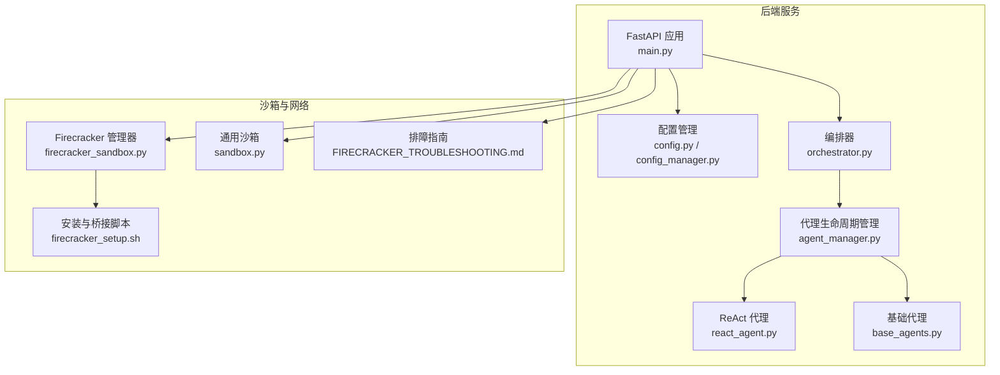
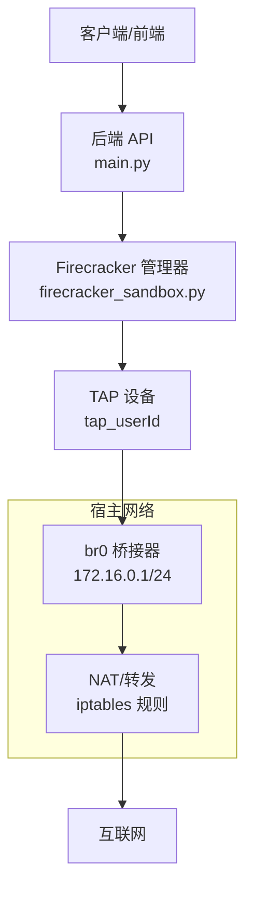
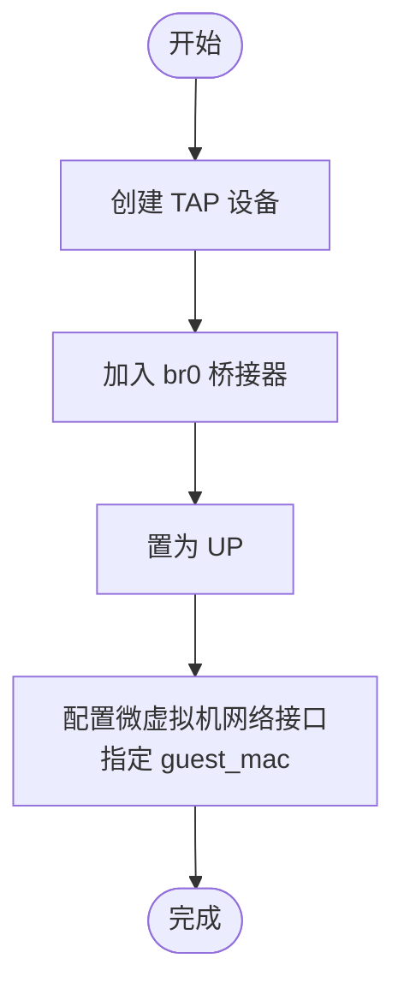
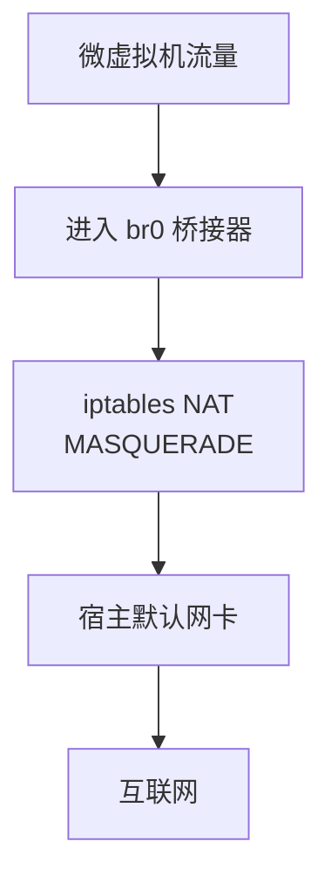
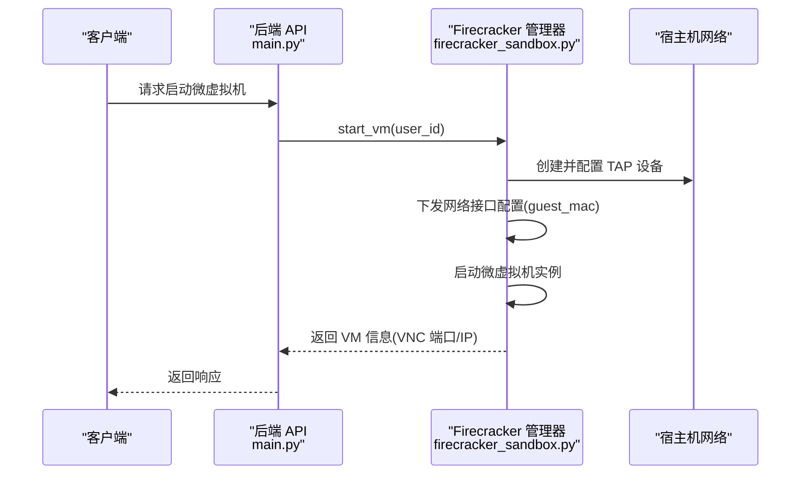
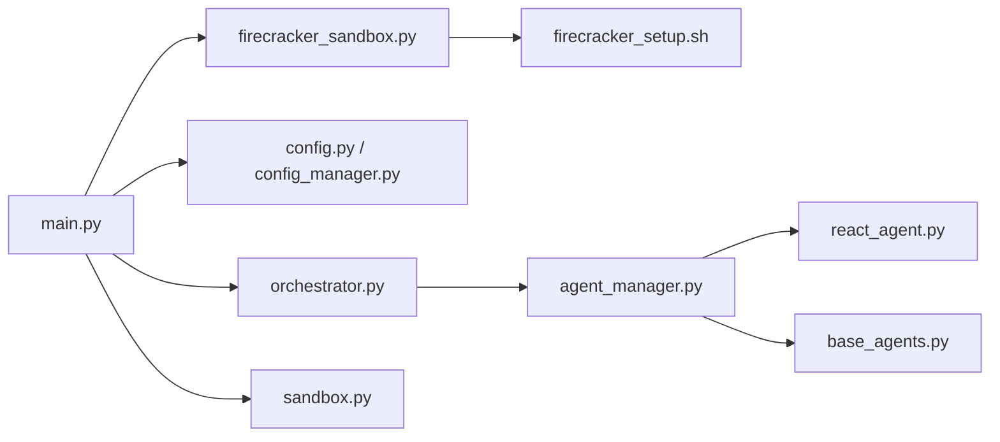

# 网络配置与桥接

<cite>
**本文引用的文件**
- [main.py](file://localmanus-backend/main.py)
- [firecracker_sandbox.py](file://localmanus-backend/core/firecracker_sandbox.py)
- [sandbox.py](file://localmanus-backend/core/sandbox.py)
- [config.py](file://localmanus-backend/core/config.py)
- [config_manager.py](file://localmanus-backend/core/config_manager.py)
- [orchestrator.py](file://localmanus-backend/core/orchestrator.py)
- [agent_manager.py](file://localmanus-backend/core/agent_manager.py)
- [react_agent.py](file://localmanus-backend/agents/react_agent.py)
- [base_agents.py](file://localmanus-backend/agents/base_agents.py)
- [firecracker_setup.sh](file://localmanus-backend/scripts/firecracker_setup.sh)
- [FIRECRACKER_TROUBLESHOOTING.md](file://localmanus-backend/scripts/FIRECRACKER_TROUBLESHOOTING.md)
</cite>

## 目录
1. [简介](#简介)
2. [项目结构](#项目结构)
3. [核心组件](#核心组件)
4. [架构总览](#架构总览)
5. [详细组件分析](#详细组件分析)
6. [依赖关系分析](#依赖关系分析)
7. [性能考虑](#性能考虑)
8. [故障排查指南](#故障排查指南)
9. [结论](#结论)
10. [附录](#附录)

## 简介
本文件面向 Firecracker 微虚拟机（microVM）的网络配置与桥接机制，结合代码库中已实现的 TAP 设备创建、网络接口绑定、MAC 地址分配、IP 地址规划策略，以及主机侧 br0 桥接器、iptables 规则与 NAT 的配置说明，帮助读者理解从宿主到微虚拟机的网络通路，并提供可操作的部署脚本、排障流程与最佳实践。

## 项目结构
后端服务采用 FastAPI 提供 API 网关，核心网络能力由 Firecracker 管理器负责，通过 TAP 设备将微虚拟机接入宿主 br0 桥接器，实现与外部网络的互通。整体结构如下：

图表来源
- [main.py](file://localmanus-backend/main.py#L34-L477)
- [firecracker_sandbox.py](file://localmanus-backend/core/firecracker_sandbox.py#L1-L243)
- [config.py](file://localmanus-backend/core/config.py#L1-L22)
- [config_manager.py](file://localmanus-backend/core/config_manager.py#L1-L57)
- [orchestrator.py](file://localmanus-backend/core/orchestrator.py#L1-L150)
- [agent_manager.py](file://localmanus-backend/core/agent_manager.py#L1-L49)
- [react_agent.py](file://localmanus-backend/agents/react_agent.py#L1-L349)
- [base_agents.py](file://localmanus-backend/agents/base_agents.py#L1-L42)
- [sandbox.py](file://localmanus-backend/core/sandbox.py#L1-L75)
- [firecracker_setup.sh](file://localmanus-backend/scripts/firecracker_setup.sh#L1-L144)
- [FIRECRACKER_TROUBLESHOOTING.md](file://localmanus-backend/scripts/FIRECRACKER_TROUBLESHOOTING.md#L1-L61)

章节来源
- [main.py](file://localmanus-backend/main.py#L34-L477)
- [firecracker_sandbox.py](file://localmanus-backend/core/firecracker_sandbox.py#L1-L243)
- [firecracker_setup.sh](file://localmanus-backend/scripts/firecracker_setup.sh#L1-L144)

## 核心组件
- Firecracker 管理器：负责启动微虚拟机、创建并配置 TAP 设备、将 TAP 接入 br0 桥接器、下发网络接口配置（含 MAC 地址）、启动实例并提供 VNC 代理端口映射。
- 安装与桥接脚本：在首次部署时创建 br0 桥接器、配置桥接 IP、启用 IPv4 转发、添加 iptables NAT 与 FORWARD 规则，确保微虚拟机具备外网访问能力。
- 配置管理：提供模型与服务端口等运行参数的环境变量读取与更新能力，便于统一管理。
- 通用沙箱：用于非容器场景下的隔离执行，虽不直接参与 Firecracker 网络，但体现了隔离与安全边界的设计思路。

章节来源
- [firecracker_sandbox.py](file://localmanus-backend/core/firecracker_sandbox.py#L12-L243)
- [firecracker_setup.sh](file://localmanus-backend/scripts/firecracker_setup.sh#L76-L90)
- [config.py](file://localmanus-backend/core/config.py#L19-L22)
- [config_manager.py](file://localmanus-backend/core/config_manager.py#L15-L57)
- [sandbox.py](file://localmanus-backend/core/sandbox.py#L10-L75)

## 架构总览
下图展示了从后端 API 到 Firecracker 微虚拟机的网络路径：API 创建/启动微虚拟机 → 生成 TAP 设备 → 加入 br0 桥接器 → 通过 NAT 访问外网。

图表来源
- [firecracker_sandbox.py](file://localmanus-backend/core/firecracker_sandbox.py#L119-L200)
- [firecracker_setup.sh](file://localmanus-backend/scripts/firecracker_setup.sh#L76-L90)

## 详细组件分析

### TAP 设备创建与配置
- TAP 创建：通过命令行工具创建 TAP 设备，并将其加入 br0 桥接器，随后置为 UP 状态。
- 接口绑定：将 TAP 设备作为宿主侧出口，供微虚拟机 eth0 使用。
- MAC 地址：在微虚拟机网络接口配置中显式指定 guest_mac，避免冲突并便于识别。
- IP 规划：VNC 代理使用基于用户 ID 的静态 IP 规划（例如 172.16.x.y），便于映射与访问；微虚拟机业务网络可按需扩展子网段。

图表来源
- [firecracker_sandbox.py](file://localmanus-backend/core/firecracker_sandbox.py#L119-L200)

章节来源
- [firecracker_sandbox.py](file://localmanus-backend/core/firecracker_sandbox.py#L119-L200)

### 网络桥接机制（Bridge/NAT）
- br0 桥接器：脚本在宿主机上创建 br0 并配置桥接 IP，作为微虚拟机的默认网关。
- iptables 规则：
  - 启用 IPv4 转发；
  - 在 NAT 表添加 MASQUERADE 规则，使微虚拟机流量经由默认网卡出站；
  - 在 FORWARD 链允许 RELATED,ESTABLISHED 流量与从 br0 出口的流量。
- NAT 作用：实现微虚拟机与外网之间的地址转换与路由，保证微虚拟机具备互联网访问能力。

图表来源
- [firecracker_setup.sh](file://localmanus-backend/scripts/firecracker_setup.sh#L84-L90)

章节来源
- [firecracker_setup.sh](file://localmanus-backend/scripts/firecracker_setup.sh#L76-L90)

### 微虚拟机网络访问控制与安全隔离
- 网络访问控制：
  - 通过 iptables FORWARD 链限制仅允许来自 br0 的流量或已建立连接的回程流量，降低跨子网横向移动风险。
  - 可在宿主侧进一步增加基于源 IP 或端口的过滤规则，以细化访问策略。
- 安全隔离：
  - 微虚拟机与宿主共享内核但处于独立命名空间，具备进程级隔离；
  - 通过 TAP 设备与 br0 桥接，微虚拟机仅能通过宿主网卡访问外网，避免直接暴露宿主网络栈；
  - 建议配合内核版本与 KVM 权限控制，确保 /dev/kvm 的最小权限开放。

章节来源
- [firecracker_setup.sh](file://localmanus-backend/scripts/firecracker_setup.sh#L84-L90)

### VNC 代理与端口映射
- 端口计算：根据用户 ID 计算 VNC 代理端口，避免冲突；
- IP 分配：为每个微虚拟机分配固定网段内的 IP（如 172.16.x.y），便于浏览器通过 VNC 客户端访问。
- 注意：该实现主要用于开发与调试场景，生产环境应结合认证与 TLS 终止等安全措施。

章节来源
- [firecracker_sandbox.py](file://localmanus-backend/core/firecracker_sandbox.py#L212-L224)

### API 工作流（启动微虚拟机）

图表来源
- [main.py](file://localmanus-backend/main.py#L422-L439)
- [firecracker_sandbox.py](file://localmanus-backend/core/firecracker_sandbox.py#L132-L210)

章节来源
- [main.py](file://localmanus-backend/main.py#L422-L439)
- [firecracker_sandbox.py](file://localmanus-backend/core/firecracker_sandbox.py#L132-L210)

## 依赖关系分析
- 后端 API 依赖 Firecracker 管理器进行微虚拟机生命周期管理；
- Firecracker 管理器依赖宿主机网络环境（KVM、bridge-utils、iptables、websockify 等）；
- 安装脚本负责一次性初始化网络与权限，确保后续启动稳定；
- 配置管理模块提供运行参数读取与更新，便于统一维护。

图表来源
- [main.py](file://localmanus-backend/main.py#L1-L50)
- [firecracker_sandbox.py](file://localmanus-backend/core/firecracker_sandbox.py#L1-L60)
- [config.py](file://localmanus-backend/core/config.py#L1-L22)
- [config_manager.py](file://localmanus-backend/core/config_manager.py#L1-L57)
- [orchestrator.py](file://localmanus-backend/core/orchestrator.py#L1-L30)
- [agent_manager.py](file://localmanus-backend/core/agent_manager.py#L1-L49)
- [react_agent.py](file://localmanus-backend/agents/react_agent.py#L1-L30)
- [base_agents.py](file://localmanus-backend/agents/base_agents.py#L1-L20)
- [sandbox.py](file://localmanus-backend/core/sandbox.py#L1-L20)
- [firecracker_setup.sh](file://localmanus-backend/scripts/firecracker_setup.sh#L1-L30)

章节来源
- [main.py](file://localmanus-backend/main.py#L1-L50)
- [firecracker_sandbox.py](file://localmanus-backend/core/firecracker_sandbox.py#L1-L60)

## 性能考虑
- TAP 与桥接：使用内核态 TAP 与桥接器，延迟低、吞吐高；建议在宿主机上开启网卡硬件加速与合适的队列深度。
- NAT 与转发：iptables 规则简单高效，避免复杂 ACL 带来的额外开销；如需更高并发，可评估使用更高效的 NAT 实现或内核模块。
- VNC 代理：仅用于开发调试，生产环境建议改用安全隧道或专用桌面访问方案。
- 微虚拟机数量：随着并发 VM 数量上升，注意 br0 上的链路带宽与 CPU 开销，必要时拆分网段或引入多桥接器。

## 故障排查指南
- 常见问题与根因
  - 套接字错误：旧进程未清理导致套接字占用、权限不足、默认套接字路径与实际不符。
  - TAP 设备残留：微虚拟机异常退出后未删除 TAP，导致后续创建失败。
  - 权限问题：KVM 设备权限不正确，导致无法启动微虚拟机。
- 快速修复步骤
  - 手动清理：停止所有 Firecracker 进程、删除套接字文件、删除 TAP 设备。
  - 使用自动化清理脚本：一键停止进程、删除套接字、清理 TAP。
  - 检查运行进程与套接字文件，确认权限与目录归属。
- 建议
  - 首次部署时运行安装脚本，确保 br0、iptables、转发等配置就绪；
  - 生产环境建议在防火墙层进一步限制外网访问范围，并对 VNC 通道进行加密与认证。

章节来源
- [FIRECRACKER_TROUBLESHOOTING.md](file://localmanus-backend/scripts/FIRECRACKER_TROUBLESHOOTING.md#L1-L61)
- [firecracker_setup.sh](file://localmanus-backend/scripts/firecracker_setup.sh#L108-L127)

## 结论
本项目通过 TAP 设备与 br0 桥接器实现了微虚拟机与宿主网络的稳定连接，并借助 iptables NAT 保障了外网可达性。配合安装脚本与排障指南，可在本地快速搭建可用的 Firecracker 网络环境。生产环境中建议进一步强化访问控制、安全隔离与监控告警，确保网络链路的安全与稳定。

## 附录
- 安装与初始化
  - 首次部署时运行安装脚本，自动创建 br0、配置桥接 IP、启用转发、添加 NAT 与 FORWARD 规则，并生成清理脚本。
- 配置项参考
  - 主机监听地址与端口：由配置模块提供；
  - 模型与 API 基础地址：由配置管理模块读取并支持更新。
- 最佳实践
  - 使用用户 ID 对 TAP 名称与微虚拟机 IP 进行唯一化规划；
  - 严格控制 KVM 权限，仅授予必要用户组；
  - 生产环境禁用或限制 VNC 访问，采用受控的远程桌面方案；
  - 定期巡检 iptables 规则与 TAP 设备状态，防止资源泄漏。

章节来源
- [firecracker_setup.sh](file://localmanus-backend/scripts/firecracker_setup.sh#L76-L144)
- [config.py](file://localmanus-backend/core/config.py#L19-L22)
- [config_manager.py](file://localmanus-backend/core/config_manager.py#L15-L57)