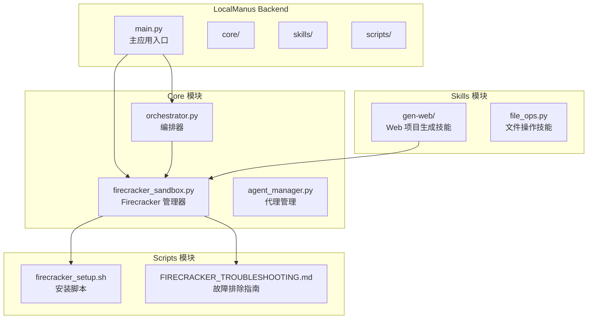
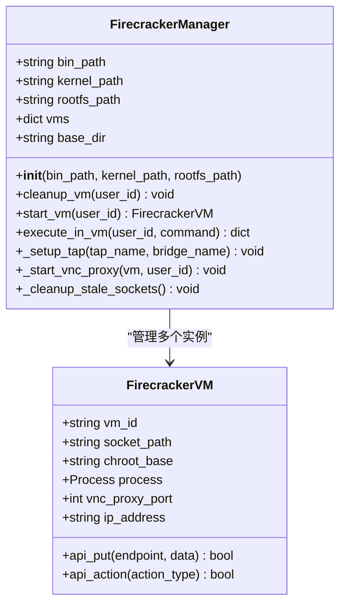
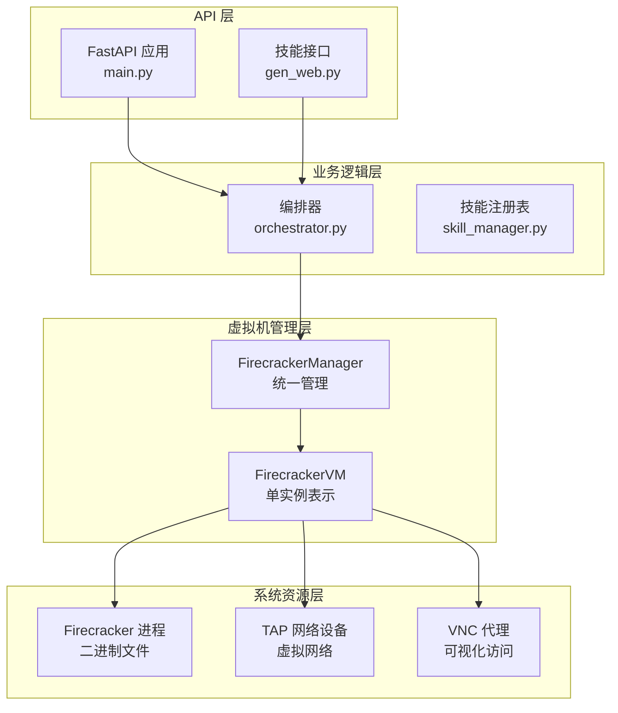
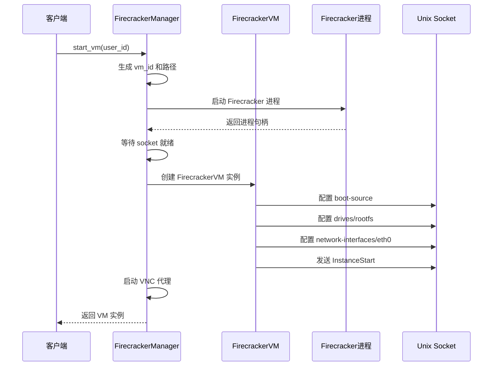
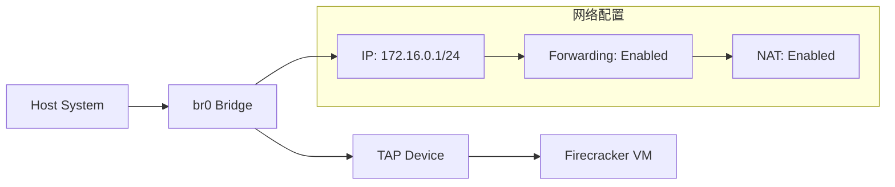
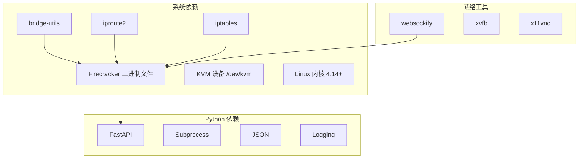
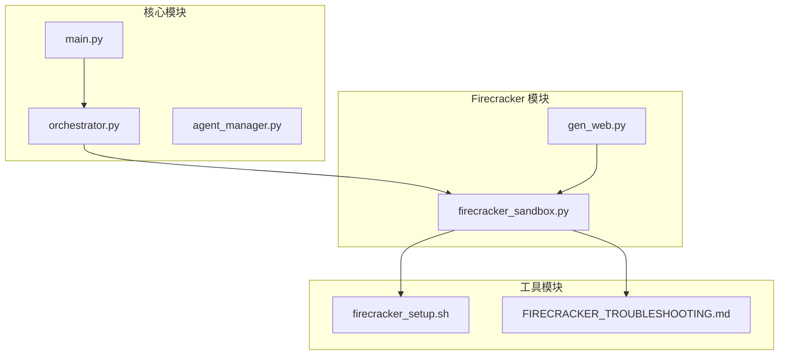

# 虚拟机实例管理

<cite>
**本文档引用的文件**
- [firecracker_sandbox.py](file://localmanus-backend/core/firecracker_sandbox.py)
- [firecracker_setup.sh](file://localmanus-backend/scripts/firecracker_setup.sh)
- [FIRECRACKER_TROUBLESHOOTING.md](file://localmanus-backend/scripts/FIRECRACKER_TROUBLESHOOTING.md)
- [gen_web.py](file://localmanus-backend/skills/gen-web/gen_web.py)
- [main.py](file://localmanus-backend/main.py)
- [requirements.txt](file://localmanus-backend/requirements.txt)
</cite>

## 目录
1. [简介](#简介)
2. [项目结构](#项目结构)
3. [核心组件](#核心组件)
4. [架构概览](#架构概览)
5. [详细组件分析](#详细组件分析)
6. [依赖关系分析](#依赖关系分析)
7. [性能考虑](#性能考虑)
8. [故障排除指南](#故障排除指南)
9. [结论](#结论)

## 简介

本文档深入解析 LocalManus 项目中的 Firecracker 虚拟机实例管理系统。该系统提供了基于 Firecracker 的微虚拟机（MicroVM）管理能力，支持为每个用户创建隔离的虚拟环境，用于执行各种任务和项目生成。

Firecracker 是一个开源的虚拟化解决方案，专注于快速启动时间和资源效率。在 LocalManus 中，它被用来为用户提供安全、隔离且高性能的计算环境。

## 项目结构

LocalManus 后端采用模块化架构设计，Firecracker 管理功能主要集中在 `core` 目录下的 `firecracker_sandbox.py` 文件中。



**图表来源**
- [firecracker_sandbox.py](file://localmanus-backend/core/firecracker_sandbox.py#L1-L243)
- [main.py](file://localmanus-backend/main.py#L1-L477)

**章节来源**
- [firecracker_sandbox.py](file://localmanus-backend/core/firecracker_sandbox.py#L1-L243)
- [main.py](file://localmanus-backend/main.py#L1-L477)

## 核心组件

### FirecrackerVM 类

`FirecrackerVM` 类是系统的核心组件之一，代表单个 Firecracker 微虚拟机实例。



**图表来源**
- [firecracker_sandbox.py](file://localmanus-backend/core/firecracker_sandbox.py#L12-L48)
- [firecracker_sandbox.py](file://localmanus-backend/core/firecracker_sandbox.py#L49-L242)

### 关键属性说明

- **vm_id**: 虚拟机唯一标识符，格式为 `vm_{user_id}_{timestamp}`
- **socket_path**: Firecracker API 套接字路径
- **chroot_base**: 虚拟机根目录基础路径
- **process**: Firecracker 进程对象
- **vnc_proxy_port**: VNC 代理端口号
- **ip_address**: 虚拟机内部 IP 地址

**章节来源**
- [firecracker_sandbox.py](file://localmanus-backend/core/firecracker_sandbox.py#L12-L48)

## 架构概览

LocalManus 的 Firecracker 管理系统采用分层架构设计，实现了从 API 层到虚拟机管理层的清晰分离。



**图表来源**
- [main.py](file://localmanus-backend/main.py#L1-L477)
- [gen_web.py](file://localmanus-backend/skills/gen-web/gen_web.py#L1-L64)
- [firecracker_sandbox.py](file://localmanus-backend/core/firecracker_sandbox.py#L49-L242)

## 详细组件分析

### VM 生命周期管理

FirecrackerVM 类实现了完整的生命周期管理，包括初始化、配置、启动和清理。

#### VM 标识符生成策略

系统采用动态标识符生成策略，确保每个虚拟机实例都有唯一的标识符：

```mermaid
flowchart TD
A[开始创建 VM] --> B[获取 user_id]
B --> C[获取当前时间戳]
C --> D[生成 vm_id = vm_{user_id}_{timestamp}]
D --> E[创建 socket 路径]
E --> F[创建 chroot 目录]
F --> G[返回 FirecrackerVM 实例]
```

**图表来源**
- [firecracker_sandbox.py](file://localmanus-backend/core/firecracker_sandbox.py#L136-L140)

#### 进程启动与监控

VM 启动过程包含多步骤配置和错误处理机制：



**图表来源**
- [firecracker_sandbox.py](file://localmanus-backend/core/firecracker_sandbox.py#L132-L210)

**章节来源**
- [firecracker_sandbox.py](file://localmanus-backend/core/firecracker_sandbox.py#L132-L210)

### API 通信机制

系统使用 cURL 工具通过 Unix 域套接字与 Firecracker API 进行通信。

#### HTTP API 调用封装

```mermaid
classDiagram
class FirecrackerVM {
+api_put(endpoint, data) bool
+api_action(action_type) bool
}
note for FirecrackerVM : "使用 cURL 工具\n通过 Unix Socket\n发送 HTTP 请求"
class APICall {
+string socket_path
+string endpoint
+dict data
+execute() dict
}
FirecrackerVM --> APICall : "封装 API 调用"
```

**图表来源**
- [firecracker_sandbox.py](file://localmanus-backend/core/firecracker_sandbox.py#L24-L47)

#### 套接字通信协议

系统采用 Unix 域套接字进行本地进程间通信，避免网络开销并提高安全性。

**章节来源**
- [firecracker_sandbox.py](file://localmanus-backend/core/firecracker_sandbox.py#L24-L47)

### VM 配置参数

#### 内核镜像配置

系统默认使用优化的 microVM 内核镜像，支持快速启动和最小化资源占用。

#### 根文件系统配置

根文件系统采用 ext4 格式，提供稳定的文件系统支持和良好的性能表现。

#### 引导参数设置

引导参数经过优化配置，包括：
- `console=ttyS0`: 设置控制台输出
- `reboot=k`: 使用内核重启
- `panic=1`: 系统崩溃时立即重启
- `pci=off`: 禁用 PCI 设备
- `nomodules`: 不加载内核模块

**章节来源**
- [firecracker_sandbox.py](file://localmanus-backend/core/firecracker_sandbox.py#L178-L182)

### 网络配置

系统使用 TAP 设备实现虚拟网络连接，支持 NAT 和桥接网络配置。



**图表来源**
- [firecracker_setup.sh](file://localmanus-backend/scripts/firecracker_setup.sh#L76-L89)

**章节来源**
- [firecracker_sandbox.py](file://localmanus-backend/core/firecracker_sandbox.py#L192-L199)
- [firecracker_setup.sh](file://localmanus-backend/scripts/firecracker_setup.sh#L76-L89)

### VNC 可视化访问

系统集成 VNC 代理服务，提供图形界面访问能力。

#### VNC 端口分配策略

```mermaid
flowchart TD
A[用户 ID] --> B{检查是否为数字}
B --> |是| C[计算端口: 6080 + (user_id % 1000)]
B --> |否| D[使用默认端口: 6080]
C --> E[VNC 端口]
D --> E
E --> F[启动 websockify 代理]
```

**图表来源**
- [firecracker_sandbox.py](file://localmanus-backend/core/firecracker_sandbox.py#L212-L223)

**章节来源**
- [firecracker_sandbox.py](file://localmanus-backend/core/firecracker_sandbox.py#L212-L223)

## 依赖关系分析

### 外部依赖

系统依赖以下关键组件：



**图表来源**
- [requirements.txt](file://localmanus-backend/requirements.txt#L1-L14)
- [firecracker_setup.sh](file://localmanus-backend/scripts/firecracker_setup.sh#L36-L45)

**章节来源**
- [requirements.txt](file://localmanus-backend/requirements.txt#L1-L14)
- [firecracker_setup.sh](file://localmanus-backend/scripts/firecracker_setup.sh#L36-L45)

### 内部组件依赖



**图表来源**
- [main.py](file://localmanus-backend/main.py#L1-L477)
- [gen_web.py](file://localmanus-backend/skills/gen-web/gen_web.py#L1-L64)
- [firecracker_sandbox.py](file://localmanus-backend/core/firecracker_sandbox.py#L1-L243)

**章节来源**
- [main.py](file://localmanus-backend/main.py#L1-L477)
- [gen_web.py](file://localmanus-backend/skills/gen-web/gen_web.py#L1-L64)
- [firecracker_sandbox.py](file://localmanus-backend/core/firecracker_sandbox.py#L1-L243)

## 性能考虑

### 启动时间优化

Firecracker 的设计目标是快速启动，系统通过以下方式进一步优化启动性能：

1. **异步启动**: 使用非阻塞方式启动虚拟机进程
2. **延迟初始化**: 按需创建虚拟机实例
3. **资源复用**: 复用已配置的内核和根文件系统

### 内存使用优化

- **最小化内核**: 使用专门优化的 microVM 内核
- **精简文件系统**: 仅包含必要的系统文件
- **按需挂载**: 动态挂载所需的磁盘驱动器

### 网络性能

- **TAP 设备**: 提供接近原生的网络性能
- **NAT 配置**: 支持互联网访问但保持隔离性
- **桥接网络**: 减少网络转发开销

## 故障排除指南

### 常见问题及解决方案

#### Socket 连接问题

**问题**: "Failed to open the API socket"

**可能原因**:
1. 存在陈旧的 socket 文件
2. 其他 Firecracker 进程正在运行
3. 权限不足
4. 使用了错误的 socket 路径

**解决方案**:
```bash
# 清理陈旧进程和 socket
sudo pkill -9 firecracker
sudo rm -f /run/firecracker.socket
sudo rm -f /tmp/localmanus_vms/*.socket

# 检查权限
sudo chmod 666 /dev/kvm
sudo chmod 755 /tmp/localmanus_vms
```

#### KVM 设备问题

**问题**: KVM 设备不可用

**解决方案**:
```bash
# 检查 KVM 是否可用
ls -la /dev/kvm

# 如果不存在，启用 KVM
modprobe kvm
modprobe kvm_intel  # 或 kvm_amd
```

#### 网络配置问题

**问题**: 虚拟机无法访问网络

**解决方案**:
```bash
# 检查桥接设备
ip link show br0

# 重新配置桥接网络
sudo ip link add name br0 type bridge
sudo ip addr add 172.16.0.1/24 dev br0
sudo ip link set br0 up

# 启用 IP 转发
sudo sysctl -w net.ipv4.ip_forward=1
```

**章节来源**
- [FIRECRACKER_TROUBLESHOOTING.md](file://localmanus-backend/scripts/FIRECRACKER_TROUBLESHOOTING.md#L1-L150)

### 日志记录最佳实践

系统实现了全面的日志记录机制，建议使用以下配置：

```python
import logging

# 基础配置
logging.basicConfig(
    level=logging.INFO,
    format='%(asctime)s - %(name)s - %(levelname)s - %(message)s'
)

# 特定模块配置
logging.getLogger("LocalManus-Firecracker").setLevel(logging.DEBUG)
logging.getLogger("LocalManus-Backend").setLevel(logging.INFO)
```

**章节来源**
- [firecracker_sandbox.py](file://localmanus-backend/core/firecracker_sandbox.py#L10-L10)
- [FIRECRACKER_TROUBLESHOOTING.md](file://localmanus-backend/scripts/FIRECRACKER_TROUBLESHOOTING.md#L116-L129)

## 结论

LocalManus 的 Firecracker 虚拟机实例管理系统展现了现代微虚拟化技术的最佳实践。通过精心设计的架构和完善的错误处理机制，系统能够为用户提供安全、隔离且高性能的计算环境。

### 主要优势

1. **快速启动**: 利用 Firecracker 的快速启动特性
2. **资源隔离**: 每个用户拥有独立的虚拟环境
3. **易于管理**: 统一的管理接口和生命周期控制
4. **可扩展性**: 支持多用户并发管理和资源分配

### 技术亮点

- **动态标识符生成**: 确保 VM 实例的唯一性和可追踪性
- **健壮的错误处理**: 完善的异常捕获和恢复机制
- **灵活的配置管理**: 支持多种配置选项和自定义参数
- **完整的生命周期管理**: 从创建到销毁的全流程自动化

### 未来改进方向

1. **增强监控**: 添加更详细的性能指标和健康检查
2. **资源限制**: 实现 CPU 和内存使用限制
3. **自动扩缩容**: 根据负载自动调整 VM 资源
4. **高级网络**: 支持更复杂的网络拓扑和安全策略

该系统为构建现代化的 AI 协作平台奠定了坚实的基础，通过 Firecracker 微虚拟化的强大能力，为用户提供了既安全又高效的计算环境。