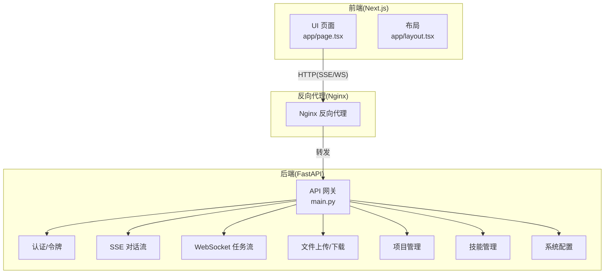
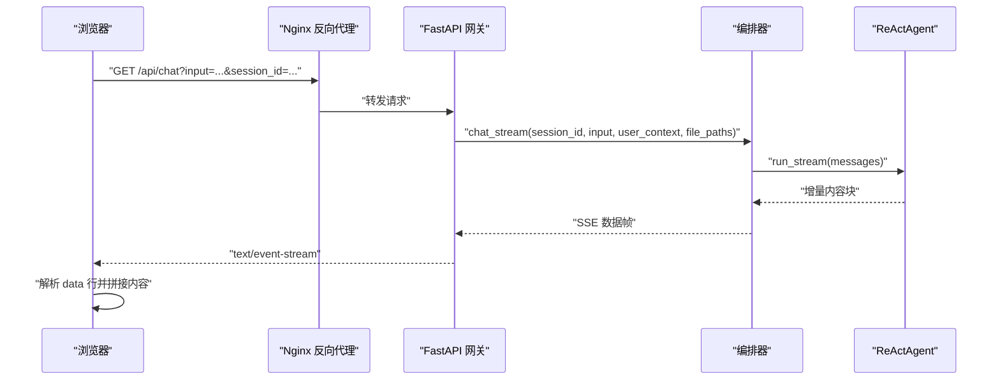
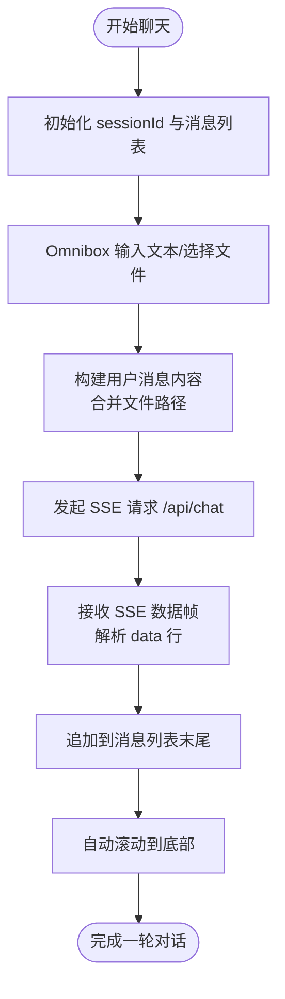
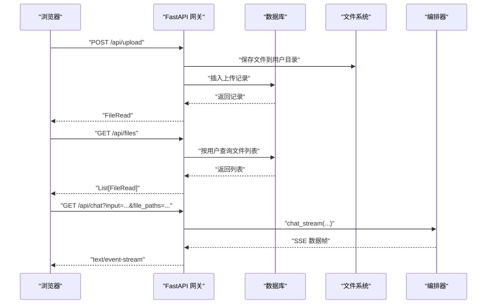
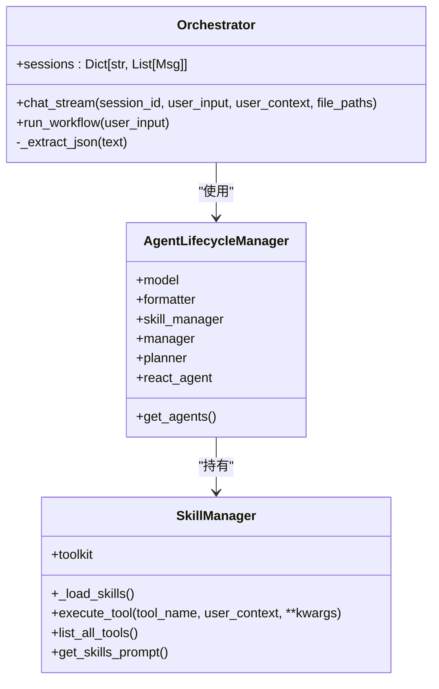
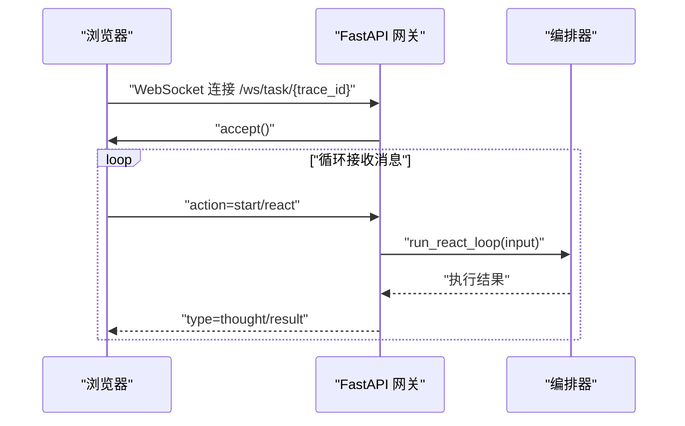
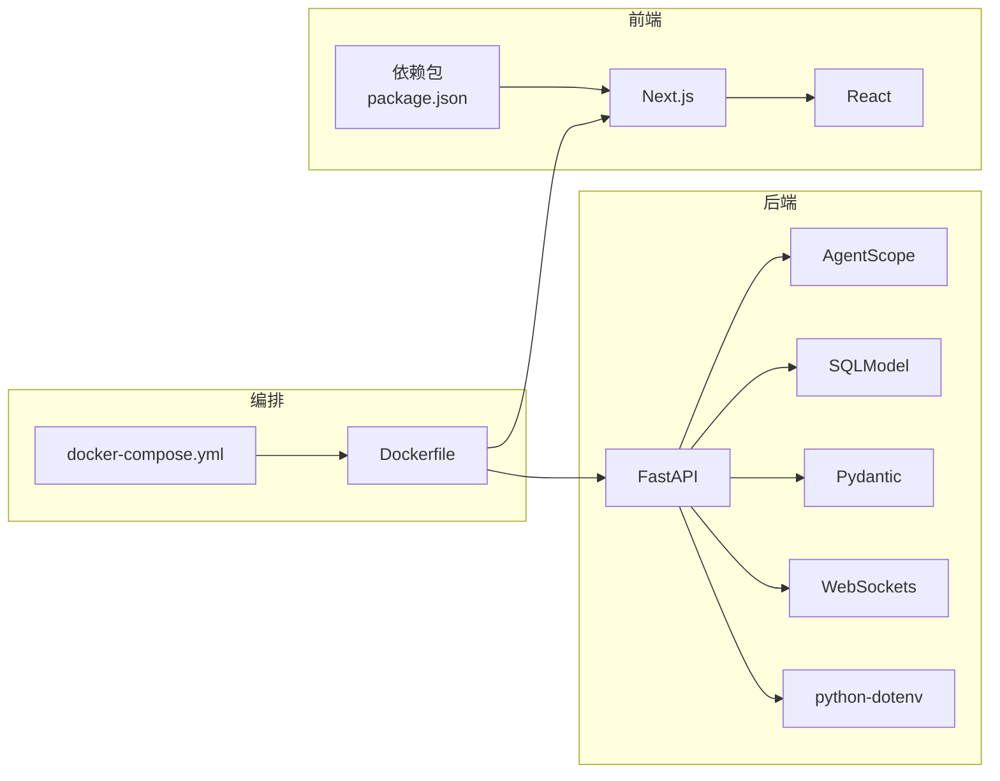
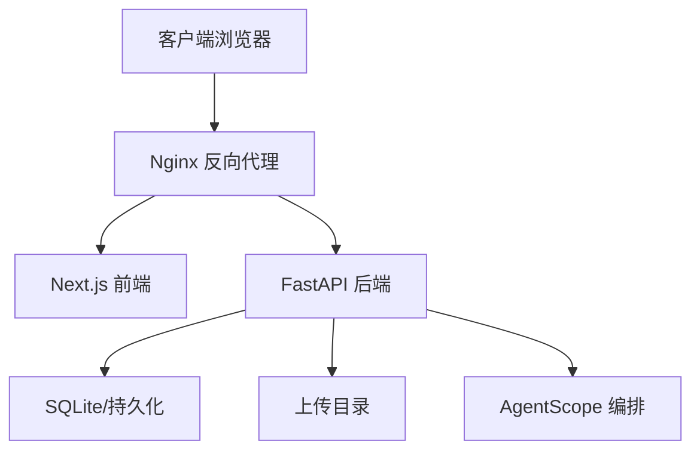

# 前后端分离架构

<cite>
**本文引用的文件**
- [localmanus-backend/main.py](file://localmanus-backend/main.py)
- [localmanus-backend/core/orchestrator.py](file://localmanus-backend/core/orchestrator.py)
- [localmanus-backend/core/agent_manager.py](file://localmanus-backend/core/agent_manager.py)
- [localmanus-backend/core/skill_manager.py](file://localmanus-backend/core/skill_manager.py)
- [localmanus-backend/core/config.py](file://localmanus-backend/core/config.py)
- [localmanus-backend/Dockerfile](file://localmanus-backend/Dockerfile)
- [localmanus-backend/requirements.txt](file://localmanus-backend/requirements.txt)
- [localmanus-ui/app/layout.tsx](file://localmanus-ui/app/layout.tsx)
- [localmanus-ui/app/page.tsx](file://localmanus-ui/app/page.tsx)
- [localmanus-ui/package.json](file://localmanus-ui/package.json)
- [localmanus-ui/next.config.ts](file://localmanus-ui/next.config.ts)
- [localmanus-ui/Dockerfile](file://localmanus-ui/Dockerfile)
- [docker-compose.yml](file://docker-compose.yml)
- [localmanus_architecture.md](file://localmanus_architecture.md)
</cite>

## 目录
1. [简介](#简介)
2. [项目结构](#项目结构)
3. [核心组件](#核心组件)
4. [架构总览](#架构总览)
5. [详细组件分析](#详细组件分析)
6. [依赖关系分析](#依赖关系分析)
7. [性能考虑](#性能考虑)
8. [故障排查指南](#故障排查指南)
9. [结论](#结论)
10. [附录](#附录)

## 简介
本文件面向 LocalManus 的前后端分离架构，系统性梳理 Next.js 前端应用的组件层次、状态管理与路由设计，以及 FastAPI 后端的服务架构、API 网关与中间件配置。同时，深入阐述 WebSocket 实时通信、SSE 流式传输与前后端数据同步策略，覆盖跨域处理、CORS 配置与安全头设置，给出接口规范、错误处理策略与性能优化建议，并提供部署架构图与数据流说明。

## 项目结构
- 后端采用 FastAPI，提供统一 API 网关，集成认证、文件上传、项目管理、技能管理、系统配置与对话流式输出等能力。
- 前端采用 Next.js，使用客户端组件与页面路由，负责聊天界面、文件上传、模板展示与实时消息渲染。
- 通过 Docker Compose 编排 Nginx 反向代理、前端与后端服务，实现健康检查与网络隔离。

图表来源
- [docker-compose.yml](file://docker-compose.yml#L1-L88)
- [localmanus-ui/app/page.tsx](file://localmanus-ui/app/page.tsx#L1-L293)
- [localmanus-backend/main.py](file://localmanus-backend/main.py#L1-L477)

章节来源
- [docker-compose.yml](file://docker-compose.yml#L1-L88)
- [localmanus-ui/app/layout.tsx](file://localmanus-ui/app/layout.tsx#L1-L20)
- [localmanus-ui/app/page.tsx](file://localmanus-ui/app/page.tsx#L1-L293)
- [localmanus-backend/main.py](file://localmanus-backend/main.py#L1-L477)

## 核心组件
- 前端 Next.js 应用
  - 页面与组件：页面路由、侧边栏、工具箱、用户状态、OmniBox 输入框、Markdown 渲染器。
  - 状态管理：本地 React 状态驱动聊天消息、加载状态、会话 ID、已上传文件列表。
  - 路由系统：App Router，页面级路由与客户端渲染。
- 后端 FastAPI 网关
  - 认证与授权：OAuth2 密码模式、JWT 令牌、当前用户依赖注入。
  - 文件服务：上传、列出、下载、删除，用户隔离存储。
  - 项目管理：CRUD 项目，按用户隔离。
  - 技能管理：技能清单、配置更新、启用/禁用。
  - 系统配置：读取与更新全局配置。
  - 对话与任务：SSE 流式对话、ReAct 循环、WebSocket 任务流。
- 多智能体编排
  - Orchestrator：会话管理、历史同步、SSE 数据格式化、JSON 提取。
  - AgentLifecycleManager：模型初始化、技能管理器、Agent 实例化。
  - SkillManager：技能目录扫描、工具注册、异步工具执行。

章节来源
- [localmanus-ui/app/page.tsx](file://localmanus-ui/app/page.tsx#L1-L293)
- [localmanus-backend/main.py](file://localmanus-backend/main.py#L1-L477)
- [localmanus-backend/core/orchestrator.py](file://localmanus-backend/core/orchestrator.py#L1-L150)
- [localmanus-backend/core/agent_manager.py](file://localmanus-backend/core/agent_manager.py#L1-L49)
- [localmanus-backend/core/skill_manager.py](file://localmanus-backend/core/skill_manager.py#L1-L143)

## 架构总览
- 服务编排
  - Nginx 作为反向代理，监听 80 端口，健康检查后将请求转发至后端与前端。
  - 后端服务暴露 8000 端口，提供健康检查与 API。
  - 前端服务暴露 3000 端口，生产构建产物通过 standalone 输出。
- 通信协议
  - SSE：后端以 text/event-stream 推送增量内容，前端逐行解析 data 字段。
  - WebSocket：任务执行阶段的实时状态与中间结果推送。
  - HTTP：RESTful API 用于认证、文件、项目、技能与配置管理。
- 安全与跨域
  - CORS：允许任意来源、方法与头，便于开发与跨域调试。
  - JWT：Bearer 令牌保护受控端点。
  - Nginx：统一入口与健康检查，隐藏内部端口细节。

图表来源
- [localmanus-backend/main.py](file://localmanus-backend/main.py#L392-L420)
- [localmanus-backend/core/orchestrator.py](file://localmanus-backend/core/orchestrator.py#L16-L96)

章节来源
- [docker-compose.yml](file://docker-compose.yml#L1-L88)
- [localmanus-backend/main.py](file://localmanus-backend/main.py#L52-L59)
- [localmanus-backend/main.py](file://localmanus-backend/main.py#L392-L420)
- [localmanus-backend/core/orchestrator.py](file://localmanus-backend/core/orchestrator.py#L16-L96)

## 详细组件分析

### 前端组件层次与状态管理
- 组件层次
  - 页面容器：Home 页面负责聊天模式切换、消息列表渲染、模板区展示。
  - 交互组件：Sidebar、Toolbox、UserStatus、Omnibox。
  - 渲染组件：MarkdownRenderer。
- 状态管理
  - 本地状态：messages、isLoading、sessionId、uploadedFiles。
  - 自动滚动：消息变化时平滑滚动到底部。
  - 文件关联：发送消息时将已上传文件路径附加到用户输入。
- 路由系统
  - App Router：页面级路由，客户端渲染，支持静态资源与样式模块化。

图表来源
- [localmanus-ui/app/page.tsx](file://localmanus-ui/app/page.tsx#L43-L141)

章节来源
- [localmanus-ui/app/page.tsx](file://localmanus-ui/app/page.tsx#L1-L293)
- [localmanus-ui/app/layout.tsx](file://localmanus-ui/app/layout.tsx#L1-L20)

### 后端服务架构与 API 网关
- 认证与授权
  - 注册：用户名唯一性校验，密码哈希存储。
  - 登录：OAuth2 密码模式，返回 JWT 令牌。
  - 当前用户：依赖注入获取当前用户信息。
- 文件服务
  - 上传：生成唯一文件名，保存到用户专属目录，记录数据库。
  - 列表：按用户查询上传记录。
  - 下载：FileResponse 返回文件，校验存在性。
  - 删除：删除磁盘文件与数据库记录。
- 项目管理
  - CRUD 项目，按用户隔离，支持颜色与图标字段。
- 技能管理
  - 列出技能与详情，更新技能配置与启用状态。
- 系统配置
  - 读取与更新全局配置，持久化到配置管理器。
- 对话与任务
  - SSE：chat_sse 以流式方式返回增量内容，支持文件路径上下文。
  - ReAct：同步端点触发 ReAct 循环，返回结果。
  - WebSocket：/ws/task/{trace_id} 接收客户端动作，执行 ReAct 并回传中间结果与最终结果。

图表来源
- [localmanus-backend/main.py](file://localmanus-backend/main.py#L112-L215)
- [localmanus-backend/main.py](file://localmanus-backend/main.py#L392-L420)
- [localmanus-backend/core/orchestrator.py](file://localmanus-backend/core/orchestrator.py#L16-L96)

章节来源
- [localmanus-backend/main.py](file://localmanus-backend/main.py#L74-L215)
- [localmanus-backend/main.py](file://localmanus-backend/main.py#L221-L285)
- [localmanus-backend/main.py](file://localmanus-backend/main.py#L287-L390)
- [localmanus-backend/main.py](file://localmanus-backend/main.py#L392-L438)

### 多智能体编排与技能系统
- Orchestrator
  - 会话管理：按 session_id 维护消息历史，限制轮次。
  - 历史同步：内部协议 _sync 用于同步到会话历史，不透传给前端。
  - JSON 提取：从 Agent 响应中提取 JSON 块。
- AgentLifecycleManager
  - 初始化模型（支持本地/远程），格式化器与内存。
  - 实例化 Manager、Planner、ReActAgent。
- SkillManager
  - 技能目录扫描：注册 AgentSkill 与 ToolFunction。
  - 工具执行：注入 user_context，异步执行工具并聚合响应。

图表来源
- [localmanus-backend/core/orchestrator.py](file://localmanus-backend/core/orchestrator.py#L11-L150)
- [localmanus-backend/core/agent_manager.py](file://localmanus-backend/core/agent_manager.py#L11-L49)
- [localmanus-backend/core/skill_manager.py](file://localmanus-backend/core/skill_manager.py#L18-L143)

章节来源
- [localmanus-backend/core/orchestrator.py](file://localmanus-backend/core/orchestrator.py#L11-L150)
- [localmanus-backend/core/agent_manager.py](file://localmanus-backend/core/agent_manager.py#L11-L49)
- [localmanus-backend/core/skill_manager.py](file://localmanus-backend/core/skill_manager.py#L18-L143)

### WebSocket 实时通信与 SSE 流式传输
- SSE
  - 后端以 StreamingResponse 返回 text/event-stream。
  - 前端使用 Fetch + ReadableStream 解析 data 行，拼接增量内容。
  - 支持文件路径上下文与用户身份信息。
- WebSocket
  - /ws/task/{trace_id} 接收客户端动作，执行 ReAct 循环，回传中间思考与最终结果。
  - 适合需要双向实时状态与中间事件的场景。

图表来源
- [localmanus-backend/main.py](file://localmanus-backend/main.py#L440-L473)
- [localmanus-backend/core/orchestrator.py](file://localmanus-backend/core/orchestrator.py#L97-L129)

章节来源
- [localmanus-backend/main.py](file://localmanus-backend/main.py#L392-L438)
- [localmanus-backend/main.py](file://localmanus-backend/main.py#L440-L473)

### 跨域处理、CORS 配置与安全头
- CORS
  - 允许任意来源、凭证、方法与头，便于开发与跨域调试。
- 安全头
  - 当前未显式设置额外安全头，建议在生产环境增加 HSTS、CSP、X-Frame-Options 等。
- 认证
  - JWT Bearer 令牌保护受控端点，登录成功后返回 access_token。

章节来源
- [localmanus-backend/main.py](file://localmanus-backend/main.py#L52-L59)
- [localmanus-backend/main.py](file://localmanus-backend/main.py#L92-L106)

### 接口规范与错误处理策略
- 接口规范
  - 认证：POST /api/login 返回 Token；GET /api/me 返回当前用户。
  - 文件：POST /api/upload、GET /api/files、GET /api/files/{file_id}、DELETE /api/files/{file_id}。
  - 项目：GET /api/projects、POST /api/projects、GET /api/projects/{project_id}、PUT /api/projects/{project_id}、DELETE /api/projects/{project_id}。
  - 技能：GET /api/skills、GET /api/skills/{skill_id}、PUT /api/skills/{skill_id}/config、PUT /api/skills/{skill_id}/status。
  - 设置：GET /api/settings、PUT /api/settings。
  - 对话：GET /api/chat（SSE）、POST /api/task（同步计划）、POST /api/react（同步 ReAct）。
  - WebSocket：/ws/task/{trace_id}。
- 错误处理
  - 文件上传异常捕获并返回 500。
  - 资源不存在返回 404。
  - 认证失败返回 401。
  - SSE 异常返回错误内容块。

章节来源
- [localmanus-backend/main.py](file://localmanus-backend/main.py#L74-L215)
- [localmanus-backend/main.py](file://localmanus-backend/main.py#L221-L285)
- [localmanus-backend/main.py](file://localmanus-backend/main.py#L287-L390)
- [localmanus-backend/main.py](file://localmanus-backend/main.py#L392-L438)

## 依赖关系分析
- 前端依赖
  - Next.js、React、lucide-react、react-markdown、rehype-highlight、remark-gfm。
  - 环境变量：NEXT_PUBLIC_API_URL、BACKEND_URL。
- 后端依赖
  - FastAPI、Uvicorn、AgentScope、Pydantic、WebSockets、SQLModel、Passlib、python-jose、dotenv。
- 编排与运行
  - Dockerfile 分层构建，健康检查，暴露端口。
  - docker-compose 编排 Nginx、后端、前端，网络隔离与数据卷。

图表来源
- [localmanus-ui/package.json](file://localmanus-ui/package.json#L15-L32)
- [localmanus-backend/requirements.txt](file://localmanus-backend/requirements.txt#L1-L14)
- [localmanus-backend/Dockerfile](file://localmanus-backend/Dockerfile#L1-L49)
- [localmanus-ui/Dockerfile](file://localmanus-ui/Dockerfile#L1-L35)
- [docker-compose.yml](file://docker-compose.yml#L1-L88)

章节来源
- [localmanus-ui/package.json](file://localmanus-ui/package.json#L1-L34)
- [localmanus-backend/requirements.txt](file://localmanus-backend/requirements.txt#L1-L14)
- [localmanus-backend/Dockerfile](file://localmanus-backend/Dockerfile#L1-L49)
- [localmanus-ui/Dockerfile](file://localmanus-ui/Dockerfile#L1-L35)
- [docker-compose.yml](file://docker-compose.yml#L1-L88)

## 性能考虑
- SSE 与 WebSocket
  - 使用流式响应与增量数据帧，减少前端等待时间。
  - WebSocket 适用于需要中间事件与实时状态的场景。
- 会话与历史
  - Orchestrator 限制会话轮次，避免无限增长导致内存压力。
- 文件上传
  - 用户隔离目录与数据库记录，便于清理与审计。
- 缓存与并发
  - 建议在 Nginx 或网关层引入缓存策略（如静态资源）。
  - 合理配置 Uvicorn workers 与连接池，避免阻塞 IO。
- 前端渲染
  - 消息列表按需渲染，使用 requestAnimationFrame 控制滚动，避免频繁重排。

## 故障排查指南
- 健康检查
  - 后端健康端点 /api/health 与 Nginx 健康检查均可用 curl/wget 验证。
- CORS 问题
  - 开发阶段允许任意来源，生产环境建议收紧 allow_origins。
- SSE 无法接收
  - 检查后端返回媒体类型为 text/event-stream，前端解析 data 行。
- WebSocket 断开
  - 捕获 WebSocketDisconnect 日志，确认 trace_id 与动作类型。
- 文件上传失败
  - 检查上传目录权限、磁盘空间与数据库连接。

章节来源
- [localmanus-backend/main.py](file://localmanus-backend/main.py#L61-L72)
- [docker-compose.yml](file://docker-compose.yml#L18-L22)
- [docker-compose.yml](file://docker-compose.yml#L49-L54)

## 结论
LocalManus 采用清晰的前后端分离架构：前端负责交互与渲染，后端提供统一 API 网关与多智能体编排能力。通过 SSE 与 WebSocket 实现高效的数据同步与实时反馈，结合 Docker Compose 的编排与 Nginx 反向代理，形成可扩展、可观测且易于部署的整体方案。建议在生产环境中收紧 CORS、补充安全头与缓存策略，以进一步提升安全性与性能。

## 附录
- 部署架构图（概念）

- 数据流说明
  - 前端通过 NEXT_PUBLIC_API_URL 发起请求，经 Nginx 转发至后端。
  - 后端根据业务逻辑调用编排器与工具，返回 SSE 或 WebSocket 数据。
  - 前端解析并渲染，实现流畅的多轮对话与实时反馈。