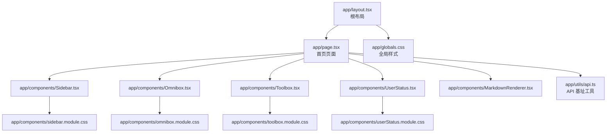
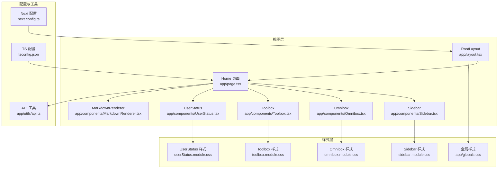
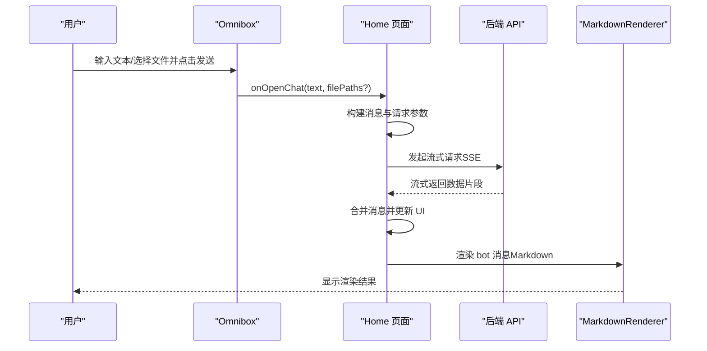
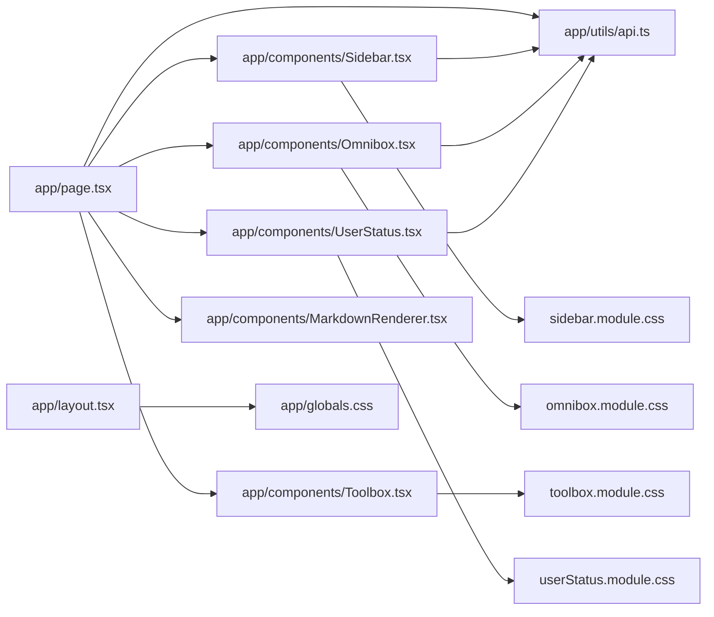

# 前端应用架构

<cite>
**本文引用的文件**
- [package.json](file://localmanus-ui/package.json)
- [tsconfig.json](file://localmanus-ui/tsconfig.json)
- [next.config.ts](file://localmanus-ui/nexy.config.ts)
- [app/layout.tsx](file://localmanus-ui/app/layout.tsx)
- [app/page.tsx](file://localmanus-ui/app/page.tsx)
- [app/globals.css](file://localmanus-ui/app/globals.css)
- [app/components/Sidebar.tsx](file://localmanus-ui/app/components/Sidebar.tsx)
- [app/components/Omnibox.tsx](file://localmanus-ui/app/components/Omnibox.tsx)
- [app/components/Toolbox.tsx](file://localmanus-ui/app/components/Toolbox.tsx)
- [app/components/UserStatus.tsx](file://localmanus-ui/app/components/UserStatus.tsx)
- [app/components/MarkdownRenderer.tsx](file://localmanus-ui/app/components/MarkdownRenderer.tsx)
- [app/components/sidebar.module.css](file://localmanus-ui/app/components/sidebar.module.css)
- [app/components/omnibox.module.css](file://localmanus-ui/app/components/omnibox.module.css)
- [app/components/toolbox.module.css](file://localmanus-ui/app/components/toolbox.module.css)
- [app/components/userStatus.module.css](file://localmanus-ui/app/components/userStatus.module.css)
- [app/utils/api.ts](file://localmanus-ui/app/utils/api.ts)
</cite>

## 目录
1. [简介](#简介)
2. [项目结构](#项目结构)
3. [核心组件](#核心组件)
4. [架构总览](#架构总览)
5. [组件详解](#组件详解)
6. [依赖关系分析](#依赖关系分析)
7. [性能考量](#性能考量)
8. [故障排查指南](#故障排查指南)
9. [结论](#结论)
10. [附录](#附录)

## 简介
本文件面向 LocalManus 前端应用（Next.js）进行系统化技术文档梳理，重点覆盖以下方面：
- 目录结构与页面路由体系
- 根布局组件 RootLayout 的职责与配置
- 全局样式与 CSS Modules 的使用与隔离策略
- 页面组件设计模式、状态管理与组件复用
- 主题与样式切换思路
- 组件开发规范、性能优化与 SEO 配置
- 构建配置、开发服务器与生产优化策略

## 项目结构
LocalManus 前端采用 Next.js App Router 结构，核心位于 localmanus-ui/app 下，按功能模块划分组件与样式，配合全局样式与工具函数实现统一的主题与交互体验。

图表来源
- [app/layout.tsx](file://localmanus-ui/app/layout.tsx#L1-L20)
- [app/page.tsx](file://localmanus-ui/app/page.tsx#L1-L293)
- [app/globals.css](file://localmanus-ui/app/globals.css#L1-L93)
- [app/components/Sidebar.tsx](file://localmanus-ui/app/components/Sidebar.tsx#L1-L163)
- [app/components/Omnibox.tsx](file://localmanus-ui/app/components/Omnibox.tsx#L1-L200)
- [app/components/Toolbox.tsx](file://localmanus-ui/app/components/Toolbox.tsx#L1-L42)
- [app/components/UserStatus.tsx](file://localmanus-ui/app/components/UserStatus.tsx#L1-L312)
- [app/components/MarkdownRenderer.tsx](file://localmanus-ui/app/components/MarkdownRenderer.tsx#L1-L48)
- [app/utils/api.ts](file://localmanus-ui/app/utils/api.ts#L1-L17)

章节来源
- [package.json](file://localmanus-ui/package.json#L1-L34)
- [tsconfig.json](file://localmanus-ui/tsconfig.json#L1-L35)
- [next.config.ts](file://localmanus-ui/next.config.ts#L1-L37)

## 核心组件
- 根布局 RootLayout：负责注入全局样式、设置语言属性、包裹页面内容。
- 首页 Home：承载聊天模式与模板展示，协调子组件状态与数据流。
- 子组件：
  - Sidebar：导航与项目/活动信息展示，支持新建会话回调。
  - Omnibox：输入框与文件上传入口，支持多文件上传与提交。
  - Toolbox：能力标签集合，用于快速选择任务类型。
  - UserStatus：用户登录/注册弹窗、令牌校验与登出。
  - MarkdownRenderer：Markdown 渲染器，集成 GFM 与代码高亮。
- 工具函数：API 基址根据运行时上下文自动选择服务地址。

章节来源
- [app/layout.tsx](file://localmanus-ui/app/layout.tsx#L1-L20)
- [app/page.tsx](file://localmanus-ui/app/page.tsx#L1-L293)
- [app/components/Sidebar.tsx](file://localmanus-ui/app/components/Sidebar.tsx#L1-L163)
- [app/components/Omnibox.tsx](file://localmanus-ui/app/components/Omnibox.tsx#L1-L200)
- [app/components/Toolbox.tsx](file://localmanus-ui/app/components/Toolbox.tsx#L1-L42)
- [app/components/UserStatus.tsx](file://localmanus-ui/app/components/UserStatus.tsx#L1-L312)
- [app/components/MarkdownRenderer.tsx](file://localmanus-ui/app/components/MarkdownRenderer.tsx#L1-L48)
- [app/utils/api.ts](file://localmanus-ui/app/utils/api.ts#L1-L17)

## 架构总览
应用采用“根布局 + 页面 + 组件 + 样式模块”的分层架构，通过 CSS 变量统一主题，CSS Modules 实现样式隔离，工具函数统一分发 API 地址，组件间通过 props 与回调解耦协作。

图表来源
- [app/layout.tsx](file://localmanus-ui/app/layout.tsx#L1-L20)
- [app/page.tsx](file://localmanus-ui/app/page.tsx#L1-L293)
- [app/globals.css](file://localmanus-ui/app/globals.css#L1-L93)
- [app/components/sidebar.module.css](file://localmanus-ui/app/components/sidebar.module.css#L1-L204)
- [app/components/omnibox.module.css](file://localmanus-ui/app/components/omnibox.module.css#L1-L185)
- [app/components/toolbox.module.css](file://localmanus-ui/app/components/toolbox.module.css#L1-L51)
- [app/components/userStatus.module.css](file://localmanus-ui/app/components/userStatus.module.css#L1-L253)
- [next.config.ts](file://localmanus-ui/next.config.ts#L1-L37)
- [tsconfig.json](file://localmanus-ui/tsconfig.json#L1-L35)
- [app/utils/api.ts](file://localmanus-ui/app/utils/api.ts#L1-L17)

## 组件详解

### 根布局 RootLayout
- 职责：设置页面元数据、注入全局样式、包裹 children。
- 关键点：lang 属性设为 zh；引入全局样式；默认导出函数组件。

章节来源
- [app/layout.tsx](file://localmanus-ui/app/layout.tsx#L1-L20)

### 首页 Home（页面组件）
- 设计模式：客户端组件（声明 use client），集中管理聊天状态、消息列表、会话 ID、文件上传等。
- 数据流：通过 Omnibox 回调触发发送逻辑，使用流式响应更新消息列表；支持新会话与滚动控制。
- 复用机制：Sidebar、Toolbox、UserStatus、MarkdownRenderer 作为独立模块复用。
- 状态管理：useState/Effect 管理本地状态；localStorage 存储访问令牌；会话 ID 随机生成。

图表来源
- [app/page.tsx](file://localmanus-ui/app/page.tsx#L43-L141)
- [app/components/Omnibox.tsx](file://localmanus-ui/app/components/Omnibox.tsx#L83-L109)
- [app/components/MarkdownRenderer.tsx](file://localmanus-ui/app/components/MarkdownRenderer.tsx#L14-L47)

章节来源
- [app/page.tsx](file://localmanus-ui/app/page.tsx#L1-L293)

### Sidebar（侧边栏）
- 功能：导航、项目列表（从后端拉取）、最近活动、用户资料区。
- 交互：导航项高亮当前路径；点击“新会话”回调父组件；项目列表点击跳转。
- 状态：本地 useState 管理项目列表；useEffect 首次加载；useRouter/usePathname 控制导航。

章节来源
- [app/components/Sidebar.tsx](file://localmanus-ui/app/components/Sidebar.tsx#L1-L163)

### Omnibox（输入框）
- 功能：文本输入、文件上传、提交按钮、文件列表与移除。
- 上传流程：表单提交到后端，成功后将文件信息回传给父组件更新列表。
- 提交流程：收集文本与文件路径数组，调用父组件回调；支持 Enter 快捷键。
- 状态：内部或外部受控文件列表；禁用状态由父组件传递。

章节来源
- [app/components/Omnibox.tsx](file://localmanus-ui/app/components/Omnibox.tsx#L1-L200)

### Toolbox（工具箱）
- 功能：展示可选任务类型标签，支持隐藏/显示切换。
- 样式：通过 CSS Modules 控制容器与标签样式，实现悬浮与过渡效果。

章节来源
- [app/components/Toolbox.tsx](file://localmanus-ui/app/components/Toolbox.tsx#L1-L42)

### UserStatus（用户状态）
- 功能：登录/注册弹窗、令牌校验、登出、用户信息展示。
- 交互：本地存储令牌；首次挂载检查令牌有效性；登录/注册提交后刷新用户信息。
- 状态：登录态、当前用户、表单字段、错误提示、注册模式切换。

章节来源
- [app/components/UserStatus.tsx](file://localmanus-ui/app/components/UserStatus.tsx#L1-L312)

### MarkdownRenderer（Markdown 渲染）
- 功能：基于 react-markdown 渲染 Markdown，启用 GFM，代码块高亮。
- 自定义：内联代码与普通代码块样式区分；外链打开新窗口并加安全属性。

章节来源
- [app/components/MarkdownRenderer.tsx](file://localmanus-ui/app/components/MarkdownRenderer.tsx#L1-L48)

### 样式与主题
- 全局样式：在 app/globals.css 中定义 CSS 变量、基础排版、玻璃拟态工具类、自定义滚动条与高亮主题。
- CSS Modules：各组件样式文件以 module.css 命名，通过 import styles 使用，实现样式隔离与命名空间避免冲突。
- 主题切换思路：通过修改 :root 变量值即可实现浅色/深色主题；当前工程已引入高亮主题样式，可按需切换。

章节来源
- [app/globals.css](file://localmanus-ui/app/globals.css#L1-L93)
- [app/components/sidebar.module.css](file://localmanus-ui/app/components/sidebar.module.css#L1-L204)
- [app/components/omnibox.module.css](file://localmanus-ui/app/components/omnibox.module.css#L1-L185)
- [app/components/toolbox.module.css](file://localmanus-ui/app/components/toolbox.module.css#L1-L51)
- [app/components/userStatus.module.css](file://localmanus-ui/app/components/userStatus.module.css#L1-L253)

### TypeScript 类型定义
- 编译选项：严格模式、增量编译、路径别名 @/* 指向根目录；包含 next-env 与 .next/types。
- 页面与组件：明确 props 接口（如 OmniboxProps、SidebarProps、User 等），提升可维护性与 IDE 支持。

章节来源
- [tsconfig.json](file://localmanus-ui/tsconfig.json#L1-L35)

### API 地址解析
- 工具函数：根据运行时判断浏览器或 SSR，分别使用 NEXT_PUBLIC_API_URL 或 BACKEND_URL。
- 用途：在组件中统一通过 getApiBaseUrl 获取基址，保证前后端一致的访问路径。

章节来源
- [app/utils/api.ts](file://localmanus-ui/app/utils/api.ts#L1-L17)
- [next.config.ts](file://localmanus-ui/next.config.ts#L4-L12)

## 依赖关系分析

图表来源
- [app/page.tsx](file://localmanus-ui/app/page.tsx#L1-L293)
- [app/components/Sidebar.tsx](file://localmanus-ui/app/components/Sidebar.tsx#L1-L163)
- [app/components/Omnibox.tsx](file://localmanus-ui/app/components/Omnibox.tsx#L1-L200)
- [app/components/Toolbox.tsx](file://localmanus-ui/app/components/Toolbox.tsx#L1-L42)
- [app/components/UserStatus.tsx](file://localmanus-ui/app/components/UserStatus.tsx#L1-L312)
- [app/components/MarkdownRenderer.tsx](file://localmanus-ui/app/components/MarkdownRenderer.tsx#L1-L48)
- [app/utils/api.ts](file://localmanus-ui/app/utils/api.ts#L1-L17)
- [app/layout.tsx](file://localmanus-ui/app/layout.tsx#L1-L20)
- [app/globals.css](file://localmanus-ui/app/globals.css#L1-L93)
- [app/components/sidebar.module.css](file://localmanus-ui/app/components/sidebar.module.css#L1-L204)
- [app/components/omnibox.module.css](file://localmanus-ui/app/components/omnibox.module.css#L1-L185)
- [app/components/toolbox.module.css](file://localmanus-ui/app/components/toolbox.module.css#L1-L51)
- [app/components/userStatus.module.css](file://localmanus-ui/app/components/userStatus.module.css#L1-L253)

## 性能考量
- 构建与输出
  - 输出模式：standalone，便于容器化部署。
  - 图片优化：关闭 Next 优化以适配 Docker 环境。
  - 严格模式：开启 reactStrictMode，提升开发期稳定性。
- 运行时优化
  - 组件懒加载：对非首屏组件可考虑动态导入。
  - 请求缓存：合理利用浏览器缓存与服务端缓存，减少重复请求。
  - 渲染优化：Markdown 渲染与长列表滚动使用 requestAnimationFrame 与虚拟滚动（可选）。
- 开发体验
  - ESLint 与 TypeScript 配置确保代码质量。
  - 路径别名 @/* 简化导入路径。

章节来源
- [next.config.ts](file://localmanus-ui/next.config.ts#L14-L34)
- [package.json](file://localmanus-ui/package.json#L5-L14)
- [tsconfig.json](file://localmanus-ui/tsconfig.json#L21-L23)

## 故障排查指南
- API 访问异常
  - 确认 NEXT_PUBLIC_API_URL 与 BACKEND_URL 设置是否正确。
  - 检查跨域与 Allowed Origins 配置。
- 上传失败
  - 检查令牌是否存在；确认后端上传接口可用；查看网络面板与控制台错误。
- Markdown 渲染问题
  - 确认 remarkGfm 与 rehypeHighlight 插件版本兼容；检查代码块高亮主题是否加载。
- 样式冲突
  - 确保使用 CSS Modules；避免全局污染；检查变量名拼写与作用域。

章节来源
- [next.config.ts](file://localmanus-ui/next.config.ts#L26-L30)
- [app/utils/api.ts](file://localmanus-ui/app/utils/api.ts#L1-L17)
- [app/components/Omnibox.tsx](file://localmanus-ui/app/components/Omnibox.tsx#L29-L77)
- [app/components/MarkdownRenderer.tsx](file://localmanus-ui/app/components/MarkdownRenderer.tsx#L17-L44)

## 结论
LocalManus 前端以 Next.js App Router 为基础，结合 CSS Modules 与全局变量实现清晰的样式体系与主题扩展；页面组件通过 props 与回调实现低耦合复用；工具函数统一 API 地址，适配开发与生产环境。建议后续完善路由与页面级 SEO、引入缓存与懒加载策略，并在 CI 中加入 ESLint 与类型检查以保障质量。

## 附录

### 开发与构建命令
- 开发：next dev 或 next dev --port 3000
- 生产构建：next build 或 next build --prod
- 清理：rimraf .next
- 启动：next start 或 next start --port 3000
- 代码检查：eslint

章节来源
- [package.json](file://localmanus-ui/package.json#L5-L14)

### TypeScript 与路径别名
- 严格模式与增量编译提升开发效率。
- 路径别名 @/* 指向根目录，简化导入。

章节来源
- [tsconfig.json](file://localmanus-ui/tsconfig.json#L7-L23)

### SEO 配置建议
- 在根布局中完善 Metadata（标题、描述、关键词、Open Graph 等）。
- 为页面添加结构化数据（JSON-LD）以增强搜索引擎理解。
- 静态预渲染与动态路由结合，优先静态化可缓存页面。

[本节为通用建议，不直接分析具体文件，故无章节来源]