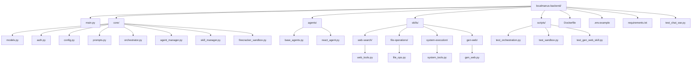
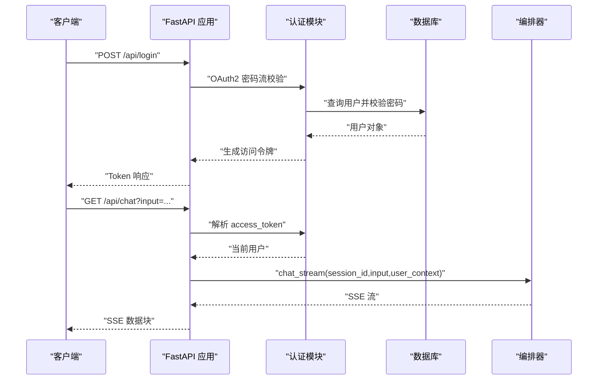
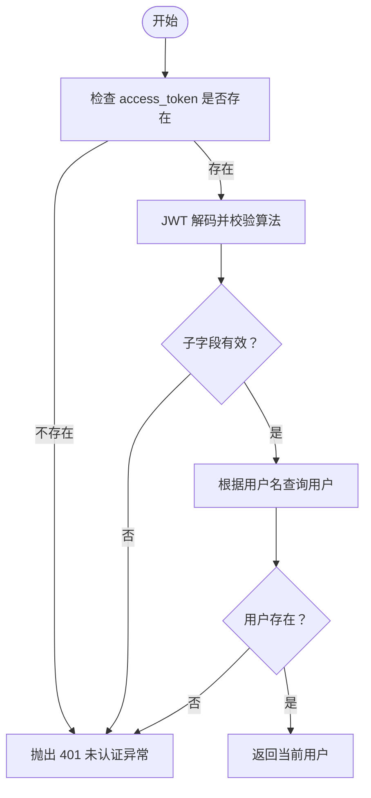
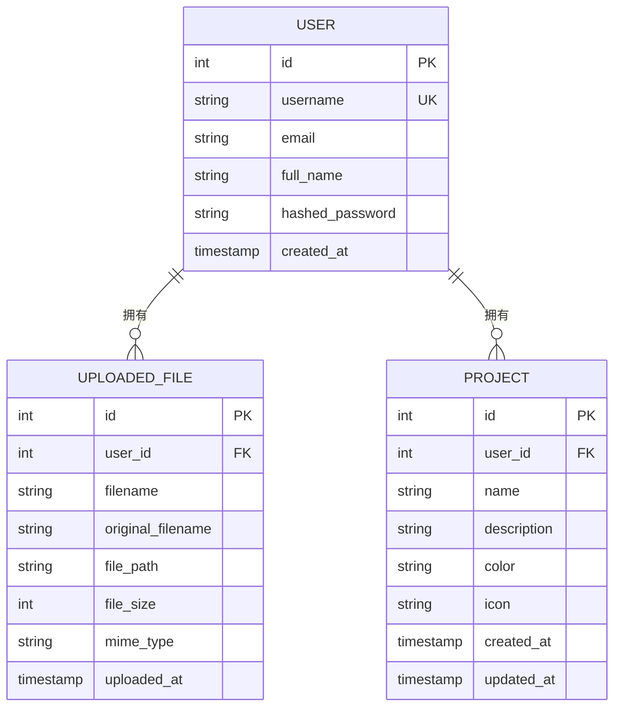
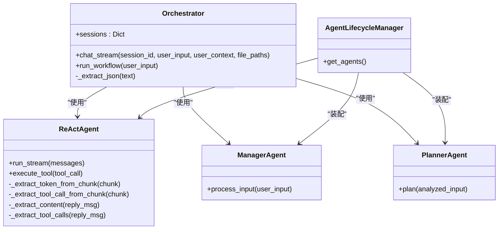
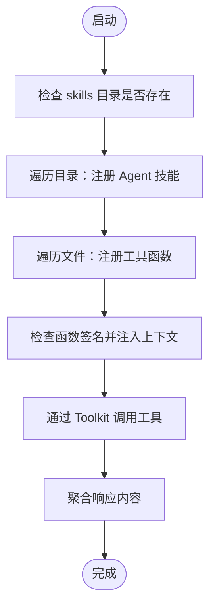
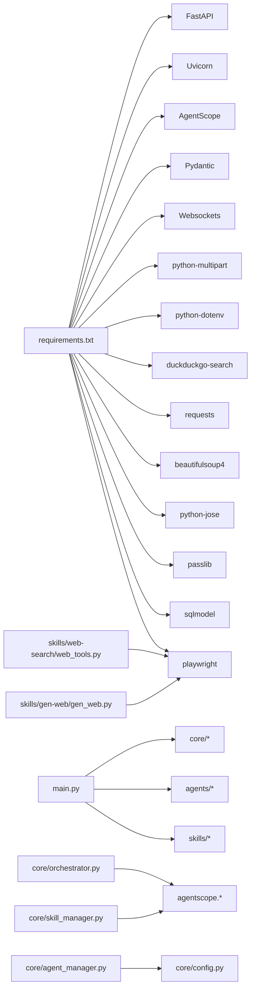

# 后端服务架构

<cite>
**本文引用的文件**
- [main.py](file://localmanus-backend/main.py)
- [requirements.txt](file://localmanus-backend/requirements.txt)
- [Dockerfile（后端）](file://localmanus-backend/Dockerfile)
- [.env.example](file://localmanus-backend/.env.example)
- [docker-compose.yml](file://docker-compose.yml)
- [core/config.py](file://localmanus-backend/core/config.py)
- [core/models.py](file://localmanus-backend/core/models.py)
- [core/auth.py](file://localmanus-backend/core/auth.py)
- [core/prompts.py](file://localmanus-backend/core/prompts.py)
- [core/orchestrator.py](file://localmanus-backend/core/orchestrator.py)
- [core/agent_manager.py](file://localmanus-backend/core/agent_manager.py)
- [core/skill_manager.py](file://localmanus-backend/core/skill_manager.py)
- [core/firecracker_sandbox.py](file://localmanus-backend/core/firecracker_sandbox.py)
- [agents/base_agents.py](file://localmanus-backend/agents/base_agents.py)
- [agents/react_agent.py](file://localmanus-backend/agents/react_agent.py)
- [skills/web-search/web_tools.py](file://localmanus-backend/skills/web-search/web_tools.py)
- [skills/system-execution/system_tools.py](file://localmanus-backend/skills/system-execution/system_tools.py)
- [skills/file-operations/file_ops.py](file://localmanus-backend/skills/file-operations/file_ops.py)
- [skills/gen-web/gen_web.py](file://localmanus-backend/skills/gen-web/gen_web.py)
- [scripts/test_orchestration.py](file://localmanus-backend/scripts/test_orchestration.py)
- [scripts/test_sandbox.py](file://localmanus-backend/scripts/test_sandbox.py)
- [scripts/test_gen_web_skill.py](file://localmanus-backend/scripts/test_gen_web_skill.py)
- [test_chat_sse.py](file://localmanus-backend/test_chat_sse.py)
</cite>

## 目录
1. [引言](#引言)
2. [项目结构](#项目结构)
3. [核心组件](#核心组件)
4. [架构总览](#架构总览)
5. [详细组件分析](#详细组件分析)
6. [SSE测试基础设施](#sse测试基础设施)
7. [依赖关系分析](#依赖关系分析)
8. [性能考虑](#性能考虑)
9. [故障排查指南](#故障排查指南)
10. [结论](#结论)
11. [附录](#附录)

## 引言
本文件面向 LocalManus 后端服务，围绕 FastAPI 应用的整体架构、路由系统、中间件与依赖注入进行系统性技术说明；同时覆盖认证授权、CORS、错误处理、API 版本管理、请求验证与响应序列化、配置管理与环境变量、数据库连接、服务监控与日志、性能优化、容器化与编排等主题。文档以代码级事实为依据，辅以可视化图示帮助不同背景读者理解。

**更新** 新增了全面的SSE测试基础设施，包括test_chat_sse.py测试套件、多引擎搜索测试、浏览器截图功能和综合工作流测试。

## 项目结构
后端采用按功能域分层的组织方式：入口模块负责应用初始化、路由注册与中间件配置；核心子包承载模型、认证、提示词模板、编排器、智能体生命周期与技能管理；代理模块提供 ReAct 与基础智能体实现；技能模块提供Web搜索、文件操作、系统执行等功能；脚本用于本地测试与演示。



**图表来源**
- [main.py](file://localmanus-backend/main.py#L1-L50)
- [core/models.py](file://localmanus-backend/core/models.py#L1-L80)
- [core/auth.py](file://localmanus-backend/core/auth.py#L1-L82)
- [core/config.py](file://localmanus-backend/core/config.py#L1-L22)
- [core/prompts.py](file://localmanus-backend/core/prompts.py#L1-L75)
- [core/orchestrator.py](file://localmanus-backend/core/orchestrator.py#L1-L150)
- [core/agent_manager.py](file://localmanus-backend/core/agent_manager.py#L1-L49)
- [core/skill_manager.py](file://localmanus-backend/core/skill_manager.py#L1-L143)
- [core/firecracker_sandbox.py](file://localmanus-backend/core/firecracker_sandbox.py#L1-L312)
- [agents/base_agents.py](file://localmanus-backend/agents/base_agents.py#L1-L42)
- [agents/react_agent.py](file://localmanus-backend/agents/react_agent.py#L1-L349)
- [skills/web-search/web_tools.py](file://localmanus-backend/skills/web-search/web_tools.py#L1-L571)
- [skills/file-operations/file_ops.py](file://localmanus-backend/skills/file-operations/file_ops.py#L1-L191)
- [skills/system-execution/system_tools.py](file://localmanus-backend/skills/system-execution/system_tools.py#L1-L78)
- [skills/gen-web/gen_web.py](file://localmanus-backend/skills/gen-web/gen_web.py#L1-L200)
- [scripts/test_orchestration.py](file://localmanus-backend/scripts/test_orchestration.py#L1-L57)
- [scripts/test_sandbox.py](file://localmanus-backend/scripts/test_sandbox.py#L1-L191)
- [scripts/test_gen_web_skill.py](file://localmanus-backend/scripts/test_gen_web_skill.py#L1-L86)
- [test_chat_sse.py](file://localmanus-backend/test_chat_sse.py#L1-L509)

**章节来源**
- [main.py](file://localmanus-backend/main.py#L1-L50)
- [requirements.txt](file://localmanus-backend/requirements.txt#L1-L15)

## 核心组件
- 应用入口与路由
  - 初始化 FastAPI 应用、加载 .env、注册 CORS 中间件、启动事件创建数据库表。
  - 提供健康检查、用户注册/登录、当前用户信息、文件上传/下载/删除、项目 CRUD、技能管理、设置管理、聊天 SSE、任务计划与 ReAct 执行、WebSocket 任务流等端点。
- 认证与授权
  - 基于 OAuth2 密码流与 JWT，支持查询参数传递 access_token（SSE 支持），密码哈希使用 bcrypt，回退到 SHA-256 兼容逻辑。
- 数据模型与数据库
  - 使用 SQLModel 定义用户、文件、项目模型，依赖注入 Session 获取数据库会话。
- 智能体与编排
  - Orchestrator 统一调度 Manager/Planner/ReActAgent，维护会话历史，支持 SSE 流式输出与内部同步协议。
  - AgentLifecycleManager 负责 AgentScope 初始化、模型/格式化器/内存与技能管理装配。
  - SkillManager 动态扫描 skills 目录，注册工具函数与 Agent 技能。
- 配置管理与环境变量
  - 通过 .env 与环境变量驱动模型配置（OPENAI_API_KEY、OPENAI_API_BASE、MODEL_NAME）、服务器监听地址与端口。
- 文件上传与持久化
  - 用户专属上传目录，UUID 命名，数据库记录文件元数据，支持列表、下载、删除。
- 中间件与安全
  - CORS 允许所有来源/方法/头，生产中建议收紧。
- 错误处理
  - 显式 HTTP 异常与统一日志记录，SSE/WS 场景下返回结构化错误消息。
- **SSE测试基础设施** 新增全面的SSE测试套件，支持多引擎搜索、浏览器截图、文件操作和复杂工作流测试。

**章节来源**
- [main.py](file://localmanus-backend/main.py#L1-L477)
- [core/auth.py](file://localmanus-backend/core/auth.py#L1-L82)
- [core/models.py](file://localmanus-backend/core/models.py#L1-L80)
- [core/orchestrator.py](file://localmanus-backend/core/orchestrator.py#L1-L150)
- [core/agent_manager.py](file://localmanus-backend/core/agent_manager.py#L1-L49)
- [core/skill_manager.py](file://localmanus-backend/core/skill_manager.py#L1-L143)
- [core/config.py](file://localmanus-backend/core/config.py#L1-L22)

## 架构总览
后端采用"网关 + 编排 + 智能体 + 技能"的分层架构：
- 网关层：FastAPI 路由与中间件，负责认证、CORS、SSE/WS、文件 IO、数据库交互。
- 编排层：Orchestrator 统筹会话、意图识别、任务规划、ReAct 循环与工具执行。
- 智能体层：Manager/Planner/ReActAgent，基于 AgentScope 实现。
- 技能层：SkillManager 动态注册工具与 Agent 技能，支持目录与函数两种形式。
- 配置层：AgentLifecycleManager 装配模型与工具链，config.py 读取环境变量。
- **测试层**：新增SSE测试套件，提供自动化测试能力。

```mermaid
graph TB
subgraph "网关层"
GW["FastAPI 应用<br/>路由/中间件/SSE/WS/文件IO"]
end
subgraph "编排层"
ORCH["Orchestrator<br/>会话/意图/规划/ReAct循环"]
end
subgraph "智能体层"
MGR["ManagerAgent"]
PLN["PlannerAgent"]
RCT["ReActAgent"]
end
subgraph "技能层"
SM["SkillManager<br/>动态注册工具/Agent技能"]
WS["WebSearchSkill<br/>多引擎搜索/截图"]
FS["FileOperationSkill<br/>文件操作"]
SYS["SystemExecutionSkill<br/>系统执行"]
GEN["GenWebSkill<br/>Web开发"]
end
subgraph "配置层"
ALM["AgentLifecycleManager<br/>模型/格式化器/内存/技能管理"]
CFG["config.py<br/>.env 读取"]
SBX["SandboxManager<br/>Playwright/CDP"]
end
subgraph "测试层"
TEST["SSE测试套件<br/>test_chat_sse.py<br/>多场景测试"]
ENDPOINT["/api/chat<br/>SSE端点"]
ENDPOINT --> TEST
GW --> ORCH
ORCH --> MGR
ORCH --> PLN
ORCH --> RCT
RCT --> SM
SM --> WS
SM --> FS
SM --> SYS
SM --> GEN
ALM --> MGR
ALM --> PLN
ALM --> RCT
ALM --> SM
CFG --> ALM
SBX --> WS
SBX --> GEN
```

**图表来源**
- [main.py](file://localmanus-backend/main.py#L34-L64)
- [core/orchestrator.py](file://localmanus-backend/core/orchestrator.py#L11-L15)
- [core/agent_manager.py](file://localmanus-backend/core/agent_manager.py#L11-L39)
- [core/skill_manager.py](file://localmanus-backend/core/skill_manager.py#L18-L28)
- [core/config.py](file://localmanus-backend/core/config.py#L6-L22)
- [test_chat_sse.py](file://localmanus-backend/test_chat_sse.py#L1-L509)
- [skills/web-search/web_tools.py](file://localmanus-backend/skills/web-search/web_tools.py#L214-L384)

## 详细组件分析

### 应用入口与路由系统（main.py）
- 应用初始化
  - 加载 .env，创建 FastAPI 实例，注册 CORS，启动事件创建数据库表。
- 路由与端点
  - 健康检查、用户注册/登录/当前用户、文件上传/列表/下载/删除、项目 CRUD、技能管理、设置管理、聊天 SSE、任务计划、ReAct 执行、WebSocket 任务流。
- 依赖注入
  - 通过 Depends(get_session) 注入数据库会话；通过 Depends(get_current_user) 注入当前用户；SSE/WS 支持查询参数 access_token。
- 中间件
  - CORS 允许通配符，生产需限制来源与方法。
- 日志
  - 初始化日志级别为 INFO，统一前缀。



**图表来源**
- [main.py](file://localmanus-backend/main.py#L92-L106)
- [main.py](file://localmanus-backend/main.py#L392-L420)
- [core/auth.py](file://localmanus-backend/core/auth.py#L47-L82)
- [core/orchestrator.py](file://localmanus-backend/core/orchestrator.py#L16-L96)

**章节来源**
- [main.py](file://localmanus-backend/main.py#L34-L64)
- [main.py](file://localmanus-backend/main.py#L74-L110)
- [main.py](file://localmanus-backend/main.py#L112-L152)
- [main.py](file://localmanus-backend/main.py#L153-L215)
- [main.py](file://localmanus-backend/main.py#L217-L220)
- [main.py](file://localmanus-backend/main.py#L221-L286)
- [main.py](file://localmanus-backend/main.py#L287-L391)
- [main.py](file://localmanus-backend/main.py#L392-L439)
- [main.py](file://localmanus-backend/main.py#L440-L477)

### 认证与授权（core/auth.py）
- 密码哈希与校验
  - bcrypt 为主，兼容 SHA-256 回退逻辑。
- JWT 令牌
  - HS256 算法，支持自定义过期时间。
- 当前用户解析
  - 支持从 Header 或查询参数提取 access_token。
- OAuth2 密码流
  - tokenUrl 指向 /api/login，自动错误处理。



**图表来源**
- [core/auth.py](file://localmanus-backend/core/auth.py#L55-L82)

**章节来源**
- [core/auth.py](file://localmanus-backend/core/auth.py#L12-L18)
- [core/auth.py](file://localmanus-backend/core/auth.py#L20-L35)
- [core/auth.py](file://localmanus-backend/core/auth.py#L37-L45)
- [core/auth.py](file://localmanus-backend/core/auth.py#L47-L53)
- [core/auth.py](file://localmanus-backend/core/auth.py#L55-L82)

### 配置管理与环境变量（core/config.py, .env.example, docker-compose.yml）
- 模型配置
  - 从环境变量读取模型名称、API Key、基础 URL，并提供默认值。
- 服务器配置
  - HOST/PORT 默认绑定 0.0.0.0:8000。
- 环境变量示例
  - OPENAI_API_KEY、OPENAI_API_BASE、MODEL_NAME。
- Compose 环境注入
  - 通过环境变量传入模型与运行参数，挂载 .env 与持久化卷。

**章节来源**
- [core/config.py](file://localmanus-backend/core/config.py#L6-L22)
- [.env.example](file://localmanus-backend/.env.example#L1-L4)
- [docker-compose.yml](file://docker-compose.yml#L32-L38)

### 数据模型与数据库（core/models.py, main.py）
- 用户、文件、项目模型
  - 用户包含哈希密码；文件记录用户关联、路径、大小、类型；项目包含主题色与图标。
- 依赖注入
  - 通过 get_session 提供 Session，SQLModel 作为 ORM。
- 启动事件
  - on_startup 创建数据库表。



**图表来源**
- [core/models.py](file://localmanus-backend/core/models.py#L10-L79)
- [main.py](file://localmanus-backend/main.py#L61-L64)

**章节来源**
- [core/models.py](file://localmanus-backend/core/models.py#L1-L80)
- [main.py](file://localmanus-backend/main.py#L61-L64)

### 编排器与智能体（core/orchestrator.py, agents/react_agent.py, agents/base_agents.py, core/agent_manager.py）
- Orchestrator
  - 维护会话历史，构建系统提示，协调 Manager/Planner/ReActAgent，支持最大轮次限制与内部同步协议。
- ReActAgent
  - 基于 AgentScope 的原生 ReActAgent，支持真实流式输出、工具调用抽取、结果观察与上下文同步。
- Manager/Planner
  - 标准化输入与生成任务 DAG 的两类智能体。
- AgentLifecycleManager
  - 初始化 AgentScope、模型、格式化器、内存与技能管理，装配三类智能体。



**图表来源**
- [core/orchestrator.py](file://localmanus-backend/core/orchestrator.py#L11-L150)
- [agents/react_agent.py](file://localmanus-backend/agents/react_agent.py#L20-L349)
- [agents/base_agents.py](file://localmanus-backend/agents/base_agents.py#L6-L42)
- [core/agent_manager.py](file://localmanus-backend/core/agent_manager.py#L11-L49)

**章节来源**
- [core/orchestrator.py](file://localmanus-backend/core/orchestrator.py#L16-L96)
- [core/orchestrator.py](file://localmanus-backend/core/orchestrator.py#L97-L129)
- [agents/react_agent.py](file://localmanus-backend/agents/react_agent.py#L53-L215)
- [agents/react_agent.py](file://localmanus-backend/agents/react_agent.py#L216-L349)
- [agents/base_agents.py](file://localmanus-backend/agents/base_agents.py#L19-L41)
- [core/agent_manager.py](file://localmanus-backend/core/agent_manager.py#L11-L49)

### 技能管理（core/skill_manager.py）
- 动态加载
  - 扫描 skills 目录，注册 Agent 技能（含 SKILL.md 的目录）与工具函数（.py 文件中的公开函数与继承 BaseSkill 的实例方法）。
- 工具执行
  - 支持注入 user_id 与 user_context，聚合异步生成器响应。
- 工具清单
  - 提供工具 JSON Schema 与 Agent 技能提示。



**图表来源**
- [core/skill_manager.py](file://localmanus-backend/core/skill_manager.py#L29-L135)

**章节来源**
- [core/skill_manager.py](file://localmanus-backend/core/skill_manager.py#L18-L89)
- [core/skill_manager.py](file://localmanus-backend/core/skill_manager.py#L90-L143)

### 提示词模板（core/prompts.py）
- Manager/Planner/ReActAgent 系统提示模板，定义角色职责、输出格式与响应规则。

**章节来源**
- [core/prompts.py](file://localmanus-backend/core/prompts.py#L3-L75)

### 文件上传与下载（main.py）
- 上传
  - 生成 UUID 文件名，保存至用户专属目录，记录数据库条目。
- 列表/下载/删除
  - 基于用户权限过滤，下载时返回 FileResponse 并校验磁盘文件存在性。

**章节来源**
- [main.py](file://localmanus-backend/main.py#L112-L152)
- [main.py](file://localmanus-backend/main.py#L153-L162)
- [main.py](file://localmanus-backend/main.py#L164-L188)
- [main.py](file://localmanus-backend/main.py#L190-L215)

### WebSocket 任务流（main.py）
- 接受客户端动作（start/react），在 WS 内部执行 ReAct 循环，发送 thought/result 类型消息，断开自动记录日志。

**章节来源**
- [main.py](file://localmanus-backend/main.py#L440-L477)

### API 版本管理、请求验证与响应序列化
- 版本管理
  - 根路径返回版本号，健康检查端点提供服务状态与时标。
- 请求验证
  - Pydantic 模型用于请求体与响应模型，如 UserCreate/UserRead、ProjectCreate/Update/Read、FileRead 等。
- 响应序列化
  - FastAPI 自动序列化 Pydantic 模型为 JSON；SSE 返回 data: 行式事件流。

**章节来源**
- [main.py](file://localmanus-backend/main.py#L65-L72)
- [main.py](file://localmanus-backend/main.py#L217-L220)
- [core/models.py](file://localmanus-backend/core/models.py#L15-L79)

### 错误处理策略
- 显式 HTTP 异常
  - 用户名已存在、认证失败、资源未找到、配置保存失败等场景抛出 4xx/5xx。
- 日志记录
  - 关键流程记录 INFO/WARNING/ERROR，SSE/WS 场景输出结构化错误消息。
- 异常传播
  - SSE/WS 将错误封装为前端可消费的数据块。

**章节来源**
- [main.py](file://localmanus-backend/main.py#L76-L80)
- [main.py](file://localmanus-backend/main.py#L96-L100)
- [main.py](file://localmanus-backend/main.py#L149-L151)
- [main.py](file://localmanus-backend/main.py#L178-L182)
- [main.py](file://localmanus-backend/main.py#L229-L231)
- [main.py](file://localmanus-backend/main.py#L252-L253)
- [main.py](file://localmanus-backend/main.py#L265-L266)
- [main.py](file://localmanus-backend/main.py#L283-L284)

## SSE测试基础设施

### 测试套件概述
新增的test_chat_sse.py提供了全面的SSE聊天端点测试基础设施，支持多种技能类型的自动化测试。

```mermaid
graph TB
subgraph "SSE测试套件"
TEST["test_chat_sse.py<br/>主测试文件"]
AUTH["认证测试<br/>get_access_token()"]
SEARCH["搜索测试<br/>多引擎搜索"]
SCRAPING["网页抓取测试"]
SCREENSHOT["浏览器截图测试"]
FILEOPS["文件操作测试"]
SYSTEM["系统执行测试"]
WORKFLOW["复杂工作流测试"]
LONG["长对话测试"]
ENDPOINT["/api/chat<br/>SSE端点"]
TEST --> AUTH
TEST --> SEARCH
TEST --> SCRAPING
TEST --> SCREENSHOT
TEST --> FILEOPS
TEST --> SYSTEM
TEST --> WORKFLOW
TEST --> LONG
ENDPOINT --> TEST
ENDPOINT --> AUTH
ENDPOINT --> SEARCH
ENDPOINT --> SCRAPING
ENDPOINT --> SCREENSHOT
ENDPOINT --> FILEOPS
ENDPOINT --> SYSTEM
ENDPOINT --> WORKFLOW
ENDPOINT --> LONG
```

**图表来源**
- [test_chat_sse.py](file://localmanus-backend/test_chat_sse.py#L1-L509)
- [main.py](file://localmanus-backend/main.py#L391-L419)

### 多引擎搜索测试
支持Bing、Google、DuckDuckGo、Baidu四种搜索引擎的测试，包括单引擎搜索和多引擎对比测试。

**章节来源**
- [test_chat_sse.py](file://localmanus-backend/test_chat_sse.py#L121-L163)
- [skills/web-search/web_tools.py](file://localmanus-backend/skills/web-search/web_tools.py#L460-L500)

### 浏览器截图功能测试
通过Playwright和Chrome DevTools Protocol (CDP)实现浏览器自动化截图，支持导航后截图和元素交互。

**章节来源**
- [test_chat_sse.py](file://localmanus-backend/test_chat_sse.py#L192-L207)
- [skills/web-search/web_tools.py](file://localmanus-backend/skills/web-search/web_tools.py#L346-L383)

### 文件操作测试
测试用户文件列表、文件读取、文件上下文聊天和多文件比较功能。

**章节来源**
- [test_chat_sse.py](file://localmanus-backend/test_chat_sse.py#L214-L249)
- [skills/file-operations/file_ops.py](file://localmanus-backend/skills/file-operations/file_ops.py#L25-L133)

### 系统执行测试
支持Python代码执行和Shell命令执行，包括数据分析和实用工具测试。

**章节来源**
- [test_chat_sse.py](file://localmanus-backend/test_chat_sse.py#L256-L284)
- [skills/system-execution/system_tools.py](file://localmanus-backend/skills/system-execution/system_tools.py#L16-L41)

### 复杂工作流测试
模拟真实应用场景，包括研究工作流、Web开发助手、中文语言支持和错误处理测试。

**章节来源**
- [test_chat_sse.py](file://localmanus-backend/test_chat_sse.py#L291-L330)
- [test_chat_sse.py](file://localmanus-backend/test_chat_sse.py#L333-L340)

### 长对话测试
支持多轮对话上下文保持，测试会话历史管理和多回合交互。

**章节来源**
- [test_chat_sse.py](file://localmanus-backend/test_chat_sse.py#L342-L384)

## 依赖关系分析
- 外部依赖
  - FastAPI、Uvicorn、AgentScope、Pydantic、Websockets、python-multipart、python-dotenv、DuckDuckGo 搜索、Requests、BeautifulSoup、python-jose、passlib、SQLModel、**Playwright**。
- 内部依赖
  - main.py 依赖 core/*、agents/*、skills/*；core/orchestrator 依赖 agentscope、agents/*、core/skill_manager；agent_manager 依赖 core/config 与 agents/*；skill_manager 依赖 agentscope.Toolkit。

**更新** 新增Playwright依赖用于浏览器自动化和截图功能。



**图表来源**
- [requirements.txt](file://localmanus-backend/requirements.txt#L1-L15)
- [main.py](file://localmanus-backend/main.py#L1-L25)
- [core/orchestrator.py](file://localmanus-backend/core/orchestrator.py#L1-L10)
- [core/agent_manager.py](file://localmanus-backend/core/agent_manager.py#L1-L10)
- [core/skill_manager.py](file://localmanus-backend/core/skill_manager.py#L1-L10)
- [skills/web-search/web_tools.py](file://localmanus-backend/skills/web-search/web_tools.py#L1-L12)
- [skills/gen-web/gen_web.py](file://localmanus-backend/skills/gen-web/gen_web.py#L1-L20)

**章节来源**
- [requirements.txt](file://localmanus-backend/requirements.txt#L1-L15)
- [main.py](file://localmanus-backend/main.py#L1-L25)

## 性能考虑
- 流式输出
  - ReActAgent 优先尝试直接模型流式输出，否则回退为完整响应字符级流式，减少首字延迟。
- 工具调用
  - 在流式块中提取工具调用，避免二次解析；工具执行为阻塞等待，适合短时任务。
- 会话与历史
  - 会话上限控制（默认 40 轮），避免无界增长导致内存压力。
- I/O 与并发
  - 文件上传使用同步写入，建议在高并发场景引入异步文件系统或队列。
- 模型与网络
  - 通过环境变量切换模型与基地址，合理设置超时与重试策略。
- 日志与监控
  - 建议集成结构化日志与指标采集（如 Prometheus/OpenTelemetry），在 Docker 环境中通过 sidecar 或外部系统收集。
- **SSE测试性能**
  - 测试套件使用异步HTTP客户端，支持快速测试和完整测试模式，避免长时间阻塞。

## 故障排查指南
- 认证失败
  - 检查 SECRET_KEY、JWT 过期时间与 access_token 传递方式（Header 或查询参数）。
- 文件上传失败
  - 检查上传目录权限、磁盘空间、文件大小限制与 MIME 类型。
- ReAct 循环无输出
  - 确认 AgentScope 初始化成功、模型配置正确、工具注册完成。
- SSE/WS 断连
  - 查看日志中断开记录，确认客户端是否正确处理事件流与心跳。
- 健康检查失败
  - 检查 /api/health 可达性与容器健康检查配置。
- **SSE测试问题**
  - 确保后端服务器运行在http://localhost:8000，验证访问令牌获取成功，检查Sandbox容器状态。

**章节来源**
- [core/auth.py](file://localmanus-backend/core/auth.py#L13-L15)
- [main.py](file://localmanus-backend/main.py#L52-L59)
- [main.py](file://localmanus-backend/main.py#L149-L151)
- [main.py](file://localmanus-backend/main.py#L471-L472)
- [docker-compose.yml](file://docker-compose.yml#L49-L54)
- [test_chat_sse.py](file://localmanus-backend/test_chat_sse.py#L30-L57)

## 结论
LocalManus 后端以 FastAPI 为网关，结合 AgentScope 智能体与动态技能体系，形成"意图识别—任务规划—工具执行—流式反馈"的闭环。通过清晰的依赖注入、完善的认证授权与日志记录、以及容器化与反向代理编排，系统具备良好的扩展性与可运维性。**新增的SSE测试基础设施**提供了全面的自动化测试能力，支持多引擎搜索、浏览器截图、文件操作和复杂工作流测试，确保系统的稳定性和可靠性。建议在生产环境中收紧 CORS、完善密钥管理、引入监控与告警，并针对高并发场景优化文件 I/O 与工具执行策略。

## 附录
- 本地测试
  - 提供脚本演示工作流生成过程，可在无 API Key 时展示预期结构。
  - **新增SSE测试套件**，支持自动化测试和手动测试。
- Docker 与编排
  - 后端镜像构建、健康检查、环境变量注入与持久化卷配置；Nginx 反代与 UI 服务协同。
- **Sandbox管理**
  - 支持LOCAL和ONLINE两种模式，通过Docker容器提供隔离的执行环境。
- **Playwright集成**
  - 通过Chrome DevTools Protocol实现浏览器自动化，支持截图、导航和元素交互。

**章节来源**
- [scripts/test_orchestration.py](file://localmanus-backend/scripts/test_orchestration.py#L12-L56)
- [scripts/test_sandbox.py](file://localmanus-backend/scripts/test_sandbox.py#L1-L191)
- [scripts/test_gen_web_skill.py](file://localmanus-backend/scripts/test_gen_web_skill.py#L1-L86)
- [Dockerfile（后端）](file://localmanus-backend/Dockerfile#L1-L49)
- [docker-compose.yml](file://docker-compose.yml#L1-L88)
- [core/firecracker_sandbox.py](file://localmanus-backend/core/firecracker_sandbox.py#L121-L312)
- [requirements.txt](file://localmanus-backend/requirements.txt#L14-L14)