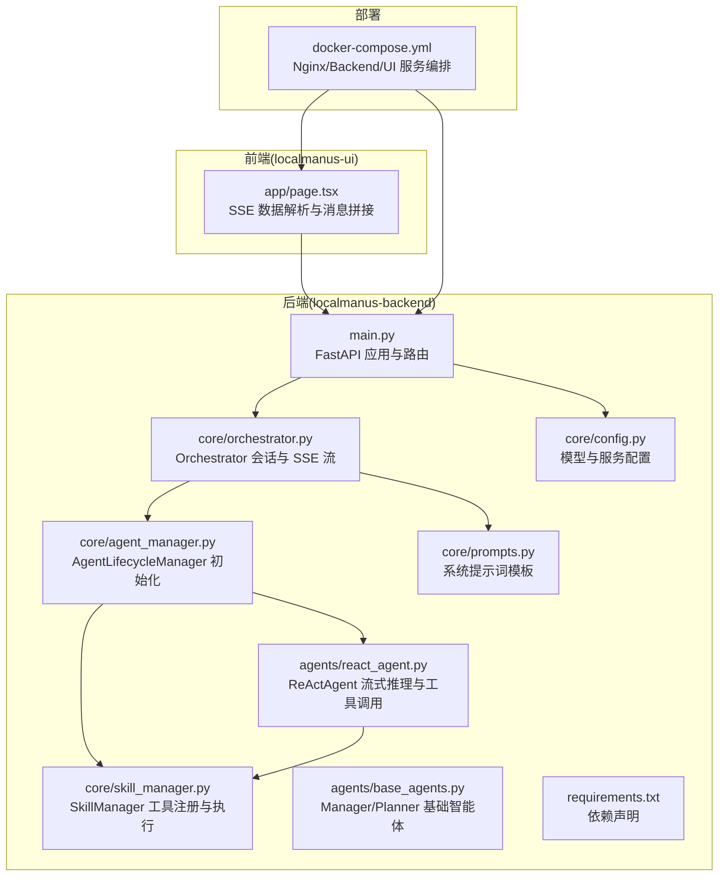
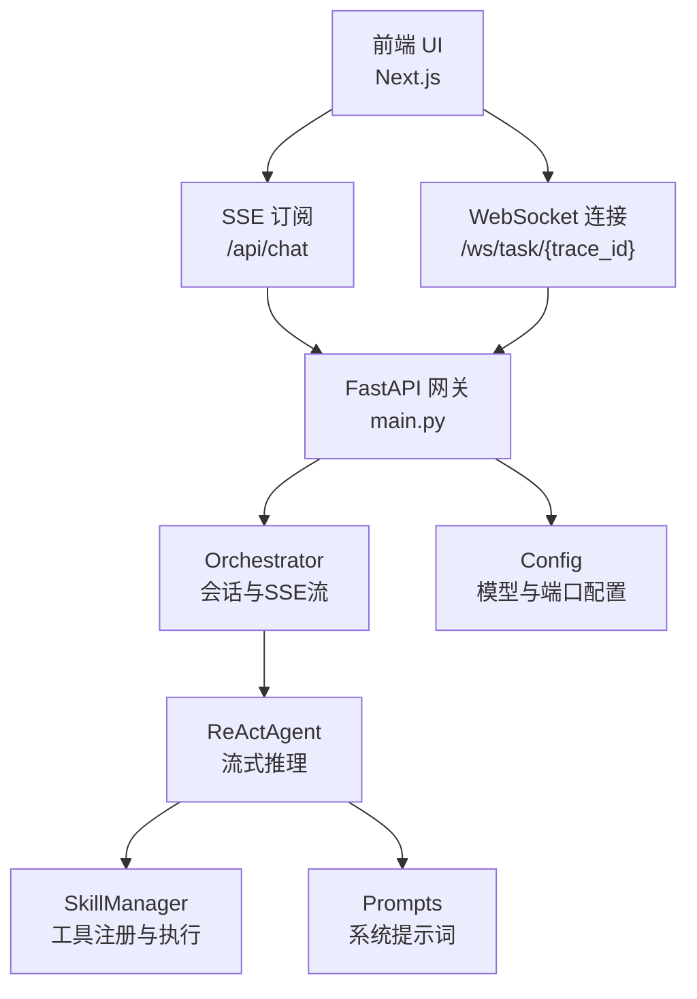
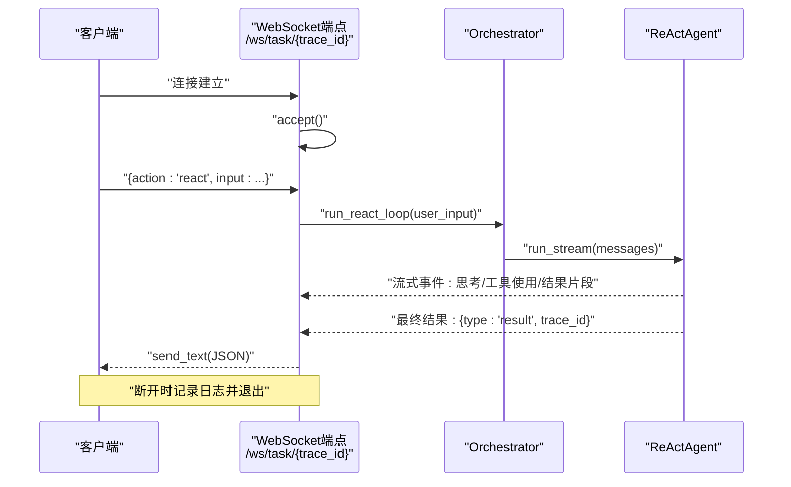
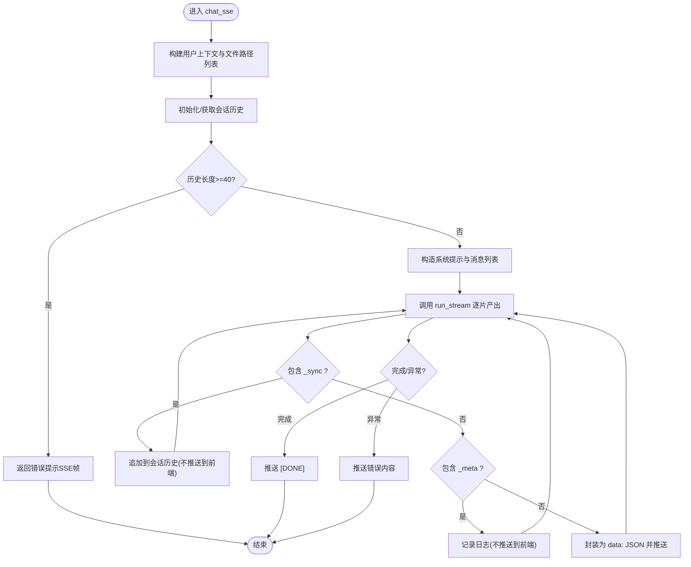
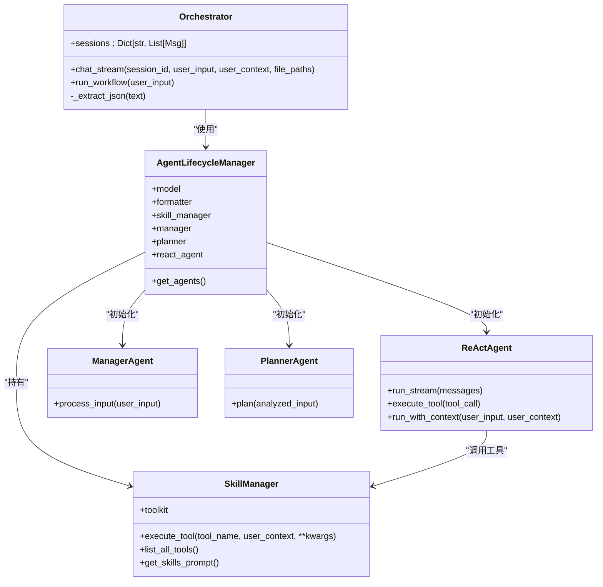

# 实时通信系统

<cite>
**本文引用的文件**
- [main.py](file://localmanus-backend/main.py)
- [orchestrator.py](file://localmanus-backend/core/orchestrator.py)
- [agent_manager.py](file://localmanus-backend/core/agent_manager.py)
- [skill_manager.py](file://localmanus-backend/core/skill_manager.py)
- [react_agent.py](file://localmanus-backend/agents/react_agent.py)
- [base_agents.py](file://localmanus-backend/agents/base_agents.py)
- [prompts.py](file://localmanus-backend/core/prompts.py)
- [config.py](file://localmanus-backend/core/config.py)
- [requirements.txt](file://localmanus-backend/requirements.txt)
- [docker-compose.yml](file://docker-compose.yml)
- [localmanus_architecture.md](file://localmanus_architecture.md)
- [page.tsx](file://localmanus-ui/app/page.tsx)
</cite>

## 目录
1. [简介](#简介)
2. [项目结构](#项目结构)
3. [核心组件](#核心组件)
4. [架构总览](#架构总览)
5. [详细组件分析](#详细组件分析)
6. [依赖关系分析](#依赖关系分析)
7. [性能考量](#性能考量)
8. [故障排查指南](#故障排查指南)
9. [结论](#结论)
10. [附录](#附录)

## 简介
本技术文档围绕 LocalManus 的实时通信系统展开，重点覆盖以下方面：
- WebSocket 连接建立与消息处理流程
- SSE（Server-Sent Events）流式传输实现与事件推送机制
- 实时状态同步策略、消息队列与并发连接管理
- 心跳检测与断线恢复策略
- 错误处理与自动重连机制
- 实时数据格式规范与消息协议设计
- 客户端封装建议、事件监听器管理与调试工具使用
- 生产环境稳定性保障与监控告警机制

## 项目结构
后端采用 FastAPI 提供 API 网关，包含认证、文件上传、SSE 聊天、WebSocket 任务流等能力；前端使用 Next.js，负责 SSE 事件解析与展示。

图表来源
- [main.py](file://localmanus-backend/main.py#L1-L477)
- [orchestrator.py](file://localmanus-backend/core/orchestrator.py#L1-L150)
- [agent_manager.py](file://localmanus-backend/core/agent_manager.py#L1-L49)
- [skill_manager.py](file://localmanus-backend/core/skill_manager.py#L1-L143)
- [react_agent.py](file://localmanus-backend/agents/react_agent.py#L1-L349)
- [base_agents.py](file://localmanus-backend/agents/base_agents.py#L1-L42)
- [prompts.py](file://localmanus-backend/core/prompts.py#L1-L75)
- [config.py](file://localmanus-backend/core/config.py#L1-L22)
- [requirements.txt](file://localmanus-backend/requirements.txt#L1-L14)
- [docker-compose.yml](file://docker-compose.yml#L1-L88)
- [page.tsx](file://localmanus-ui/app/page.tsx#L101-L137)

章节来源
- [main.py](file://localmanus-backend/main.py#L1-L477)
- [docker-compose.yml](file://docker-compose.yml#L1-L88)

## 核心组件
- FastAPI 应用与路由：提供健康检查、认证、文件上传、SSE 聊天、WebSocket 任务流等接口。
- Orchestrator：会话管理、历史记录、SSE 数据格式化、ReAct 流式输出与内部同步事件。
- AgentLifecycleManager：初始化 AgentScope 模型、格式化器、技能管理器与核心智能体。
- SkillManager：扫描 skills 目录，注册工具函数与 Agent 技能，统一工具调用入口。
- ReActAgent：基于 AgentScope 的 ReAct 推理，支持真实流式输出与工具调用。
- Manager/Planner：标准化输入与动态任务 DAG 规划。
- Prompts：系统提示词模板，驱动智能体行为。
- Config：模型配置与服务端口等参数。
- 前端页面：解析 SSE 事件，拼接消息内容。

章节来源
- [main.py](file://localmanus-backend/main.py#L392-L420)
- [orchestrator.py](file://localmanus-backend/core/orchestrator.py#L11-L96)
- [agent_manager.py](file://localmanus-backend/core/agent_manager.py#L11-L48)
- [skill_manager.py](file://localmanus-backend/core/skill_manager.py#L18-L143)
- [react_agent.py](file://localmanus-backend/agents/react_agent.py#L20-L215)
- [base_agents.py](file://localmanus-backend/agents/base_agents.py#L6-L41)
- [prompts.py](file://localmanus-backend/core/prompts.py#L1-L75)
- [config.py](file://localmanus-backend/core/config.py#L1-L22)
- [page.tsx](file://localmanus-ui/app/page.tsx#L101-L137)

## 架构总览
下图展示了实时通信在系统中的位置与交互关系：前端通过 SSE 订阅聊天流，同时通过 WebSocket 获取任务执行状态；后端由 FastAPI 网关承载，内部通过 Orchestrator 与 ReActAgent 实现实时推理与工具调用。

图表来源
- [main.py](file://localmanus-backend/main.py#L392-L420)
- [main.py](file://localmanus-backend/main.py#L440-L473)
- [orchestrator.py](file://localmanus-backend/core/orchestrator.py#L16-L96)
- [react_agent.py](file://localmanus-backend/agents/react_agent.py#L53-L215)
- [skill_manager.py](file://localmanus-backend/core/skill_manager.py#L23-L143)
- [prompts.py](file://localmanus-backend/core/prompts.py#L54-L75)
- [config.py](file://localmanus-backend/core/config.py#L19-L22)

## 详细组件分析

### WebSocket 连接与任务流
- 连接建立：客户端发起 WebSocket 请求，后端接受连接并记录 trace_id。
- 消息处理：接收客户端 action=start/react 等动作，执行 ReAct 循环并发送中间结果与最终结果。
- 断开处理：捕获断开异常，记录日志并结束循环。

图表来源
- [main.py](file://localmanus-backend/main.py#L440-L473)
- [orchestrator.py](file://localmanus-backend/core/orchestrator.py#L97-L112)
- [react_agent.py](file://localmanus-backend/agents/react_agent.py#L53-L215)

章节来源
- [main.py](file://localmanus-backend/main.py#L440-L473)

### SSE 流式传输与事件推送
- SSE 端点：/api/chat 支持多轮对话与文件路径上下文，返回 text/event-stream。
- 内部协议：SSE 数据帧包含 content、_sync、_meta 等字段，其中 _sync 用于内部历史同步，_meta 用于元数据记录。
- 历史管理：会话按 session_id 维护消息历史，超过上限返回错误提示。
- 文件上下文：将用户上传文件路径注入系统提示词，增强工具调用能力。

图表来源
- [main.py](file://localmanus-backend/main.py#L392-L420)
- [orchestrator.py](file://localmanus-backend/core/orchestrator.py#L16-L96)

章节来源
- [main.py](file://localmanus-backend/main.py#L392-L420)
- [orchestrator.py](file://localmanus-backend/core/orchestrator.py#L16-L96)

### 实时状态同步策略与消息队列
- 会话历史：以 session_id 为键维护消息列表，支持多轮对话。
- 同步事件：_sync 字段用于在内部同步新增消息，避免重复推送给前端。
- 元数据事件：_meta 字段用于记录运行元信息，便于调试与审计。
- 历史上限：超过阈值（如 40 条）时终止会话并提示错误。

章节来源
- [orchestrator.py](file://localmanus-backend/core/orchestrator.py#L14-L96)

### 并发连接管理与心跳检测
- WebSocket 并发：每个 trace_id 对应一个长连接，后端未实现全局连接池管理；可通过外部反向代理或网关进行限流与健康检查。
- 心跳检测：当前代码未实现内置心跳；可在客户端侧定期发送 ping 消息并在服务端记录最近活动时间，结合健康检查端点进行监控。

章节来源
- [main.py](file://localmanus-backend/main.py#L440-L473)
- [docker-compose.yml](file://docker-compose.yml#L18-L54)

### 错误处理与自动重连机制
- 异常捕获：SSE 与 WebSocket 均包含 try/except 与断开捕获，记录日志并返回错误信息。
- 前端重连：建议前端在断开或错误时进行指数退避重连，并在 UI 上提示用户状态。
- 健康检查：后端提供 /api/health 与 Nginx 健康检查，可用于服务发现与自动摘除。

章节来源
- [main.py](file://localmanus-backend/main.py#L471-L473)
- [docker-compose.yml](file://docker-compose.yml#L18-L54)

### 客户端封装与事件监听器管理
- SSE 解析：前端按行解析 data: 前缀，忽略 [DONE]，将 content 拼接到最新 bot 消息。
- WebSocket 封装：建议封装连接状态、重连策略、超时与错误回调，统一事件分发。
- 调试工具：利用浏览器开发者工具 Network 面板观察 SSE/WS 帧，结合后端日志定位问题。

章节来源
- [page.tsx](file://localmanus-ui/app/page.tsx#L101-L137)

### 生产环境稳定性与监控告警
- 反向代理：Nginx 作为反向代理，开启 SSE 专用配置（关闭缓冲、设置读取超时）。
- 健康检查：后端与 Nginx 健康检查端点，支持容器编排自动重启与流量摘除。
- 环境变量：通过 .env 或 Docker 环境变量配置模型、存储与上传限制。

章节来源
- [docker-compose.yml](file://docker-compose.yml#L1-L88)

## 依赖关系分析

图表来源
- [orchestrator.py](file://localmanus-backend/core/orchestrator.py#L11-L129)
- [agent_manager.py](file://localmanus-backend/core/agent_manager.py#L11-L48)
- [skill_manager.py](file://localmanus-backend/core/skill_manager.py#L18-L143)
- [react_agent.py](file://localmanus-backend/agents/react_agent.py#L20-L215)
- [base_agents.py](file://localmanus-backend/agents/base_agents.py#L6-L41)

章节来源
- [orchestrator.py](file://localmanus-backend/core/orchestrator.py#L11-L129)
- [agent_manager.py](file://localmanus-backend/core/agent_manager.py#L11-L48)
- [skill_manager.py](file://localmanus-backend/core/skill_manager.py#L18-L143)
- [react_agent.py](file://localmanus-backend/agents/react_agent.py#L20-L215)
- [base_agents.py](file://localmanus-backend/agents/base_agents.py#L6-L41)

## 性能考量
- SSE 流式输出：逐片推送 content，降低首字节延迟，提升用户体验。
- 工具调用阻塞：工具执行为阻塞等待，建议在工具层引入异步与缓存，减少端到端延迟。
- 历史上限：限制会话长度，避免内存膨胀与响应变慢。
- 模型流式：ReActAgent 优先尝试直接从模型流式获取 token，回退到完整响应字符流，兼顾兼容性与体验。
- 前端渲染：SSE 数据按行解析并增量拼接，避免大对象频繁重组。

章节来源
- [orchestrator.py](file://localmanus-backend/core/orchestrator.py#L16-L96)
- [react_agent.py](file://localmanus-backend/agents/react_agent.py#L53-L215)

## 故障排查指南
- 健康检查失败：检查 /api/health 与 Nginx 健康检查端点状态，确认容器存活与端口可达。
- SSE 无法接收：确认请求头与媒体类型正确，关注 [DONE] 帧与异常帧的处理。
- WebSocket 断开：查看断开异常日志，确认客户端重连策略与网络稳定性。
- 工具执行错误：检查工具注册与签名，确认 user_context 注入是否满足工具参数要求。
- 日志定位：后端使用 INFO 级别日志，建议在生产环境调整为更细粒度的日志级别与集中化收集。

章节来源
- [main.py](file://localmanus-backend/main.py#L65-L72)
- [main.py](file://localmanus-backend/main.py#L471-L473)
- [page.tsx](file://localmanus-ui/app/page.tsx#L101-L137)
- [skill_manager.py](file://localmanus-backend/core/skill_manager.py#L90-L134)

## 结论
LocalManus 的实时通信体系以 FastAPI 为核心，结合 SSE 与 WebSocket 实现了低延迟的多轮对话与任务执行状态推送。通过 Orchestrator 的会话管理与 ReActAgent 的流式推理，系统在保证实时性的同时具备良好的扩展性。建议在生产环境中完善心跳与断线恢复、引入连接池与限流策略，并加强监控与日志体系，以进一步提升稳定性与可观测性。

## 附录

### 实时数据格式规范与消息协议
- SSE 数据帧
  - content：字符串片段，前端增量拼接
  - _sync：内部同步消息列表，不推送至前端
  - _meta：运行元信息，不推送至前端
  - [DONE]：结束标记
- WebSocket 消息
  - action: "react" 等
  - input: 用户输入
  - type: "result" 等
  - trace_id: 任务追踪标识

章节来源
- [orchestrator.py](file://localmanus-backend/core/orchestrator.py#L24-L28)
- [main.py](file://localmanus-backend/main.py#L449-L470)

### 客户端 WebSocket 封装建议
- 连接状态管理：CONNECTING、OPEN、CLOSING、CLOSED
- 重连策略：指数退避与最大重试次数
- 超时与心跳：定期发送 ping，超时则主动断开并重连
- 事件分发：统一监听 message、error、close 事件并分发到业务层

章节来源
- [main.py](file://localmanus-backend/main.py#L440-L473)

### 调试工具使用指南
- 浏览器 Network 面板：观察 SSE/WS 帧、状态码与耗时
- 后端日志：INFO 级别查看连接与断开事件
- 健康检查：/api/health 与 Nginx 健康检查端点

章节来源
- [main.py](file://localmanus-backend/main.py#L65-L72)
- [docker-compose.yml](file://docker-compose.yml#L18-L54)