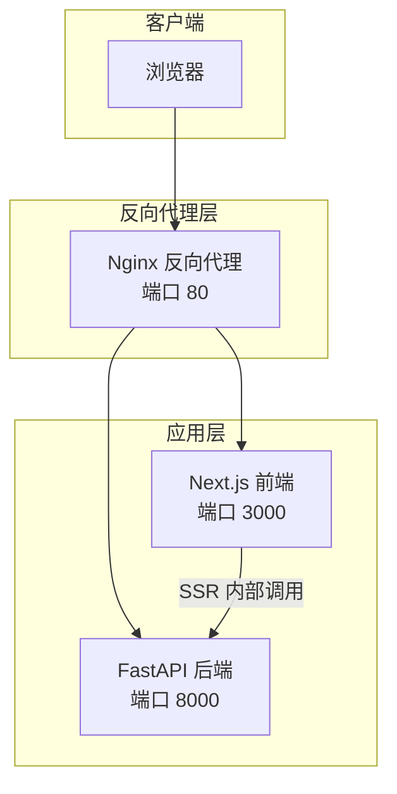
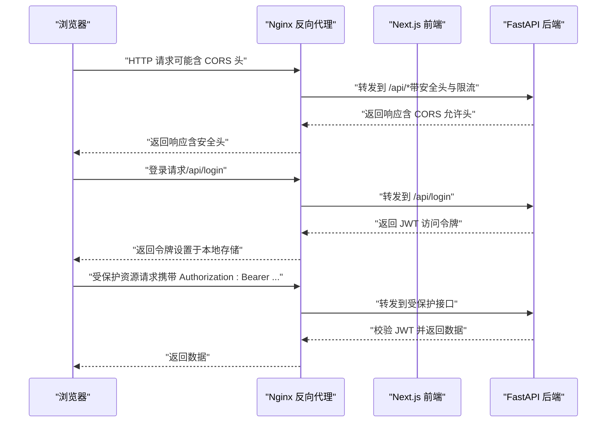
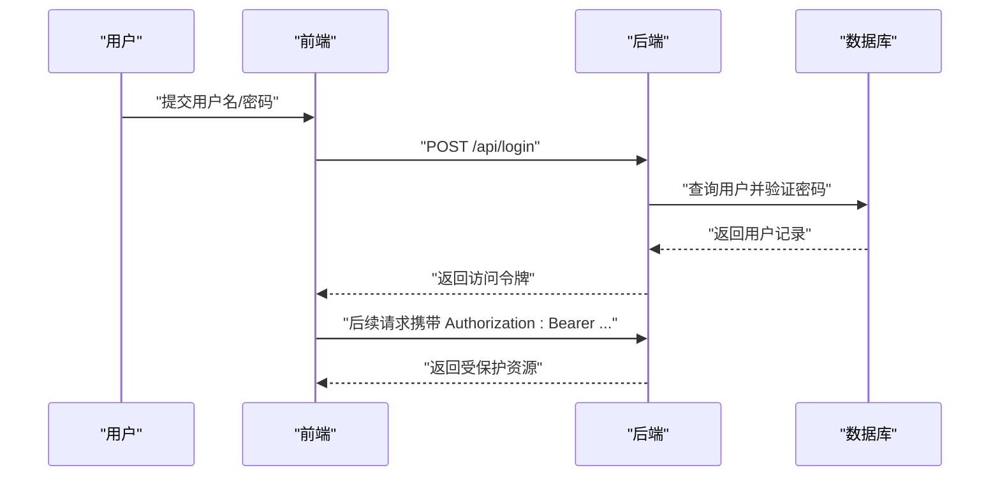
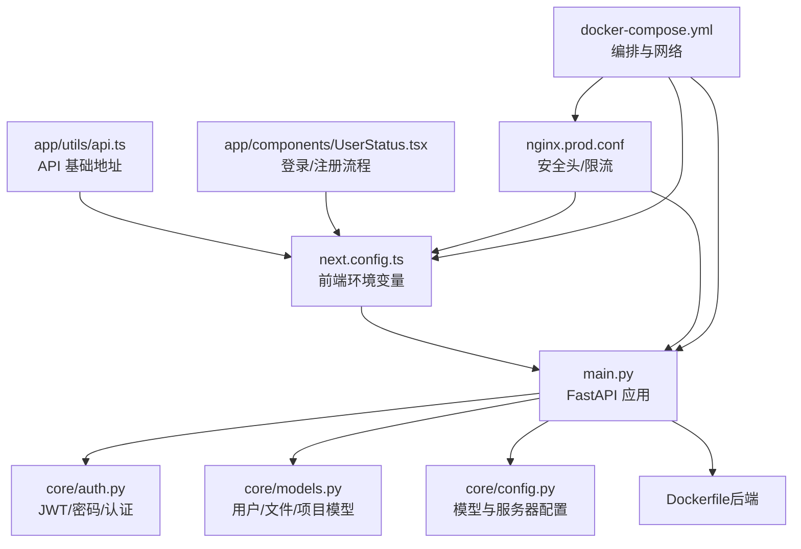

# 跨域与安全配置

<cite>
**本文档引用的文件**
- [main.py](file://localmanus-backend/main.py)
- [auth.py](file://localmanus-backend/core/auth.py)
- [models.py](file://localmanus-backend/core/models.py)
- [config.py](file://localmanus-backend/core/config.py)
- [Dockerfile（后端）](file://localmanus-backend/Dockerfile)
- [Dockerfile（前端）](file://localmanus-ui/Dockerfile)
- [docker-compose.yml](file://docker-compose.yml)
- [next.config.ts](file://localmanus-ui/next.config.ts)
- [nginx.prod.conf](file://nginx/nginx.prod.conf)
- [nginx.conf](file://nginx/nginx.conf)
- [api.ts](file://localmanus-ui/app/utils/api.ts)
- [UserStatus.tsx](file://localmanus-ui/app/components/UserStatus.tsx)
- [.env.example](file://localmanus-backend/.env.example)
- [PRODUCTION_DEPLOYMENT.md](file://PRODUCTION_DEPLOYMENT.md)
</cite>

## 目录
1. [简介](#简介)
2. [项目结构](#项目结构)
3. [核心组件](#核心组件)
4. [架构总览](#架构总览)
5. [详细组件分析](#详细组件分析)
6. [依赖关系分析](#依赖关系分析)
7. [性能考虑](#性能考虑)
8. [故障排查指南](#故障排查指南)
9. [结论](#结论)
10. [附录](#附录)

## 简介
本文件聚焦 LocalManus 的跨域与安全配置，系统性阐述 CORS（跨域资源共享）配置原理、允许源列表设置、预检请求处理；详述安全头配置、HSTS 头设置、内容安全策略（CSP）策略；解释 CSRF 防护机制、XSS 防护策略、SQL 注入防护措施；说明认证令牌管理、会话安全、密码加密存储；提供 HTTPS 配置、证书管理、安全扫描工具使用；并给出安全审计清单、漏洞检测方法、应急响应预案，以及生产环境的安全加固建议与合规性要求。

## 项目结构
LocalManus 采用前后端分离架构：前端为 Next.js 应用，后端为 FastAPI 应用，二者通过 Nginx 反向代理统一对外提供服务。开发与生产均通过 docker-compose 编排，后端容器暴露 8000 端口，前端容器暴露 3000 端口，Nginx 暴露 80 端口并作为反向代理与安全边界。

图表来源
- [docker-compose.yml](file://docker-compose.yml#L1-L88)
- [nginx.prod.conf](file://nginx/nginx.prod.conf#L33-L87)
- [nginx.conf](file://nginx/nginx.conf#L48-L68)

章节来源
- [docker-compose.yml](file://docker-compose.yml#L1-L88)
- [next.config.ts](file://localmanus-ui/next.config.ts#L1-L37)

## 核心组件
- CORS 中间件：在后端启用跨域支持，当前配置为“允许所有源、方法与头部”，便于开发但不适用于生产。
- 安全头与限流：在 Nginx 层集中注入安全头（如 X-Frame-Options、X-Content-Type-Options、X-XSS-Protection），并配置速率限制与连接限制。
- 认证与授权：基于 JWT 的 OAuth2 密码流，密码使用 bcrypt 存储，访问令牌过期时间可配置。
- 文件上传与沙箱执行：上传目录隔离与命令执行沙箱，防止越权与路径穿越。
- 环境变量与部署：通过 .env 与 docker-compose 管理敏感配置，支持生产部署与 HTTPS。

章节来源
- [main.py](file://localmanus-backend/main.py#L52-L59)
- [nginx.prod.conf](file://nginx/nginx.prod.conf#L37-L40)
- [auth.py](file://localmanus-backend/core/auth.py#L12-L18)
- [models.py](file://localmanus-backend/core/models.py#L10-L13)
- [config.py](file://localmanus-backend/core/config.py#L12-L16)

## 架构总览
下图展示浏览器到后端 API 的完整链路，包括 CORS、Nginx 安全头与限流、JWT 认证流程。

图表来源
- [main.py](file://localmanus-backend/main.py#L92-L106)
- [auth.py](file://localmanus-backend/core/auth.py#L55-L82)
- [nginx.prod.conf](file://nginx/nginx.prod.conf#L57-L82)

## 详细组件分析

### CORS（跨域资源共享）配置
- 当前实现：后端启用 CORS 中间件，允许所有源、凭据、方法与头部，便于开发调试。
- 风险与建议：
  - 生产环境应明确列出允许源（如前端域名或 IP），避免使用通配符。
  - 对敏感端点启用严格预检策略，仅放行必要方法与头部。
  - 结合 Nginx 层的 CORS 控制，形成多层保障。
- 关键位置参考：
  - 后端 CORS 中间件注册与参数配置
  - 前端环境变量 NEXT_PUBLIC_API_URL 与 SSR 环境变量 BACKEND_URL

章节来源
- [main.py](file://localmanus-backend/main.py#L52-L59)
- [next.config.ts](file://localmanus-ui/next.config.ts#L5-L12)

### 安全头与限流（Nginx）
- 安全头：
  - X-Frame-Options：SAMEORIGIN，防止点击劫持。
  - X-Content-Type-Options：nosniff，阻止 MIME 类型嗅探。
  - X-XSS-Protection：1; mode=block，启用浏览器 XSS 过滤。
- 限流与连接控制：
  - API 限流区：每 IP 20 次/秒，突发 50。
  - 登录限流区：每 IP 5 次/分钟，突发 3。
  - 连接数限制：每 IP 最大并发 10。
- 优化项：
  - 可结合 HSTS、CSP、Referrer-Policy 等进一步强化。
  - 针对不同端点细化限流策略（如 /api/chat 流式传输需关闭缓冲）。

章节来源
- [nginx.prod.conf](file://nginx/nginx.prod.conf#L37-L40)
- [nginx.prod.conf](file://nginx/nginx.prod.conf#L16-L21)
- [nginx.prod.conf](file://nginx/nginx.prod.conf#L57-L70)

### 认证与授权（JWT）
- 认证流程：
  - 使用 OAuth2 密码流，用户名/密码换取访问令牌。
  - 令牌签名算法与密钥来自环境变量，过期时间可配置。
  - 获取当前用户时，支持从查询参数传递令牌（用于 SSE）。
- 密码存储：
  - 新用户使用 bcrypt 加密存储；兼容历史用户使用 SHA-256+盐值。
- 安全建议：
  - 强制使用 HTTPS 传输令牌；生产环境设置 HttpOnly、Secure、SameSite Cookie。
  - 令牌刷新策略与黑名单管理；短令牌与刷新令牌配合。
  - 定期轮换 SECRET_KEY，确保密钥安全。

图表来源
- [auth.py](file://localmanus-backend/core/auth.py#L47-L53)
- [auth.py](file://localmanus-backend/core/auth.py#L55-L82)
- [main.py](file://localmanus-backend/main.py#L92-L106)

章节来源
- [auth.py](file://localmanus-backend/core/auth.py#L12-L18)
- [auth.py](file://localmanus-backend/core/auth.py#L37-L45)
- [auth.py](file://localmanus-backend/core/auth.py#L47-L53)
- [auth.py](file://localmanus-backend/core/auth.py#L55-L82)
- [models.py](file://localmanus-backend/core/models.py#L10-L13)

### CSRF 防护
- 当前状态：未见显式 CSRF 防护（如 CSRF Token 或 SameSite Cookie）。
- 建议：
  - 对有状态表单提交启用 CSRF Token，并在 Nginx 层校验来源。
  - 将关键写操作限定为特定方法（如 POST/PUT/DELETE），并结合 Origin/Referer 校验。
  - 设置 Cookie 的 SameSite=Lax|Strict，HttpOnly 与 Secure。

章节来源
- [main.py](file://localmanus-backend/main.py#L92-L106)
- [nginx.prod.conf](file://nginx/nginx.prod.conf#L37-L40)

### XSS 防护
- 当前状态：Nginx 设置了 X-XSS-Protection，前端未见专门的输出编码或 CSP。
- 建议：
  - 前端对用户输入进行严格的输出编码与转义。
  - 在 Nginx 或响应头中加入 Content-Security-Policy，限制脚本来源与内联脚本。
  - 对富文本场景使用白名单过滤库（如 DOMPurify）。

章节来源
- [nginx.prod.conf](file://nginx/nginx.prod.conf#L37-L40)
- [UserStatus.tsx](file://localmanus-ui/app/components/UserStatus.tsx#L40-L53)

### SQL 注入防护
- 当前状态：使用 SQLModel ORM，参数化查询默认生效。
- 建议：
  - 严禁拼接 SQL 字符串；所有动态条件使用 ORM 查询构造器。
  - 对文件路径与外部命令执行进行严格白名单与路径规范化。
  - 定期进行静态与动态安全扫描。

章节来源
- [models.py](file://localmanus-backend/core/models.py#L1-L80)
- [main.py](file://localmanus-backend/main.py#L112-L151)

### 文件上传与沙箱执行
- 文件上传：
  - 用户上传目录按用户隔离；文件名唯一化；记录元信息。
- 沙箱执行：
  - 命令执行限制在沙箱目录内，防止路径穿越；超时控制。
- 建议：
  - 上传类型白名单与大小限制；病毒扫描集成。
  - 执行权限最小化，非特权用户运行。

章节来源
- [main.py](file://localmanus-backend/main.py#L112-L151)
- [main.py](file://localmanus-backend/main.py#L46-L50)
- [main.py](file://localmanus-backend/main.py#L440-L473)
- [core/sandbox.py](file://localmanus-backend/core/sandbox.py#L37-L74)

### HTTPS 配置与证书管理
- 当前状态：Nginx 提供示例 HTTPS 配置（监听 443，挂载证书卷）。
- 建议：
  - 使用 Let’s Encrypt 自动签发与续期。
  - 强制 HSTS（至少一年）、禁用弱加密套件与协议版本。
  - 证书监控与到期告警。

章节来源
- [nginx.conf](file://nginx/nginx.conf#L119-L132)
- [PRODUCTION_DEPLOYMENT.md](file://PRODUCTION_DEPLOYMENT.md#L176-L217)

### 内容安全策略（CSP）
- 当前状态：未见 CSP 响应头。
- 建议：
  - 默认拒绝（default-src 'self'），逐步放开样式、脚本、媒体等来源。
  - 对外部 CDN 与第三方服务配置严格的主机与哈希/非ces。
  - 启用 report-only 模式进行过渡与观测。

章节来源
- [nginx.prod.conf](file://nginx/nginx.prod.conf#L37-L40)

## 依赖关系分析

图表来源
- [main.py](file://localmanus-backend/main.py#L1-L40)
- [auth.py](file://localmanus-backend/core/auth.py#L1-L20)
- [models.py](file://localmanus-backend/core/models.py#L1-L20)
- [config.py](file://localmanus-backend/core/config.py#L1-L22)
- [next.config.ts](file://localmanus-ui/next.config.ts#L1-L37)
- [api.ts](file://localmanus-ui/app/utils/api.ts#L1-L16)
- [UserStatus.tsx](file://localmanus-ui/app/components/UserStatus.tsx#L55-L83)
- [nginx.prod.conf](file://nginx/nginx.prod.conf#L33-L87)
- [docker-compose.yml](file://docker-compose.yml#L1-L88)

章节来源
- [main.py](file://localmanus-backend/main.py#L1-L40)
- [next.config.ts](file://localmanus-ui/next.config.ts#L1-L37)
- [docker-compose.yml](file://docker-compose.yml#L1-L88)

## 性能考虑
- Nginx 层：
  - 开启 gzip 压缩与静态缓存头，减少带宽与延迟。
  - 对长连接启用 keepalive，提升复用率。
- 后端：
  - SSE 与 WebSocket 场景关闭代理缓冲，保证实时性。
  - 数据库查询使用索引字段，避免全表扫描。
- 前端：
  - 图片与静态资源按需加载，减少首屏压力。

章节来源
- [nginx.prod.conf](file://nginx/nginx.prod.conf#L27-L31)
- [nginx.prod.conf](file://nginx/nginx.prod.conf#L67-L70)
- [Dockerfile（前端）](file://localmanus-ui/Dockerfile#L1-L35)

## 故障排查指南
- CORS 相关问题：
  - 确认后端 CORS 中间件已启用且允许的源、方法、头部正确。
  - 检查浏览器开发者工具 Network 面板中的预检请求与响应头。
- 认证失败：
  - 核对 SECRET_KEY 是否一致；检查令牌是否过期。
  - 确认 /api/login 返回的令牌格式与前端存储方式一致。
- 上传失败：
  - 检查上传目录权限与磁盘空间；确认文件大小限制与类型白名单。
- Nginx 错误：
  - 查看 access/error 日志定位 502/504/429 等错误原因。
  - 调整 proxy_* 超时与缓冲设置以适配长任务。

章节来源
- [main.py](file://localmanus-backend/main.py#L52-L59)
- [auth.py](file://localmanus-backend/core/auth.py#L55-L82)
- [main.py](file://localmanus-backend/main.py#L112-L151)
- [nginx.prod.conf](file://nginx/nginx.prod.conf#L134-L147)

## 结论
LocalManus 已具备基础的跨域与安全能力：后端 CORS 中间件、Nginx 安全头与限流、JWT 认证与 bcrypt 密码存储。为满足生产安全要求，建议明确 CORS 允许源、补充 CSRF 与 CSP、强制 HTTPS 与 HSTS、完善令牌与会话安全策略，并持续进行安全扫描与审计。

## 附录

### 安全审计清单（建议）
- CORS
  - 明确允许源列表，禁用通配符
  - 仅放行必要方法与头部
- 安全头
  - X-Frame-Options、X-Content-Type-Options、X-XSS-Protection
  - HSTS（至少一年）、CSP、Referrer-Policy
- 认证与会话
  - HttpOnly、Secure、SameSite Cookie
  - 短令牌与刷新令牌、令牌黑名单
  - 强密码策略与多因子认证（可选）
- 数据与传输
  - HTTPS 强制、TLS 版本与套件加固
  - 输入验证、参数化查询、文件类型与大小限制
- 日志与监控
  - 审计日志、异常告警、访问日志留存
- 渗透测试与扫描
  - 定期 OWASP ZAP/ Burp Suite 扫描
  - 依赖漏洞扫描（如 npm audit、pip-audit）

### 漏洞检测方法
- 自动化扫描
  - 静态分析：Secret 泄漏、硬编码密钥
  - 动态分析：SQL 注入、XSS、CSRF、不安全的反序列化
- 手动渗透
  - 权限绕过、越权访问、敏感信息泄露
  - 业务逻辑缺陷与异常路径

### 应急响应预案
- 事件分级与处置流程
  - 快速隔离受影响服务与网络段
  - 回滚变更与恢复备份
  - 通知监管与受影响用户
- 事后复盘
  - 根因分析、修复补丁、流程改进

### 生产环境加固建议
- 网络与部署
  - 使用专用子网与防火墙规则，仅开放必要端口
  - 使用只读根文件系统与最小权限容器
- 配置与密钥
  - 环境变量集中管理与加密存储，定期轮换
  - 机密信息不进入镜像与日志
- 运维与合规
  - 安全基线检查与合规审计
  - 定期演练与培训

章节来源
- [PRODUCTION_DEPLOYMENT.md](file://PRODUCTION_DEPLOYMENT.md#L161-L224)
- [nginx.prod.conf](file://nginx/nginx.prod.conf#L119-L132)