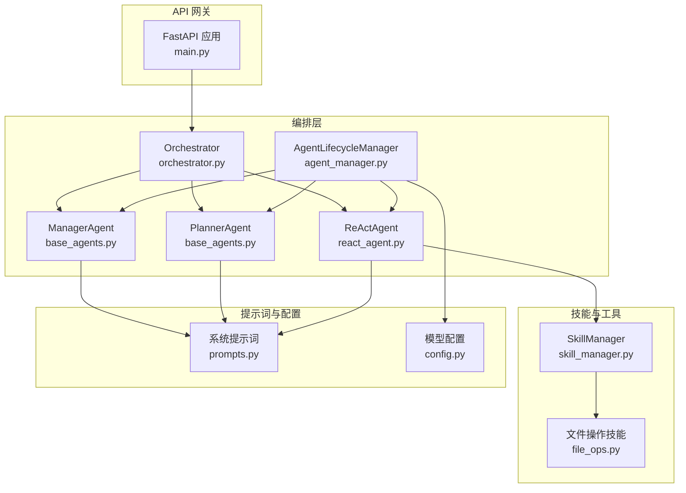
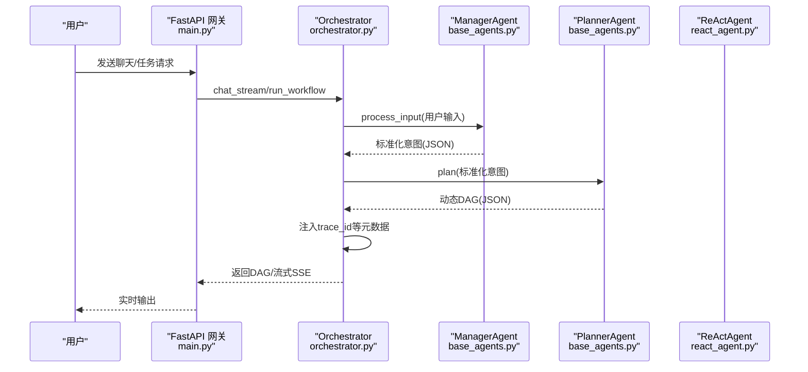
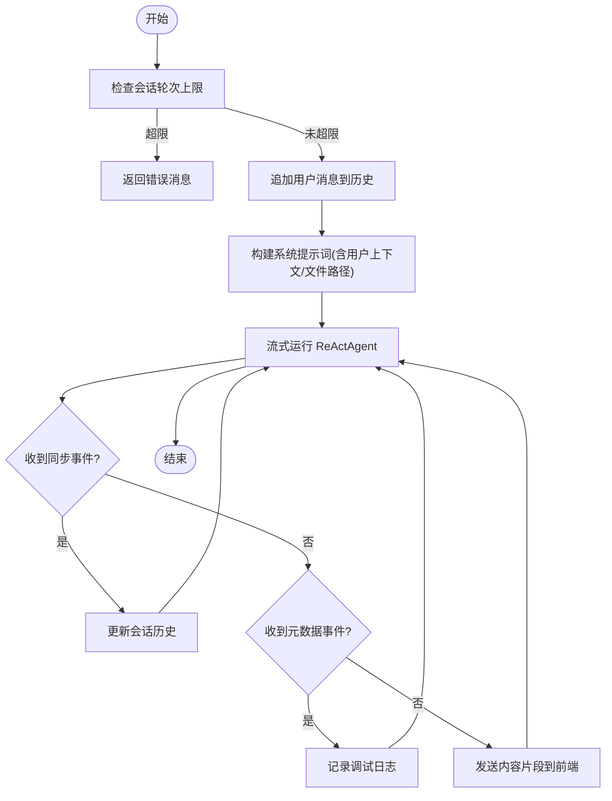
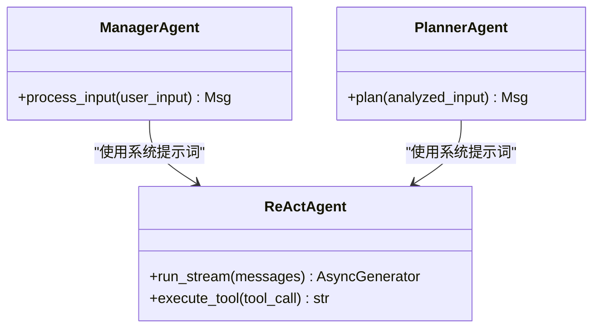
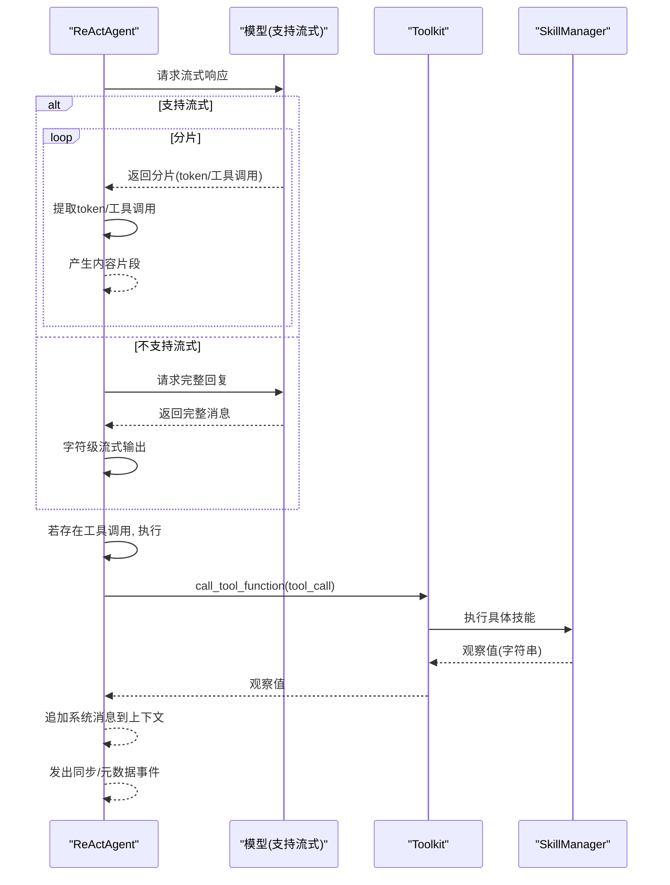
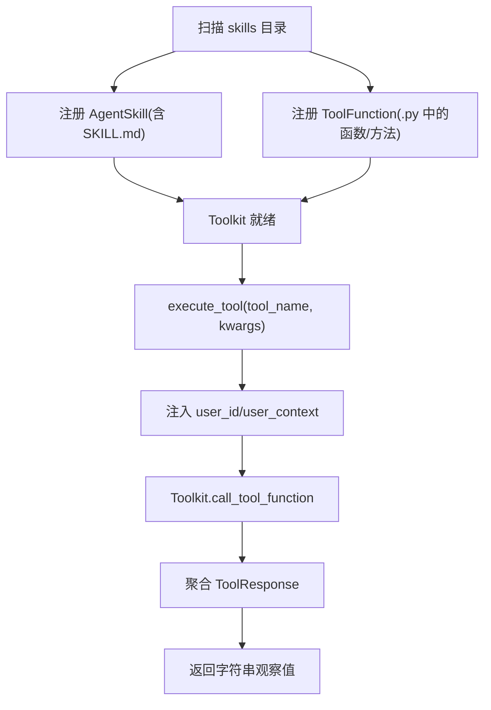
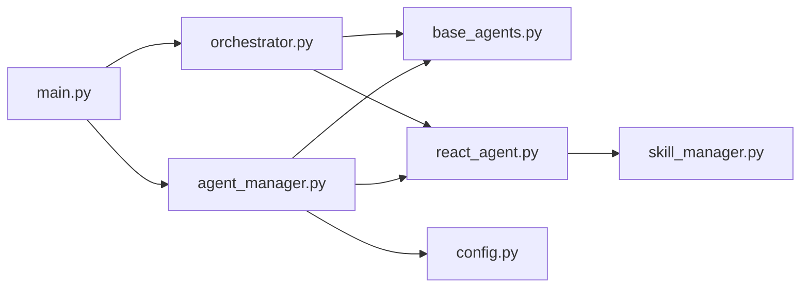

# 系统处理链路

<cite>
**本文引用的文件**
- [main.py](file://localmanus-backend/main.py)
- [orchestrator.py](file://localmanus-backend/core/orchestrator.py)
- [agent_manager.py](file://localmanus-backend/core/agent_manager.py)
- [base_agents.py](file://localmanus-backend/agents/base_agents.py)
- [react_agent.py](file://localmanus-backend/agents/react_agent.py)
- [prompts.py](file://localmanus-backend/core/prompts.py)
- [skill_manager.py](file://localmanus-backend/core/skill_manager.py)
- [config.py](file://localmanus-backend/core/config.py)
- [file_ops.py](file://localmanus-backend/skills/file-operations/file_ops.py)
- [localmanus_architecture.md](file://localmanus_architecture.md)
- [test_orchestration.py](file://localmanus-backend/scripts/test_orchestration.py)
</cite>

## 目录
1. [引言](#引言)
2. [项目结构](#项目结构)
3. [核心组件](#核心组件)
4. [架构总览](#架构总览)
5. [详细组件分析](#详细组件分析)
6. [依赖关系分析](#依赖关系分析)
7. [性能考量](#性能考量)
8. [故障排查指南](#故障排查指南)
9. [结论](#结论)
10. [附录](#附录)

## 引言
本技术文档围绕 LocalManus 的系统处理链路展开，聚焦三层递进式处理：从 Query 到规划 Agent 的意图解析与环境对齐、规划 Agent 的技能路由与语义映射、执行技能与入参的受控执行过程。文档同时阐述任务规划的决策逻辑、技能选择算法、参数标准化流程，解释自纠正循环机制、错误处理策略与重试机制，并给出性能监控、瓶颈分析与优化建议，辅以实际案例与最佳实践。

## 项目结构
后端采用 FastAPI 作为网关，核心编排由 Orchestrator 负责，Agent 管理与模型初始化由 AgentLifecycleManager 完成，技能系统通过 SkillManager 动态加载并注册工具函数，ReActAgent 提供流式推理与工具调用能力，Prompts 提供系统提示词模板，配置由 config.py 管理。

**图示来源**
- [main.py](file://localmanus-backend/main.py#L34-L40)
- [orchestrator.py](file://localmanus-backend/core/orchestrator.py#L11-L14)
- [agent_manager.py](file://localmanus-backend/core/agent_manager.py#L11-L36)
- [base_agents.py](file://localmanus-backend/agents/base_agents.py#L6-L41)
- [react_agent.py](file://localmanus-backend/agents/react_agent.py#L20-L34)
- [prompts.py](file://localmanus-backend/core/prompts.py#L3-L74)
- [skill_manager.py](file://localmanus-backend/core/skill_manager.py#L18-L27)
- [config.py](file://localmanus-backend/core/config.py#L8-L16)

**章节来源**
- [main.py](file://localmanus-backend/main.py#L34-L40)
- [orchestrator.py](file://localmanus-backend/core/orchestrator.py#L11-L14)
- [agent_manager.py](file://localmanus-backend/core/agent_manager.py#L11-L36)
- [prompts.py](file://localmanus-backend/core/prompts.py#L3-L74)
- [config.py](file://localmanus-backend/core/config.py#L8-L16)

## 核心组件
- Orchestrator：负责会话管理、SSE 输出、JSON 提取、工作流编排（意图分析 → DAG 规划 → 元数据注入）。
- ManagerAgent/PlannerAgent：分别承担意图标准化与动态 DAG 生成，使用统一的系统提示词模板。
- ReActAgent：基于 AgentScope 的 ReAct 实现，支持真实流式响应、工具调用抽取、消息同步与元数据事件。
- SkillManager：扫描 skills 目录，注册 AgentSkill 与 ToolFunction，提供工具执行与工具模式导出。
- AgentLifecycleManager：初始化模型、格式化器、内存与技能管理器，统一提供三类 Agent。
- 文件操作技能：示例技能，演示用户上传目录隔离、文件读写与列表等能力。

**章节来源**
- [orchestrator.py](file://localmanus-backend/core/orchestrator.py#L11-L14)
- [base_agents.py](file://localmanus-backend/agents/base_agents.py#L6-L41)
- [react_agent.py](file://localmanus-backend/agents/react_agent.py#L20-L34)
- [skill_manager.py](file://localmanus-backend/core/skill_manager.py#L18-L27)
- [agent_manager.py](file://localmanus-backend/core/agent_manager.py#L11-L36)
- [file_ops.py](file://localmanus-backend/skills/file-operations/file_ops.py#L9-L165)

## 架构总览
系统采用三层递进处理链路：
- 阶段一：Query 到规划 Agent（意图解析与环境对齐）
- 阶段二：规划 Agent 执行技能路由（语义映射）
- 阶段三：执行技能与入参（受控执行）

**图示来源**
- [main.py](file://localmanus-backend/main.py#L392-L429)
- [orchestrator.py](file://localmanus-backend/core/orchestrator.py#L97-L112)
- [base_agents.py](file://localmanus-backend/agents/base_agents.py#L19-L40)
- [react_agent.py](file://localmanus-backend/agents/react_agent.py#L53-L215)

## 详细组件分析

### 组件一：Orchestrator（编排器）
- 会话管理：按 session_id 维护历史消息，限制最大轮次，支持内部同步与元数据事件。
- 工作流编排：调用 ManagerAgent 进行意图解析，再调用 PlannerAgent 生成 DAG，最后注入 trace_id。
- JSON 提取：从 Agent 响应中提取 JSON 块，兼容多种包裹形式。
- SSE 输出：将 ReActAgent 的流式输出封装为 Server-Sent Events，区分内容、同步与元数据事件。

**图示来源**
- [orchestrator.py](file://localmanus-backend/core/orchestrator.py#L16-L96)

**章节来源**
- [orchestrator.py](file://localmanus-backend/core/orchestrator.py#L11-L14)
- [orchestrator.py](file://localmanus-backend/core/orchestrator.py#L97-L129)

### 组件二：ManagerAgent 与 PlannerAgent（意图解析与动态规划）
- ManagerAgent：将用户输入标准化为结构化 JSON，包含 intent、entities、context 等字段。
- PlannerAgent：接收 ManagerAgent 的输出，生成动态任务 DAG，包含 step_id、skill、args、dependencies 等。
- 系统提示词：分别定义 Manager 与 Planner 的职责边界与输出格式，保证 Agent 行为一致性。

**图示来源**
- [base_agents.py](file://localmanus-backend/agents/base_agents.py#L6-L41)
- [prompts.py](file://localmanus-backend/core/prompts.py#L3-L52)

**章节来源**
- [base_agents.py](file://localmanus-backend/agents/base_agents.py#L6-L41)
- [prompts.py](file://localmanus-backend/core/prompts.py#L3-L52)

### 组件三：ReActAgent（流式推理与工具执行）
- 流式优化：优先尝试模型原生流式接口，若失败则回退为完整响应字符级流式输出。
- 工具调用抽取：从流式分片中提取工具调用，避免二次解析；若无流式支持，则回退到结构化消息解析。
- 工具执行：通过 Toolkit 调用工具函数，支持注入 user_id 与 user_context，聚合 ToolResponse 并返回字符串观察值。
- 同步与元数据：在 finally 中发出同步事件，将新增消息写入会话历史；发出元数据事件便于调试。

**图示来源**
- [react_agent.py](file://localmanus-backend/agents/react_agent.py#L53-L215)
- [skill_manager.py](file://localmanus-backend/core/skill_manager.py#L90-L134)

**章节来源**
- [react_agent.py](file://localmanus-backend/agents/react_agent.py#L53-L215)
- [skill_manager.py](file://localmanus-backend/core/skill_manager.py#L90-L134)

### 组件四：SkillManager（技能注册与执行）
- 加载策略：扫描 skills 目录，注册 AgentSkill（含 SKILL.md 的目录）与 ToolFunction（.py 文件中的函数与继承 BaseSkill 的方法）。
- 执行流程：根据工具名查找 Toolkit 中的工具，注入 user_id 与 user_context，调用 Toolkit 执行，聚合 ToolResponse 并返回字符串。
- 工具模式：导出工具 JSON Schema 与 AgentSkill 提示词，供 ReActAgent 构建系统提示词。

**图示来源**
- [skill_manager.py](file://localmanus-backend/core/skill_manager.py#L29-L89)
- [skill_manager.py](file://localmanus-backend/core/skill_manager.py#L90-L134)

**章节来源**
- [skill_manager.py](file://localmanus-backend/core/skill_manager.py#L18-L27)
- [skill_manager.py](file://localmanus-backend/core/skill_manager.py#L29-L89)
- [skill_manager.py](file://localmanus-backend/core/skill_manager.py#L90-L134)

### 组件五：AgentLifecycleManager（Agent 生命周期）
- 初始化：加载模型配置（支持本地 Ollama/远程 OpenAI 风格）、格式化器、内存与技能管理器。
- 统一提供：ManagerAgent、PlannerAgent、ReActAgent 三个核心 Agent 实例。

**章节来源**
- [agent_manager.py](file://localmanus-backend/core/agent_manager.py#L11-L36)
- [config.py](file://localmanus-backend/core/config.py#L8-L16)

### 组件六：文件操作技能（示例）
- 用户目录隔离：每个用户拥有独立上传目录，防止越权访问。
- 文件读写：支持文本与二进制文件读取，提供目录列表与文件写入。
- 安全校验：路径合法性检查，避免目录穿越。

**章节来源**
- [file_ops.py](file://localmanus-backend/skills/file-operations/file_ops.py#L18-L85)
- [file_ops.py](file://localmanus-backend/skills/file-operations/file_ops.py#L87-L121)
- [file_ops.py](file://localmanus-backend/skills/file-operations/file_ops.py#L122-L136)

## 依赖关系分析
- 入口依赖：main.py 依赖 Orchestrator、AgentLifecycleManager、SkillRegistry、ConfigManager，提供健康检查、认证、文件上传、技能管理、设置管理与聊天 SSE 端点。
- 编排依赖：Orchestrator 依赖 AgentLifecycleManager 获取三类 Agent，并依赖 SkillRegistry/SkillManager 提供工具能力。
- Agent 依赖：ManagerAgent/PlannerAgent 基于 ReActAgent，ReActAgent 依赖 SkillManager 的 Toolkit。
- 配置依赖：AgentLifecycleManager 依赖 config.py 的模型配置，支持环境变量覆盖。

**图示来源**
- [main.py](file://localmanus-backend/main.py#L6-L40)
- [orchestrator.py](file://localmanus-backend/core/orchestrator.py#L6-L13)
- [agent_manager.py](file://localmanus-backend/core/agent_manager.py#L1-L36)

**章节来源**
- [main.py](file://localmanus-backend/main.py#L6-L40)
- [orchestrator.py](file://localmanus-backend/core/orchestrator.py#L6-L13)
- [agent_manager.py](file://localmanus-backend/core/agent_manager.py#L1-L36)

## 性能考量
- 流式优先：ReActAgent 优先尝试模型原生流式接口，减少首字节延迟；若不支持则回退为字符级流式输出，仍优于批量输出。
- 工具调用抽取：从流式分片中提取工具调用，避免二次解析，降低延迟与计算开销。
- 工具聚合：合并 Toolkit 的 ToolResponse，减少多次异步迭代的调度成本。
- 会话限制：Orchestrator 对会话轮次进行上限控制，避免无限增长导致内存与带宽压力。
- 模型配置：AgentLifecycleManager 支持本地/远程模型切换，结合环境变量可灵活适配不同部署场景。

**章节来源**
- [react_agent.py](file://localmanus-backend/agents/react_agent.py#L85-L161)
- [react_agent.py](file://localmanus-backend/agents/react_agent.py#L163-L175)
- [orchestrator.py](file://localmanus-backend/core/orchestrator.py#L34-L37)
- [agent_manager.py](file://localmanus-backend/core/agent_manager.py#L20-L25)

## 故障排查指南
- JSON 提取失败：Orchestrator 的 JSON 提取器对无包裹与 Markdown 包裹均做兼容，若解析失败会返回包含原始文本的错误对象，便于定位问题。
- 工具执行异常：SkillManager 的 execute_tool 捕获异常并返回错误字符串，ReActAgent 在工具执行后将错误作为观察值返回，便于前端展示。
- 流式回退：若模型不支持流式，ReActAgent 回退为完整响应字符级流式输出，确保用户体验连续性。
- 会话上限：超过最大轮次将返回错误消息，避免资源耗尽。
- 认证与权限：文件上传/下载/删除依赖用户认证与权限校验，若用户不匹配或文件不存在将抛出相应 HTTP 异常。

**章节来源**
- [orchestrator.py](file://localmanus-backend/core/orchestrator.py#L114-L128)
- [skill_manager.py](file://localmanus-backend/core/skill_manager.py#L132-L134)
- [react_agent.py](file://localmanus-backend/agents/react_agent.py#L207-L209)
- [orchestrator.py](file://localmanus-backend/core/orchestrator.py#L34-L37)
- [main.py](file://localmanus-backend/main.py#L112-L215)

## 结论
LocalManus 的系统处理链路以 AgentScope 为核心，通过 ManagerAgent 的意图解析、PlannerAgent 的动态 DAG 规划与 ReActAgent 的流式推理与工具执行，形成三层递进的处理闭环。结合 SkillManager 的动态技能注册与执行、AgentLifecycleManager 的统一生命周期管理，系统具备良好的扩展性与可控性。通过流式优化、工具调用抽取与会话限制等策略，系统在性能与稳定性方面具备良好表现。建议后续完善沙箱执行与自纠正循环的端到端集成，以支撑更复杂的任务编排与容错恢复。

## 附录

### 实际案例：PDF 转 Word 的三层链路
- 阶段一：ManagerAgent 标准化用户输入，收集文件系统与资源上下文。
- 阶段二：PlannerAgent 生成动态 DAG，将 PDF 转 Word 的目标映射为具体技能与参数。
- 阶段三：ReActAgent 执行工具调用，将参数标准化并注入到技能执行环境中，实现受控执行与结果反馈。

**章节来源**
- [localmanus_architecture.md](file://localmanus_architecture.md#L117-L151)

### 最佳实践
- 使用 Schema 驱动的技能设计，确保参数对齐与 Planner 的正确路由。
- 在技能执行过程中输出可观测日志，便于前端实时展示与问题定位。
- 严格控制会话轮次与消息长度，避免资源耗尽。
- 优先启用流式响应，提升用户体验；在不支持流式的模型上做好回退策略。
- 对用户上传目录进行隔离与路径校验，防止越权访问与目录穿越。

**章节来源**
- [localmanus_skills_roadmap.md](file://localmanus_skills_roadmap.md#L5-L10)
- [file_ops.py](file://localmanus-backend/skills/file-operations/file_ops.py#L64-L85)
- [orchestrator.py](file://localmanus-backend/core/orchestrator.py#L34-L37)
- [react_agent.py](file://localmanus-backend/agents/react_agent.py#L85-L161)

### 端到端测试参考
- 使用 test_orchestration.py 演示 run_workflow 的预期结构与错误处理（无 API Key 时的模拟模式）。

**章节来源**
- [test_orchestration.py](file://localmanus-backend/scripts/test_orchestration.py#L12-L56)