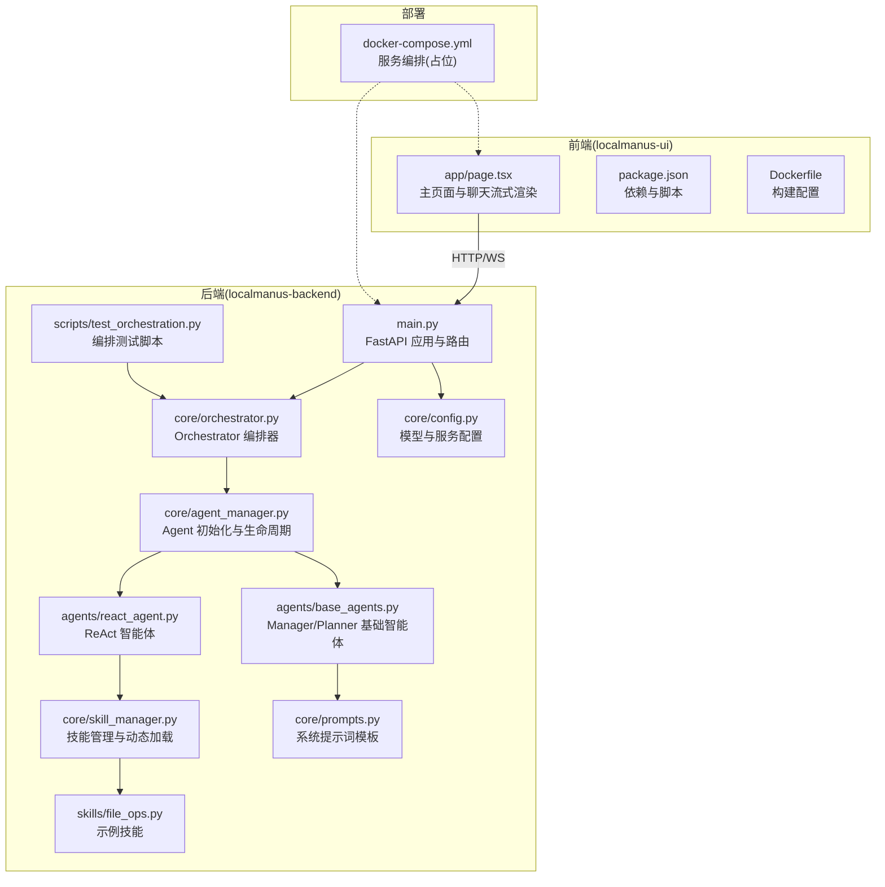
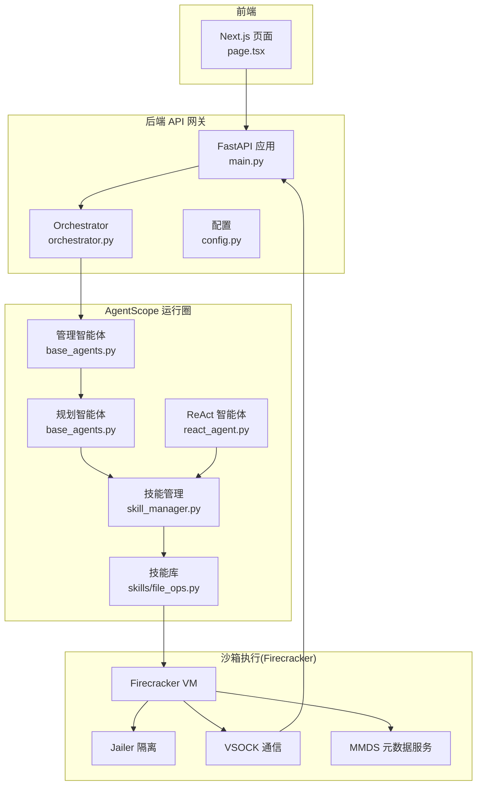
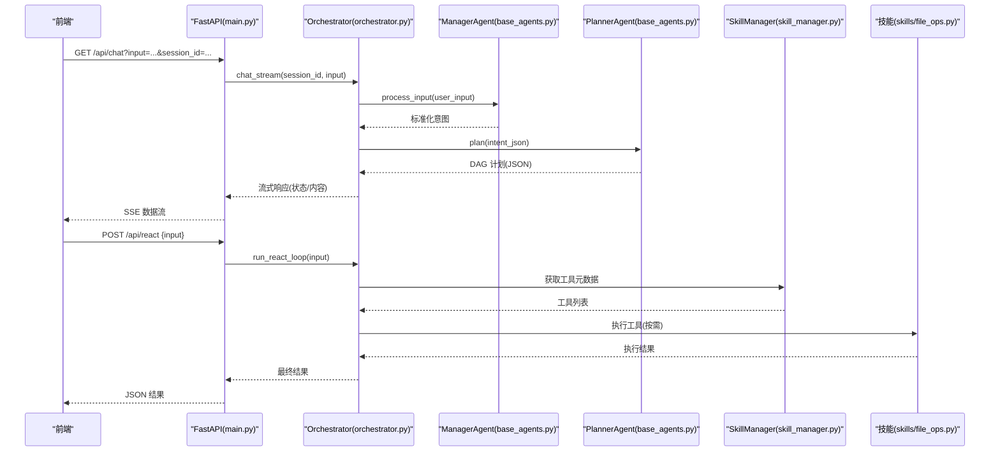
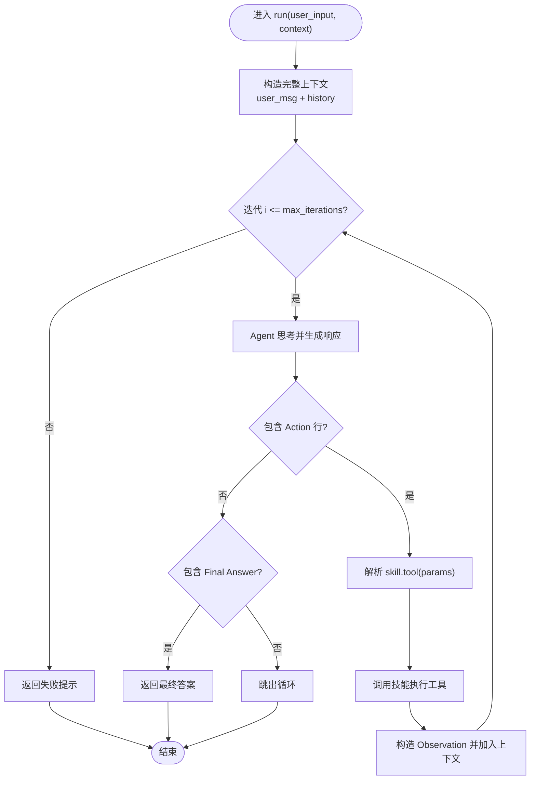
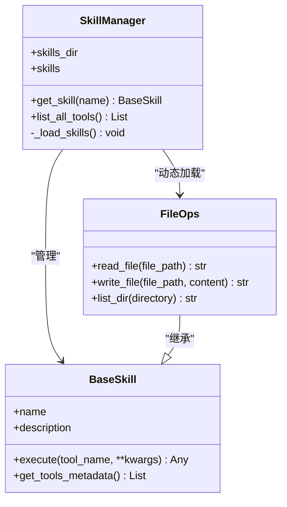
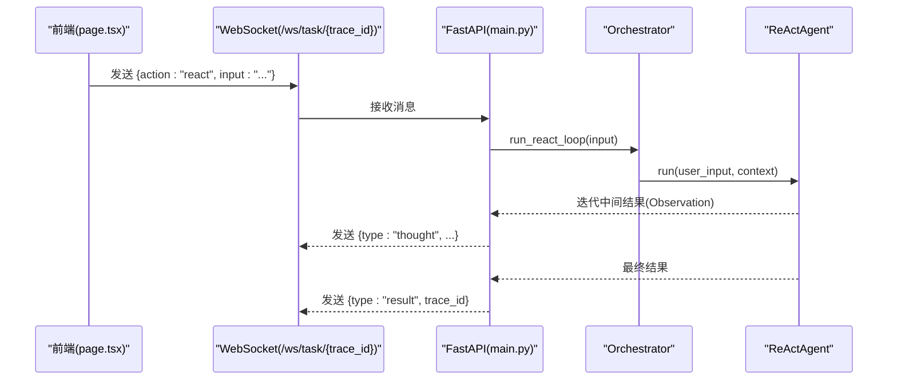
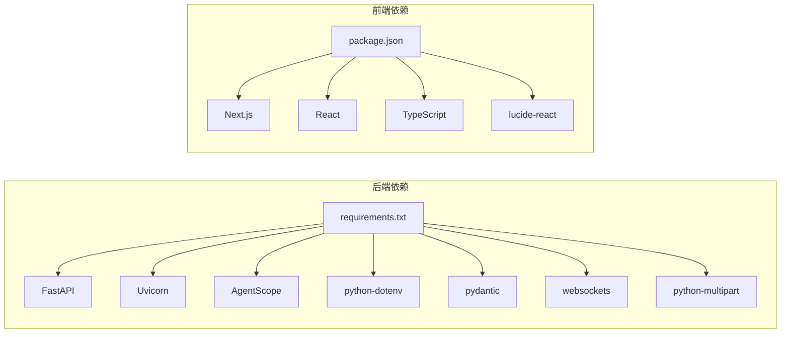

# 系统架构设计

<cite>
**本文引用的文件**
- [main.py](file://localmanus-backend/main.py)
- [orchestrator.py](file://localmanus-backend/core/orchestrator.py)
- [agent_manager.py](file://localmanus-backend/core/agent_manager.py)
- [base_agents.py](file://localmanus-backend/agents/base_agents.py)
- [react_agent.py](file://localmanus-backend/agents/react_agent.py)
- [skill_manager.py](file://localmanus-backend/core/skill_manager.py)
- [file_ops.py](file://localmanus-backend/skills/file_ops.py)
- [config.py](file://localmanus-backend/core/config.py)
- [prompts.py](file://localmanus-backend/core/prompts.py)
- [requirements.txt](file://localmanus-backend/requirements.txt)
- [docker-compose.yml](file://docker-compose.yml)
- [localmanus_architecture.md](file://localmanus_architecture.md)
- [test_orchestration.py](file://localmanus-backend/scripts/test_orchestration.py)
- [page.tsx](file://localmanus-ui/app/page.tsx)
- [package.json](file://localmanus-ui/package.json)
- [Dockerfile](file://localmanus-ui/Dockerfile)
</cite>

## 目录
1. [引言](#引言)
2. [项目结构](#项目结构)
3. [核心组件](#核心组件)
4. [架构总览](#架构总览)
5. [详细组件分析](#详细组件分析)
6. [依赖关系分析](#依赖关系分析)
7. [性能考量](#性能考量)
8. [故障排查指南](#故障排查指南)
9. [结论](#结论)
10. [附录](#附录)

## 引言
本架构文档面向 LocalManus 系统，聚焦于基于 AgentScope 的动态多智能体系统设计与 Firecracker 沙箱执行架构，并补充前后端分离的全栈设计与实时通信方案。文档旨在帮助读者快速理解系统如何将用户请求转化为可执行的动态任务图（DAG），并通过 ReAct 智能体驱动工具执行，同时在安全隔离的沙箱环境中完成实际操作。

## 项目结构
系统采用前后端分离的双仓库布局：
- 后端（FastAPI + AgentScope）：负责多智能体编排、任务规划、工具路由与实时/同步接口。
- 前端（Next.js）：负责用户交互、对话流式渲染与 WebSocket 任务流式展示。

图表来源
- [main.py](file://localmanus-backend/main.py#L1-L95)
- [orchestrator.py](file://localmanus-backend/core/orchestrator.py#L1-L118)
- [agent_manager.py](file://localmanus-backend/core/agent_manager.py#L1-L31)
- [base_agents.py](file://localmanus-backend/agents/base_agents.py#L1-L41)
- [react_agent.py](file://localmanus-backend/agents/react_agent.py#L1-L104)
- [skill_manager.py](file://localmanus-backend/core/skill_manager.py#L1-L84)
- [file_ops.py](file://localmanus-backend/skills/file_ops.py#L1-L41)
- [config.py](file://localmanus-backend/core/config.py#L1-L21)
- [prompts.py](file://localmanus-backend/core/prompts.py#L1-L53)
- [test_orchestration.py](file://localmanus-backend/scripts/test_orchestration.py#L1-L57)
- [page.tsx](file://localmanus-ui/app/page.tsx#L1-L184)
- [package.json](file://localmanus-ui/package.json#L1-L26)
- [Dockerfile](file://localmanus-ui/Dockerfile#L1-L32)
- [docker-compose.yml](file://docker-compose.yml#L1-L16)

章节来源
- [main.py](file://localmanus-backend/main.py#L1-L95)
- [docker-compose.yml](file://docker-compose.yml#L1-L16)

## 核心组件
- 管理智能体（Manager Agent）：标准化用户输入，生成意图摘要与实体列表，为 Planner 提供上下文。
- 规划智能体（Planner Agent）：根据可用技能生成动态任务 DAG，包含步骤 ID、依赖关系与参数映射。
- ReAct 智能体（ReAct Agent）：遵循“思考-行动-观察”的循环，解析并执行工具调用，支持多轮迭代直至得到最终答案。
- 技能管理（SkillManager）：动态发现与加载技能模块，提供工具元数据，支持异步/同步工具方法。
- 工作流编排（Orchestrator）：串联 Manager → Planner → 可选 ReAct 执行，维护会话历史与流式响应。
- API 网关（FastAPI）：提供 SSE 对话流、同步任务与 ReAct 执行接口，以及 WebSocket 任务流。
- 前端界面（Next.js）：实现聊天消息流式渲染、模板选择与工具箱入口。

章节来源
- [base_agents.py](file://localmanus-backend/agents/base_agents.py#L6-L41)
- [prompts.py](file://localmanus-backend/core/prompts.py#L3-L52)
- [react_agent.py](file://localmanus-backend/agents/react_agent.py#L32-L104)
- [skill_manager.py](file://localmanus-backend/core/skill_manager.py#L42-L84)
- [orchestrator.py](file://localmanus-backend/core/orchestrator.py#L8-L118)
- [main.py](file://localmanus-backend/main.py#L14-L95)
- [page.tsx](file://localmanus-ui/app/page.tsx#L11-L90)

## 架构总览
系统采用“多智能体 + 沙箱执行”的混合架构。前端通过 HTTP/WS 与后端交互，后端通过 AgentScope 的智能体完成意图解析、任务规划与工具执行，工具在 Firecracker 沙箱中隔离运行，通过 VSOCK/MMDS 与宿主机通信，确保高性能与强隔离。

图表来源
- [main.py](file://localmanus-backend/main.py#L14-L95)
- [orchestrator.py](file://localmanus-backend/core/orchestrator.py#L8-L118)
- [base_agents.py](file://localmanus-backend/agents/base_agents.py#L6-L41)
- [react_agent.py](file://localmanus-backend/agents/react_agent.py#L32-L104)
- [skill_manager.py](file://localmanus-backend/core/skill_manager.py#L42-L84)
- [file_ops.py](file://localmanus-backend/skills/file_ops.py#L4-L41)
- [config.py](file://localmanus-backend/core/config.py#L8-L16)
- [localmanus_architecture.md](file://localmanus_architecture.md#L1-L137)

## 详细组件分析

### 组件 A：多智能体编排（Manager → Planner → ReAct）
- 管理智能体负责将用户输入标准化为结构化意图，便于 Planner 生成可执行的 DAG。
- 规划智能体依据可用技能生成带依赖关系的步骤序列，支持 trace_id 注入以便追踪。
- ReAct 智能体在工具可用时执行“思考-行动-观察”循环，逐步逼近最终答案；若未找到工具或执行失败，返回错误观察并终止迭代。

图表来源
- [main.py](file://localmanus-backend/main.py#L30-L56)
- [orchestrator.py](file://localmanus-backend/core/orchestrator.py#L13-L80)
- [base_agents.py](file://localmanus-backend/agents/base_agents.py#L18-L39)
- [react_agent.py](file://localmanus-backend/agents/react_agent.py#L49-L103)
- [skill_manager.py](file://localmanus-backend/core/skill_manager.py#L75-L83)
- [file_ops.py](file://localmanus-backend/skills/file_ops.py#L9-L40)

章节来源
- [base_agents.py](file://localmanus-backend/agents/base_agents.py#L6-L41)
- [prompts.py](file://localmanus-backend/core/prompts.py#L3-L52)
- [orchestrator.py](file://localmanus-backend/core/orchestrator.py#L65-L80)
- [react_agent.py](file://localmanus-backend/agents/react_agent.py#L32-L104)

### 组件 B：ReAct 智能体执行流程
- 输入：用户问题 + 可选上下文（历史消息）。
- 步骤：
  1) 思考：基于系统提示词与工具元数据生成下一步行动。
  2) 行动：解析 Action 行，调用对应技能工具，传入参数。
  3) 观察：接收工具返回结果，加入上下文。
  4) 判断：若出现 Final Answer 则结束；否则继续最多 N 轮迭代。
- 参数解析：演示版本使用安全风险较低的参数解析方式，建议在生产中替换为更健壮的解析器。

图表来源
- [react_agent.py](file://localmanus-backend/agents/react_agent.py#L49-L103)

章节来源
- [react_agent.py](file://localmanus-backend/agents/react_agent.py#L32-L104)

### 组件 C：技能系统与动态加载
- BaseSkill：统一规范工具方法，支持异步/同步调用，自动导出工具元数据。
- SkillManager：扫描 skills 目录，动态导入技能类，建立名称到实例的映射，提供工具元数据聚合。
- 示例技能：文件操作（读/写/列目录），可扩展为更多业务工具。

图表来源
- [skill_manager.py](file://localmanus-backend/core/skill_manager.py#L6-L83)
- [file_ops.py](file://localmanus-backend/skills/file_ops.py#L4-L41)

章节来源
- [skill_manager.py](file://localmanus-backend/core/skill_manager.py#L42-L84)
- [file_ops.py](file://localmanus-backend/skills/file_ops.py#L4-L41)

### 组件 D：API 网关与实时通信
- SSE 对话流：GET /api/chat 返回事件流，支持状态与内容分片推送。
- 同步任务：POST /api/task 生成计划（DAG）。
- ReAct 执行：POST /api/react 直接运行 ReAct 循环。
- WebSocket 任务流：/ws/task/{trace_id} 支持 UI 实时展示 ReAct 思考与结果。

图表来源
- [main.py](file://localmanus-backend/main.py#L58-L90)
- [orchestrator.py](file://localmanus-backend/core/orchestrator.py#L13-L64)
- [react_agent.py](file://localmanus-backend/agents/react_agent.py#L49-L103)

章节来源
- [main.py](file://localmanus-backend/main.py#L30-L90)
- [page.tsx](file://localmanus-ui/app/page.tsx#L24-L90)

### 组件 E：前端交互与流式渲染
- 主页组件负责聊天模式切换、消息列表滚动、SSE 读取与错误处理。
- 通过 fetch + ReadableStream 解析 data: 块，逐条更新 bot 回复内容。
- 会话 ID 用于后端维护会话历史与轮次上限控制。

章节来源
- [page.tsx](file://localmanus-ui/app/page.tsx#L11-L90)

## 依赖关系分析
- 后端依赖
  - FastAPI/uvicorn：提供 HTTP/WS 服务与 SSE。
  - AgentScope：多智能体框架与消息传递。
  - python-dotenv：读取环境变量（模型配置）。
  - pydantic/websockets/python-multipart：类型校验与 WebSocket 支持。
- 前端依赖
  - Next.js 16、React 19：SSR/CSR 渲染与组件生态。
  - TypeScript：类型安全。
  - lucide-react：图标库。

图表来源
- [requirements.txt](file://localmanus-backend/requirements.txt#L1-L8)
- [package.json](file://localmanus-ui/package.json#L11-L24)

章节来源
- [requirements.txt](file://localmanus-backend/requirements.txt#L1-L8)
- [package.json](file://localmanus-ui/package.json#L1-L26)

## 性能考量
- 多智能体编排：通过 AgentScope 的消息与上下文传递减少重复计算，提升规划效率。
- ReAct 迭代：最大迭代次数限制避免无限循环；工具调用应尽量幂等与短时。
- SSE/WS：前端按块解析，降低 UI 渲染压力；后端流式发送，改善用户体验。
- 沙箱执行（Firecracker）：热快照恢复时间极短，适合高频、短生命周期的技能执行；Jailer + seccomp 提升隔离强度。
- 端到端优化：建议在后端缓存常用工具元数据，减少动态加载开销；WebSocket 仅在需要时开启，避免长连接占用。

## 故障排查指南
- API 无响应或超时
  - 检查后端服务是否启动（端口 8000）、CORS 是否允许前端域名。
  - 查看日志输出与异常堆栈，确认 AgentScope 初始化与模型配置正确。
- SSE/WS 不显示内容
  - 确认前端已正确解析 data: 块，检查网络面板与浏览器控制台错误。
  - 后端 WebSocket 逻辑需完善“start”动作与 trace_id 传递。
- ReAct 执行失败
  - 检查工具名称与参数是否匹配；确认技能已正确加载且方法签名一致。
  - 关注 Action 行解析与异常分支，确保 Observation 正确注入上下文。
- 模型配置问题
  - 确认 OPENAI_API_KEY、OPENAI_API_BASE、MODEL_NAME 等环境变量已设置。
  - 若为空值，编排测试脚本会回退为模拟计划结构，便于联调。

章节来源
- [main.py](file://localmanus-backend/main.py#L18-L24)
- [page.tsx](file://localmanus-ui/app/page.tsx#L36-L90)
- [test_orchestration.py](file://localmanus-backend/scripts/test_orchestration.py#L26-L56)
- [config.py](file://localmanus-backend/core/config.py#L8-L16)

## 结论
LocalManus 通过 AgentScope 将传统工作流升级为动态多智能体系统，结合 ReAct 的工具执行能力与 Firecracker 的高性能沙箱隔离，实现了“意图解析 → 任务规划 → 工具执行 → 结果合成”的闭环。前后端通过 SSE/WS 实时通信，既保证了交互体验，又维持了系统的可扩展性与安全性。后续可在以下方面持续演进：
- 完善 WebSocket 的“start”动作与 trace_id 传递，实现端到端可观测。
- 引入更稳健的 Action 参数解析器，替代演示版本的解析方式。
- 扩展技能库与工具元数据，覆盖更多业务场景。
- 在 Firecracker 层面引入热快照池与资源配额，进一步提升吞吐与稳定性。

## 附录
- 部署参考
  - 前端 Next.js 使用 Dockerfile 分阶段构建，暴露 3000 端口。
  - docker-compose.yml 当前仅定义 UI 服务，后端可按需扩展。
- 文档与架构背景
  - 体系结构文档明确指出：AgentScope 动态规划、Firecracker 沙箱、VSOCK/MMDS 通信与 Jailer 隔离等关键技术。

章节来源
- [Dockerfile](file://localmanus-ui/Dockerfile#L1-L32)
- [docker-compose.yml](file://docker-compose.yml#L1-L16)
- [localmanus_architecture.md](file://localmanus_architecture.md#L1-L137)