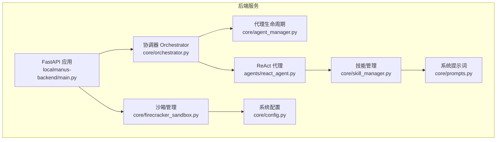
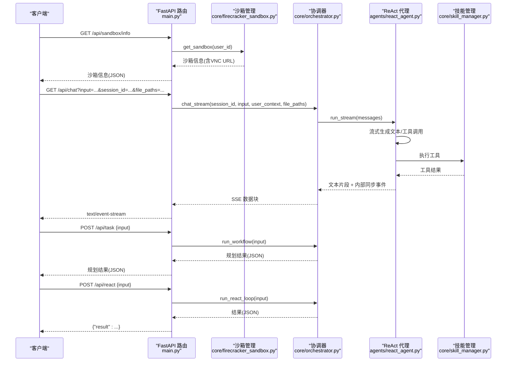
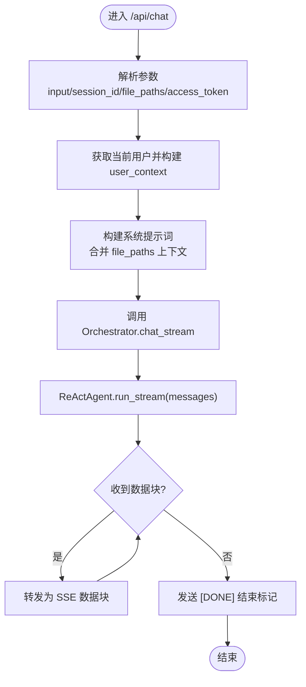
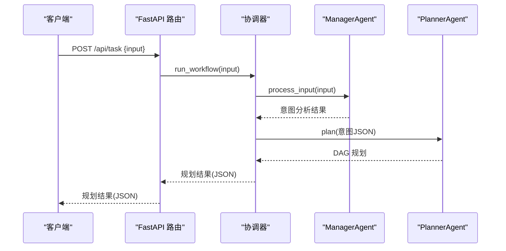
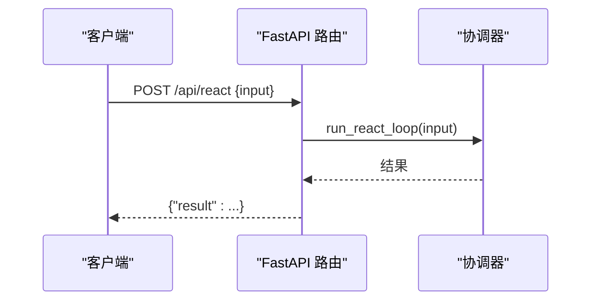
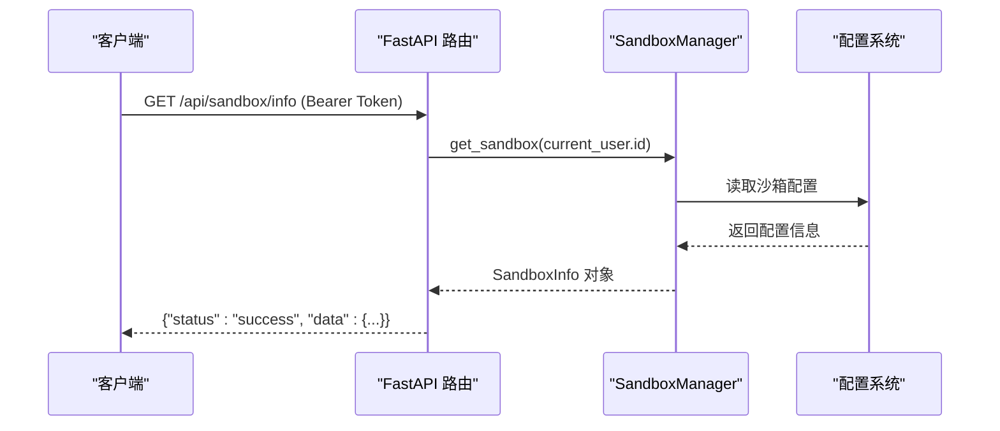
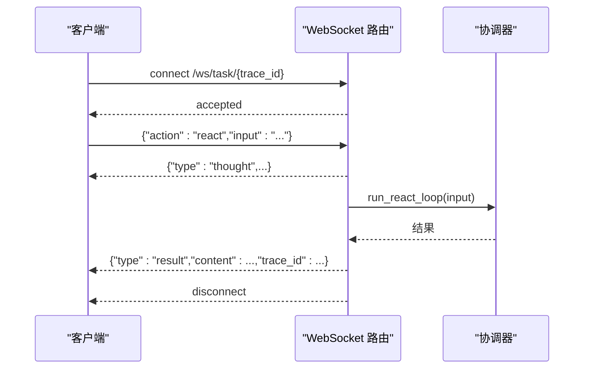
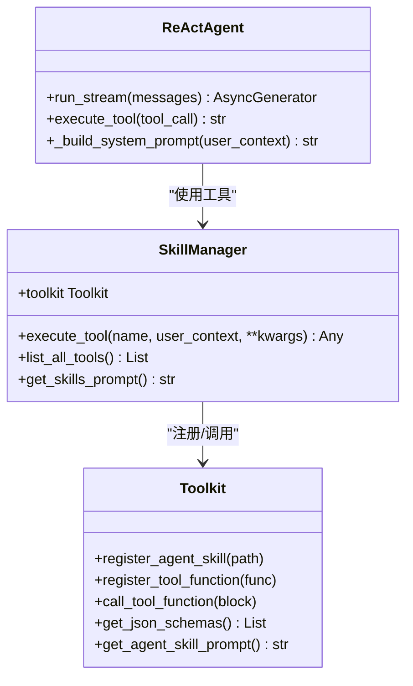
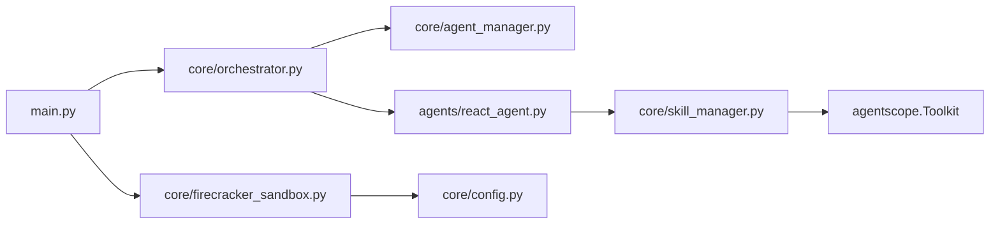

# AI 聊天与任务端点

<cite>
**本文引用的文件**
- [main.py](file://localmanus-backend/main.py)
- [orchestrator.py](file://localmanus-backend/core/orchestrator.py)
- [agent_manager.py](file://localmanus-backend/core/agent_manager.py)
- [react_agent.py](file://localmanus-backend/agents/react_agent.py)
- [skill_manager.py](file://localmanus-backend/core/skill_manager.py)
- [prompts.py](file://localmanus-backend/core/prompts.py)
- [firecracker_sandbox.py](file://localmanus-backend/core/firecracker_sandbox.py)
- [config.py](file://localmanus-backend/core/config.py)
- [requirements.txt](file://localmanus-backend/requirements.txt)
- [skills/README.md](file://localmanus-backend/skills/README.md)
- [skills/file-operations/SKILL.md](file://localmanus-backend/skills/file-operations/SKILL.md)
- [VNCPreview.tsx](file://localmanus-ui/app/components/VNCPreview.tsx)
- [api.ts](file://localmanus-ui/app/utils/api.ts)
</cite>

## 目录
1. [简介](#简介)
2. [项目结构](#项目结构)
3. [核心组件](#核心组件)
4. [架构总览](#架构总览)
5. [详细组件分析](#详细组件分析)
6. [依赖关系分析](#依赖关系分析)
7. [性能考虑](#性能考虑)
8. [故障排查指南](#故障排查指南)
9. [结论](#结论)
10. [附录](#附录)

## 简介
本文件面向 LocalManus 后端的 AI 聊天与任务 API 端点，提供对以下接口的完整技术文档：
- SSE 聊天端点：/api/chat
- 任务规划端点：/api/task
- ReAct 执行端点：/api/react
- 沙箱信息端点：/api/sandbox/info
- WebSocket 实时任务流：/ws/task/{trace_id}

内容涵盖 HTTP 方法、请求参数、响应格式、流式传输机制、WebSocket 实时通信、聊天上下文管理、文件路径处理、会话状态维护、错误处理策略，并给出前端实时消息处理示例、多轮对话管理、性能优化建议与调试工具使用指南。

## 项目结构
后端采用 FastAPI 框架，核心模块包括：
- 应用入口与路由：localmanus-backend/main.py
- 协调器：localmanus-backend/core/orchestrator.py
- 代理生命周期与模型配置：localmanus-backend/core/agent_manager.py
- ReAct 代理实现：localmanus-backend/agents/react_agent.py
- 技能管理与工具注册：localmanus-backend/core/skill_manager.py
- 系统提示词模板：localmanus-backend/core/prompts.py
- 沙箱管理：localmanus-backend/core/firecracker_sandbox.py
- 系统配置：localmanus-backend/core/config.py
- 技能开发规范与样例：localmanus-backend/skills/README.md、localmanus-backend/skills/file-operations/SKILL.md
- 依赖声明：localmanus-backend/requirements.txt

**图表来源**
- [main.py](file://localmanus-backend/main.py#L34-L477)
- [orchestrator.py](file://localmanus-backend/core/orchestrator.py#L11-L150)
- [agent_manager.py](file://localmanus-backend/core/agent_manager.py#L11-L49)
- [react_agent.py](file://localmanus-backend/agents/react_agent.py#L20-L349)
- [skill_manager.py](file://localmanus-backend/core/skill_manager.py#L18-L143)
- [prompts.py](file://localmanus-backend/core/prompts.py#L1-L75)
- [firecracker_sandbox.py](file://localmanus-backend/core/firecracker_sandbox.py#L1-L312)
- [config.py](file://localmanus-backend/core/config.py#L1-L27)

**章节来源**
- [main.py](file://localmanus-backend/main.py#L34-L477)
- [requirements.txt](file://localmanus-backend/requirements.txt#L1-L14)

## 核心组件
- FastAPI 应用与路由
  - 提供健康检查、认证、文件上传/下载/删除、项目管理、技能管理、设置管理等通用端点
  - 关键聊天与任务端点由协调器 Orchestrator 统一调度
  - 新增沙箱信息端点 /api/sandbox/info，提供 VNC URL 动态检索功能
- 协调器 Orchestrator
  - 维护会话历史 sessions，支持多轮对话
  - 将用户输入与系统提示词、文件路径上下文组合，驱动 ReAct 流式执行
  - 输出符合 SSE 协议的数据块
- 代理生命周期 AgentLifecycleManager
  - 初始化 AgentScope 模型、格式化器、内存与技能管理器
  - 提供 ManagerAgent、PlannerAgent、ReActAgent 实例
- ReAct 代理 ReActAgent
  - 基于 AgentScope 原生 ReActAgent，支持真实流式输出
  - 自动提取工具调用，执行工具并回写上下文
  - 支持内部协议事件（同步、元数据）
- 技能管理 SkillManager
  - 自动扫描 skills 目录，注册文件型工具函数与目录型 AgentSkill
  - 通过 Toolkit 暴露工具给 ReActAgent 使用
- 沙箱管理 SandboxManager
  - 支持本地模式（连接现有沙箱）和在线模式（Docker 容器）
  - 动态生成 VNC URL 和 VSCode URL
  - 提供沙箱环境信息查询和资源管理
- 系统提示词 Prompts
  - 定义 Manager、Planner、ReAct 的系统提示词模板

**章节来源**
- [main.py](file://localmanus-backend/main.py#L34-L477)
- [orchestrator.py](file://localmanus-backend/core/orchestrator.py#L11-L150)
- [agent_manager.py](file://localmanus-backend/core/agent_manager.py#L11-L49)
- [react_agent.py](file://localmanus-backend/agents/react_agent.py#L20-L349)
- [skill_manager.py](file://localmanus-backend/core/skill_manager.py#L18-L143)
- [firecracker_sandbox.py](file://localmanus-backend/core/firecracker_sandbox.py#L121-L251)
- [prompts.py](file://localmanus-backend/core/prompts.py#L1-L75)

## 架构总览
下图展示从客户端到后端各组件的交互流程，重点体现 SSE 聊天、任务规划、ReAct 执行以及沙箱信息获取的协作关系。

**图表来源**
- [main.py](file://localmanus-backend/main.py#L475-L514)
- [firecracker_sandbox.py](file://localmanus-backend/core/firecracker_sandbox.py#L223-L251)
- [orchestrator.py](file://localmanus-backend/core/orchestrator.py#L16-L129)
- [react_agent.py](file://localmanus-backend/agents/react_agent.py#L53-L215)
- [skill_manager.py](file://localmanus-backend/core/skill_manager.py#L90-L134)

## 详细组件分析

### SSE 聊天端点 /api/chat
- HTTP 方法与路由
  - 方法：GET
  - 路径：/api/chat
- 请求参数
  - input: 用户输入文本（必需）
  - session_id: 会话标识符，默认值为 "default"
  - file_paths: 逗号分隔的文件路径字符串（可选）
  - access_token: 查询参数（用于支持 SSE 的访问令牌，可选）
- 认证与上下文
  - 依赖当前登录用户，注入 user_context 包含 id、username、full_name
  - 解析 file_paths 为列表，作为系统提示词的一部分
- 响应格式（SSE）
  - 媒体类型：text/event-stream
  - 数据块：每条 data: 后跟 JSON 对象，包含 content 或内部协议字段
  - 结束标记：data: [DONE]
- 流式传输机制
  - 通过 StreamingResponse 返回异步生成器
  - ReActAgent.run_stream 提供真实流式输出，逐字/逐令牌推送
  - 协调器在内部协议中同步消息至会话历史，不暴露给前端
- 错误处理
  - 达到最大对话轮次限制时返回错误消息
  - 异常捕获并以 JSON 形式的 content 字段返回
- 多轮对话与上下文
  - 会话按 session_id 维护，最多 40 轮
  - 历史消息转换为 Msg 对象，系统提示词动态构建
- 文件路径处理
  - 将 file_paths 追加到系统提示词，提示使用 read_user_file 工具读取

**图表来源**
- [main.py](file://localmanus-backend/main.py#L392-L421)
- [orchestrator.py](file://localmanus-backend/core/orchestrator.py#L16-L96)
- [react_agent.py](file://localmanus-backend/agents/react_agent.py#L53-L215)

**章节来源**
- [main.py](file://localmanus-backend/main.py#L392-L421)
- [orchestrator.py](file://localmanus-backend/core/orchestrator.py#L16-L96)

### 任务规划端点 /api/task
- HTTP 方法与路由
  - 方法：POST
  - 路径：/api/task
- 请求体
  - JSON 对象，包含 input 字段
- 处理流程
  - 协调器调用 run_workflow，依次经 ManagerAgent 与 PlannerAgent
  - 生成带 trace_id 的任务计划（DAG），返回给客户端
- 响应格式
  - JSON 对象，包含规划信息与 trace_id

**图表来源**
- [main.py](file://localmanus-backend/main.py#L422-L429)
- [orchestrator.py](file://localmanus-backend/core/orchestrator.py#L97-L129)

**章节来源**
- [main.py](file://localmanus-backend/main.py#L422-L429)
- [orchestrator.py](file://localmanus-backend/core/orchestrator.py#L97-L129)

### ReAct 执行端点 /api/react
- HTTP 方法与路由
  - 方法：POST
  - 路径：/api/react
- 请求体
  - JSON 对象，包含 input 字段
- 处理流程
  - 协调器调用 run_react_loop（基于现有实现，返回结构化结果）
  - 返回 {"result": ...}
- 响应格式
  - JSON 对象，包含 result 字段

**图表来源**
- [main.py](file://localmanus-backend/main.py#L431-L438)
- [orchestrator.py](file://localmanus-backend/core/orchestrator.py#L129-L129)

**章节来源**
- [main.py](file://localmanus-backend/main.py#L431-L438)
- [orchestrator.py](file://localmanus-backend/core/orchestrator.py#L129-L129)

### 沙箱信息端点 /api/sandbox/info
- HTTP 方法与路由
  - 方法：GET
  - 路径：/api/sandbox/info
- 认证要求
  - 需要有效的访问令牌（Authorization: Bearer token）
- 响应格式
  - JSON 对象，包含状态和数据字段
  - 数据字段包含：sandbox_id、base_url、vnc_url、vscode_url、mode、home_dir
- 功能说明
  - 返回当前用户的沙箱详细信息
  - 包含 VNC 浏览器访问 URL，用于前端实时预览
  - 包含 VSCode Server URL，用于远程开发
  - 包含沙箱模式（local 或 online）
  - 包含用户家目录路径
- 错误处理
  - 沙箱信息获取失败时返回 500 错误
  - 记录详细的错误日志便于调试

**图表来源**
- [main.py](file://localmanus-backend/main.py#L475-L514)
- [firecracker_sandbox.py](file://localmanus-backend/core/firecracker_sandbox.py#L223-L251)
- [config.py](file://localmanus-backend/core/config.py#L23-L27)

**章节来源**
- [main.py](file://localmanus-backend/main.py#L475-L514)
- [firecracker_sandbox.py](file://localmanus-backend/core/firecracker_sandbox.py#L223-L251)
- [config.py](file://localmanus-backend/core/config.py#L23-L27)

### WebSocket 实时任务流 /ws/task/{trace_id}
- 协议与路由
  - WebSocket：/ws/task/{trace_id}
  - 支持 action=start 与 action=react
- 行为说明
  - 接受连接后等待客户端消息
  - 当 action=react 时，模拟 ReAct 思考阶段并向前端发送中间内容
  - 调用协调器执行 run_react_loop 并发送最终结果
- 断开处理
  - 捕获 WebSocketDisconnect，记录断开日志

**图表来源**
- [main.py](file://localmanus-backend/main.py#L440-L473)

**章节来源**
- [main.py](file://localmanus-backend/main.py#L440-L473)

### ReAct 代理与工具系统
- ReActAgent.run_stream
  - 优先尝试直接从模型流式获取响应，否则回退到完整响应字符级流式
  - 从流式块中提取工具调用，避免二次解析
  - 执行工具并把观察结果写入上下文，随后发出元数据与同步事件
- 技能管理 SkillManager
  - 自动扫描 skills 目录，注册两类技能：
    - 目录型 AgentSkill（含 SKILL.md）
    - 文件型工具函数（.py）
  - 通过 Toolkit 暴露工具，ReActAgent 可直接调用
- 系统提示词
  - 动态注入当前时间、用户信息、可用工具元数据与技能提示

**图表来源**
- [react_agent.py](file://localmanus-backend/agents/react_agent.py#L20-L349)
- [skill_manager.py](file://localmanus-backend/core/skill_manager.py#L18-L143)

**章节来源**
- [react_agent.py](file://localmanus-backend/agents/react_agent.py#L53-L215)
- [skill_manager.py](file://localmanus-backend/core/skill_manager.py#L29-L134)
- [prompts.py](file://localmanus-backend/core/prompts.py#L54-L75)

### 沙箱管理与 VNC URL 动态检索
- 沙箱模式支持
  - 本地模式：连接现有沙箱实例，使用固定 VNC URL
  - 在线模式：按需启动 Docker 容器，动态分配端口
- VNC URL 生成规则
  - 本地模式：`{local_url}/vnc/index.html?autoconnect=true`
  - 在线模式：`{base_url}/vnc/index.html?autoconnect=true`
- 前端适配机制
  - 生产环境和特定端口使用代理路径 `/vnc/index.html?autoconnect=true`
  - 其他环境使用直接的沙箱 VNC URL
- 沙箱信息结构
  - SandboxInfo 数据类包含所有必要的沙箱属性
  - 支持沙箱清理和资源管理

**章节来源**
- [firecracker_sandbox.py](file://localmanus-backend/core/firecracker_sandbox.py#L15-L30)
- [firecracker_sandbox.py](file://localmanus-backend/core/firecracker_sandbox.py#L223-L251)
- [VNCPreview.tsx](file://localmanus-ui/app/components/VNCPreview.tsx#L39-L51)

## 依赖关系分析
- 组件耦合
  - main.py 仅负责路由与依赖注入，业务逻辑集中在 Orchestrator
  - Orchestrator 依赖 AgentLifecycleManager 获取代理实例
  - ReActAgent 依赖 SkillManager 的 Toolkit
  - SkillManager 依赖 agentscope.Toolkit 注册与调用工具
  - main.py 依赖 SandboxManager 提供沙箱信息
- 外部依赖
  - FastAPI、Uvicorn、AgentScope、Python-dotenv、SQLModel 等
- 潜在循环依赖
  - 未发现直接循环导入；模块职责清晰

**图表来源**
- [main.py](file://localmanus-backend/main.py#L34-L477)
- [orchestrator.py](file://localmanus-backend/core/orchestrator.py#L11-L150)
- [agent_manager.py](file://localmanus-backend/core/agent_manager.py#L11-L49)
- [react_agent.py](file://localmanus-backend/agents/react_agent.py#L20-L349)
- [skill_manager.py](file://localmanus-backend/core/skill_manager.py#L18-L143)
- [firecracker_sandbox.py](file://localmanus-backend/core/firecracker_sandbox.py#L121-L251)
- [config.py](file://localmanus-backend/core/config.py#L1-L27)

**章节来源**
- [requirements.txt](file://localmanus-backend/requirements.txt#L1-L14)

## 性能考虑
- 流式传输优化
  - ReActAgent 优先使用模型原生流式输出，减少延迟
  - 字符级流式回退仍优于整包批量返回
- 工具调用检测
  - 从流式块中提取工具调用，避免二次解析，降低开销
- 会话限制
  - 最大对话轮次限制为 40，防止历史过长导致性能下降
- 并发与让出
  - 在流式循环中适时让出事件循环，提升并发友好性
- 沙箱资源管理
  - 在线模式下按需启动容器，避免资源浪费
  - 提供沙箱清理机制，释放不再使用的资源
- 建议
  - 控制单次输入长度与文件路径数量
  - 合理拆分复杂任务，利用 /api/task 生成 DAG 分步执行
  - 对工具调用结果进行缓存或去重
  - 在生产环境中合理配置沙箱模式

## 故障排查指南
- SSE 聊天无输出
  - 检查 /api/chat 是否正确传入 input 与 access_token（如需）
  - 确认用户已登录，且 session_id 一致
  - 查看后端日志中的错误消息（会被包装为 content 字段）
- WebSocket 断开
  - 检查客户端是否发送正确的 action 与 input
  - 确认 trace_id 与连接一致
- 工具调用失败
  - 检查技能目录结构与 SKILL.md 是否正确
  - 确认工具函数签名与参数匹配
  - 查看工具执行日志与异常栈
- 任务规划未返回
  - 确认 /api/task 的 input 是否包含足够上下文
  - 检查 ManagerAgent 与 PlannerAgent 的响应是否包含有效 JSON
- 沙箱信息获取失败
  - 检查 /api/sandbox/info 的访问令牌是否有效
  - 确认沙箱服务是否正常运行
  - 查看沙箱模式配置（SANDBOX_MODE、SANDBOX_LOCAL_URL）
  - 检查网络连接和防火墙设置
- VNC 预览无法连接
  - 检查前端是否正确处理沙箱信息响应格式
  - 确认 VNC 服务是否在沙箱中正常运行
  - 验证代理配置（nginx）是否正确设置
- 性能问题
  - 减少单次输入长度与工具调用次数
  - 合理使用 /api/task 生成 DAG，避免一次性复杂 ReAct 循环
  - 优化沙箱资源配置，避免过多并发容器

**章节来源**
- [main.py](file://localmanus-backend/main.py#L392-L473)
- [orchestrator.py](file://localmanus-backend/core/orchestrator.py#L34-L96)
- [react_agent.py](file://localmanus-backend/agents/react_agent.py#L148-L210)
- [skill_manager.py](file://localmanus-backend/core/skill_manager.py#L90-L134)
- [firecracker_sandbox.py](file://localmanus-backend/core/firecracker_sandbox.py#L145-L154)
- [VNCPreview.tsx](file://localmanus-ui/app/components/VNCPreview.tsx#L56-L64)

## 结论
LocalManus 的聊天与任务端点通过 FastAPI 与 AgentScope 生态实现，具备完善的流式传输、工具集成与会话管理能力。SSE 聊天端点提供近实时的多轮对话体验，任务规划端点生成可执行的 DAG，ReAct 执行端点结合工具链完成复杂任务。新增的沙箱信息端点 /api/sandbox/info 提供了 VNC URL 的动态检索功能，配合前端 VNC 预览组件实现了完整的沙盒浏览器实时预览体验。WebSocket 实时流可满足前端交互需求。建议在生产环境中关注会话轮次限制、工具调用幂等与缓存策略、沙箱资源管理和网络代理配置，以获得更稳定的性能表现。

## 附录

### API 定义概览
- GET /api/chat
  - 查询参数：input、session_id、file_paths、access_token
  - 响应：text/event-stream，逐块 JSON
- POST /api/task
  - 请求体：{ input }
  - 响应：JSON 规划结果（含 trace_id）
- POST /api/react
  - 请求体：{ input }
  - 响应：{"result": ...}
- GET /api/sandbox/info
  - 认证：Bearer Token
  - 响应：JSON 沙箱信息（含 vnc_url、vscode_url 等）
- WebSocket /ws/task/{trace_id}
  - 消息：{"action":"react","input":"..."}，返回思考与结果消息

**章节来源**
- [main.py](file://localmanus-backend/main.py#L392-L438)
- [main.py](file://localmanus-backend/main.py#L440-L473)
- [main.py](file://localmanus-backend/main.py#L475-L514)

### 技能开发与注册
- 目录型技能
  - 在 skills/ 下创建目录并编写 SKILL.md
  - 自动被 SkillManager 注册为 AgentSkill
- 文件型工具
  - 在 skills/ 下编写 .py 文件，导出带文档字符串的函数或继承 BaseSkill 的类方法
  - 自动被注册为工具函数
- 示例参考
  - skills/README.md 与 skills/file-operations/SKILL.md

**章节来源**
- [skills/README.md](file://localmanus-backend/skills/README.md#L1-L122)
- [skills/file-operations/SKILL.md](file://localmanus-backend/skills/file-operations/SKILL.md#L1-L28)
- [skill_manager.py](file://localmanus-backend/core/skill_manager.py#L29-L88)

### 沙箱配置与部署
- 沙箱模式配置
  - SANDBOX_MODE: local 或 online
  - SANDBOX_LOCAL_URL: 本地沙箱地址（默认：http://192.168.126.133:8080）
  - USE_CHINA_MIRROR: 是否使用中国镜像
- 部署注意事项
  - 本地模式：确保本地沙箱服务正常运行
  - 在线模式：确保 Docker 服务可用，网络端口可访问
  - VNC 代理：配置 nginx 将 /vnc/ 路径代理到沙箱 VNC 服务

**章节来源**
- [config.py](file://localmanus-backend/core/config.py#L23-L27)
- [firecracker_sandbox.py](file://localmanus-backend/core/firecracker_sandbox.py#L130-L144)
- [firecracker_sandbox.py](file://localmanus-backend/core/firecracker_sandbox.py#L155-L221)