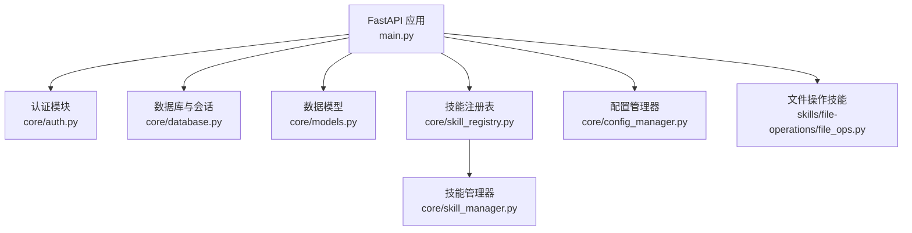
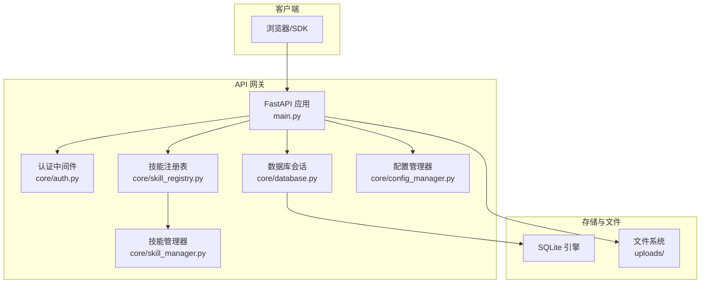
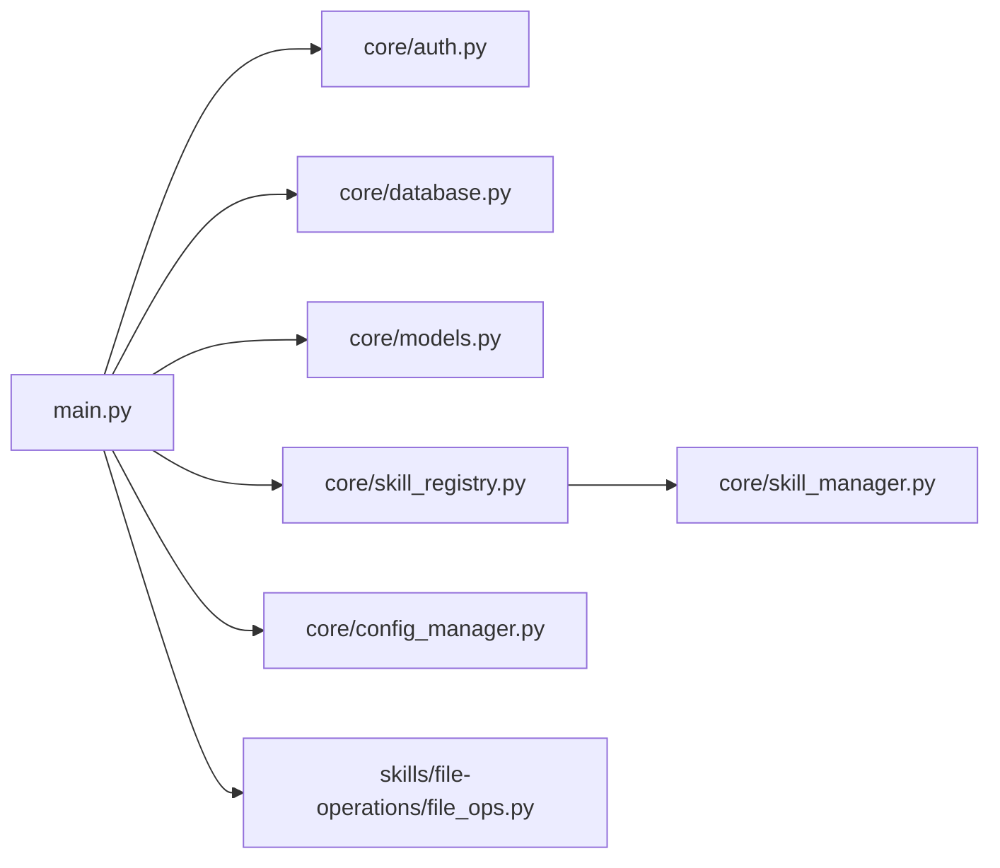

# HTTP API 端点

<cite>
**本文引用的文件**
- [main.py](file://localmanus-backend/main.py)
- [models.py](file://localmanus-backend/core/models.py)
- [auth.py](file://localmanus-backend/core/auth.py)
- [database.py](file://localmanus-backend/core/database.py)
- [config.py](file://localmanus-backend/core/config.py)
- [config_manager.py](file://localmanus-backend/core/config_manager.py)
- [skill_registry.py](file://localmanus-backend/core/skill_registry.py)
- [skill_manager.py](file://localmanus-backend/core/skill_manager.py)
- [file_ops.py](file://localmanus-backend/skills/file-operations/file_ops.py)
- [.env.example](file://localmanus-backend/.env.example)
- [requirements.txt](file://localmanus-backend/requirements.txt)
</cite>

## 目录
1. [简介](#简介)
2. [项目结构](#项目结构)
3. [核心组件](#核心组件)
4. [架构总览](#架构总览)
5. [详细组件分析](#详细组件分析)
6. [依赖关系分析](#依赖关系分析)
7. [性能考量](#性能考量)
8. [故障排查指南](#故障排查指南)
9. [结论](#结论)
10. [附录](#附录)

## 简介
本文件为 LocalManus 后端的 HTTP API 端点系统提供权威、可操作的接口文档。内容覆盖认证与用户管理、文件上传与管理、技能管理、项目管理以及系统设置等模块，逐项给出端点的 HTTP 方法、URL 模式、请求参数、响应格式与状态码说明，并解释认证机制、权限控制、错误处理策略。同时提供使用示例、SDK 集成建议、最佳实践与性能优化要点，帮助开发者与集成方快速、稳定地对接。

## 项目结构
后端采用 FastAPI 构建，核心入口位于 main.py，数据库与认证逻辑分别封装在 core 子模块中，技能系统通过 SkillRegistry 与 SkillManager 管理，文件操作技能位于 skills 子目录。

图表来源
- [main.py](file://localmanus-backend/main.py#L34-L40)
- [auth.py](file://localmanus-backend/core/auth.py#L1-L82)
- [database.py](file://localmanus-backend/core/database.py#L1-L17)
- [models.py](file://localmanus-backend/core/models.py#L1-L80)
- [skill_registry.py](file://localmanus-backend/core/skill_registry.py#L1-L156)
- [skill_manager.py](file://localmanus-backend/core/skill_manager.py#L1-L143)
- [file_ops.py](file://localmanus-backend/skills/file-operations/file_ops.py#L1-L165)

章节来源
- [main.py](file://localmanus-backend/main.py#L34-L40)
- [requirements.txt](file://localmanus-backend/requirements.txt#L1-L14)

## 核心组件
- 认证与权限
  - 基于 OAuth2 密码流的登录与令牌颁发，使用 Bearer Token 进行后续请求鉴权。
  - 通过依赖注入获取当前用户，未携带或无效令牌将返回 401。
- 数据模型
  - 用户、令牌、文件、项目等模型定义，用于请求/响应序列化与数据库映射。
- 技能系统
  - 通过 SkillRegistry 聚合并暴露技能元数据与配置；技能工具通过 SkillManager 注册到 Toolkit。
- 配置管理
  - 通过 ConfigManager 读取与更新 .env 中的系统配置键值，支持敏感键掩码传输。
- 文件系统
  - 上传文件保存在 uploads 目录下，按用户隔离；提供列表、下载、删除等操作。

章节来源
- [auth.py](file://localmanus-backend/core/auth.py#L12-L82)
- [models.py](file://localmanus-backend/core/models.py#L5-L80)
- [skill_registry.py](file://localmanus-backend/core/skill_registry.py#L12-L156)
- [skill_manager.py](file://localmanus-backend/core/skill_manager.py#L18-L143)
- [config_manager.py](file://localmanus-backend/core/config_manager.py#L6-L57)
- [main.py](file://localmanus-backend/main.py#L42-L50)

## 架构总览
下图展示 API 网关与核心模块的交互关系，以及关键数据流。

图表来源
- [main.py](file://localmanus-backend/main.py#L34-L40)
- [auth.py](file://localmanus-backend/core/auth.py#L55-L82)
- [database.py](file://localmanus-backend/core/database.py#L11-L17)
- [skill_registry.py](file://localmanus-backend/core/skill_registry.py#L15-L17)
- [skill_manager.py](file://localmanus-backend/core/skill_manager.py#L23-L27)
- [config_manager.py](file://localmanus-backend/core/config_manager.py#L9-L13)

## 详细组件分析

### 认证与用户管理
- 登录 /api/login
  - 方法与路径: POST /api/login
  - 认证方式: OAuth2 密码流（表单字段）
  - 请求体: 表单字段 username、password
  - 成功响应: 返回 access_token 与 token_type
  - 失败响应: 401 未授权，WWW-Authenticate: Bearer
  - 说明: 成功后生成带过期时间的 JWT，用于后续 Bearer 认证
- 注册 /api/register
  - 方法与路径: POST /api/register
  - 请求体: JSON 对象，字段见 UserCreate
  - 成功响应: 返回 UserRead
  - 失败响应: 400 用户名已存在
- 当前用户 /api/me
  - 方法与路径: GET /api/me
  - 认证: Bearer Token
  - 成功响应: 返回 UserRead
  - 失败响应: 401 未验证凭据

章节来源
- [main.py](file://localmanus-backend/main.py#L74-L110)
- [auth.py](file://localmanus-backend/core/auth.py#L47-L82)
- [models.py](file://localmanus-backend/core/models.py#L15-L28)

### 文件管理
- 上传文件 /api/upload
  - 方法与路径: POST /api/upload
  - 认证: Bearer Token
  - 请求体: multipart/form-data，字段 file
  - 成功响应: 返回 FileRead
  - 失败响应: 500 服务器错误（上传失败）
  - 说明: 文件保存在 uploads/<user_id>/ 下，唯一文件名生成，记录数据库条目
- 文件列表 /api/files
  - 方法与路径: GET /api/files
  - 认证: Bearer Token
  - 成功响应: 返回 FileRead 数组
- 下载文件 /api/files/{file_id}
  - 方法与路径: GET /api/files/{file_id}
  - 认证: Bearer Token
  - 成功响应: 返回文件流（FileResponse）
  - 失败响应: 404 文件不存在（数据库或磁盘）
- 删除文件 /api/files/{file_id}
  - 方法与路径: DELETE /api/files/{file_id}
  - 认证: Bearer Token
  - 成功响应: 返回成功消息
  - 失败响应: 404 文件不存在

章节来源
- [main.py](file://localmanus-backend/main.py#L112-L215)
- [models.py](file://localmanus-backend/core/models.py#L29-L47)

### 技能管理
- 获取技能清单 /api/skills
  - 方法与路径: GET /api/skills
  - 认证: Bearer Token
  - 成功响应: 返回技能数组（包含 id、name、category、description、icon、enabled、tools、config）
  - 失败响应: 500 服务器错误
- 获取技能详情 /api/skills/{skill_id}
  - 方法与路径: GET /api/skills/{skill_id}
  - 认证: Bearer Token
  - 成功响应: 返回指定技能详情
  - 失败响应: 404 技能不存在
- 更新技能配置 /api/skills/{skill_id}/config
  - 方法与路径: PUT /api/skills/{skill_id}/config
  - 认证: Bearer Token
  - 请求体: JSON 对象（任意键值）
  - 成功响应: 返回成功消息
  - 失败响应: 500 保存失败
- 更新技能启用状态 /api/skills/{skill_id}/status
  - 方法与路径: PUT /api/skills/{skill_id}/status
  - 认证: Bearer Token
  - 请求体: JSON 对象，字段 enabled: boolean
  - 成功响应: 返回成功消息与当前 enabled 状态
  - 失败响应: 500 更新失败

章节来源
- [main.py](file://localmanus-backend/main.py#L223-L267)
- [skill_registry.py](file://localmanus-backend/core/skill_registry.py#L19-L59)
- [skill_registry.py](file://localmanus-backend/core/skill_registry.py#L129-L155)

### 项目管理
- 获取项目列表 /api/projects
  - 方法与路径: GET /api/projects
  - 认证: Bearer Token
  - 成功响应: 返回 ProjectRead 数组
- 创建项目 /api/projects
  - 方法与路径: POST /api/projects
  - 认证: Bearer Token
  - 请求体: ProjectCreate（name 必填，description/color/icon 可选）
  - 成功响应: 返回 ProjectRead
- 获取项目详情 /api/projects/{project_id}
  - 方法与路径: GET /api/projects/{project_id}
  - 认证: Bearer Token
  - 成功响应: 返回 ProjectRead
  - 失败响应: 404 项目不存在
- 更新项目 /api/projects/{project_id}
  - 方法与路径: PUT /api/projects/{project_id}
  - 认证: Bearer Token
  - 请求体: ProjectUpdate（name/description/color/icon 可选）
  - 成功响应: 返回 ProjectRead
  - 失败响应: 404 项目不存在
- 删除项目 /api/projects/{project_id}
  - 方法与路径: DELETE /api/projects/{project_id}
  - 认证: Bearer Token
  - 成功响应: 返回成功消息
  - 失败响应: 404 项目不存在

章节来源
- [main.py](file://localmanus-backend/main.py#L289-L390)
- [models.py](file://localmanus-backend/core/models.py#L49-L80)

### 设置管理
- 获取设置 /api/settings
  - 方法与路径: GET /api/settings
  - 认证: Bearer Token
  - 成功响应: 返回包含 MODEL_NAME、OPENAI_API_KEY（掩码）、OPENAI_API_BASE、AGENT_MEMORY_LIMIT、UPLOAD_SIZE_LIMIT 的对象
- 更新设置 /api/settings
  - 方法与路径: PUT /api/settings
  - 认证: Bearer Token
  - 请求体: JSON 对象，允许键: MODEL_NAME、OPENAI_API_KEY、OPENAI_API_BASE、AGENT_MEMORY_LIMIT、UPLOAD_SIZE_LIMIT
  - 成功响应: 返回成功消息
  - 失败响应: 500 保存失败（仅允许白名单键）

章节来源
- [main.py](file://localmanus-backend/main.py#L271-L285)
- [config_manager.py](file://localmanus-backend/core/config_manager.py#L15-L50)
- [.env.example](file://localmanus-backend/.env.example#L1-L4)

### 辅助端点
- 健康检查 /api/health
  - 方法与路径: GET /api/health
  - 认证: 无需
  - 成功响应: 返回服务状态、版本与时戳
- 根路径 /
  - 方法与路径: GET /
  - 认证: 无需
  - 成功响应: 返回服务状态与版本

章节来源
- [main.py](file://localmanus-backend/main.py#L65-L72)
- [main.py](file://localmanus-backend/main.py#L217-L219)

## 依赖关系分析
- 认证与权限
  - 依赖 OAuth2PasswordBearer 与 JWT 解析，校验失败统一抛出 401
- 数据模型与数据库
  - 使用 SQLModel 与 SQLite，依赖 get_session 提供的 Session
- 技能系统
  - SkillRegistry 依赖 SkillManager 的 Toolkit，动态聚合工具函数与 AgentSkill
- 文件系统
  - 上传目录按用户隔离，删除时同步清理磁盘与数据库记录

图表来源
- [main.py](file://localmanus-backend/main.py#L1-L25)
- [auth.py](file://localmanus-backend/core/auth.py#L1-L18)
- [database.py](file://localmanus-backend/core/database.py#L1-L17)
- [models.py](file://localmanus-backend/core/models.py#L1-L4)
- [skill_registry.py](file://localmanus-backend/core/skill_registry.py#L9-L17)
- [skill_manager.py](file://localmanus-backend/core/skill_manager.py#L6-L27)
- [config_manager.py](file://localmanus-backend/core/config_manager.py#L4-L13)
- [file_ops.py](file://localmanus-backend/skills/file-operations/file_ops.py#L4-L6)

章节来源
- [main.py](file://localmanus-backend/main.py#L1-L25)
- [auth.py](file://localmanus-backend/core/auth.py#L1-L18)
- [database.py](file://localmanus-backend/core/database.py#L1-L17)
- [models.py](file://localmanus-backend/core/models.py#L1-L4)
- [skill_registry.py](file://localmanus-backend/core/skill_registry.py#L9-L17)
- [skill_manager.py](file://localmanus-backend/core/skill_manager.py#L6-L27)
- [config_manager.py](file://localmanus-backend/core/config_manager.py#L4-L13)
- [file_ops.py](file://localmanus-backend/skills/file-operations/file_ops.py#L4-L6)

## 性能考量
- 上传性能
  - 采用流式写入，避免一次性加载大文件到内存
  - 建议前端限制单次上传大小，结合设置中的 UPLOAD_SIZE_LIMIT
- 数据库访问
  - 使用依赖注入的 Session，减少连接开销
  - 查询按用户维度过滤，避免全表扫描
- 技能加载
  - 技能按需注册，避免启动时大量导入
  - 工具函数通过 Toolkit 聚合，减少重复扫描
- 缓存与并发
  - 建议在网关层引入缓存（如 Redis）缓存热门技能元数据
  - 对高频查询（如 /api/files）可增加索引或分页

[本节为通用性能建议，不直接分析具体文件]

## 故障排查指南
- 401 未授权
  - 检查 Authorization 头是否为 Bearer Token，且未过期
  - 确认 SECRET_KEY 与 ALGORITHM 配置一致
- 404 资源不存在
  - 文件/项目 ID 是否正确，是否属于当前用户
  - 磁盘上文件是否存在（删除后数据库未同步）
- 500 服务器错误
  - 上传失败：检查磁盘权限与磁盘空间
  - 技能配置保存失败：检查技能目录权限与 JSON 格式
  - 设置更新失败：确认键名在白名单内
- 日志定位
  - 后端使用 INFO 级别日志，关注上传、删除、技能配置等关键路径的日志输出

章节来源
- [auth.py](file://localmanus-backend/core/auth.py#L62-L82)
- [main.py](file://localmanus-backend/main.py#L149-L151)
- [main.py](file://localmanus-backend/main.py#L196-L215)
- [config_manager.py](file://localmanus-backend/core/config_manager.py#L25-L50)

## 结论
LocalManus 的 API 网关围绕用户、文件、技能、项目与设置五大领域构建，采用 OAuth2 + JWT 的标准认证模式，结合 SQLModel 与 SQLite 提供简洁稳定的后端支撑。技能系统通过 SkillRegistry 与 SkillManager 实现动态聚合与按需加载，适合扩展与演进。建议在生产环境中完善限流、缓存与可观测性，并严格遵循本文的使用示例与最佳实践。

[本节为总结性内容，不直接分析具体文件]

## 附录

### 认证机制与权限控制
- 登录后获得 access_token，后续请求在 Authorization 头中携带 Bearer Token
- 未提供或无效令牌将返回 401，且包含 WWW-Authenticate: Bearer
- 令牌过期时间可在配置中调整

章节来源
- [auth.py](file://localmanus-backend/core/auth.py#L13-L15)
- [auth.py](file://localmanus-backend/core/auth.py#L55-L82)
- [main.py](file://localmanus-backend/main.py#L92-L106)

### 错误处理与状态码
- 400: 注册用户名已存在
- 401: 凭据无效或缺失
- 404: 资源不存在（文件/项目）
- 500: 服务器内部错误（上传失败、技能配置保存失败、设置更新失败）

章节来源
- [main.py](file://localmanus-backend/main.py#L77-L78)
- [auth.py](file://localmanus-backend/core/auth.py#L62-L82)
- [main.py](file://localmanus-backend/main.py#L149-L151)
- [main.py](file://localmanus-backend/main.py#L229-L231)
- [main.py](file://localmanus-backend/main.py#L283-L284)

### API 使用示例（步骤说明）
- 获取访问令牌
  - POST /api/login
  - 表单字段: username、password
  - 成功后保存 access_token
- 使用令牌访问受保护端点
  - 在请求头添加 Authorization: Bearer <access_token>
  - 示例: GET /api/me、GET /api/files、PUT /api/settings
- 上传文件
  - POST /api/upload，multipart/form-data，字段 file
  - 成功后得到 FileRead，可用于后续下载/删除
- 技能管理
  - GET /api/skills 获取技能清单
  - PUT /api/skills/{skill_id}/status 更新启用状态
  - PUT /api/skills/{skill_id}/config 更新配置
- 项目管理
  - GET /api/projects 获取列表
  - POST /api/projects 创建项目
  - PUT /api/projects/{project_id} 更新项目
  - DELETE /api/projects/{project_id} 删除项目
- 设置管理
  - GET /api/settings 获取当前配置
  - PUT /api/settings 更新配置（仅允许白名单键）

章节来源
- [main.py](file://localmanus-backend/main.py#L74-L110)
- [main.py](file://localmanus-backend/main.py#L112-L215)
- [main.py](file://localmanus-backend/main.py#L223-L267)
- [main.py](file://localmanus-backend/main.py#L289-L390)
- [main.py](file://localmanus-backend/main.py#L271-L285)

### SDK 集成指南（建议）
- 语言选择
  - 前端推荐使用 fetch 或 axios；后端推荐使用 httpx
- 令牌管理
  - 将 access_token 存储在安全位置（如 HttpOnly Cookie 或加密存储），避免泄露
- 重试与退避
  - 对 5xx 与网络异常实施指数退避重试
- 超时与取消
  - 为长耗时操作（如上传、下载）设置合理超时与取消信号
- 健康检查
  - 定期调用 /api/health 以监控服务可用性

[本节为通用集成建议，不直接分析具体文件]

### 最佳实践
- 严格区分用户数据：所有文件与项目均按 user_id 过滤
- 上传安全：限制文件类型与大小，必要时进行病毒扫描
- 配置安全：敏感键（如 OPENAI_API_KEY）仅在后端可见，前端显示掩码
- 监控与日志：为关键路径添加结构化日志与指标埋点
- 版本化：在 URL 中体现 API 版本，便于平滑演进

[本节为通用最佳实践，不直接分析具体文件]