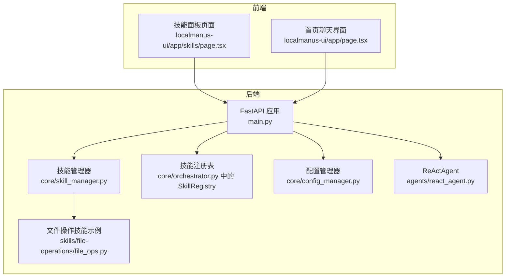
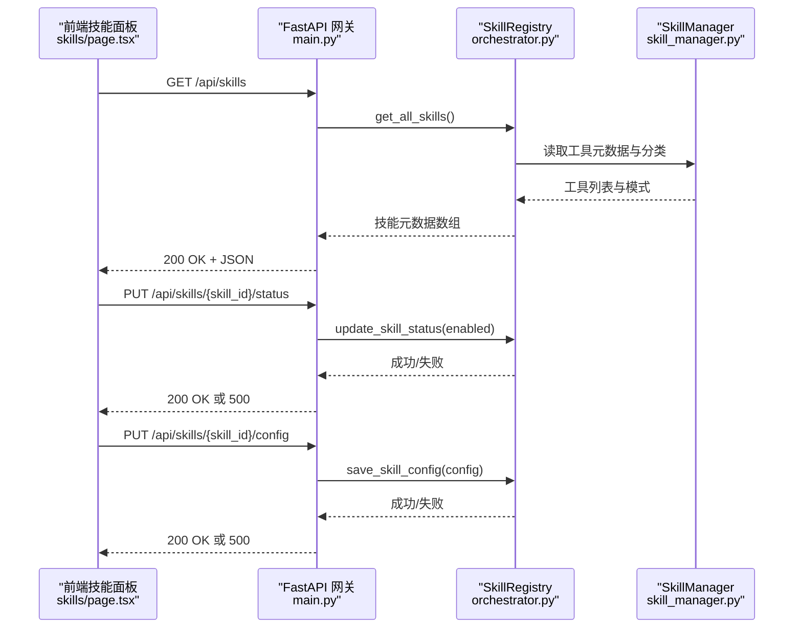
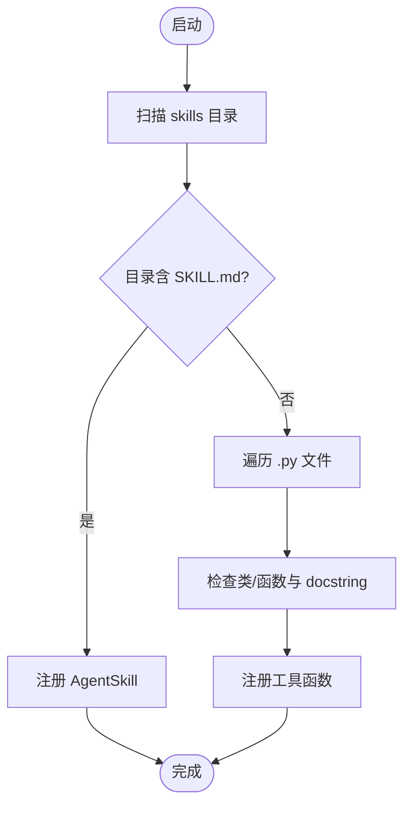
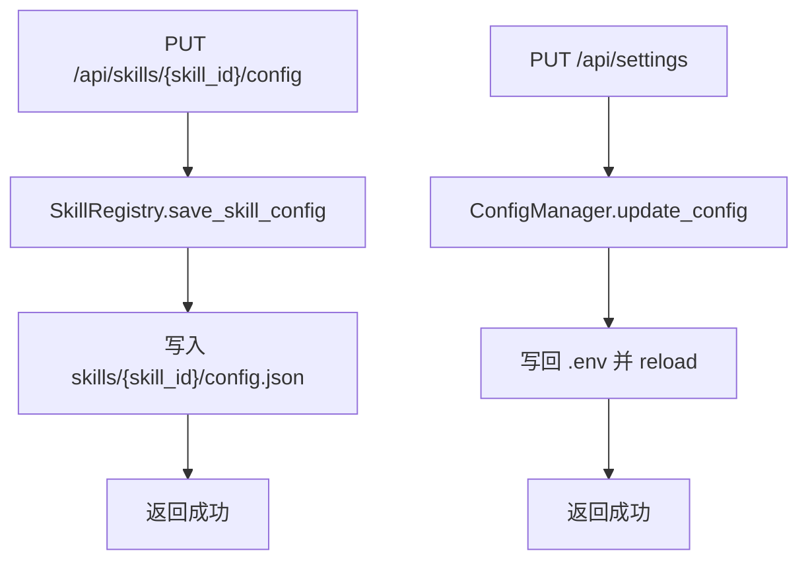
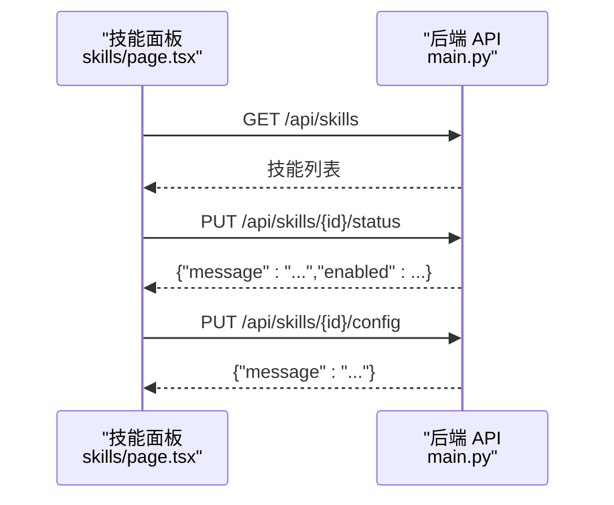
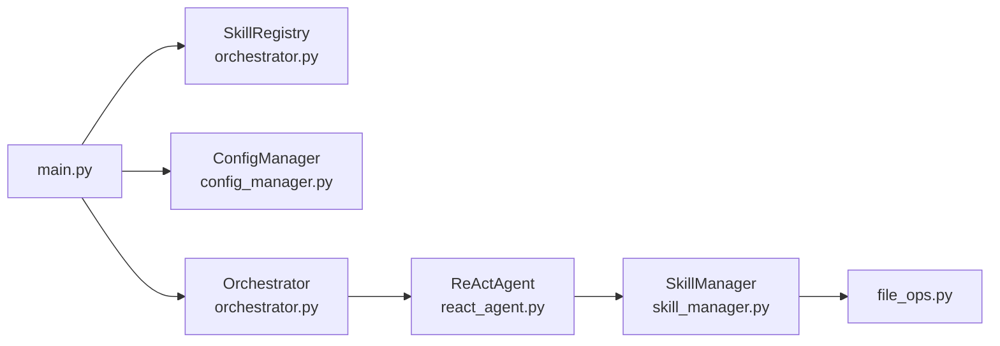

# 技能管理端点

<cite>
**本文引用的文件**
- [main.py](file://localmanus-backend/main.py)
- [skill_manager.py](file://localmanus-backend/core/skill_manager.py)
- [orchestrator.py](file://localmanus-backend/core/orchestrator.py)
- [file_ops.py](file://localmanus-backend/skills/file-operations/file_ops.py)
- [config_manager.py](file://localmanus-backend/core/config_manager.py)
- [react_agent.py](file://localmanus-backend/agents/react_agent.py)
- [requirements.txt](file://localmanus-backend/requirements.txt)
- [SKILL_LIBRARY_IMPLEMENTATION.md](file://SKILL_LIBRARY_IMPLEMENTATION.md)
- [localmanus_architecture.md](file://localmanus_architecture.md)
- [page.tsx](file://localmanus-ui/app/page.tsx)
- [skills/page.tsx](file://localmanus-ui/app/skills/page.tsx)
</cite>

## 目录
1. [简介](#简介)
2. [项目结构](#项目结构)
3. [核心组件](#核心组件)
4. [架构总览](#架构总览)
5. [详细组件分析](#详细组件分析)
6. [依赖关系分析](#依赖关系分析)
7. [性能考量](#性能考量)
8. [故障排查指南](#故障排查指南)
9. [结论](#结论)
10. [附录](#附录)

## 简介
本文件面向 LocalManus 的技能管理 API 端点，提供全面的技术文档，覆盖以下端点：
- 技能列表端点：GET /api/skills
- 技能详情端点：GET /api/skills/{skill_id}
- 技能配置更新端点：PUT /api/skills/{skill_id}/config
- 技能状态更新端点：PUT /api/skills/{skill_id}/status

文档内容包括：HTTP 方法、请求参数、响应格式、技能元数据结构、配置管理机制、技能注册表与动态加载机制、配置持久化与状态控制逻辑，并提供完整的技能管理示例、前端技能面板集成方式、自定义技能开发指南以及性能监控建议。

## 项目结构
后端采用 FastAPI 提供 API 网关，核心技能管理由 SkillManager 与 SkillRegistry 协同完成，前端 Next.js 提供技能面板界面。

**图表来源**
- [main.py](file://localmanus-backend/main.py#L34-L60)
- [skill_manager.py](file://localmanus-backend/core/skill_manager.py#L18-L28)
- [orchestrator.py](file://localmanus-backend/core/orchestrator.py#L130-L149)
- [react_agent.py](file://localmanus-backend/agents/react_agent.py#L20-L35)
- [file_ops.py](file://localmanus-backend/skills/file-operations/file_ops.py#L9-L25)
- [page.tsx](file://localmanus-ui/app/page.tsx#L1-L20)
- [skills/page.tsx](file://localmanus-ui/app/skills/page.tsx#L47-L81)

**章节来源**
- [main.py](file://localmanus-backend/main.py#L34-L60)
- [SKILL_LIBRARY_IMPLEMENTATION.md](file://SKILL_LIBRARY_IMPLEMENTATION.md#L1-L20)

## 核心组件
- FastAPI 应用与路由：负责技能管理相关端点的定义与鉴权依赖。
- SkillManager：扫描 skills 目录，动态加载技能，注册为 AgentScope 工具集。
- SkillRegistry：提供技能元数据、配置与状态管理接口。
- ReActAgent：在对话中根据系统提示与工具元数据执行工具调用。
- 配置管理器：管理 .env 配置的读取与更新。
- 前端技能面板：展示技能卡片、详情、配置与启用/禁用切换。

**章节来源**
- [main.py](file://localmanus-backend/main.py#L221-L268)
- [skill_manager.py](file://localmanus-backend/core/skill_manager.py#L18-L28)
- [orchestrator.py](file://localmanus-backend/core/orchestrator.py#L130-L149)
- [react_agent.py](file://localmanus-backend/agents/react_agent.py#L20-L35)
- [config_manager.py](file://localmanus-backend/core/config_manager.py#L6-L14)
- [SKILL_LIBRARY_IMPLEMENTATION.md](file://SKILL_LIBRARY_IMPLEMENTATION.md#L8-L23)

## 架构总览
技能管理端点与技能执行链路如下：

**图表来源**
- [main.py](file://localmanus-backend/main.py#L221-L268)
- [orchestrator.py](file://localmanus-backend/core/orchestrator.py#L130-L149)
- [skill_manager.py](file://localmanus-backend/core/skill_manager.py#L136-L142)

## 详细组件分析

### 技能列表端点：GET /api/skills
- HTTP 方法：GET
- 认证：依赖当前用户（依赖注入）
- 请求参数：无
- 响应格式：JSON 数组，元素为技能对象
- 返回内容：所有可用技能的元数据列表（含 id、name、category、description、icon、enabled、tools、config）

技能元数据结构（示例字段）
- id：字符串，唯一标识
- name：字符串，显示名称
- category：字符串，功能分组（如 search、file、generation、system、general）
- description：字符串，技能描述
- icon：字符串，图标名（Lucide React 名称）
- enabled：布尔值，是否启用
- tools：数组，工具清单（name、description、parameters、required）
- config：对象，技能配置（存储于 skills/{skill_id}/config.json）

实现要点
- 调用 SkillRegistry.get_all_skills() 获取技能元数据
- 若异常，记录日志并返回 500

**章节来源**
- [main.py](file://localmanus-backend/main.py#L221-L232)
- [SKILL_LIBRARY_IMPLEMENTATION.md](file://SKILL_LIBRARY_IMPLEMENTATION.md#L24-L48)

### 技能详情端点：GET /api/skills/{skill_id}
- HTTP 方法：GET
- 路径参数：skill_id（字符串）
- 认证：依赖当前用户
- 响应格式：JSON 对象，技能详细信息
- 行为：通过 SkillRegistry.get_skill_detail(skill_id) 查找并返回匹配技能

实现要点
- 若未找到技能，返回 404
- 否则返回技能详情对象（包含 tools 与 config）

**章节来源**
- [main.py](file://localmanus-backend/main.py#L233-L242)
- [orchestrator.py](file://localmanus-backend/core/orchestrator.py#L143-L149)

### 技能配置更新端点：PUT /api/skills/{skill_id}/config
- HTTP 方法：PUT
- 路径参数：skill_id（字符串）
- 请求体：JSON 对象，任意键值对（具体键取决于技能自身配置）
- 认证：依赖当前用户
- 响应格式：JSON 对象，包含 message 字段
- 行为：调用 SkillRegistry.save_skill_config(skill_id, config) 持久化配置

实现要点
- 配置持久化到 skills/{skill_id}/config.json
- 若保存失败，返回 500

**章节来源**
- [main.py](file://localmanus-backend/main.py#L244-L254)
- [orchestrator.py](file://localmanus-backend/core/orchestrator.py#L129-L142)

### 技能状态更新端点：PUT /api/skills/{skill_id}/status
- HTTP 方法：PUT
- 路径参数：skill_id（字符串）
- 请求体：JSON 对象，包含 enabled（布尔值，默认 true）
- 认证：依赖当前用户
- 响应格式：JSON 对象，包含 message 与 enabled
- 行为：调用 SkillRegistry.update_skill_status(skill_id, enabled) 更新启用状态

实现要点
- 通过读取并修改 config.json 中的 enabled 字段实现状态切换
- 若更新失败，返回 500

**章节来源**
- [main.py](file://localmanus-backend/main.py#L256-L267)
- [orchestrator.py](file://localmanus-backend/core/orchestrator.py#L151-L155)

### 技能注册表与动态加载机制
- 动态加载
  - SkillManager 扫描 skills 目录，支持两类技能来源：
    - 目录型技能：目录下存在 SKILL.md 的即视为 AgentSkill，使用 Toolkit.register_agent_skill 注册
    - 函数型技能：.py 文件中的函数与继承自 BaseSkill 的类方法，若带 docstring，则注册为工具函数
  - 加载时注入 user_context 与 user_id 参数（若签名匹配），便于按用户隔离与审计
- 元数据提取
  - 使用 Toolkit.get_json_schemas() 获取工具 JSON Schema，用于前端展示参数与必填项
  - 使用 Toolkit.get_agent_skill_prompt() 生成技能提示，注入到 ReActAgent 系统提示中
- 执行工具
  - SkillManager.execute_tool(tool_name, user_context, **kwargs) 支持异步生成器返回，聚合 ToolResponse 内容

**图表来源**
- [skill_manager.py](file://localmanus-backend/core/skill_manager.py#L29-L89)

**章节来源**
- [skill_manager.py](file://localmanus-backend/core/skill_manager.py#L18-L28)
- [skill_manager.py](file://localmanus-backend/core/skill_manager.py#L136-L142)
- [file_ops.py](file://localmanus-backend/skills/file-operations/file_ops.py#L9-L25)

### 配置管理机制与持久化
- 技能配置持久化
  - SkillRegistry.save_skill_config 将配置写入 skills/{skill_id}/config.json
- 系统设置持久化
  - ConfigManager.update_config 仅允许特定键更新，并通过 python-dotenv.set_key 写回 .env
  - get_config 返回当前环境变量的关键配置项（敏感键进行掩码）
- 环境变量加载
  - 启动时加载 .env，后续 update_config 会重新加载以生效

**图表来源**
- [orchestrator.py](file://localmanus-backend/core/orchestrator.py#L129-L142)
- [config_manager.py](file://localmanus-backend/core/config_manager.py#L25-L50)

**章节来源**
- [config_manager.py](file://localmanus-backend/core/config_manager.py#L6-L14)
- [config_manager.py](file://localmanus-backend/core/config_manager.py#L15-L23)
- [config_manager.py](file://localmanus-backend/core/config_manager.py#L25-L50)

### 状态控制逻辑
- 启用/禁用切换
  - 通过 update_skill_status 读取并修改 config.json 中的 enabled 字段
  - 前端点击切换后重新拉取 /api/skills 列表以刷新 UI
- 与执行链路的关系
  - ReActAgent 在构建系统提示时会注入可用工具元数据，禁用的技能不会出现在工具列表中
  - 因此，状态变更会影响后续对话中工具的可见性与可用性

**章节来源**
- [main.py](file://localmanus-backend/main.py#L256-L267)
- [orchestrator.py](file://localmanus-backend/core/orchestrator.py#L151-L155)
- [react_agent.py](file://localmanus-backend/agents/react_agent.py#L36-L51)

### 前端技能面板集成
- 页面入口
  - 技能面板路由：/skills
  - 通过 fetch 调用 /api/skills 获取技能列表
- 功能特性
  - 技能卡片：显示图标、名称、描述、启用状态
  - 搜索过滤：按名称与描述实时筛选
  - 详情弹窗：查看工具清单与参数 Schema
  - 配置弹窗：查看与编辑 config.json
  - 启用/禁用：点击切换状态，自动刷新列表
- 与后端交互
  - 列表：GET /api/skills
  - 状态：PUT /api/skills/{skill_id}/status
  - 配置：PUT /api/skills/{skill_id}/config

**图表来源**
- [skills/page.tsx](file://localmanus-ui/app/skills/page.tsx#L47-L81)
- [main.py](file://localmanus-backend/main.py#L221-L267)

**章节来源**
- [skills/page.tsx](file://localmanus-ui/app/skills/page.tsx#L47-L81)
- [SKILL_LIBRARY_IMPLEMENTATION.md](file://SKILL_LIBRARY_IMPLEMENTATION.md#L71-L114)

### 自定义技能开发指南
- 目录结构
  - 在 skills/ 下创建新目录，目录名即为技能 id
  - 若为 AgentSkill，需提供 SKILL.md
  - 若为函数型技能，编写 .py 文件，导出函数或继承 BaseSkill 的类方法
- 文档字符串与参数
  - 函数需带有 docstring，以便自动生成工具描述与参数 Schema
  - 参数 Schema 将被前端用于展示与校验
- 返回类型
  - 使用 ToolResponse 包裹文本内容，便于统一处理
- 示例参考
  - 文件操作技能：提供 list_user_files、read_user_file、file_read、file_write、directory_list 等方法

**章节来源**
- [SKILL_LIBRARY_IMPLEMENTATION.md](file://SKILL_LIBRARY_IMPLEMENTATION.md#L156-L187)
- [file_ops.py](file://localmanus-backend/skills/file-operations/file_ops.py#L9-L25)
- [file_ops.py](file://localmanus-backend/skills/file-operations/file_ops.py#L24-L136)

### 完整技能管理示例
- 获取技能列表
  - 请求：GET /api/skills
  - 响应：技能数组（包含 id、name、category、description、icon、enabled、tools、config）
- 获取技能详情
  - 请求：GET /api/skills/{skill_id}
  - 响应：技能详情对象（包含 tools 与 config）
- 更新技能配置
  - 请求：PUT /api/skills/{skill_id}/config
  - 请求体：任意键值对（如 max_results、timeout、custom_settings）
  - 响应：{"message":"Configuration updated successfully"}
- 更新技能状态
  - 请求：PUT /api/skills/{skill_id}/status
  - 请求体：{"enabled": true/false}
  - 响应：{"message":"Status updated successfully","enabled": true/false}

**章节来源**
- [main.py](file://localmanus-backend/main.py#L221-L267)
- [SKILL_LIBRARY_IMPLEMENTATION.md](file://SKILL_LIBRARY_IMPLEMENTATION.md#L24-L69)

## 依赖关系分析

**图表来源**
- [main.py](file://localmanus-backend/main.py#L34-L40)
- [orchestrator.py](file://localmanus-backend/core/orchestrator.py#L11-L15)
- [react_agent.py](file://localmanus-backend/agents/react_agent.py#L12-L16)
- [skill_manager.py](file://localmanus-backend/core/skill_manager.py#L18-L28)
- [file_ops.py](file://localmanus-backend/skills/file-operations/file_ops.py#L1-L10)

**章节来源**
- [requirements.txt](file://localmanus-backend/requirements.txt#L1-L14)
- [localmanus_architecture.md](file://localmanus_architecture.md#L1-L50)

## 性能考量
- 工具加载与缓存
  - SkillManager 在启动时一次性扫描并注册工具，避免运行时重复扫描
  - 建议保持 skills 目录结构清晰，减少不必要的文件数量
- 工具执行
  - execute_tool 使用异步生成器聚合响应，避免阻塞主线程
  - 前端在对话中按流式片段渲染，提升交互体验
- 配置读写
  - 配置文件读写为本地文件操作，建议避免频繁更新
  - 系统设置更新通过 .env 刷新，重启服务后生效

[本节为通用性能建议，无需特定文件引用]

## 故障排查指南
- 端点返回 500
  - 检查后端日志，定位技能加载或配置保存异常
  - 确认 skills/{skill_id}/config.json 是否可写
- 技能未出现在列表
  - 确认技能目录是否包含 SKILL.md（AgentSkill）或函数是否带 docstring（函数型技能）
  - 确认函数签名是否满足 user_context/user_id 注入条件
- 前端无法切换状态
  - 检查 /api/skills/{skill_id}/status 的返回状态
  - 确认前端 fetch 是否携带 Authorization: Bearer token
- 系统设置更新无效
  - 确认 .env 文件存在且可写
  - 检查 update_config 是否仅允许特定键更新

**章节来源**
- [main.py](file://localmanus-backend/main.py#L229-L231)
- [skill_manager.py](file://localmanus-backend/core/skill_manager.py#L29-L89)
- [config_manager.py](file://localmanus-backend/core/config_manager.py#L25-L50)
- [skills/page.tsx](file://localmanus-ui/app/skills/page.tsx#L63-L81)

## 结论
LocalManus 的技能管理 API 通过 SkillRegistry 与 SkillManager 实现了技能的自动发现、元数据提取、配置持久化与状态控制，并与前端技能面板无缝集成。该体系具备良好的扩展性与可维护性，适合持续引入新的技能模块与前端可视化配置界面。

## 附录

### API 定义汇总
- GET /api/skills
  - 认证：需要登录
  - 响应：技能元数据数组
- GET /api/skills/{skill_id}
  - 认证：需要登录
  - 响应：技能详情对象
- PUT /api/skills/{skill_id}/config
  - 认证：需要登录
  - 请求体：任意键值对
  - 响应：{"message":"..."}
- PUT /api/skills/{skill_id}/status
  - 认证：需要登录
  - 请求体：{"enabled": boolean}
  - 响应：{"message":"...","enabled": boolean}

**章节来源**
- [main.py](file://localmanus-backend/main.py#L221-L267)
- [SKILL_LIBRARY_IMPLEMENTATION.md](file://SKILL_LIBRARY_IMPLEMENTATION.md#L24-L69)