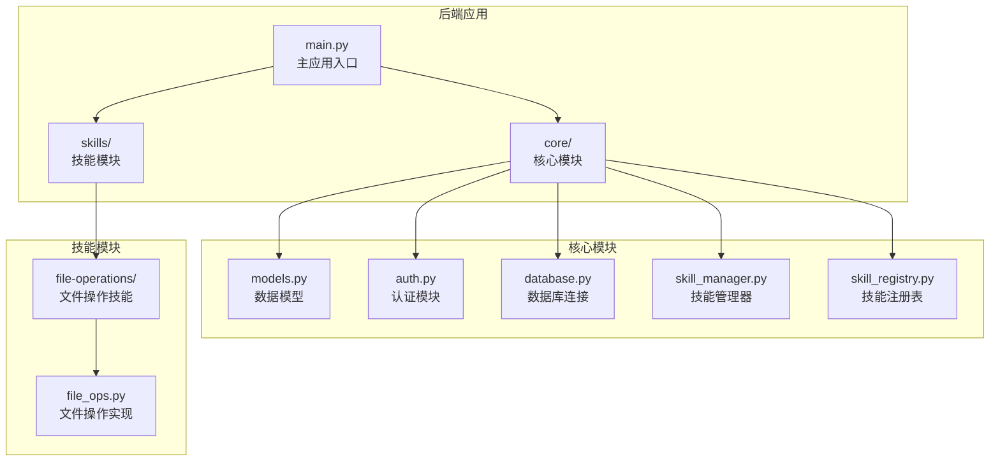
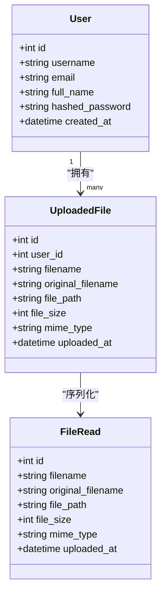
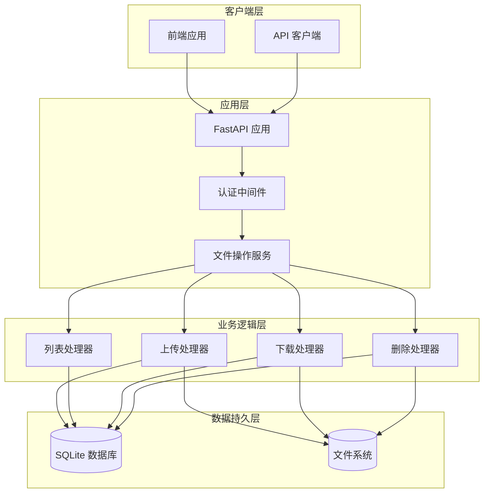
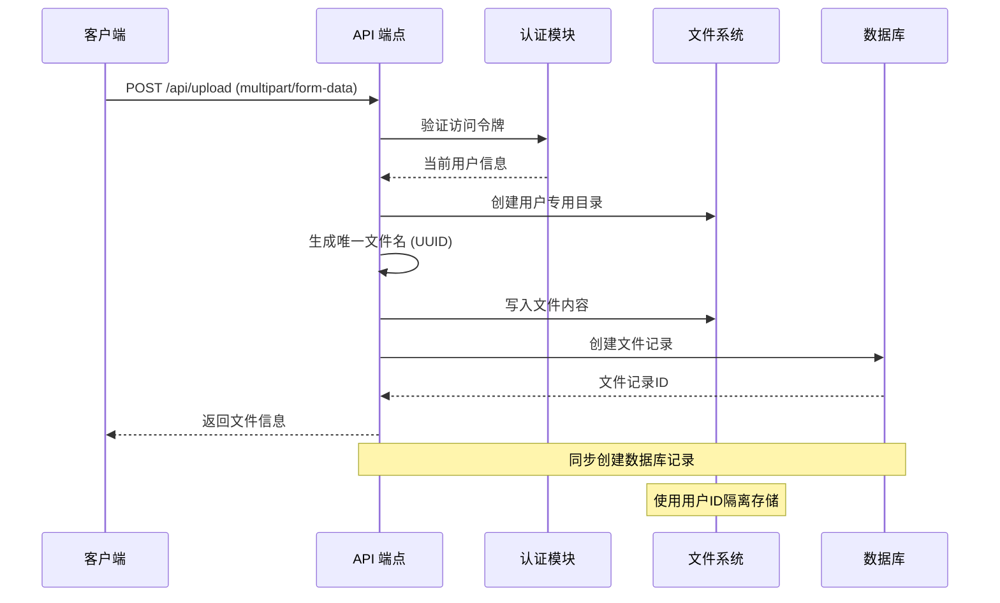
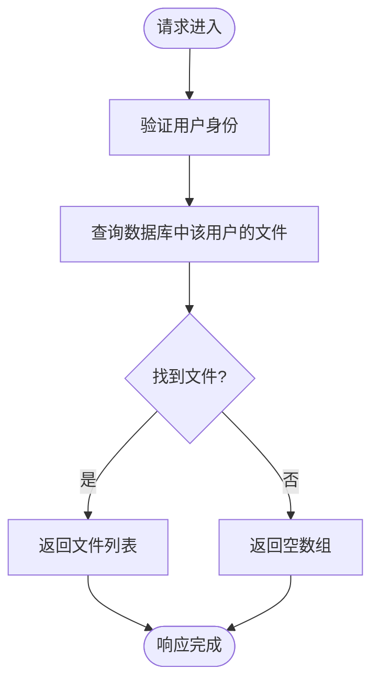
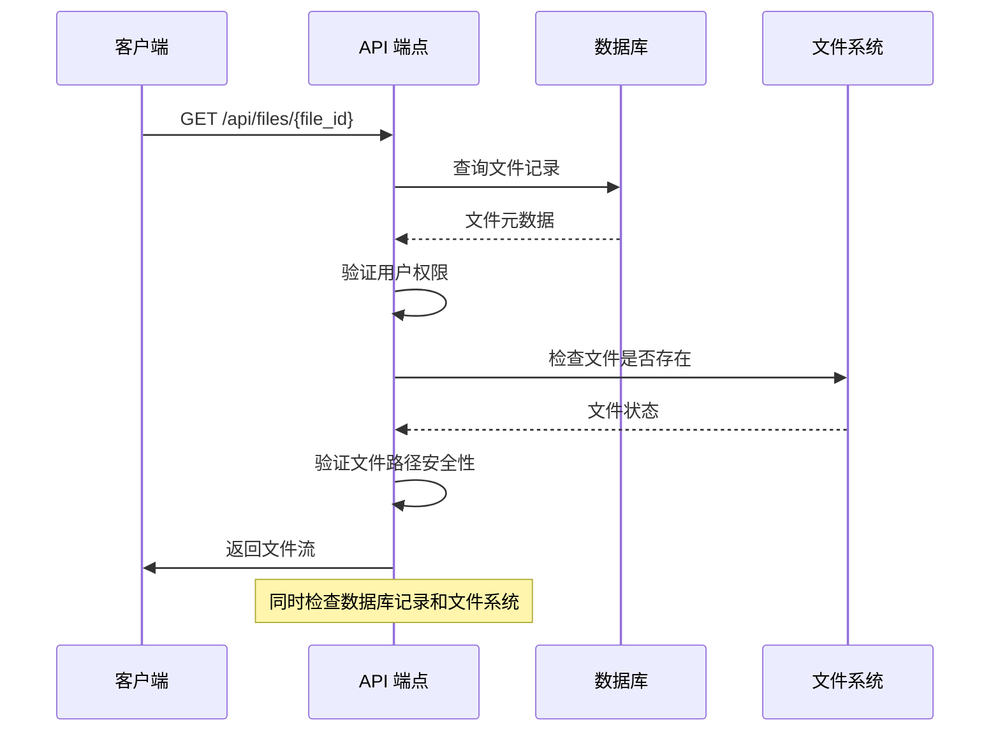
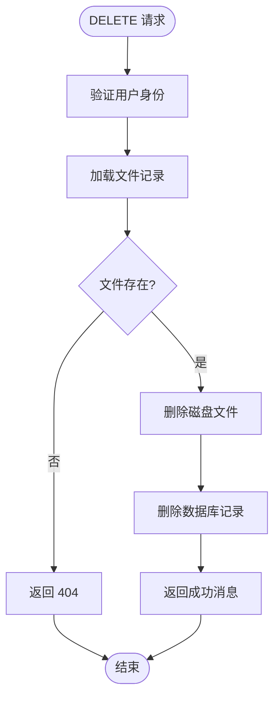
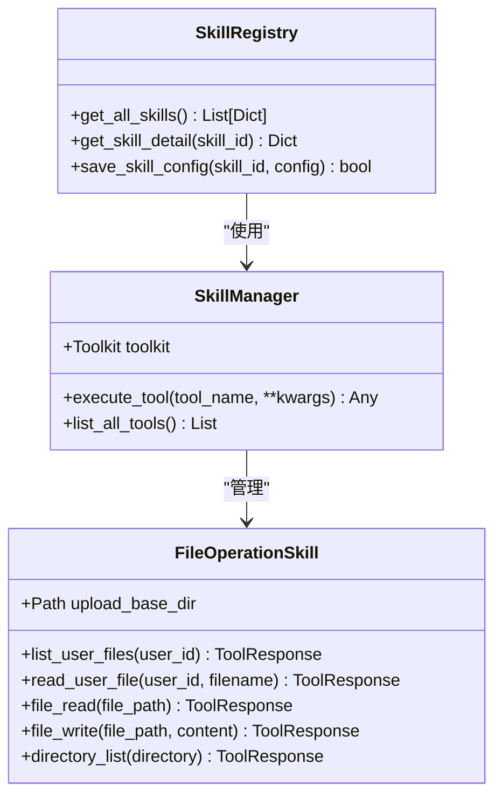

# 文件管理端点

<cite>
**本文档引用的文件**
- [main.py](file://localmanus-backend/main.py)
- [models.py](file://localmanus-backend/core/models.py)
- [auth.py](file://localmanus-backend/core/auth.py)
- [database.py](file://localmanus-backend/core/database.py)
- [file_ops.py](file://localmanus-backend/skills/file-operations/file_ops.py)
- [skill_manager.py](file://localmanus-backend/core/skill_manager.py)
- [skill_registry.py](file://localmanus-backend/core/skill_registry.py)
- [.env.example](file://localmanus-backend/.env.example)
- [requirements.txt](file://localmanus-backend/requirements.txt)
</cite>

## 目录
1. [简介](#简介)
2. [项目结构](#项目结构)
3. [核心组件](#核心组件)
4. [架构概览](#架构概览)
5. [详细组件分析](#详细组件分析)
6. [依赖关系分析](#依赖关系分析)
7. [性能考虑](#性能考虑)
8. [故障排除指南](#故障排除指南)
9. [结论](#结论)

## 简介

LocalManus 是一个基于 FastAPI 的本地文件管理系统，提供了完整的文件管理 API 端点。本文档专注于文件管理相关的四个核心端点：文件上传、文件列表、文件下载和文件删除。系统采用 SQLite 数据库存储用户信息和文件元数据，使用 UUID 生成唯一文件名，并通过用户认证确保文件访问的安全性。

## 项目结构

LocalManus 后端采用模块化设计，主要包含以下关键目录和文件：



**图表来源**
- [main.py](file://localmanus-backend/main.py#L1-L50)
- [models.py](file://localmanus-backend/core/models.py#L1-L80)
- [file_ops.py](file://localmanus-backend/skills/file-operations/file_ops.py#L1-L50)

**章节来源**
- [main.py](file://localmanus-backend/main.py#L1-L50)
- [requirements.txt](file://localmanus-backend/requirements.txt#L1-L14)

## 核心组件

### 数据模型

系统使用 SQLModel 定义了完整的数据模型结构：



**图表来源**
- [models.py](file://localmanus-backend/core/models.py#L10-L47)

### 认证与授权

系统采用 JWT 令牌进行用户认证，支持密码哈希验证和访问令牌过期管理：

- **认证方式**: OAuth2 密码流
- **令牌类型**: Bearer Token
- **过期时间**: 7 天
- **密码哈希**: bcrypt 加密

**章节来源**
- [auth.py](file://localmanus-backend/core/auth.py#L12-L53)
- [main.py](file://localmanus-backend/main.py#L108-L111)

## 架构概览

LocalManus 的文件管理架构采用分层设计，确保了清晰的关注点分离：



**图表来源**
- [main.py](file://localmanus-backend/main.py#L112-L215)
- [database.py](file://localmanus-backend/core/database.py#L11-L17)

## 详细组件分析

### 文件上传端点 (/api/upload)

#### 端点定义
- **HTTP 方法**: POST
- **请求体**: multipart/form-data
- **参数**: file (必需)
- **响应**: FileRead 模型

#### 实现流程



**图表来源**
- [main.py](file://localmanus-backend/main.py#L112-L152)

#### 关键特性

1. **文件命名规则**: 使用 UUID 生成唯一文件名，保留原始扩展名
2. **存储路径管理**: 每个用户拥有独立的上传目录 (`uploads/{user_id}`)
3. **数据库同步**: 自动创建 UploadedFile 记录
4. **错误处理**: 统一的异常捕获和 500 错误响应

**章节来源**
- [main.py](file://localmanus-backend/main.py#L112-L152)
- [models.py](file://localmanus-backend/core/models.py#L29-L47)

### 文件列表端点 (/api/files)

#### 端点定义
- **HTTP 方法**: GET
- **请求参数**: 无
- **响应**: FileRead 对象数组

#### 实现逻辑



**图表来源**
- [main.py](file://localmanus-backend/main.py#L153-L162)

#### 权限控制
- 基于用户上下文过滤文件
- 确保用户只能访问自己的文件

**章节来源**
- [main.py](file://localmanus-backend/main.py#L153-L162)

### 文件下载端点 (/api/files/{file_id})

#### 端点定义
- **HTTP 方法**: GET
- **路径参数**: file_id (整数)
- **响应**: 文件流或 404 错误

#### 下载流程



**图表来源**
- [main.py](file://localmanus-backend/main.py#L164-L188)

#### 安全验证
- 用户权限验证
- 文件存在性检查
- 路径遍历攻击防护

**章节来源**
- [main.py](file://localmanus-backend/main.py#L164-L188)

### 文件删除端点 (/api/files/{file_id})

#### 端点定义
- **HTTP 方法**: DELETE
- **路径参数**: file_id (整数)
- **响应**: JSON 成功消息

#### 删除流程



**图表来源**
- [main.py](file://localmanus-backend/main.py#L190-L215)

#### 双重删除策略
1. **文件系统删除**: 直接删除物理文件
2. **数据库清理**: 删除对应的元数据记录

**章节来源**
- [main.py](file://localmanus-backend/main.py#L190-L215)

## 依赖关系分析

### 技术栈依赖

```mermaid
graph TB
subgraph "核心框架"
FastAPI[FastAPI 0.115.0]
SQLModel[SQLModel 0.0.22]
Uvicorn[Uvicorn 0.32.0]
end
subgraph "认证相关"
JWT[python-jose]
Bcrypt[passlib[bcrypt]]
OAuth2[OAuth2PasswordBearer]
end
subgraph "文件处理"
Multipart[python-multipart]
Pathlib[pathlib.Path]
end
subgraph "工具库"
Websockets[websockets]
Requests[requests]
BeautifulSoup[beautifulsoup4]
end
FastAPI --> SQLModel
FastAPI --> JWT
FastAPI --> Multipart
FastAPI --> Websockets
SQLModel --> SQLite
```

**图表来源**
- [requirements.txt](file://localmanus-backend/requirements.txt#L1-L14)

### 文件操作技能集成

系统还提供了基于 AgentScope 的文件操作技能：



**图表来源**
- [file_ops.py](file://localmanus-backend/skills/file-operations/file_ops.py#L9-L165)
- [skill_manager.py](file://localmanus-backend/core/skill_manager.py#L18-L143)
- [skill_registry.py](file://localmanus-backend/core/skill_registry.py#L12-L156)

**章节来源**
- [file_ops.py](file://localmanus-backend/skills/file-operations/file_ops.py#L1-L165)
- [skill_manager.py](file://localmanus-backend/core/skill_manager.py#L1-L143)
- [skill_registry.py](file://localmanus-backend/core/skill_registry.py#L1-L156)

## 性能考虑

### 存储优化策略

1. **文件命名优化**
   - 使用 UUID 避免文件名冲突
   - 保持原始文件扩展名便于识别

2. **目录结构优化**
   - 按用户 ID 分离存储避免竞争条件
   - 自动创建目录结构

3. **内存使用优化**
   - 流式文件写入避免大文件内存占用
   - 按需查询数据库记录

### 安全最佳实践

1. **路径安全**
   - 使用相对路径和目录限制
   - 防止路径遍历攻击

2. **文件大小限制**
   - 建议在生产环境中添加文件大小验证
   - 实施合理的默认限制

3. **并发处理**
   - SQLite 在高并发场景下的限制
   - 建议在生产环境使用更强大的数据库

## 故障排除指南

### 常见问题及解决方案

#### 1. 文件上传失败
**症状**: 500 错误，上传失败
**可能原因**:
- 上传目录权限不足
- 磁盘空间不足
- 文件系统写入权限问题

**解决方法**:
- 检查 `uploads` 目录权限
- 验证磁盘空间
- 确认应用运行用户权限

#### 2. 文件下载 404
**症状**: 下载接口返回 404
**可能原因**:
- 文件记录存在但文件已删除
- 用户权限不足
- 文件路径不正确

**解决方法**:
- 检查数据库中的文件记录
- 验证文件系统中的实际文件
- 确认用户身份验证

#### 3. 认证问题
**症状**: 401 未授权错误
**可能原因**:
- 令牌过期
- 无效的访问令牌
- 用户不存在

**解决方法**:
- 重新登录获取新令牌
- 检查令牌格式和有效期
- 验证用户账户状态

**章节来源**
- [main.py](file://localmanus-backend/main.py#L149-L151)
- [auth.py](file://localmanus-backend/core/auth.py#L62-L82)

## 结论

LocalManus 的文件管理 API 提供了完整、安全且高效的文件操作能力。系统采用现代的 FastAPI 架构，结合 SQLite 数据库和文件系统，实现了可靠的文件存储和管理功能。

### 主要优势

1. **安全性**: 基于 JWT 的用户认证，文件访问权限控制
2. **可靠性**: 数据库记录与文件系统同步，双重验证机制
3. **可扩展性**: 模块化设计，易于添加新的文件操作功能
4. **易用性**: 清晰的 API 设计，符合 RESTful 标准

### 改进建议

1. **生产环境优化**: 考虑使用 PostgreSQL 替代 SQLite
2. **文件大小限制**: 添加上传文件大小限制
3. **并发处理**: 实现更完善的并发控制机制
4. **监控日志**: 增强错误日志和性能监控

该系统为本地文件管理提供了一个坚实的基础，可以根据具体需求进一步扩展和完善。