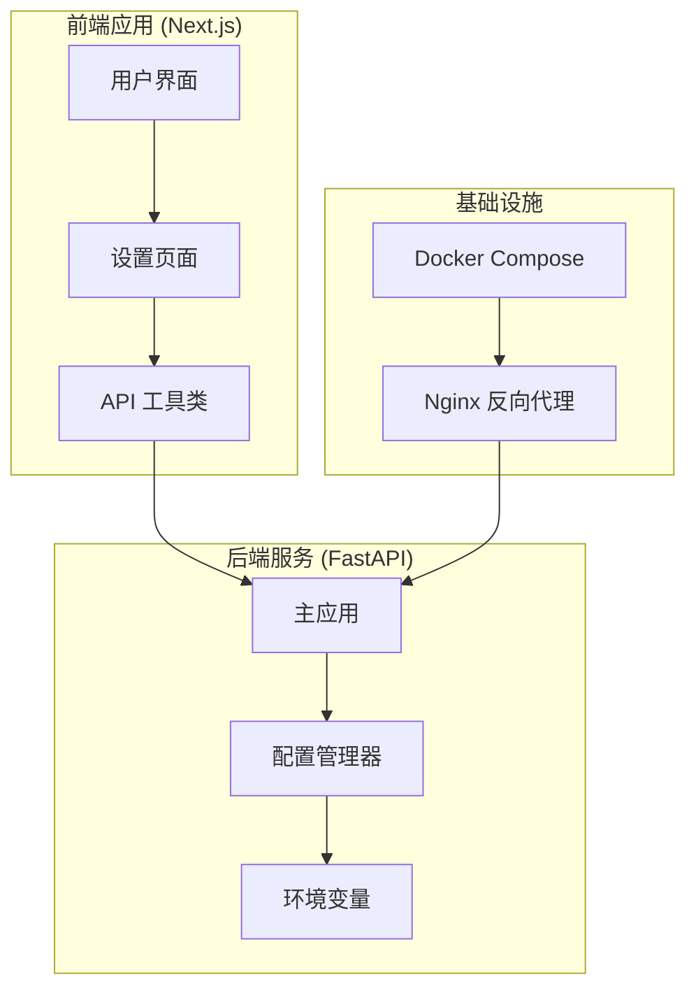
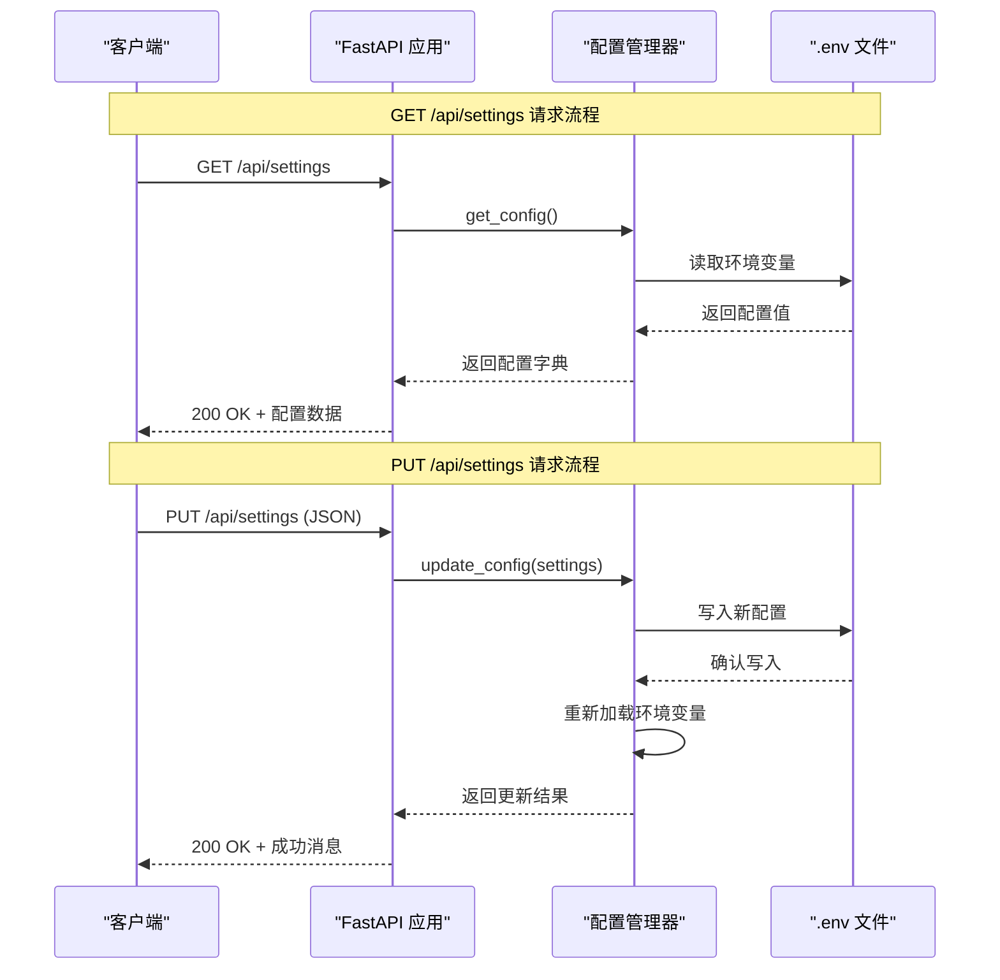
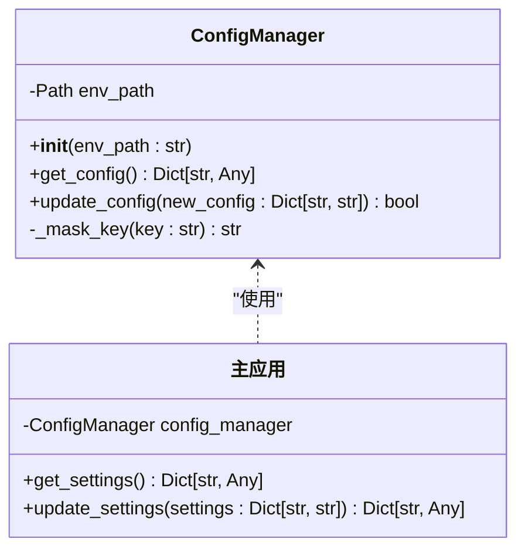
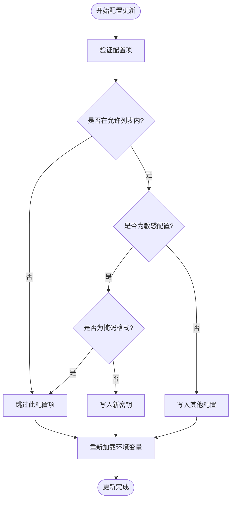
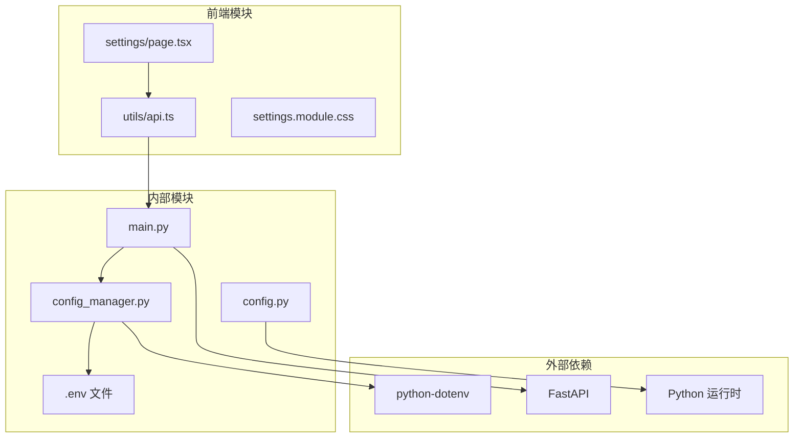

# 系统设置端点

<cite>
**本文档引用的文件**
- [main.py](file://localmanus-backend/main.py)
- [config_manager.py](file://localmanus-backend/core/config_manager.py)
- [config.py](file://localmanus-backend/core/config.py)
- [.env.example](file://localmanus-backend/.env.example)
- [docker-compose.yml](file://docker-compose.yml)
- [page.tsx](file://localmanus-ui/app/settings/page.tsx)
- [api.ts](file://localmanus-ui/app/utils/api.ts)
- [settings.module.css](file://localmanus-ui/app/settings/settings.module.css)
</cite>

## 目录
1. [简介](#简介)
2. [项目结构](#项目结构)
3. [核心组件](#核心组件)
4. [架构概览](#架构概览)
5. [详细组件分析](#详细组件分析)
6. [依赖关系分析](#依赖关系分析)
7. [性能考虑](#性能考虑)
8. [故障排除指南](#故障排除指南)
9. [结论](#结论)
10. [附录](#附录)

## 简介

LocalManus 的系统设置 API 端点提供了对系统配置的集中管理和持久化功能。该实现包括两个主要端点：GET /api/settings 用于获取当前配置，PUT /api/settings 用于更新和持久化配置。系统采用 .env 文件作为配置存储后端，支持敏感信息掩码、默认值处理和安全的配置更新机制。

## 项目结构

LocalManus 采用前后端分离的架构设计，系统设置功能分布在以下组件中：



**图表来源**
- [main.py](file://localmanus-backend/main.py#L34-L40)
- [config_manager.py](file://localmanus-backend/core/config_manager.py#L6-L13)
- [docker-compose.yml](file://docker-compose.yml#L1-L88)

**章节来源**
- [main.py](file://localmanus-backend/main.py#L1-L50)
- [docker-compose.yml](file://docker-compose.yml#L1-L88)

## 核心组件

### 配置管理器 (ConfigManager)

配置管理器是系统设置功能的核心组件，负责配置的读取、更新和持久化操作。它提供了以下关键功能：

- **配置读取**: 从 .env 文件中读取当前配置
- **配置更新**: 安全地更新 .env 文件中的配置项
- **敏感信息掩码**: 对敏感配置进行显示掩码处理
- **默认值处理**: 为未设置的配置项提供合理的默认值

### 系统设置端点

系统设置功能通过两个 REST API 端点提供服务：

1. **GET /api/settings**: 获取当前系统配置
2. **PUT /api/settings**: 更新系统配置并持久化到 .env 文件

**章节来源**
- [config_manager.py](file://localmanus-backend/core/config_manager.py#L6-L57)
- [main.py](file://localmanus-backend/main.py#L269-L286)

## 架构概览

系统设置端点的完整架构流程如下：



**图表来源**
- [main.py](file://localmanus-backend/main.py#L271-L285)
- [config_manager.py](file://localmanus-backend/core/config_manager.py#L15-L50)

## 详细组件分析

### 配置管理器类结构



**图表来源**
- [config_manager.py](file://localmanus-backend/core/config_manager.py#L6-L57)
- [main.py](file://localmanus-backend/main.py#L40-L40)

### 系统设置端点实现

#### GET /api/settings 端点

**HTTP 方法**: GET  
**认证要求**: 需要有效的访问令牌  
**响应格式**: JSON 对象，包含所有配置项

**响应内容结构**:
```json
{
  "MODEL_NAME": "字符串",
  "OPENAI_API_KEY": "掩码后的密钥",
  "OPENAI_API_BASE": "字符串",
  "AGENT_MEMORY_LIMIT": "字符串形式的数字",
  "UPLOAD_SIZE_LIMIT": "字符串形式的数字"
}
```

**默认值处理**:
- MODEL_NAME: 默认值为 "gpt-4"
- OPENAI_API_BASE: 默认值为 "http://localhost:11434/v1"
- AGENT_MEMORY_LIMIT: 默认值为 "40"
- UPLOAD_SIZE_LIMIT: 默认值为 "10485760" (10MB)

#### PUT /api/settings 端点

**HTTP 方法**: PUT  
**认证要求**: 需要有效的访问令牌  
**请求格式**: JSON 对象，包含要更新的配置键值对

**允许更新的配置项**:
- MODEL_NAME: AI 模型名称
- OPENAI_API_KEY: API 访问密钥
- OPENAI_API_BASE: API 基础地址
- AGENT_MEMORY_LIMIT: Agent 记忆轮数限制
- UPLOAD_SIZE_LIMIT: 文件上传大小限制

**安全特性**:
- 仅允许指定的配置项更新
- 敏感密钥自动掩码处理
- 防止未修改密钥的重复更新

**章节来源**
- [main.py](file://localmanus-backend/main.py#L271-L285)
- [config_manager.py](file://localmanus-backend/core/config_manager.py#L15-L50)

### 前端集成实现

#### 设置页面组件

前端设置页面实现了完整的配置管理界面，包括：

**配置项展示**:
- 模型配置区域 (CPU 图标)
- API 连接区域 (Globe 图标)  
- 系统限制区域 (ShieldCheck 图标)

**交互功能**:
- 自动加载当前配置
- 实时表单编辑
- 保存按钮状态管理
- 错误处理和用户反馈

**章节来源**
- [page.tsx](file://localmanus-ui/app/settings/page.tsx#L10-L190)
- [api.ts](file://localmanus-ui/app/utils/api.ts#L7-L16)

### 配置持久化机制

系统采用 .env 文件作为配置存储后端，具有以下特点：



**图表来源**
- [config_manager.py](file://localmanus-backend/core/config_manager.py#L25-L50)

**章节来源**
- [config_manager.py](file://localmanus-backend/core/config_manager.py#L25-L50)
- [.env.example](file://localmanus-backend/.env.example#L1-L4)

## 依赖关系分析

系统设置功能的依赖关系图：



**图表来源**
- [main.py](file://localmanus-backend/main.py#L1-L28)
- [config_manager.py](file://localmanus-backend/core/config_manager.py#L1-L5)
- [page.tsx](file://localmanus-ui/app/settings/page.tsx#L1-L8)

**章节来源**
- [main.py](file://localmanus-backend/main.py#L1-L28)
- [config_manager.py](file://localmanus-backend/core/config_manager.py#L1-L5)

## 性能考虑

### 配置访问优化

- **内存缓存**: 环境变量在进程启动时加载到内存中
- **延迟加载**: 配置文件仅在需要时读取
- **批量更新**: 单次请求可更新多个配置项

### 前端性能特性

- **懒加载**: 设置页面按需加载
- **状态管理**: 使用 React hooks 进行高效的状态更新
- **防抖处理**: 避免频繁的 API 调用

## 故障排除指南

### 常见问题及解决方案

**问题 1**: 配置更新后不生效
- **原因**: 环境变量需要重新加载
- **解决**: 重启后端服务或重新部署容器

**问题 2**: API 密钥显示异常
- **原因**: 敏感信息被自动掩码
- **解决**: 在密钥字段输入新的密钥值

**问题 3**: 权限错误
- **原因**: .env 文件权限不足
- **解决**: 确保后端进程有文件写入权限

**问题 4**: 配置项未被更新
- **原因**: 非允许的配置项被忽略
- **解决**: 检查配置项名称是否在允许列表中

**章节来源**
- [config_manager.py](file://localmanus-backend/core/config_manager.py#L45-L50)

## 结论

LocalManus 的系统设置 API 端点提供了一个安全、可靠的配置管理解决方案。通过 .env 文件持久化、敏感信息掩码和严格的权限控制，系统确保了配置的安全性和一致性。前后端的良好分离设计使得配置管理既直观又高效。

## 附录

### 配置项参考表

| 配置项 | 类型 | 默认值 | 描述 |
|--------|------|--------|------|
| MODEL_NAME | 字符串 | "gpt-4" | AI 模型名称 |
| OPENAI_API_KEY | 字符串 | "" | API 访问密钥 |
| OPENAI_API_BASE | 字符串 | "http://localhost:11434/v1" | API 基础地址 |
| AGENT_MEMORY_LIMIT | 数字字符串 | "40" | Agent 记忆轮数限制 |
| UPLOAD_SIZE_LIMIT | 数字字符串 | "10485760" | 文件上传大小限制 |

### 部署配置建议

**Docker 环境变量**:
- MODEL_NAME: ${MODEL_NAME:-gpt-4}
- OPENAI_API_KEY: ${OPENAI_API_KEY}
- OPENAI_API_BASE: ${OPENAI_API_BASE:-http://localhost:11434/v1}
- AGENT_MEMORY_LIMIT: ${AGENT_MEMORY_LIMIT:-40}
- UPLOAD_SIZE_LIMIT: ${UPLOAD_SIZE_LIMIT:-10485760}

**章节来源**
- [docker-compose.yml](file://docker-compose.yml#L32-L37)
- [.env.example](file://localmanus-backend/.env.example#L1-L4)