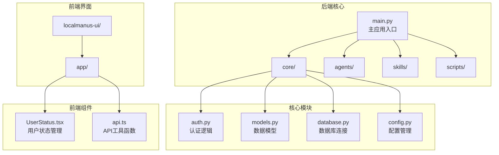
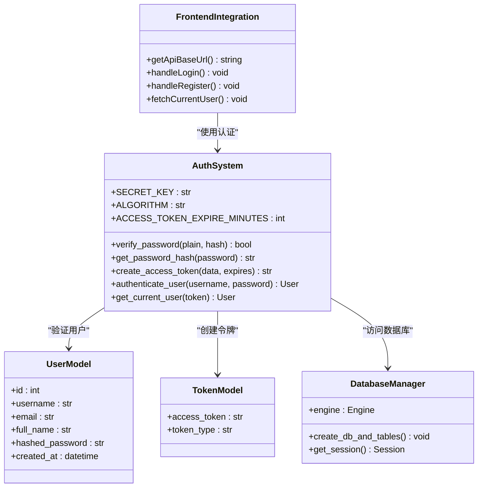
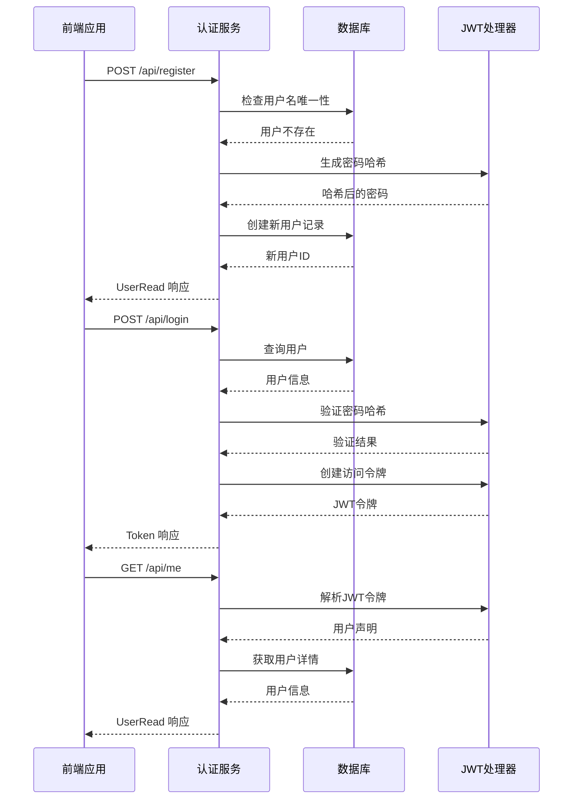
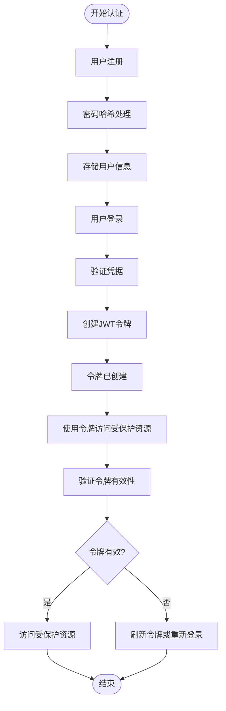
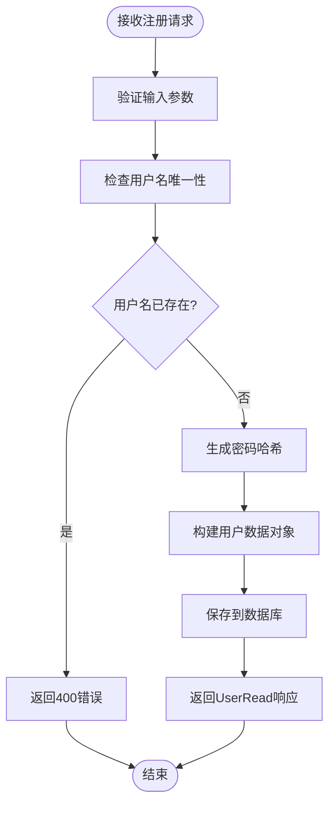
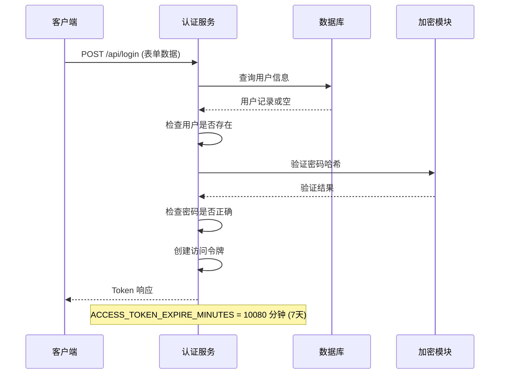
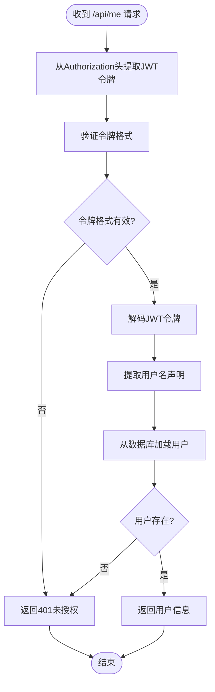
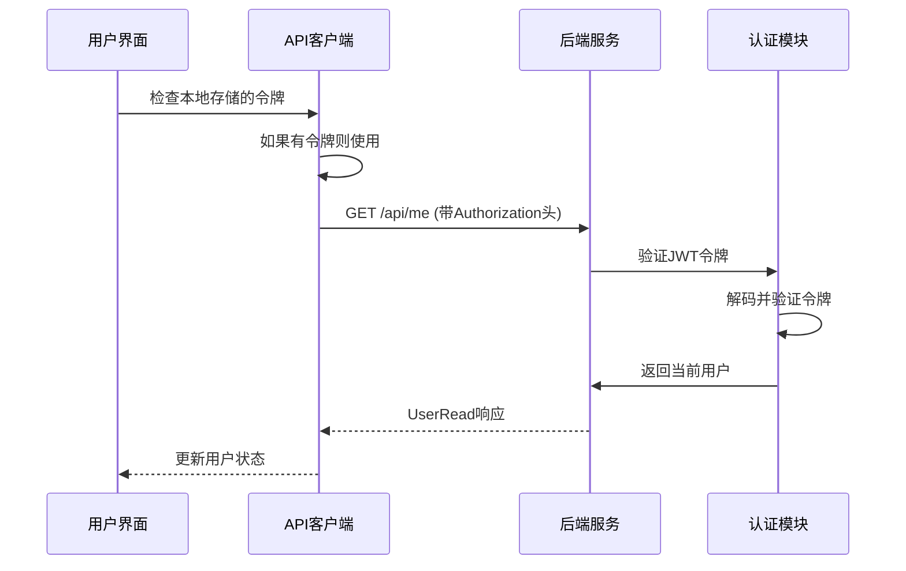
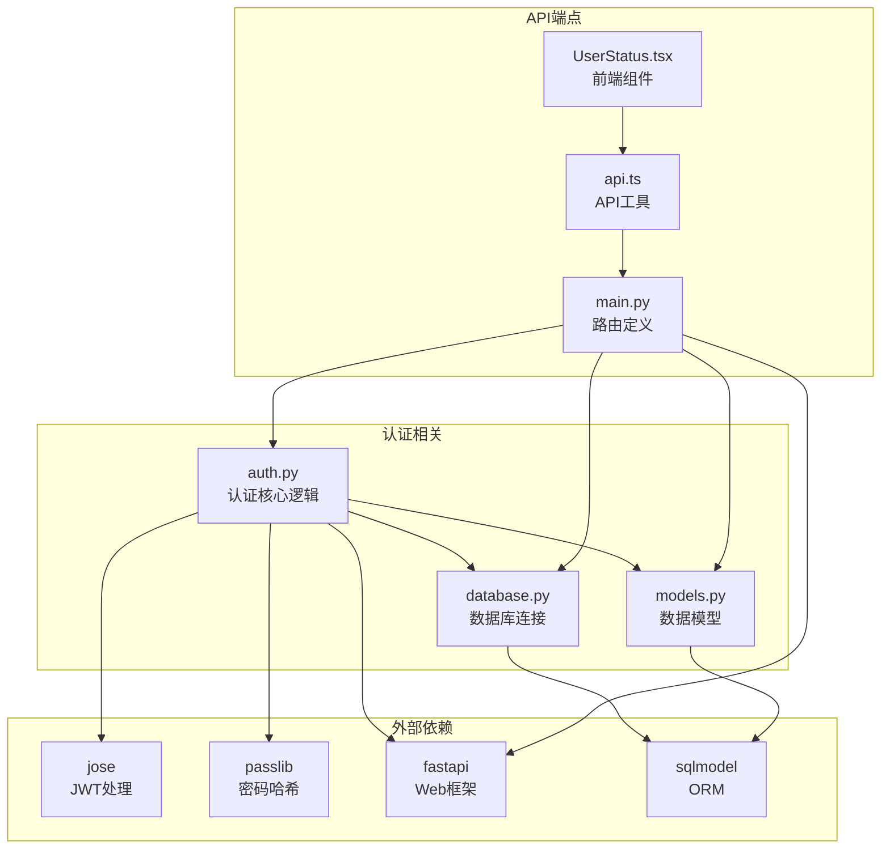
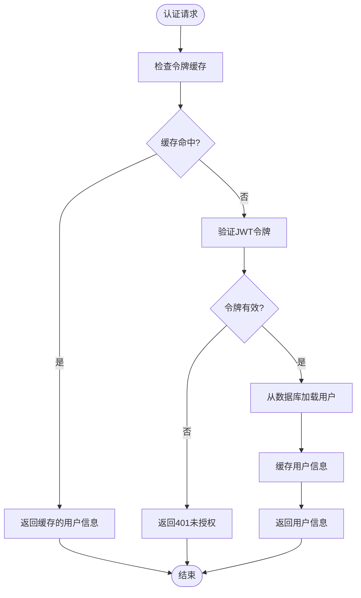

# 认证与用户管理端点

<cite>
**本文档引用的文件**
- [main.py](file://localmanus-backend/main.py)
- [auth.py](file://localmanus-backend/core/auth.py)
- [models.py](file://localmanus-backend/core/models.py)
- [database.py](file://localmanus-backend/core/database.py)
- [.env.example](file://localmanus-backend/.env.example)
- [UserStatus.tsx](file://localmanus-ui/app/components/UserStatus.tsx)
- [api.ts](file://localmanus-ui/app/utils/api.ts)
</cite>

## 目录
1. [简介](#简介)
2. [项目结构](#项目结构)
3. [核心组件](#核心组件)
4. [架构概览](#架构概览)
5. [详细组件分析](#详细组件分析)
6. [依赖关系分析](#依赖关系分析)
7. [性能考虑](#性能考虑)
8. [故障排除指南](#故障排除指南)
9. [结论](#结论)

## 简介

LocalManus 是一个基于 FastAPI 构建的本地智能体平台，提供了完整的认证与用户管理功能。本文档详细介绍了三个核心认证端点：用户注册（/api/register）、用户登录（/api/login）和用户信息查询（/api/me）的实现细节。

系统采用 JWT（JSON Web Token）令牌认证机制，结合 bcrypt 密码哈希算法，确保用户身份验证的安全性和可靠性。所有认证相关的业务逻辑都集中在后端服务中，前端通过标准的 HTTP 请求与后端进行交互。

## 项目结构

LocalManus 后端采用模块化设计，主要包含以下关键目录和文件：

**图表来源**
- [main.py](file://localmanus-backend/main.py#L1-L50)
- [auth.py](file://localmanus-backend/core/auth.py#L1-L20)
- [models.py](file://localmanus-backend/core/models.py#L1-L20)

**章节来源**
- [main.py](file://localmanus-backend/main.py#L1-L50)
- [auth.py](file://localmanus-backend/core/auth.py#L1-L20)
- [models.py](file://localmanus-backend/core/models.py#L1-L20)

## 核心组件

### 认证系统架构

LocalManus 的认证系统由多个紧密协作的组件构成：

**图表来源**
- [auth.py](file://localmanus-backend/core/auth.py#L12-L82)
- [models.py](file://localmanus-backend/core/models.py#L5-L28)
- [database.py](file://localmanus-backend/core/database.py#L1-L17)

### 数据模型设计

系统使用 SQLModel 定义了完整的数据模型体系：

| 模型名称 | 字段 | 类型 | 描述 |
|---------|------|------|------|
| User | id | Optional[int] | 主键标识符 |
| User | username | str | 用户名（唯一索引） |
| User | email | Optional[str] | 邮箱地址 |
| User | full_name | Optional[str] | 全名 |
| User | hashed_password | str | bcrypt 哈希后的密码 |
| User | created_at | datetime | 创建时间戳 |
| UserCreate | password | str | 注册时的明文密码 |
| UserRead | id | int | 返回给客户端的用户ID |
| UserRead | created_at | datetime | 返回给客户端的创建时间 |
| Token | access_token | str | JWT 访问令牌 |
| Token | token_type | str | 令牌类型（固定为 "bearer"） |

**章节来源**
- [models.py](file://localmanus-backend/core/models.py#L5-L28)
- [database.py](file://localmanus-backend/core/database.py#L1-L17)

## 架构概览

### 认证流程总览

**图表来源**
- [main.py](file://localmanus-backend/main.py#L74-L110)
- [auth.py](file://localmanus-backend/core/auth.py#L47-L82)

### JWT 令牌生命周期

**图表来源**
- [auth.py](file://localmanus-backend/core/auth.py#L37-L53)
- [auth.py](file://localmanus-backend/core/auth.py#L55-L82)

## 详细组件分析

### 用户注册端点 (/api/register)

#### 端点规范

| 属性 | 详细信息 |
|------|----------|
| HTTP 方法 | POST |
| 路径 | `/api/register` |
| 请求体 | JSON 格式，包含用户名、邮箱、全名和密码 |
| 响应体 | UserRead 模型 |
| 状态码 | 200 成功，400 用户名已存在 |

#### 请求参数详解

注册端点接受以下参数：

| 参数名 | 类型 | 必需 | 描述 |
|--------|------|------|------|
| username | string | 是 | 用户名，必须唯一且不为空 |
| email | string | 否 | 用户邮箱地址 |
| full_name | string | 否 | 用户全名 |
| password | string | 是 | 用户密码，长度至少6个字符 |

#### 实现逻辑分析

**图表来源**
- [main.py](file://localmanus-backend/main.py#L74-L90)

#### 错误处理机制

- **400 Bad Request**: 当用户名已被注册时返回
- **500 Internal Server Error**: 数据库操作失败时返回
- **422 Unprocessable Entity**: 请求体格式不正确时返回

**章节来源**
- [main.py](file://localmanus-backend/main.py#L74-L90)

### 用户登录端点 (/api/login)

#### 端点规范

| 属性 | 详细信息 |
|------|----------|
| HTTP 方法 | POST |
| 路径 | `/api/login` |
| 请求体 | 表单数据，包含用户名和密码 |
| 响应体 | Token 模型 |
| 状态码 | 200 成功，401 凭据无效 |

#### 认证流程详解

**图表来源**
- [main.py](file://localmanus-backend/main.py#L92-L106)
- [auth.py](file://localmanus-backend/core/auth.py#L47-L53)

#### 登录成功响应

成功的登录响应包含以下字段：

| 字段名 | 类型 | 描述 |
|--------|------|------|
| access_token | string | JWT 访问令牌 |
| token_type | string | 令牌类型，固定为 "bearer" |

#### 安全特性

- **OAuth2 密码流**: 使用标准的 OAuth2 密码流协议
- **令牌过期**: 默认7天有效期，可配置
- **凭据隐藏**: 密码在传输过程中保持加密状态
- **速率限制**: 建议在生产环境中实施登录尝试限制

**章节来源**
- [main.py](file://localmanus-backend/main.py#L92-L106)
- [auth.py](file://localmanus-backend/core/auth.py#L12-L16)

### 用户信息查询端点 (/api/me)

#### 端点规范

| 属性 | 详细信息 |
|------|----------|
| HTTP 方法 | GET |
| 路径 | `/api/me` |
| 请求头 | Authorization: Bearer {token} |
| 响应体 | UserRead 模型 |
| 状态码 | 200 成功，401 未授权 |

#### 权限验证机制

**图表来源**
- [auth.py](file://localmanus-backend/core/auth.py#L55-L82)

#### 前端集成示例

前端应用通过以下方式使用 /api/me 端点：

**图表来源**
- [UserStatus.tsx](file://localmanus-ui/app/components/UserStatus.tsx#L36-L53)

**章节来源**
- [main.py](file://localmanus-backend/main.py#L108-L110)
- [auth.py](file://localmanus-backend/core/auth.py#L55-L82)
- [UserStatus.tsx](file://localmanus-ui/app/components/UserStatus.tsx#L36-L53)

## 依赖关系分析

### 组件间依赖关系

**图表来源**
- [main.py](file://localmanus-backend/main.py#L1-L20)
- [auth.py](file://localmanus-backend/core/auth.py#L1-L10)
- [models.py](file://localmanus-backend/core/models.py#L1-L4)

### 外部依赖分析

| 依赖包 | 版本 | 用途 | 安全考虑 |
|--------|------|------|----------|
| fastapi | 最新版本 | Web 框架 | 定期更新以修复安全漏洞 |
| sqlmodel | 最新版本 | ORM 和数据库 | 确保使用最新版本 |
| jose | 最新版本 | JWT 处理 | 关注 CVE 更新 |
| passlib | 最新版本 | 密码哈希 | 使用 bcrypt 方案 |
| python-dotenv | 最新版本 | 环境变量管理 | 配置文件权限设置 |

**章节来源**
- [main.py](file://localmanus-backend/main.py#L1-L20)
- [auth.py](file://localmanus-backend/core/auth.py#L1-L10)

## 性能考虑

### 认证性能优化

1. **令牌缓存策略**
   - 对于频繁访问的用户，可以考虑实现令牌缓存
   - 设置合理的令牌过期时间平衡安全性与性能

2. **数据库查询优化**
   - 用户名字段已建立唯一索引，查询效率高
   - 可以考虑添加用户名的复合索引

3. **密码哈希成本**
   - bcrypt 的成本因子需要在安全性和性能间平衡
   - 建议使用默认成本因子或根据硬件性能调整

4. **并发处理**
   - FastAPI 基于异步处理，支持高并发认证请求
   - 建议部署时配置合适的 worker 数量

### 缓存策略建议

## 故障排除指南

### 常见认证问题

#### 1. 登录失败 (401 未授权)

**可能原因**：
- 用户名或密码错误
- 令牌格式不正确
- 令牌已过期

**解决方案**：
- 检查用户名和密码是否正确
- 确认使用正确的 Authorization 头格式
- 重新登录获取新的访问令牌

#### 2. 注册失败 (400 用户名已存在)

**可能原因**：
- 用户名已被其他用户使用

**解决方案**：
- 尝试使用不同的用户名
- 检查用户名是否符合长度要求

#### 3. API 调用失败 (404 未找到)

**可能原因**：
- 认证令牌缺失
- 令牌格式错误
- 用户账户被删除

**解决方案**：
- 确保在请求头中包含有效的 Authorization 头
- 重新登录获取新的令牌
- 检查用户账户状态

### 前端集成问题

#### 令牌存储问题

**问题描述**：
前端无法持久化存储访问令牌

**解决方案**：
- 检查浏览器的 localStorage 是否启用
- 确认跨域设置允许存储令牌
- 实现令牌过期检测和自动刷新

#### CORS 配置问题

**问题描述**：
前端请求被拒绝，出现跨域错误

**解决方案**：
- 检查后端的 CORS 配置
- 确认前端请求的 Origin 在允许列表中
- 验证预检请求的处理

**章节来源**
- [main.py](file://localmanus-backend/main.py#L52-L59)
- [UserStatus.tsx](file://localmanus-ui/app/components/UserStatus.tsx#L28-L53)

## 结论

LocalManus 的认证与用户管理系统提供了完整、安全且易于使用的用户身份验证解决方案。系统采用业界标准的 JWT 令牌认证机制，结合 bcrypt 密码哈希算法，确保了用户数据的安全性。

### 主要优势

1. **安全性**: 使用 JWT 令牌和 bcrypt 密码哈希，符合现代安全标准
2. **易用性**: 提供清晰的 API 接口和完整的前端集成示例
3. **可扩展性**: 模块化设计便于功能扩展和维护
4. **性能**: 基于 FastAPI 的高性能异步处理

### 最佳实践建议

1. **生产环境配置**
   - 设置强密码的 SECRET_KEY 环境变量
   - 实施严格的 CORS 策略
   - 配置适当的速率限制和防护措施

2. **监控和日志**
   - 记录认证相关的审计日志
   - 监控异常登录尝试
   - 设置令牌过期提醒

3. **用户体验**
   - 实现自动令牌刷新机制
   - 提供清晰的错误提示信息
   - 支持多设备登录管理

该认证系统为 LocalManus 平台提供了坚实的基础，支持后续的功能扩展和企业级部署需求。