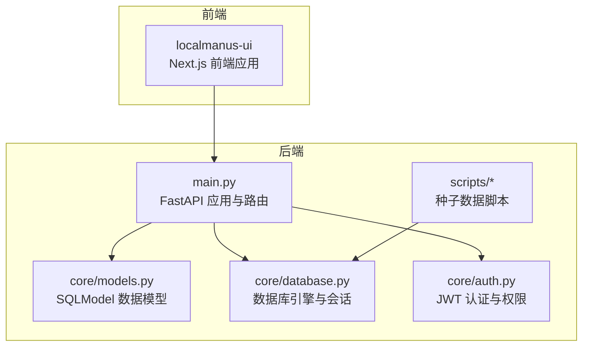
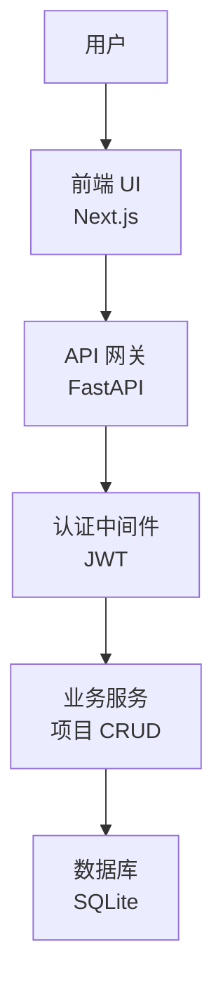
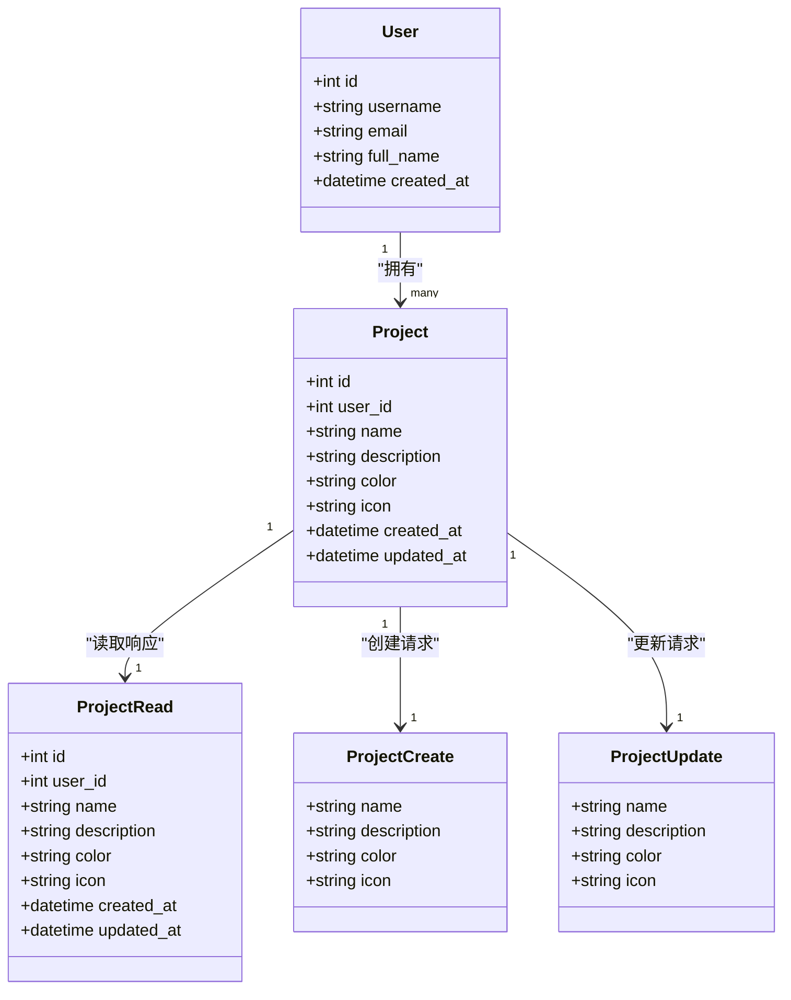
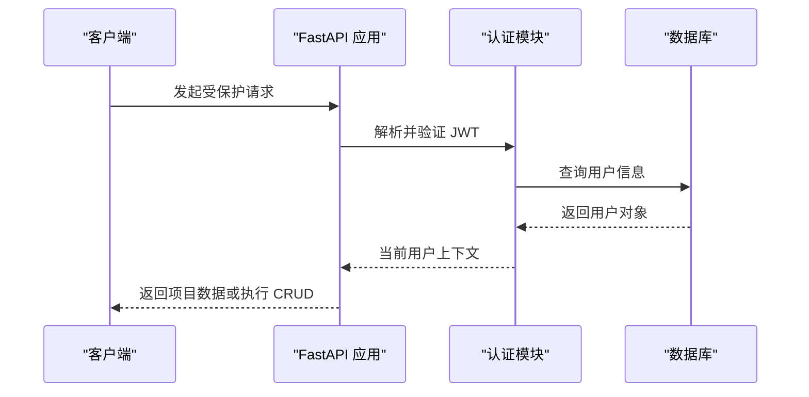
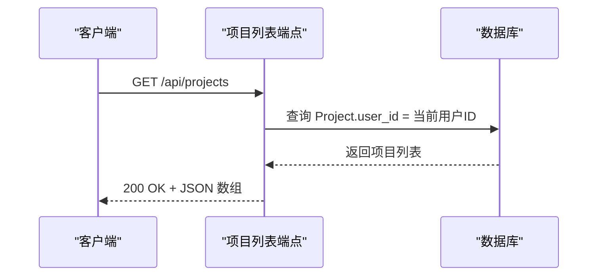
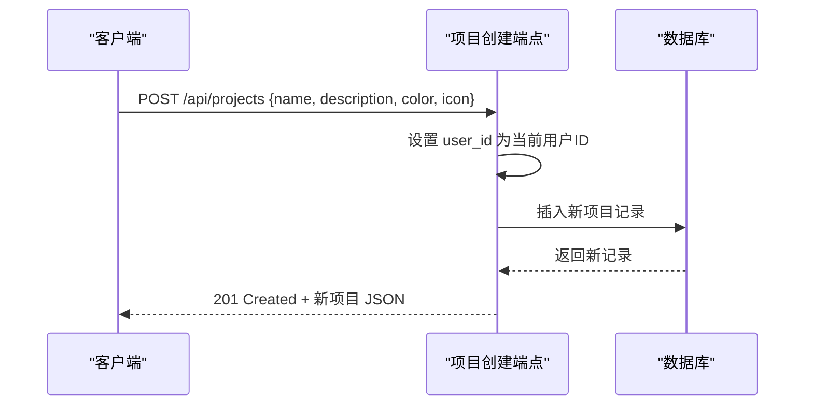
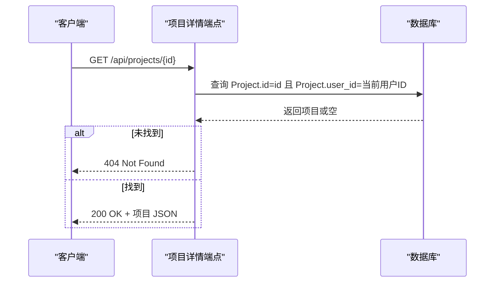
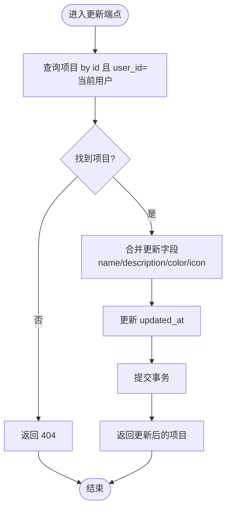
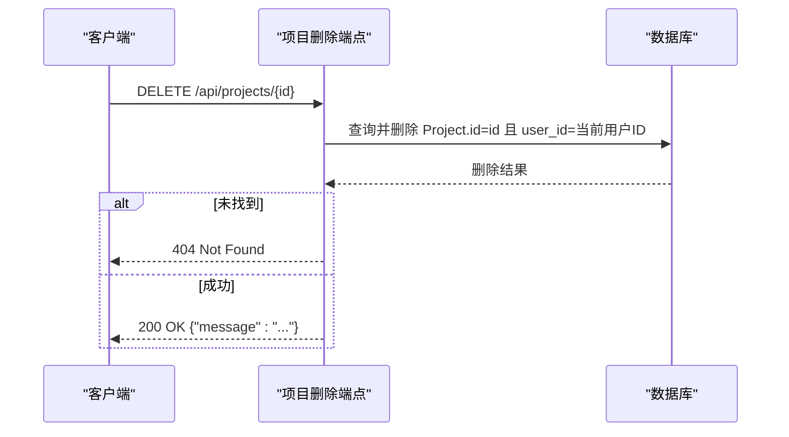
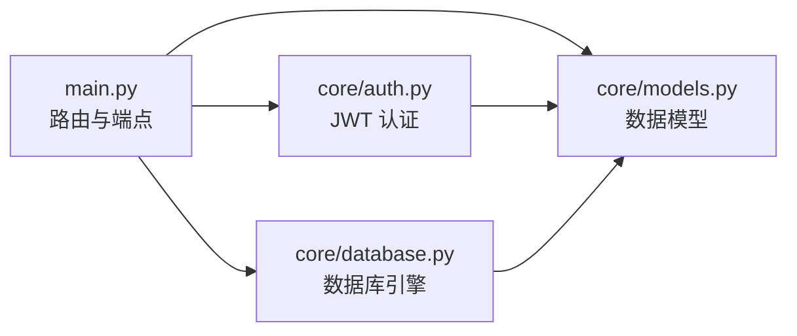

# 项目管理端点

<cite>
**本文档引用的文件**
- [main.py](file://localmanus-backend/main.py)
- [models.py](file://localmanus-backend/core/models.py)
- [database.py](file://localmanus-backend/core/database.py)
- [auth.py](file://localmanus-backend/core/auth.py)
- [seed_users.py](file://localmanus-backend/scripts/seed_users.py)
- [seed_simple.py](file://localmanus-backend/scripts/seed_simple.py)
- [MY_PROJECTS_IMPLEMENTATION.md](file://MY_PROJECTS_IMPLEMENTATION.md)
- [localmanus_architecture.md](file://localmanus_architecture.md)
</cite>

## 目录
1. [简介](#简介)
2. [项目结构](#项目结构)
3. [核心组件](#核心组件)
4. [架构总览](#架构总览)
5. [详细组件分析](#详细组件分析)
6. [依赖关系分析](#依赖关系分析)
7. [性能考虑](#性能考虑)
8. [故障排除指南](#故障排除指南)
9. [结论](#结论)
10. [附录](#附录)

## 简介
本文件面向 LocalManus 后端的项目管理 API 端点，系统性梳理以下五个端点的实现细节：
- 项目列表端点：GET /api/projects
- 项目创建端点：POST /api/projects
- 项目详情端点：GET /api/projects/{project_id}
- 项目更新端点：PUT /api/projects/{project_id}
- 项目删除端点：DELETE /api/projects/{project_id}

内容涵盖 HTTP 方法、请求参数、响应格式、项目数据模型、权限控制机制、CRUD 操作流程、用户关联、数据验证、级联删除逻辑，并提供完整的项目管理示例、前端项目面板集成、项目模板系统使用指南以及数据迁移策略。

## 项目结构
后端采用 FastAPI + SQLModel 架构，项目管理功能集中在主应用文件中，数据模型定义在核心模块，认证与权限控制通过 JWT 实现，数据库为 SQLite。

图表来源
- [main.py](file://localmanus-backend/main.py#L1-L477)
- [models.py](file://localmanus-backend/core/models.py#L1-L80)
- [database.py](file://localmanus-backend/core/database.py#L1-L17)
- [auth.py](file://localmanus-backend/core/auth.py#L1-L82)

章节来源
- [main.py](file://localmanus-backend/main.py#L1-L477)
- [models.py](file://localmanus-backend/core/models.py#L1-L80)
- [database.py](file://localmanus-backend/core/database.py#L1-L17)
- [auth.py](file://localmanus-backend/core/auth.py#L1-L82)

## 核心组件
- 项目数据模型：包含项目标识、所属用户、名称、描述、主题色、图标、创建与更新时间戳等字段。
- 项目请求/响应模型：Create、Update、Read 三种模型分别用于创建、更新与读取场景。
- 权限控制：所有项目端点均依赖 JWT 认证中间件，通过当前用户上下文限制访问范围。
- 数据库：SQLite 引擎，自动创建表结构；会话管理通过依赖注入提供。

章节来源
- [models.py](file://localmanus-backend/core/models.py#L48-L80)
- [main.py](file://localmanus-backend/main.py#L287-L391)
- [auth.py](file://localmanus-backend/core/auth.py#L55-L82)
- [database.py](file://localmanus-backend/core/database.py#L11-L17)

## 架构总览
项目管理端点在整体系统中的位置如下：

图表来源
- [main.py](file://localmanus-backend/main.py#L34-L64)
- [auth.py](file://localmanus-backend/core/auth.py#L55-L82)
- [database.py](file://localmanus-backend/core/database.py#L11-L17)

## 详细组件分析

### 项目数据模型
项目实体与相关模型定义如下：
- Project：数据库表，包含 user_id 外键、名称、描述、颜色、图标、创建与更新时间。
- ProjectCreate：创建请求模型，允许指定名称、描述、颜色、图标。
- ProjectUpdate：更新请求模型，各字段均为可选。
- ProjectRead：响应模型，包含完整项目信息。

图表来源
- [models.py](file://localmanus-backend/core/models.py#L48-L80)

章节来源
- [models.py](file://localmanus-backend/core/models.py#L48-L80)

### 权限控制机制
- 认证方式：OAuth2 密码流，登录成功后返回 JWT 访问令牌。
- 当前用户提取：通过依赖注入从 JWT 中解析用户信息，若无效则抛出未授权异常。
- 项目访问控制：所有项目端点均要求认证，并通过查询条件限制只能访问当前用户的项目记录。

图表来源
- [auth.py](file://localmanus-backend/core/auth.py#L55-L82)
- [main.py](file://localmanus-backend/main.py#L287-L391)

章节来源
- [auth.py](file://localmanus-backend/core/auth.py#L1-L82)
- [main.py](file://localmanus-backend/main.py#L287-L391)

### 项目列表端点（GET /api/projects）
- 功能：返回当前用户的所有项目。
- 请求参数：无。
- 响应：项目数组，元素为 ProjectRead。
- 权限：必须登录，按 user_id 过滤。
- 数据验证：无额外校验，直接查询数据库。

图表来源
- [main.py](file://localmanus-backend/main.py#L289-L298)
- [models.py](file://localmanus-backend/core/models.py#L48-L80)

章节来源
- [main.py](file://localmanus-backend/main.py#L289-L298)

### 项目创建端点（POST /api/projects）
- 功能：为当前用户创建新项目。
- 请求参数：ProjectCreate（name、description、color、icon）。
- 响应：创建后的项目（ProjectRead）。
- 权限：必须登录。
- 数据验证：必填字段 name；color/icon 缺省值设置为默认值。
- 业务逻辑：根据请求参数构造 Project 实体，设置 user_id，保存并刷新。

图表来源
- [main.py](file://localmanus-backend/main.py#L300-L317)
- [models.py](file://localmanus-backend/core/models.py#L59-L70)

章节来源
- [main.py](file://localmanus-backend/main.py#L300-L317)
- [models.py](file://localmanus-backend/core/models.py#L59-L70)

### 项目详情端点（GET /api/projects/{project_id}）
- 功能：按 ID 获取单个项目详情。
- 请求参数：路径参数 project_id。
- 响应：单个项目（ProjectRead）。
- 权限：必须登录，且项目属于当前用户。
- 错误处理：未找到返回 404。

图表来源
- [main.py](file://localmanus-backend/main.py#L319-L335)
- [models.py](file://localmanus-backend/core/models.py#L71-L80)

章节来源
- [main.py](file://localmanus-backend/main.py#L319-L335)

### 项目更新端点（PUT /api/projects/{project_id}）
- 功能：更新现有项目。
- 请求参数：路径参数 project_id；请求体为 ProjectUpdate（各字段可选）。
- 响应：更新后的项目（ProjectRead）。
- 权限：必须登录，且项目属于当前用户。
- 业务逻辑：逐字段判断是否为 None，非空则更新；同时更新 updated_at 时间戳。

图表来源
- [main.py](file://localmanus-backend/main.py#L337-L369)
- [models.py](file://localmanus-backend/core/models.py#L65-L69)

章节来源
- [main.py](file://localmanus-backend/main.py#L337-L369)

### 项目删除端点（DELETE /api/projects/{project_id}）
- 功能：删除指定项目。
- 请求参数：路径参数 project_id。
- 响应：成功消息。
- 权限：必须登录，且项目属于当前用户。
- 错误处理：未找到返回 404。
- 级联删除：当前实现仅删除项目记录，未定义外键级联删除规则。如需级联删除，请在数据库层面配置外键约束或在业务层补充删除逻辑。

图表来源
- [main.py](file://localmanus-backend/main.py#L371-L390)

章节来源
- [main.py](file://localmanus-backend/main.py#L371-L390)

### 前端项目面板集成
- 前端路由：/projects 页面展示项目网格，支持创建、编辑、删除操作。
- 用户交互：新建项目弹窗、编辑模态框、删除确认对话框。
- 样式与主题：支持 8 种预设颜色与图标，响应式布局。
- 边栏集成：侧边栏显示用户最近项目，点击“查看全部”跳转至项目页。

章节来源
- [MY_PROJECTS_IMPLEMENTATION.md](file://MY_PROJECTS_IMPLEMENTATION.md#L49-L121)
- [MY_PROJECTS_IMPLEMENTATION.md](file://MY_PROJECTS_IMPLEMENTATION.md#L173-L237)

### 项目模板系统使用指南
- 概念：未来增强方向包括项目模板、文件关联、协作分享、统计与搜索等功能。
- 使用建议：可在现有 ProjectCreate 基础上扩展模板字段，后端据此填充默认值与关联资源。

章节来源
- [MY_PROJECTS_IMPLEMENTATION.md](file://MY_PROJECTS_IMPLEMENTATION.md#L267-L276)

### 数据迁移策略
- 初始种子数据：提供两种脚本用于快速创建示例用户，便于测试项目管理端点。
- 迁移建议：
  - 字段扩展：如新增标签、收藏、统计字段，建议使用 SQLite ALTER TABLE 逐步添加。
  - 外键级联：如启用级联删除，需在建表时定义 ON DELETE CASCADE 或迁移后重建表。
  - 数据一致性：迁移前后保留 user_id 与项目关联不变，确保权限边界不被破坏。

章节来源
- [seed_users.py](file://localmanus-backend/scripts/seed_users.py#L10-L50)
- [seed_simple.py](file://localmanus-backend/scripts/seed_simple.py#L25-L65)

## 依赖关系分析
项目管理端点的依赖关系如下：

图表来源
- [main.py](file://localmanus-backend/main.py#L1-L477)
- [auth.py](file://localmanus-backend/core/auth.py#L1-L82)
- [database.py](file://localmanus-backend/core/database.py#L1-L17)
- [models.py](file://localmanus-backend/core/models.py#L1-L80)

章节来源
- [main.py](file://localmanus-backend/main.py#L1-L477)
- [auth.py](file://localmanus-backend/core/auth.py#L1-L82)
- [database.py](file://localmanus-backend/core/database.py#L1-L17)
- [models.py](file://localmanus-backend/core/models.py#L1-L80)

## 性能考虑
- 数据库连接：使用依赖注入的 Session，避免全局状态，减少连接泄漏风险。
- 查询优化：项目列表与详情查询均带有 user_id 过滤条件，建议在 user_id 上建立索引以提升查询效率。
- 事务处理：CRUD 操作均在单个事务中完成，保证一致性。
- 前端渲染：项目网格采用响应式布局，建议在大数据集下引入分页或虚拟滚动。

## 故障排除指南
- 401 未授权：检查 Authorization 头是否包含有效的 Bearer 令牌，确认令牌未过期。
- 403 禁止访问：当前用户与目标项目不匹配时可能出现权限问题，确认项目归属。
- 404 未找到：项目 ID 不存在或已被删除，确认 URL 路径正确。
- 500 服务器错误：数据库连接或事务异常，检查数据库文件权限与磁盘空间。

章节来源
- [auth.py](file://localmanus-backend/core/auth.py#L62-L82)
- [main.py](file://localmanus-backend/main.py#L319-L335)
- [main.py](file://localmanus-backend/main.py#L371-L390)

## 结论
LocalManus 的项目管理 API 提供了完整的用户隔离与基本 CRUD 能力，结合前端项目面板实现了良好的用户体验。当前版本未实现外键级联删除，如需更强的一致性保障，建议在数据库层面完善约束或在业务层补充清理逻辑。未来可扩展模板系统、文件关联与协作功能，进一步提升项目管理能力。

## 附录

### API 端点一览
- GET /api/projects：列出当前用户的所有项目
- POST /api/projects：创建新项目
- GET /api/projects/{project_id}：获取指定项目详情
- PUT /api/projects/{project_id}：更新项目
- DELETE /api/projects/{project_id}：删除项目

章节来源
- [main.py](file://localmanus-backend/main.py#L289-L390)

### 示例请求/响应
- 创建项目示例：见项目实现文档中的示例请求与响应格式。
- 列出项目示例：见项目实现文档中的示例请求与响应格式。

章节来源
- [MY_PROJECTS_IMPLEMENTATION.md](file://MY_PROJECTS_IMPLEMENTATION.md#L173-L237)