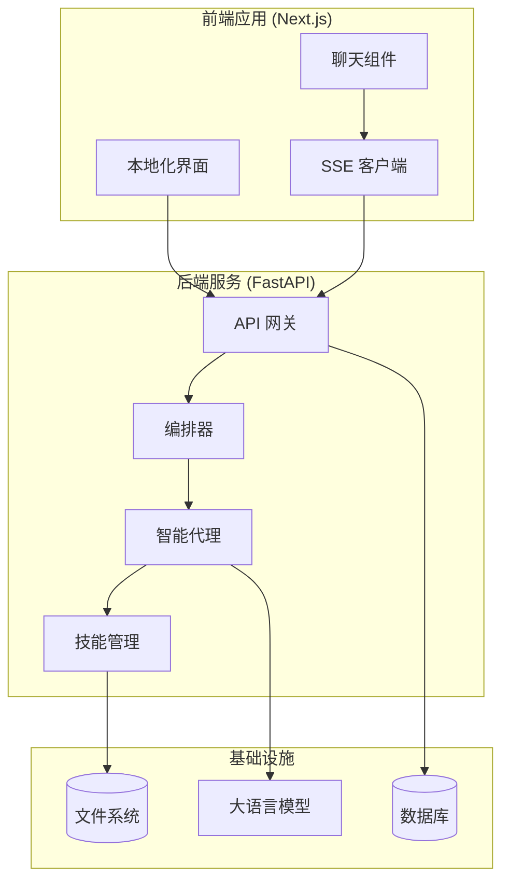
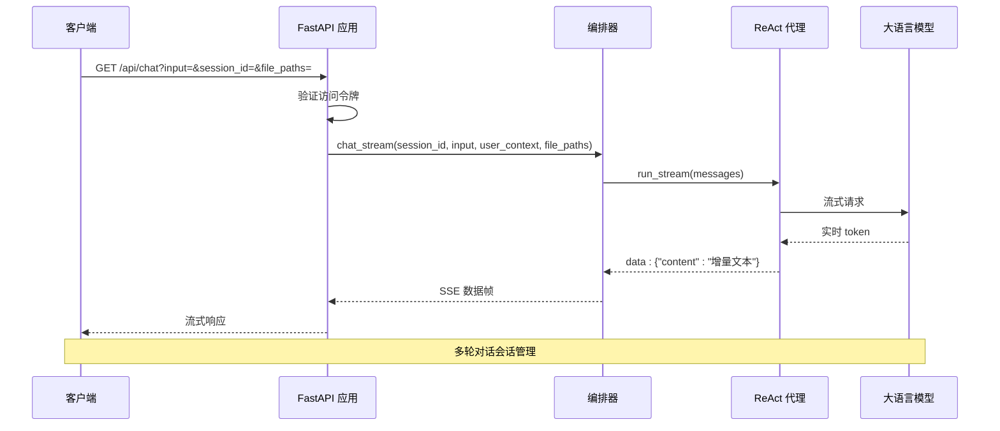
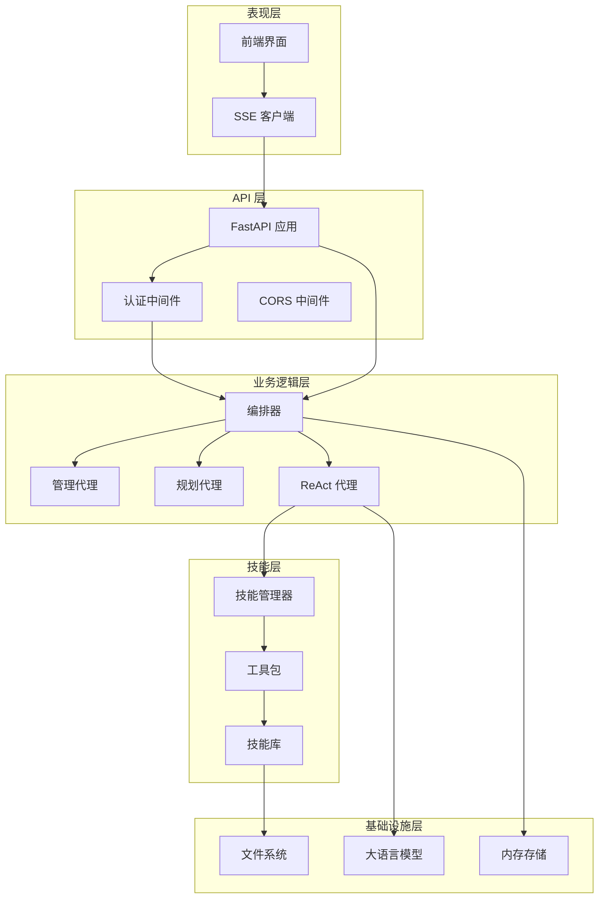
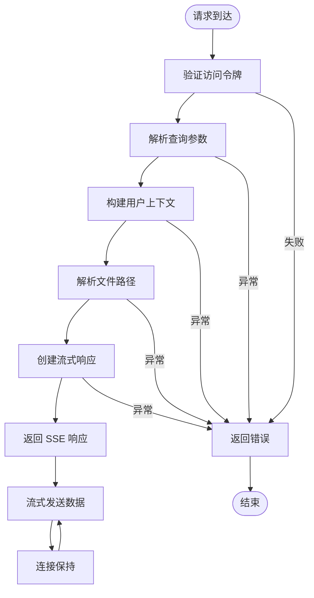
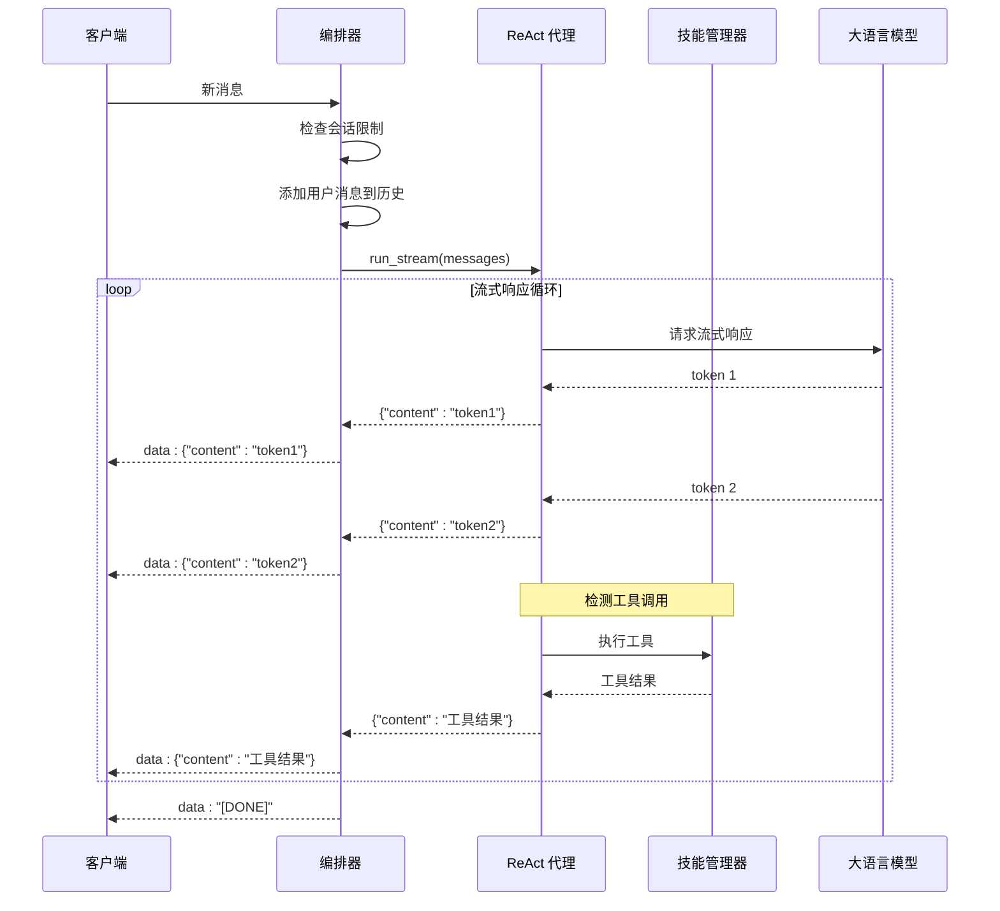
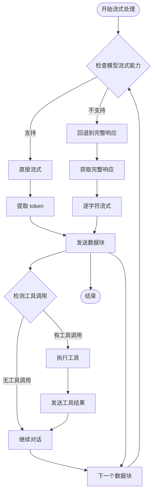
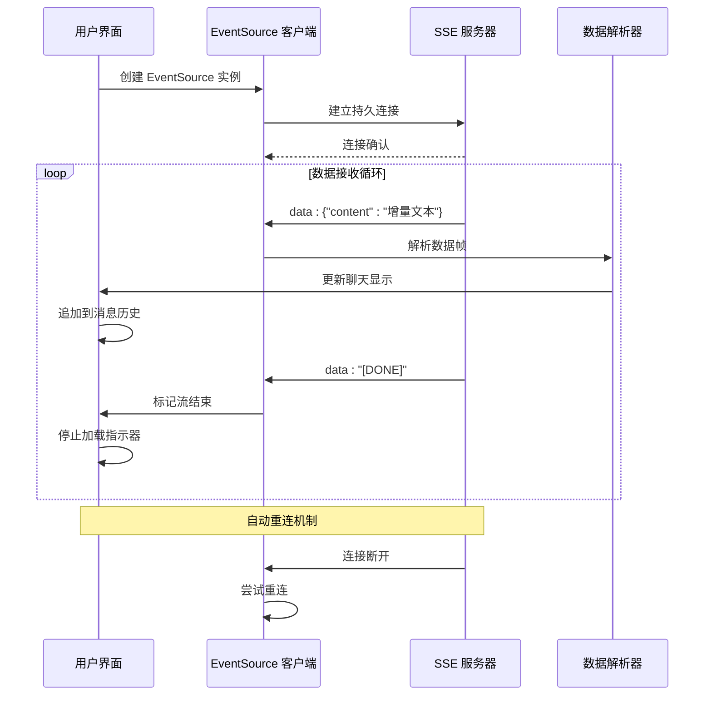
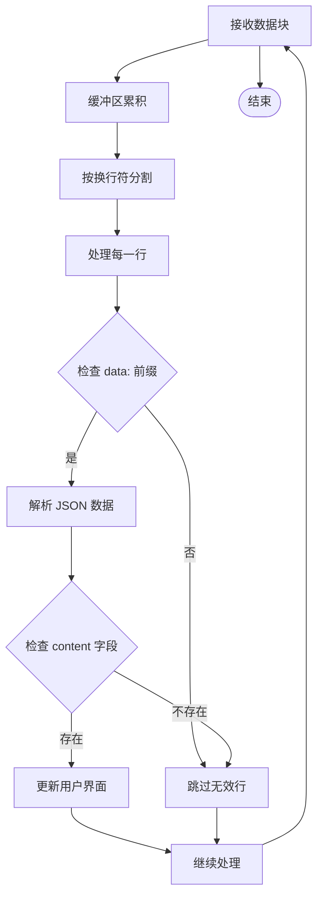
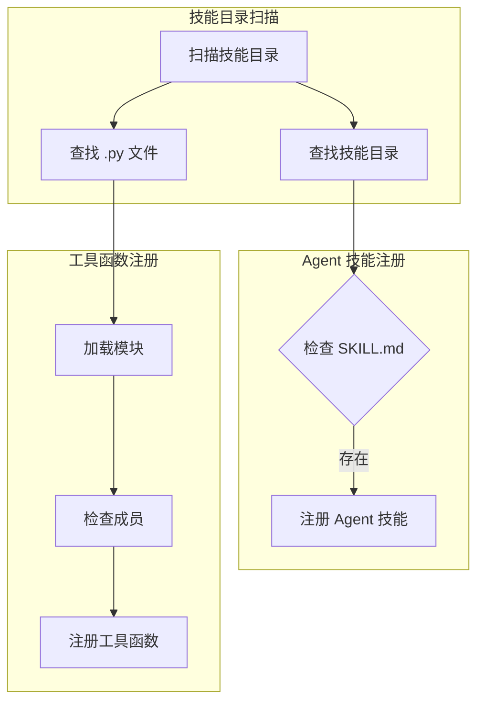
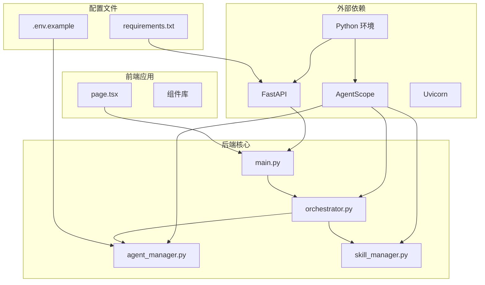

# SSE 流式传输

<cite>
**本文档引用的文件**
- [main.py](file://localmanus-backend/main.py)
- [orchestrator.py](file://localmanus-backend/core/orchestrator.py)
- [react_agent.py](file://localmanus-backend/agents/react_agent.py)
- [agent_manager.py](file://localmanus-backend/core/agent_manager.py)
- [skill_manager.py](file://localmanus-backend/core/skill_manager.py)
- [base_agents.py](file://localmanus-backend/agents/base_agents.py)
- [page.tsx](file://localmanus-ui/app/page.tsx)
- [.env.example](file://localmanus-backend/.env.example)
- [requirements.txt](file://localmanus-backend/requirements.txt)
</cite>

## 目录
1. [简介](#简介)
2. [项目结构](#项目结构)
3. [核心组件](#核心组件)
4. [架构概览](#架构概览)
5. [详细组件分析](#详细组件分析)
6. [依赖关系分析](#依赖关系分析)
7. [性能考虑](#性能考虑)
8. [故障排除指南](#故障排除指南)
9. [结论](#结论)

## 简介

LocalManus 的 SSE（Server-Sent Events）流式传输系统是一个基于 FastAPI 和 AgentScope 架构的实时聊天对话平台。该系统实现了真正的流式响应，允许服务器向客户端推送实时更新，特别适用于需要即时反馈的 AI 对话场景。

SSE 协议通过持久化的 HTTP 连接实现服务器到客户端的单向数据传输，支持自动重连、事件类型标识和数据编码等特性。在 LocalManus 中，SSE 被用于实现多轮对话的实时流式响应，包括文本生成、工具调用执行和状态更新。

## 项目结构

LocalManus 采用分层架构设计，主要分为后端服务层和前端界面层：

**图表来源**
- [main.py](file://localmanus-backend/main.py#L34-L477)
- [orchestrator.py](file://localmanus-backend/core/orchestrator.py#L11-L150)
- [react_agent.py](file://localmanus-backend/agents/react_agent.py#L20-L349)

**章节来源**
- [main.py](file://localmanus-backend/main.py#L1-L477)
- [requirements.txt](file://localmanus-backend/requirements.txt#L1-L14)

## 核心组件

### SSE 端点实现

系统的核心是 `/api/chat` 端点，它提供了完整的流式聊天功能：

**图表来源**
- [main.py](file://localmanus-backend/main.py#L392-L421)
- [orchestrator.py](file://localmanus-backend/core/orchestrator.py#L16-L96)
- [react_agent.py](file://localmanus-backend/agents/react_agent.py#L53-L215)

### 会话管理系统

系统实现了基于内存的会话管理，支持多轮对话的历史记录维护：

| 组件 | 功能 | 特性 |
|------|------|------|
| **会话存储** | 存储对话历史 | 基于字典的内存存储，支持并发访问 |
| **历史同步** | 自动同步消息 | 内部协议 `_sync` 用于历史同步 |
| **轮次限制** | 控制对话长度 | 默认最大 40 轮对话 |
| **上下文传递** | 用户信息传递 | 包含用户 ID、用户名、全名 |

**章节来源**
- [orchestrator.py](file://localmanus-backend/core/orchestrator.py#L14-L96)

## 架构概览

LocalManus 的 SSE 架构采用了分层设计模式，确保了系统的可扩展性和可维护性：

**图表来源**
- [main.py](file://localmanus-backend/main.py#L34-L477)
- [agent_manager.py](file://localmanus-backend/core/agent_manager.py#L11-L49)
- [skill_manager.py](file://localmanus-backend/core/skill_manager.py#L18-L143)

## 详细组件分析

### 1. 后端 SSE 端点实现

#### 主要端点定义

`/api/chat` 端点是 SSE 流式传输的核心入口：

**图表来源**
- [main.py](file://localmanus-backend/main.py#L392-L421)

#### 参数处理机制

| 参数 | 类型 | 必需 | 描述 | 示例 |
|------|------|------|------|------|
| **input** | 字符串 | 是 | 用户输入的文本内容 | "如何使用文件操作技能？" |
| **session_id** | 字符串 | 否 | 会话标识符，默认 "default" | "session_12345" |
| **file_paths** | 字符串 | 否 | 逗号分隔的文件路径列表 | "/uploads/1/file1.txt,/uploads/2/file2.pdf" |
| **access_token** | 字符串 | 否 | 访问令牌（查询参数） | JWT 令牌 |

**章节来源**
- [main.py](file://localmanus-backend/main.py#L392-L421)

### 2. 编排器核心逻辑

#### 流式聊天处理流程

编排器负责协调整个流式聊天过程，实现了复杂的多轮对话管理：

**图表来源**
- [orchestrator.py](file://localmanus-backend/core/orchestrator.py#L16-L96)
- [react_agent.py](file://localmanus-backend/agents/react_agent.py#L53-L215)

#### 内部协议设计

编排器实现了特殊的内部通信协议，用于区分用户可见内容和内部状态：

| 协议键 | 类型 | 用途 | 示例 |
|--------|------|------|------|
| **content** | 字符串 | 用户可见的文本内容 | `"这是流式生成的文本"` |
| **_sync** | 数组 | 内部消息同步，不发送给前端 | `[{"role": "assistant", "content": "..."}]` |
| **_meta** | 对象 | 运行元数据，用于日志记录 | `{"tool_calls_made": true}` |

**章节来源**
- [orchestrator.py](file://localmanus-backend/core/orchestrator.py#L16-L96)

### 3. ReAct 代理流式实现

#### 流式响应优化策略

ReAct 代理实现了多种流式响应优化策略，确保最佳用户体验：

**图表来源**
- [react_agent.py](file://localmanus-backend/agents/react_agent.py#L53-L215)

#### 工具调用检测机制

代理能够从流式响应中检测工具调用，提供更准确的工具执行时机：

| 检测方式 | 支持格式 | 优先级 |
|----------|----------|--------|
| **流式块检测** | OpenAI 格式 `choices[0].delta.tool_calls` | 最高 |
| **对象属性检测** | `chunk.tool_calls` 属性 | 中等 |
| **回退解析** | 结构化响应重新解析 | 最低 |

**章节来源**
- [react_agent.py](file://localmanus-backend/agents/react_agent.py#L216-L254)

### 4. 前端 SSE 客户端实现

#### 客户端事件监听机制

前端使用标准的 EventSource API 来处理服务器推送的数据：

**图表来源**
- [page.tsx](file://localmanus-ui/app/page.tsx#L89-L131)

#### 数据解析流程

前端实现了健壮的数据解析机制来处理各种 SSE 格式：

**图表来源**
- [page.tsx](file://localmanus-ui/app/page.tsx#L93-L131)

**章节来源**
- [page.tsx](file://localmanus-ui/app/page.tsx#L43-L141)

### 5. 技能管理器集成

#### 工具函数注册机制

技能管理器负责动态加载和注册各种工具函数：

**图表来源**
- [skill_manager.py](file://localmanus-backend/core/skill_manager.py#L29-L89)

**章节来源**
- [skill_manager.py](file://localmanus-backend/core/skill_manager.py#L18-L143)

## 依赖关系分析

### 核心依赖图

**图表来源**
- [main.py](file://localmanus-backend/main.py#L1-L28)
- [agent_manager.py](file://localmanus-backend/core/agent_manager.py#L1-L10)
- [requirements.txt](file://localmanus-backend/requirements.txt#L1-L14)

### 模块间交互关系

| 模块 | 依赖模块 | 交互类型 | 用途 |
|------|----------|----------|------|
| **main.py** | FastAPI, StreamingResponse | 导入 | API 端点定义 |
| **orchestrator.py** | ReActAgent, Msg | 组合 | 业务逻辑编排 |
| **react_agent.py** | AgentScope, Toolkit | 继承 | AI 代理实现 |
| **agent_manager.py** | OpenAIChatModel | 组合 | 模型和工具初始化 |
| **skill_manager.py** | Toolkit, BaseSkill | 组合 | 技能动态加载 |
| **page.tsx** | EventSource, fetch | 使用 | 客户端 SSE 处理 |

**章节来源**
- [main.py](file://localmanus-backend/main.py#L1-L28)
- [agent_manager.py](file://localmanus-backend/core/agent_manager.py#L1-L10)

## 性能考虑

### 流式传输优化策略

#### 1. 内存管理优化

- **会话限制**：默认最多 40 轮对话，防止内存无限增长
- **异步生成器**：使用 `AsyncGenerator` 实现内存友好的流式处理
- **及时清理**：工具调用完成后及时清理临时数据

#### 2. 网络传输优化

- **最小化数据包**：每个 token 作为独立数据包发送
- **压缩传输**：使用 JSON 格式进行高效序列化
- **连接复用**：单个 HTTP 连接支持多轮对话

#### 3. 并发处理优化

- **非阻塞 I/O**：所有操作都是异步的，避免阻塞主线程
- **事件循环调度**：使用 `await asyncio.sleep(0)` 让出控制权
- **资源池管理**：模型实例和工具函数的统一管理

### 生产环境部署建议

#### Nginx 反向代理配置

对于生产环境，建议使用 Nginx 作为反向代理：

| 配置项 | 值 | 说明 |
|--------|----|------|
| **proxy_buffering** | off | 关闭缓冲以支持实时流式传输 |
| **proxy_cache** | off | 禁用缓存避免延迟 |
| **proxy_read_timeout** | 86400 | 设置长超时时间支持长时间连接 |
| **proxy_http_version** | 1.1 | 使用 HTTP/1.1 支持持久连接 |

**章节来源**
- [PRODUCTION_DEPLOYMENT.md](file://PRODUCTION_DEPLOYMENT.md#L196-L210)

## 故障排除指南

### 常见问题及解决方案

#### 1. SSE 连接问题

**问题症状**：
- 页面无法建立 SSE 连接
- 控制台出现网络错误

**可能原因**：
- CORS 配置不正确
- 访问令牌验证失败
- 服务器端口配置错误

**解决方案**：
- 检查 CORS 中间件配置
- 验证访问令牌有效性
- 确认服务器端口和防火墙设置

#### 2. 流式响应中断

**问题症状**：
- 文本显示不完整
- 连接意外断开

**可能原因**：
- 服务器超时设置过短
- 网络不稳定
- 客户端解析错误

**解决方案**：
- 增加 Nginx 的 `proxy_read_timeout`
- 检查网络连接稳定性
- 验证客户端数据解析逻辑

#### 3. 工具调用失败

**问题症状**：
- 工具执行结果显示错误
- 代理无法找到可用工具

**可能原因**：
- 技能目录配置错误
- 工具函数签名不匹配
- 文件权限问题

**解决方案**：
- 检查技能目录结构
- 验证工具函数签名
- 确认文件系统权限

### 调试技巧

#### 1. 服务器端调试

启用详细的日志记录：
- 在 `main.py` 中设置 `logging.basicConfig(level=logging.DEBUG)`
- 监控编排器的日志输出
- 检查 ReAct 代理的内部协议日志

#### 2. 客户端调试

使用浏览器开发者工具：
- 查看 Network 标签中的 SSE 连接
- 监控 Console 输出的错误信息
- 使用 Application 标签检查本地存储

#### 3. 性能监控

监控关键指标：
- SSE 连接数
- 消息处理延迟
- 内存使用情况
- 错误率统计

**章节来源**
- [main.py](file://localmanus-backend/main.py#L29-L31)
- [orchestrator.py](file://localmanus-backend/core/orchestrator.py#L9-L10)

## 结论

LocalManus 的 SSE 流式传输系统展现了现代 AI 应用的最佳实践，通过以下关键特性实现了优秀的用户体验：

### 核心优势

1. **实时性**：真正的流式响应，提供即时的用户反馈
2. **可靠性**：完善的错误处理和自动重连机制
3. **可扩展性**：模块化的架构设计支持功能扩展
4. **易用性**：简洁的 API 接口和标准的 SSE 协议

### 技术亮点

- **多轮对话支持**：基于内存的会话管理，支持上下文保持
- **智能工具集成**：动态技能加载和工具调用执行
- **流式优化**：多种流式响应策略确保最佳性能
- **安全保证**：完整的认证授权和 CORS 配置

### 发展方向

未来可以考虑的功能增强：
- **持久化会话**：将对话历史存储到数据库
- **并发优化**：支持多用户并发流式处理
- **缓存机制**：实现智能缓存减少重复计算
- **监控告警**：添加完整的性能监控和告警系统

这个 SSE 系统为 LocalManus 提供了强大的实时通信能力，是构建现代 AI 应用的重要基础设施。