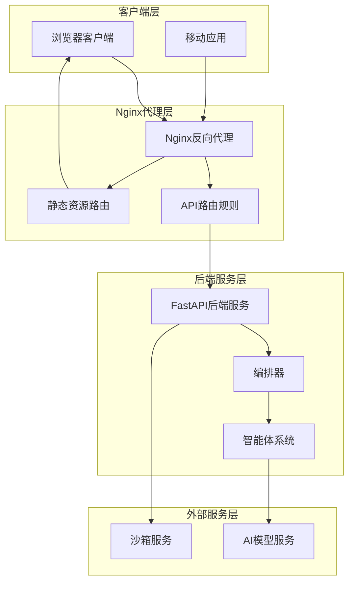
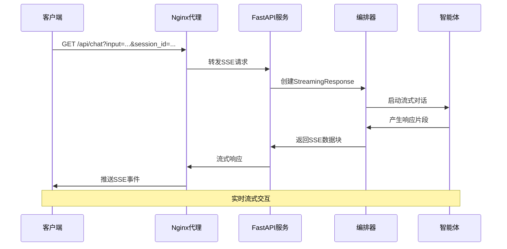
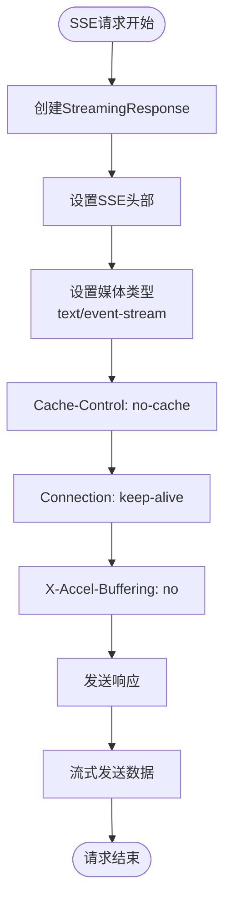
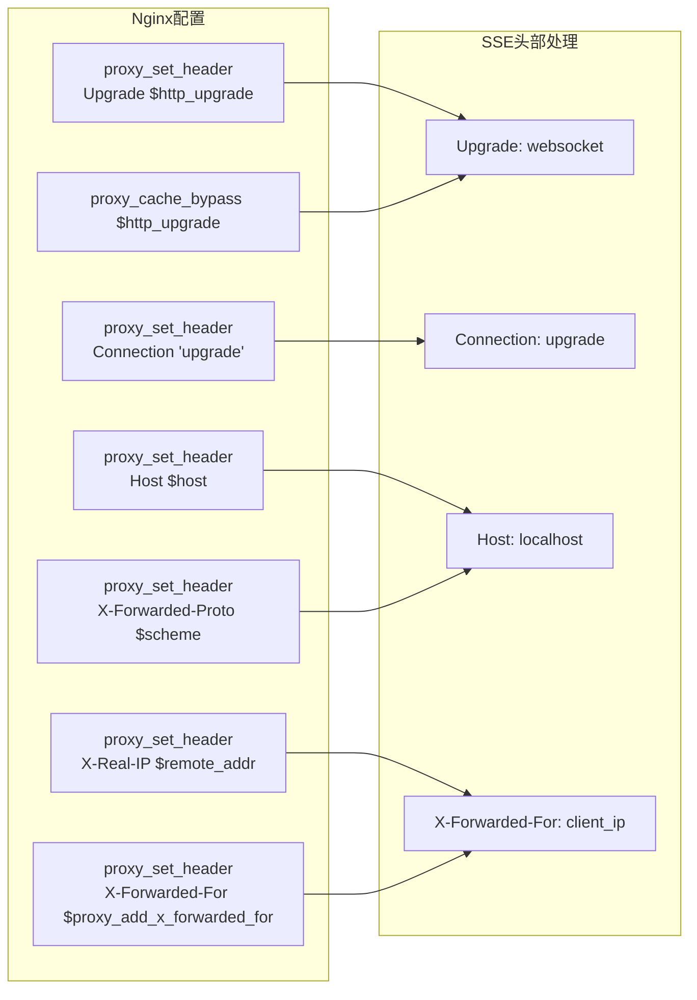
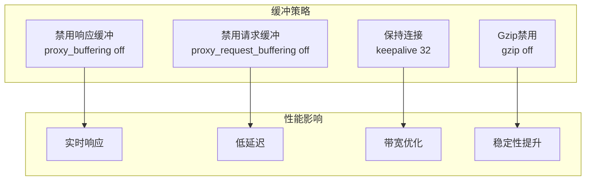
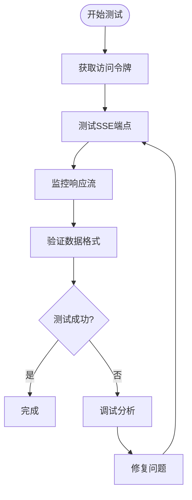

# SSE头部配置优化

<cite>
**本文档引用的文件**
- [main.py](file://localmanus-backend/main.py)
- [nginx.conf](file://nginx/nginx.conf)
- [nginx.prod.conf](file://nginx/nginx.prod.conf)
- [test_chat_sse.py](file://localmanus-backend/test_chat_sse.py)
- [orchestrator.py](file://localmanus-backend/core/orchestrator.py)
- [README.md](file://nginx/README.md)
</cite>

## 目录
1. [简介](#简介)
2. [项目架构概览](#项目架构概览)
3. [SSE流式响应机制](#sse流式响应机制)
4. [头部配置分析](#头部配置分析)
5. [Nginx代理配置优化](#nginx代理配置优化)
6. [性能优化策略](#性能优化策略)
7. [故障排除指南](#故障排除指南)
8. [最佳实践建议](#最佳实践建议)
9. [总结](#总结)

## 简介

本文件专注于LocalManus项目的SSE（Server-Sent Events）头部配置优化，这是一个实时流式通信技术，用于实现后端与前端之间的双向数据传输。在LocalManus项目中，SSE主要用于聊天对话的实时响应，提供流畅的用户体验。

SSE技术通过HTTP连接持续推送数据，特别适合需要服务器向客户端推送更新的应用场景，如聊天应用、实时通知、数据监控等。在本项目中，SSE实现了多轮对话的流式响应，用户可以实时看到AI助手的回复过程。

## 项目架构概览

LocalManus采用前后端分离的架构设计，使用Nginx作为反向代理服务器，负责路由请求到相应的服务。



**图表来源**
- [main.py](file://localmanus-backend/main.py#L391-L424)
- [nginx.conf](file://nginx/nginx.conf#L35-L66)

## SSE流式响应机制

### SSE端点实现

项目中的SSE功能通过`/api/chat`端点实现，该端点支持多轮对话和文件上下文传递。



**图表来源**
- [main.py](file://localmanus-backend/main.py#L391-L424)
- [orchestrator.py](file://localmanus-backend/core/orchestrator.py#L17-L150)

### SSE数据格式规范

SSE响应遵循标准的事件格式，每个数据块包含JSON格式的内容：

| 字段 | 类型 | 描述 | 示例 |
|------|------|------|------|
| content | string | 用户可见的文本内容 | "Hello, how can I help you?" |
| thinking | string | 内部思考过程（不显示给用户） | "需要分析用户需求..." |
| _sync | array | 内部同步消息（不显示给用户） | [{"role":"assistant","content":"..."}] |
| _meta | object | 运行元数据（不显示给用户） | {"trace_id":"uuid"} |

### 头部配置详解

项目中SSE端点的关键头部配置包括：

1. **Cache-Control: no-cache** - 禁用缓存，确保实时性
2. **Connection: keep-alive** - 维持连接活跃状态
3. **X-Accel-Buffering: no** - 在Nginx中禁用缓冲（针对特定环境）

**章节来源**
- [main.py](file://localmanus-backend/main.py#L416-L424)

## 头部配置分析

### FastAPI端点头部配置

在FastAPI中，SSE端点通过`StreamingResponse`类设置响应头：



**图表来源**
- [main.py](file://localmanus-backend/main.py#L416-L424)

### Nginx代理头部处理

Nginx作为反向代理，需要正确处理SSE相关的头部信息：



**图表来源**
- [nginx.conf](file://nginx/nginx.conf#L25-L32)
- [nginx.prod.conf](file://nginx/nginx.prod.conf#L53-L60)

**章节来源**
- [nginx.conf](file://nginx/nginx.conf#L25-L32)
- [nginx.prod.conf](file://nginx/nginx.prod.conf#L53-L60)

## Nginx代理配置优化

### 开发环境配置

开发环境使用`nginx.conf`，主要特点：
- 端口监听：80
- 反向代理：backend:8000
- 静态资源：ui:3000
- SSE支持：禁用缓冲

### 生产环境配置

生产环境使用`nginx.prod.conf`，包含更多优化：
- 端口监听：80（可配置为1243）
- keepalive连接：32个持久连接
- 压缩：gzip启用
- 安全头：X-Frame-Options、X-Content-Type-Options等
- SSE优化：完全禁用缓冲

### 关键优化参数

| 参数 | 开发配置 | 生产配置 | 说明 |
|------|----------|----------|------|
| proxy_buffering | off | off | 禁用缓冲以支持SSE |
| proxy_request_buffering | off | off | 禁用请求缓冲 |
| proxy_read_timeout | 300s | 300s | 读取超时时间 |
| proxy_connect_timeout | 75s | 75s | 连接超时时间 |
| proxy_send_timeout | 300s | 300s | 发送超时时间 |
| keepalive | 未设置 | 32 | 持久连接数量 |

**章节来源**
- [nginx.conf](file://nginx/nginx.conf#L62-L75)
- [nginx.prod.conf](file://nginx/nginx.prod.conf#L62-L75)

## 性能优化策略

### 缓冲区优化

SSE流式传输需要禁用Nginx的缓冲机制，以确保实时性：



### 连接管理优化

生产环境的连接管理策略：
- **keepalive连接**：32个持久连接减少连接建立开销
- **连接限制**：每IP最多10个并发连接
- **超时配置**：合理的超时设置避免资源浪费

### 安全性考虑

生产环境的安全增强：
- **安全头**：X-Frame-Options、X-Content-Type-Options、X-XSS-Protection
- **速率限制**：API端点20r/s，登录端点5r/m
- **连接限制**：防止DDoS攻击

**章节来源**
- [nginx.prod.conf](file://nginx/nginx.prod.conf#L21-L26)
- [nginx.prod.conf](file://nginx/nginx.prod.conf#L42-L46)

## 故障排除指南

### 常见问题及解决方案

| 问题类型 | 症状 | 可能原因 | 解决方案 |
|----------|------|----------|----------|
| SSE连接中断 | 页面无响应 | 缓冲配置错误 | 检查proxy_buffering设置 |
| 响应延迟 | 对话卡顿 | 超时设置过短 | 调整proxy_read_timeout |
| 502错误 | 请求失败 | 后端服务不可达 | 检查容器状态 |
| 429错误 | 请求被限流 | 速率限制触发 | 调整limit_req配置 |
| 504错误 | 网关超时 | 连接超时 | 增加超时时间 |

### 调试方法

使用提供的测试脚本进行SSE功能验证：



**图表来源**
- [test_chat_sse.py](file://localmanus-backend/test_chat_sse.py#L60-L115)

**章节来源**
- [test_chat_sse.py](file://localmanus-backend/test_chat_sse.py#L30-L58)
- [test_chat_sse.py](file://localmanus-backend/test_chat_sse.py#L83-L115)

## 最佳实践建议

### 头部配置最佳实践

1. **SSE专用头部**
   - 始终设置`Cache-Control: no-cache`
   - 保持`Connection: keep-alive`
   - 在Nginx环境中设置`X-Accel-Buffering: no`

2. **代理头部处理**
   - 正确传递`Upgrade`和`Connection`头部
   - 设置适当的`Host`和`X-Forwarded-For`头部
   - 使用`proxy_cache_bypass $http_upgrade`

3. **超时配置**
   - 根据业务需求调整超时时间
   - 长轮询场景适当增加超时值
   - 监控超时统计进行优化

### 性能监控指标

| 指标类型 | 目标值 | 监控方法 |
|----------|--------|----------|
| SSE连接数 | 保持稳定 | Nginx状态页 |
| 响应时间 | <100ms | 应用日志 |
| 错误率 | <0.1% | 监控告警 |
| 缓冲命中率 | 0% | Nginx统计 |

### 安全配置建议

1. **CORS配置**
   ```python
   app.add_middleware(
       CORSMiddleware,
       allow_origins=["*"],
       allow_credentials=True,
       allow_methods=["*"],
       allow_headers=["*"],
   )
   ```

2. **速率限制**
   - API端点：20r/s，burst=50
   - 登录端点：5r/m，burst=3
   - 连接限制：每IP 10个并发连接

3. **健康检查**
   - Nginx健康检查：`/health`
   - 后端健康检查：`/api/health`

**章节来源**
- [main.py](file://localmanus-backend/main.py#L51-L58)
- [nginx.prod.conf](file://nginx/nginx.prod.conf#L21-L26)
- [nginx.prod.conf](file://nginx/nginx.prod.conf#L83-L87)

## 总结

SSE头部配置优化是确保实时流式通信正常运行的关键因素。通过合理的头部配置、Nginx代理设置和性能优化策略，可以实现稳定可靠的SSE服务。

### 关键要点回顾

1. **头部配置的重要性**
   - `Cache-Control: no-cache`确保实时性
   - `Connection: keep-alive`维持连接
   - `X-Accel-Buffering: no`禁用缓冲

2. **Nginx代理优化**
   - 完全禁用SSE相关的缓冲
   - 正确处理升级头部
   - 合理的超时配置

3. **生产环境考虑**
   - 安全头配置
   - 速率限制和连接限制
   - 性能监控和日志记录

通过遵循这些最佳实践，可以构建高性能、稳定的SSE服务，为用户提供流畅的实时交互体验。