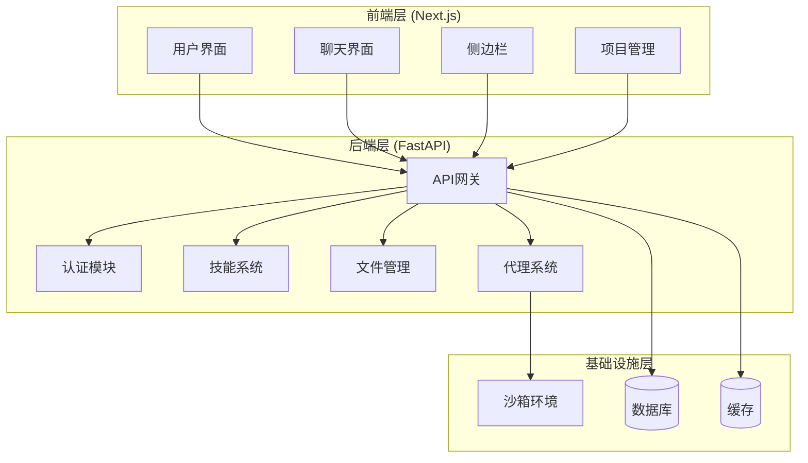
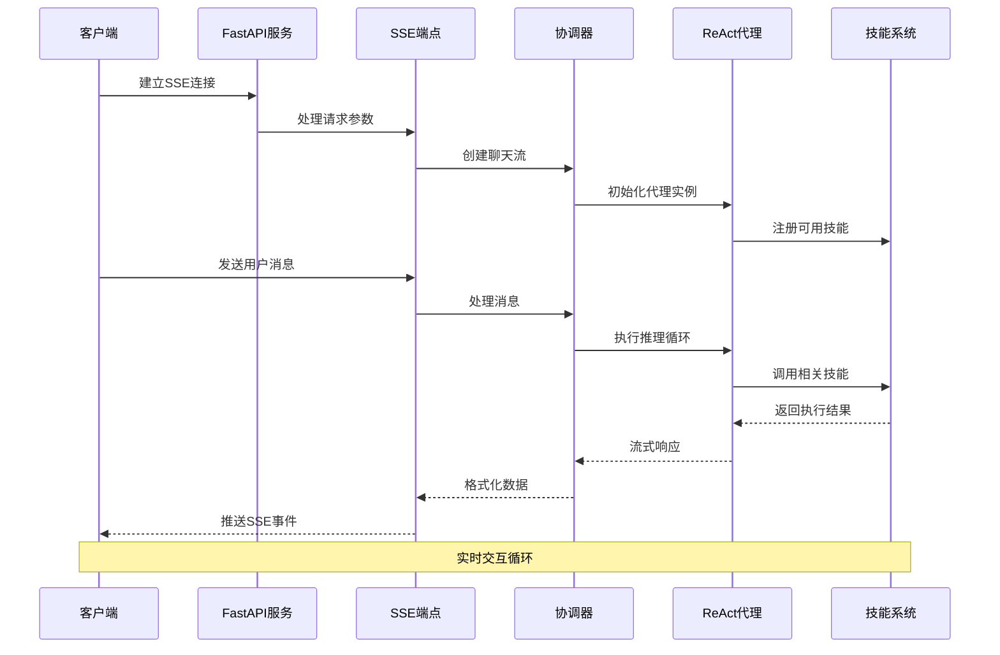
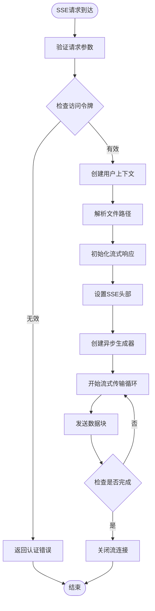
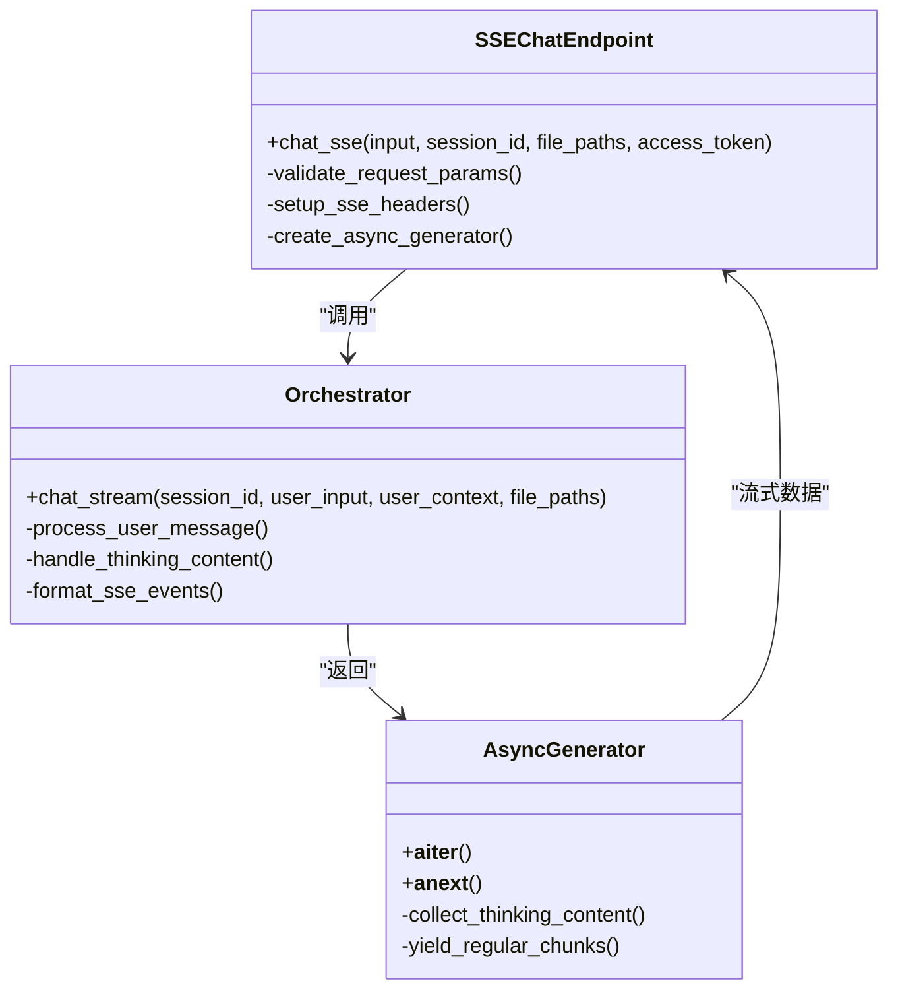
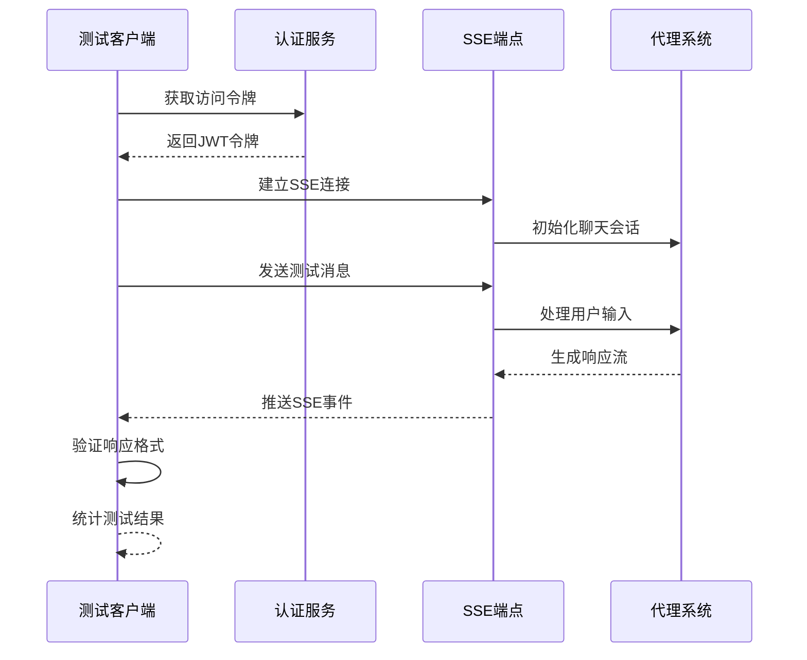
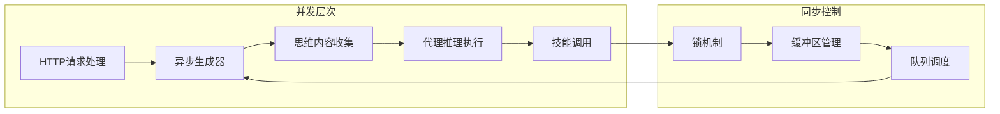

# SSE流式传输学习示例

<cite>
**本文档中引用的文件**
- [main.py](file://localmanus-backend/main.py)
- [streaming.py](file://localmanus-backend/learning/streaming.py)
- [test_chat_sse.py](file://localmanus-backend/test_chat_sse.py)
- [orchestrator.py](file://localmanus-backend/core/orchestrator.py)
- [agent_manager.py](file://localmanus-backend/core/agent_manager.py)
- [moonshot_formatter.py](file://localmanus-backend/core/moonshot_formatter.py)
- [requirements.txt](file://localmanus-backend/requirements.txt)
- [web-search SKILL.md](file://localmanus-backend/skills/web-search/SKILL.md)
- [system-execution SKILL.md](file://localmanus-backend/skills/system-execution/SKILL.md)
- [README.md](file://README.md)
</cite>

## 目录
1. [简介](#简介)
2. [项目结构](#项目结构)
3. [核心组件](#核心组件)
4. [架构概览](#架构概览)
5. [详细组件分析](#详细组件分析)
6. [SSE流式传输实现](#sse流式传输实现)
7. [测试与验证](#测试与验证)
8. [性能考虑](#性能考虑)
9. [故障排除指南](#故障排除指南)
10. [结论](#结论)

## 简介

本项目是一个基于FastAPI的SSE（Server-Sent Events）流式传输学习示例，展示了如何在本地AI代理平台中实现实时聊天功能。该项目集成了多代理系统、技能管理、文件操作和浏览器自动化等核心功能，为开发者提供了一个完整的流式传输解决方案。

SSE技术允许服务器向客户端推送实时更新，特别适用于聊天应用、数据监控和实时通知等场景。本示例通过异步生成器和StreamingResponse实现了高效的双向通信。

## 项目结构

LocalManus是一个现代化的AI代理平台，采用前后端分离架构，包含以下主要组件：

**图表来源**
- [main.py](file://localmanus-backend/main.py#L33-L524)
- [README.md](file://README.md#L35-L61)

**章节来源**
- [main.py](file://localmanus-backend/main.py#L1-L524)
- [README.md](file://README.md#L1-L312)

## 核心组件

### 1. FastAPI应用入口

主应用文件定义了完整的API路由和服务配置，包括认证、文件管理、技能管理和代理协调等功能。

### 2. SSE聊天端点

专门设计的SSE端点支持实时聊天功能，能够处理多轮对话和文件上下文。

### 3. 代理协调器

负责管理多个AI代理（Manager、Planner、ReAct）的协作，实现复杂的任务执行流程。

### 4. 技能管理系统

提供可扩展的技能框架，支持网页搜索、文件操作、系统执行等多种能力。

**章节来源**
- [main.py](file://localmanus-backend/main.py#L391-L424)
- [orchestrator.py](file://localmanus-backend/core/orchestrator.py#L12-L162)

## 架构概览

系统采用分层架构设计，确保各组件之间的松耦合和高内聚：

**图表来源**
- [main.py](file://localmanus-backend/main.py#L391-L424)
- [orchestrator.py](file://localmanus-backend/core/orchestrator.py#L17-L162)

## 详细组件分析

### SSE聊天端点实现

SSE端点是整个系统的实时通信核心，提供了完整的多轮对话支持：

#### 主要特性
- **实时流式响应**：使用`StreamingResponse`实现低延迟的数据传输
- **会话管理**：支持多轮对话的历史记录维护
- **文件上下文**：允许用户上传文件并将其作为对话上下文
- **身份验证**：集成JWT令牌进行安全访问控制

#### 关键实现细节

**图表来源**
- [main.py](file://localmanus-backend/main.py#L391-L424)

**章节来源**
- [main.py](file://localmanus-backend/main.py#L391-L424)

### 代理协调器架构

协调器是多代理系统的核心控制器，负责管理代理生命周期和任务分配：

#### 核心功能
- **会话状态管理**：维护每个会话的历史记录和上下文
- **代理初始化**：协调Manager、Planner和ReAct代理的启动
- **流式响应处理**：实现异步内容生成和思维过程输出
- **错误处理**：提供健壮的异常捕获和恢复机制

#### 内部协议设计

协调器实现了自定义的内部通信协议，用于区分不同类型的消息：

| 协议类型 | 数据格式 | 用途 | 是否发送给前端 |
|---------|---------|------|---------------|
| `content` | `{"content": string}` | 用户可见的文本内容 | ✅ 是 |
| `_sync` | `{"_sync": array}` | 同步消息到会话历史 | ❌ 否 |
| `_meta` | `{"_meta": object}` | 运行元数据 | ❌ 否 |
| `thinking` | `{"thinking": string}` | 代理思考过程 | ✅ 是 |

**章节来源**
- [orchestrator.py](file://localmanus-backend/core/orchestrator.py#L17-L162)

### 技能系统集成

技能系统为代理提供了丰富的外部能力，支持多种类型的工具调用：

#### 支持的技能类型

| 技能名称 | 功能描述 | 主要用途 |
|---------|---------|----------|
| `web-search` | 网页搜索和内容提取 | 信息检索和研究辅助 |
| `file-operations` | 文件读写和管理 | 文档处理和数据分析 |
| `system-execution` | Python代码和Shell命令执行 | 自动化脚本和系统管理 |
| `gen-web` | Web项目生成 | 应用程序开发辅助 |

**章节来源**
- [web-search SKILL.md](file://localmanus-backend/skills/web-search/SKILL.md#L1-L190)
- [system-execution SKILL.md](file://localmanus-backend/skills/system-execution/SKILL.md#L1-L27)

## SSE流式传输实现

### 异步生成器模式

SSE流式传输基于Python的异步生成器模式，实现了高效的内存管理和响应速度：

#### 核心实现原理

**图表来源**
- [main.py](file://localmanus-backend/main.py#L391-L424)
- [orchestrator.py](file://localmanus-backend/core/orchestrator.py#L17-L162)

### 思维内容处理机制

为了提供更好的用户体验，系统实现了思维过程的实时展示：

#### 实现策略
- **并发收集**：使用异步队列收集代理的思考内容
- **缓冲管理**：通过锁机制确保线程安全的缓冲区操作
- **优先级调度**：思维内容优先于普通内容发送
- **超时处理**：防止长时间阻塞导致的性能问题

**章节来源**
- [orchestrator.py](file://localmanus-backend/core/orchestrator.py#L45-L149)

## 测试与验证

### 测试套件设计

项目提供了完整的测试套件，覆盖了各种SSE流式传输场景：

#### 测试分类

| 测试类别 | 测试用例数量 | 主要目标 |
|---------|-------------|----------|
| 网络搜索测试 | 5个 | 验证多引擎搜索功能 |
| 网页抓取测试 | 2个 | 测试动态内容提取 |
| 浏览器截图测试 | 2个 | 验证视觉内容捕获 |
| 文件操作测试 | 4个 | 检查文件上下文处理 |
| 系统执行测试 | 3个 | 验证代码和命令执行 |
| 复杂工作流测试 | 4个 | 测试多步骤任务处理 |

#### 测试执行流程

**图表来源**
- [test_chat_sse.py](file://localmanus-backend/test_chat_sse.py#L30-L115)

**章节来源**
- [test_chat_sse.py](file://localmanus-backend/test_chat_sse.py#L1-L509)

### 性能基准测试

系统支持多种性能测试场景，包括：

- **吞吐量测试**：测量每秒处理的消息数量
- **延迟测试**：评估从请求到响应的端到端延迟
- **并发测试**：验证多用户同时使用的稳定性
- **资源使用测试**：监控CPU、内存和网络资源消耗

## 性能考虑

### 内存管理优化

SSE流式传输的关键在于高效的内存管理：

#### 缓冲策略
- **流式处理**：避免将整个响应加载到内存中
- **异步队列**：使用`asyncio.Queue`实现非阻塞的数据传递
- **批量发送**：合理控制数据块大小以平衡延迟和带宽

#### 连接管理
- **超时设置**：防止僵尸连接占用系统资源
- **心跳机制**：定期发送ping消息保持连接活跃
- **自动重连**：客户端断开后的自动重连逻辑

### 并发处理优化

系统采用了多层并发处理机制：

**图表来源**
- [orchestrator.py](file://localmanus-backend/core/orchestrator.py#L88-L149)

## 故障排除指南

### 常见问题诊断

#### SSE连接问题
- **症状**：客户端无法建立SSE连接
- **原因**：CORS配置错误、网络防火墙阻止
- **解决方案**：检查CORS中间件配置，验证端口可达性

#### 流式传输中断
- **症状**：消息传输过程中断
- **原因**：代理执行超时、技能调用失败
- **解决方案**：增加超时时间，检查代理日志

#### 思维内容丢失
- **症状**：用户看不到代理的思考过程
- **原因**：思维回调函数未正确设置
- **解决方案**：验证`set_thinking_callback`调用

### 日志监控

系统提供了详细的日志记录机制：

#### 关键日志级别
- **DEBUG**：详细的操作流程和内部状态
- **INFO**：正常操作的确认信息
- **WARNING**：潜在问题的警告信息
- **ERROR**：错误事件和异常情况

**章节来源**
- [orchestrator.py](file://localmanus-backend/core/orchestrator.py#L152-L156)

## 结论

本SSE流式传输学习示例展示了现代Web应用中实时通信的最佳实践。通过FastAPI的异步特性和AgentScope的多代理架构，系统实现了高效、可靠的实时聊天功能。

### 主要优势

1. **高性能**：基于异步I/O的流式传输，支持高并发连接
2. **可扩展性**：模块化的技能系统支持功能扩展
3. **可靠性**：完善的错误处理和恢复机制
4. **易用性**：简洁的API接口和丰富的测试套件

### 技术创新点

- **思维过程可视化**：实时展示AI代理的思考过程
- **多模态内容支持**：支持文本、图像等多种内容类型
- **智能会话管理**：自动维护对话历史和上下文
- **安全的技能执行**：受控的外部系统调用机制

该示例为开发者提供了一个完整的SSE流式传输实现参考，可以作为构建实时Web应用的基础模板。