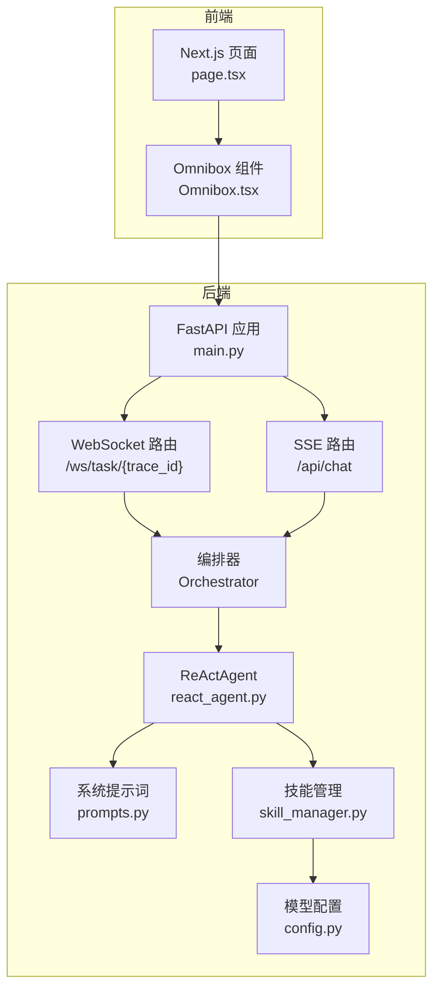
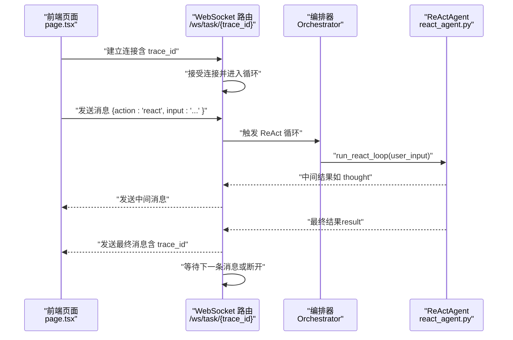
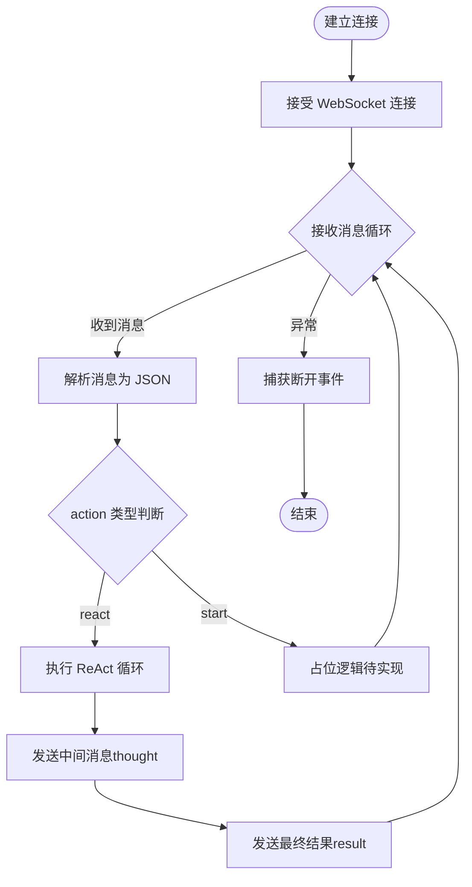
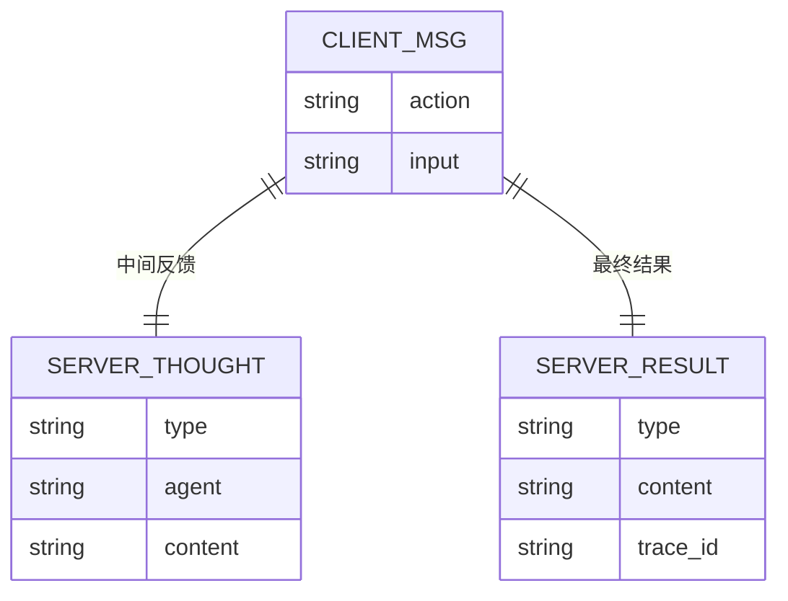
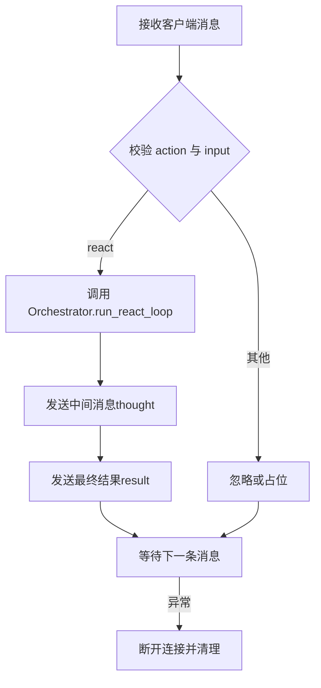
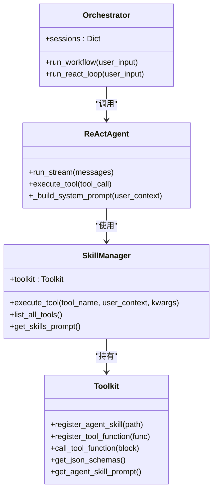
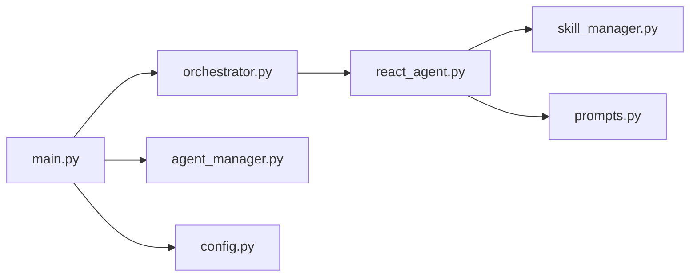

# WebSocket 实时通信

<cite>
**本文引用的文件**
- [main.py](file://localmanus-backend/main.py)
- [orchestrator.py](file://localmanus-backend/core/orchestrator.py)
- [agent_manager.py](file://localmanus-backend/core/agent_manager.py)
- [react_agent.py](file://localmanus-backend/agents/react_agent.py)
- [prompts.py](file://localmanus-backend/core/prompts.py)
- [skill_manager.py](file://localmanus-backend/core/skill_manager.py)
- [page.tsx](file://localmanus-ui/app/page.tsx)
- [Omnibox.tsx](file://localmanus-ui/app/components/Omnibox.tsx)
- [config.py](file://localmanus-backend/core/config.py)
- [nginx.prod.conf](file://nginx/nginx.prod.conf)
- [PRODUCTION_DEPLOYMENT.md](file://PRODUCTION_DEPLOYMENT.md)
</cite>

## 目录
1. [简介](#简介)
2. [项目结构](#项目结构)
3. [核心组件](#核心组件)
4. [架构总览](#架构总览)
5. [组件详解](#组件详解)
6. [依赖关系分析](#依赖关系分析)
7. [性能考量](#性能考量)
8. [故障排查指南](#故障排查指南)
9. [结论](#结论)
10. [附录](#附录)

## 简介
本技术文档聚焦 LocalManus 的 WebSocket 实时通信系统，围绕以下目标展开：  
- WebSocket 连接建立流程、握手协议与连接参数  
- 消息格式规范（action 类型、trace_id 机制、消息载荷结构）  
- 客户端连接管理、自动重连与断线恢复策略  
- 服务器端消息路由、并发连接处理与资源清理  
- WebSocket API 使用示例、错误处理策略、性能优化建议与故障诊断方法  

当前代码库中，后端通过 FastAPI 提供 WebSocket 路由，前端 Next.js 应用负责发起连接与消息交互。系统同时支持基于 SSE 的流式对话，便于对比与扩展。

## 项目结构
后端采用 FastAPI 架构，WebSocket 路由位于主应用中；前端 Next.js 应用负责用户交互与消息发送。核心模块包括：
- 后端主入口与路由：FastAPI 应用、WebSocket 路由、SSE 路由
- 核心编排器：Orchestrator、Manager/Planner/ReAct Agent
- 技能与工具：SkillManager、Toolkit
- 配置与模型：Agent 模型配置、CORS 设置
- 前端页面与组件：Next.js 页面、OmniBox 输入组件

**图表来源**
- [main.py](file://localmanus-backend/main.py#L440-L476)
- [page.tsx](file://localmanus-ui/app/page.tsx#L43-L141)
- [Omnibox.tsx](file://localmanus-ui/app/components/Omnibox.tsx#L83-L109)
- [orchestrator.py](file://localmanus-backend/core/orchestrator.py#L11-L150)
- [react_agent.py](file://localmanus-backend/agents/react_agent.py#L20-L349)
- [prompts.py](file://localmanus-backend/core/prompts.py#L54-L75)
- [skill_manager.py](file://localmanus-backend/core/skill_manager.py#L18-L143)
- [config.py](file://localmanus-backend/core/config.py#L8-L22)

**章节来源**
- [main.py](file://localmanus-backend/main.py#L1-L477)
- [page.tsx](file://localmanus-ui/app/page.tsx#L1-L293)
- [Omnibox.tsx](file://localmanus-ui/app/components/Omnibox.tsx#L1-L200)

## 核心组件
- WebSocket 路由与握手
  - 路由定义：/ws/task/{trace_id}
  - 握手：FastAPI WebSocket 接受连接
  - 连接参数：trace_id 作为路径参数，用于会话标识与追踪
- 消息格式与 action 类型
  - 支持 action: "react"（触发 ReAct 循环）
  - 消息载荷包含 input 字段与 action 字段
- 服务器端编排与路由
  - 接收客户端消息，调用 Orchestrator.run_react_loop 执行 ReAct 循环
  - 返回类型化消息（如 thought、result），携带 trace_id
- 前端交互
  - Next.js 页面负责构建请求、解析 SSE 流
  - Omnibox 组件负责文件上传与输入提交

**章节来源**
- [main.py](file://localmanus-backend/main.py#L440-L476)
- [orchestrator.py](file://localmanus-backend/core/orchestrator.py#L97-L112)
- [react_agent.py](file://localmanus-backend/agents/react_agent.py#L53-L215)
- [page.tsx](file://localmanus-ui/app/page.tsx#L43-L141)
- [Omnibox.tsx](file://localmanus-ui/app/components/Omnibox.tsx#L83-L109)

## 架构总览
WebSocket 实时通信在后端通过 FastAPI 的 WebSocket 协议实现，前端通过 Next.js 发起连接并发送消息。服务器端编排器负责执行 ReAct 循环并将中间结果以结构化消息形式返回。

**图表来源**
- [main.py](file://localmanus-backend/main.py#L440-L476)
- [orchestrator.py](file://localmanus-backend/core/orchestrator.py#L97-L112)
- [react_agent.py](file://localmanus-backend/agents/react_agent.py#L53-L215)

## 组件详解

### WebSocket 连接与握手
- 路由与参数
  - 路径：/ws/task/{trace_id}
  - 参数：trace_id 作为会话标识
- 握手与接受
  - 服务器端使用 WebSocket.accept() 接受连接
  - 记录 trace_id 日志，便于追踪
- 连接生命周期
  - 保持循环读取客户端文本消息
  - 捕获 WebSocketDisconnect 异常，记录断开日志

**图表来源**
- [main.py](file://localmanus-backend/main.py#L440-L476)

**章节来源**
- [main.py](file://localmanus-backend/main.py#L440-L476)

### 消息格式规范
- 客户端到服务器
  - 结构：包含 action 与 input 字段
  - action 取值："react" 触发 ReAct 循环
- 服务器到客户端
  - 中间消息：type="thought"，包含 agent 与 content
  - 最终结果：type="result"，包含 content 与 trace_id
- trace_id 机制
  - trace_id 由路径参数传入，贯穿会话
  - 服务器端在最终结果中回传该 trace_id，便于前端关联

**图表来源**
- [main.py](file://localmanus-backend/main.py#L453-L469)

**章节来源**
- [main.py](file://localmanus-backend/main.py#L453-L469)

### 服务器端消息路由与并发处理
- 路由逻辑
  - 仅处理 action="react" 场景（其他 action 为占位）
  - 将 input 传递给 Orchestrator.run_react_loop
- 并发与会话
  - 当前实现未维护全局连接池或会话表
  - 每个连接独立处理，无跨连接共享状态
- 资源清理
  - 捕获 WebSocketDisconnect，记录断开信息
  - 未见显式清理缓存或会话数据的逻辑

**图表来源**
- [main.py](file://localmanus-backend/main.py#L440-L476)
- [orchestrator.py](file://localmanus-backend/core/orchestrator.py#L97-L112)

**章节来源**
- [main.py](file://localmanus-backend/main.py#L440-L476)
- [orchestrator.py](file://localmanus-backend/core/orchestrator.py#L97-L112)

### 客户端连接管理与自动重连
- 前端页面
  - 使用 fetch + ReadableStream 处理 SSE，未直接使用 WebSocket
  - 未在页面中实现 WebSocket 的自动重连逻辑
- Omnibox 组件
  - 负责文件上传与输入提交，不涉及 WebSocket 连接管理
- 自动重连建议
  - 在前端引入 WebSocket 时，建议实现指数退避重连、心跳保活与断线缓冲队列

**章节来源**
- [page.tsx](file://localmanus-ui/app/page.tsx#L43-L141)
- [Omnibox.tsx](file://localmanus-ui/app/components/Omnibox.tsx#L83-L109)

### 服务器端编排与 ReAct 循环
- 编排器职责
  - run_workflow 生成带 trace_id 的计划
  - run_react_loop 执行 ReAct 循环（当前在 WebSocket 中被调用）
- ReActAgent 能力
  - 支持流式输出与工具调用
  - 通过 Toolkit 注册工具，动态构建系统提示词
- 工具链集成
  - SkillManager 动态加载工具函数与 Agent 技能
  - 通过 Toolkit 执行工具并收集观察结果

**图表来源**
- [orchestrator.py](file://localmanus-backend/core/orchestrator.py#L11-L150)
- [react_agent.py](file://localmanus-backend/agents/react_agent.py#L20-L349)
- [skill_manager.py](file://localmanus-backend/core/skill_manager.py#L18-L143)

**章节来源**
- [orchestrator.py](file://localmanus-backend/core/orchestrator.py#L11-L150)
- [react_agent.py](file://localmanus-backend/agents/react_agent.py#L20-L349)
- [skill_manager.py](file://localmanus-backend/core/skill_manager.py#L18-L143)

### 前端交互与消息消费
- 页面逻辑
  - handleSendMessage 构建请求，调用 /api/chat 获取 SSE
  - 解析 data: 行，拼接 content，更新消息列表
- Omnibox 逻辑
  - 处理文件上传与输入提交，调用父组件回调
- WebSocket 前端实现
  - 当前页面未使用 WebSocket；如需使用，可参考现有消息格式进行适配

**章节来源**
- [page.tsx](file://localmanus-ui/app/page.tsx#L43-L141)
- [Omnibox.tsx](file://localmanus-ui/app/components/Omnibox.tsx#L83-L109)

## 依赖关系分析
- 模块耦合
  - main.py 依赖 Orchestrator、AgentLifecycleManager、SkillRegistry
  - Orchestrator 依赖 ReActAgent、Manager/Planner
  - ReActAgent 依赖 SkillManager、Toolkit、系统提示词
- 外部依赖
  - AgentScope 框架、OpenAI 模型接口
  - FastAPI WebSocket、CORS 中间件
- 潜在风险
  - WebSocket 连接未做并发限制与会话持久化
  - 缺少心跳与断线重连机制

**图表来源**
- [main.py](file://localmanus-backend/main.py#L1-L477)
- [orchestrator.py](file://localmanus-backend/core/orchestrator.py#L11-L150)
- [agent_manager.py](file://localmanus-backend/core/agent_manager.py#L11-L49)
- [react_agent.py](file://localmanus-backend/agents/react_agent.py#L20-L349)
- [skill_manager.py](file://localmanus-backend/core/skill_manager.py#L18-L143)
- [prompts.py](file://localmanus-backend/core/prompts.py#L54-L75)
- [config.py](file://localmanus-backend/core/config.py#L8-L22)

**章节来源**
- [main.py](file://localmanus-backend/main.py#L1-L477)
- [agent_manager.py](file://localmanus-backend/core/agent_manager.py#L11-L49)

## 性能考量
- 服务器端
  - WebSocket 循环中未设置超时与背压控制，建议增加心跳与空闲超时
  - 每个连接独立处理，未做连接池复用，高并发场景需考虑限流与隔离
- 前端
  - SSE 已具备流式消费能力；若引入 WebSocket，建议使用二进制帧减少序列化开销
- 部署层
  - Nginx 配置已开启升级头与长连接，适合 WebSocket 代理
  - 生产部署建议启用 gzip、keepalive 与限速策略

**章节来源**
- [nginx.prod.conf](file://nginx/nginx.prod.conf#L1-L50)
- [PRODUCTION_DEPLOYMENT.md](file://PRODUCTION_DEPLOYMENT.md#L161-L224)

## 故障排查指南
- 连接问题
  - 检查 CORS 配置是否允许前端域名访问
  - 确认 WebSocket 路径与 trace_id 是否正确
- 消息问题
  - 确认客户端发送的消息包含 action 与 input 字段
  - 服务器端仅处理 action="react"，其他 action 将被忽略
- 错误处理
  - 服务器端捕获断开事件并记录日志
  - 建议在客户端实现断线重连与错误提示
- 日志定位
  - 关注 WebSocket 连接与断开日志
  - 关注 Orchestrator 与 ReActAgent 的运行日志

**章节来源**
- [main.py](file://localmanus-backend/main.py#L440-L476)
- [page.tsx](file://localmanus-ui/app/page.tsx#L135-L141)

## 结论
当前 WebSocket 实时通信系统以最小可用为目标：支持 action="react" 的消息处理与中间/最终结果的回传，trace_id 用于会话追踪。系统在功能上完整，但在并发连接管理、自动重连与资源清理方面仍有改进空间。建议后续补充心跳保活、断线重连、连接池与会话持久化等机制，以满足生产环境的稳定性与可维护性要求。

## 附录

### WebSocket API 使用示例（客户端）
- 建立连接
  - ws://localhost:8000/ws/task/{trace_id}
- 发送消息
  - {"action": "react", "input": "你的任务描述"}
- 接收消息
  - {"type": "thought", "agent": "ReActAgent", "content": "..."}
  - {"type": "result", "content": "...", "trace_id": "{trace_id}"}

**章节来源**
- [main.py](file://localmanus-backend/main.py#L440-L476)

### 部署与网络配置要点
- 端口与防火墙
  - 后端监听 8000，确保防火墙放行
- 反向代理
  - Nginx 需设置 Upgrade/Connection 头以支持 WebSocket
  - 生产环境建议开启 keepalive 与限速

**章节来源**
- [PRODUCTION_DEPLOYMENT.md](file://PRODUCTION_DEPLOYMENT.md#L161-L224)
- [nginx.prod.conf](file://nginx/nginx.prod.conf#L47-L50)