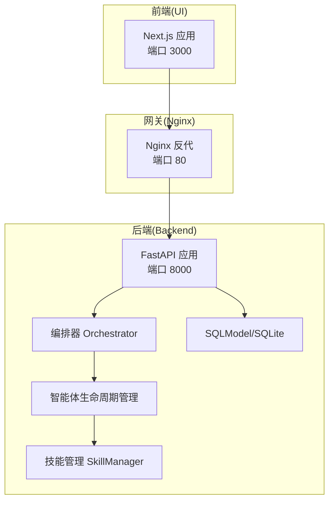
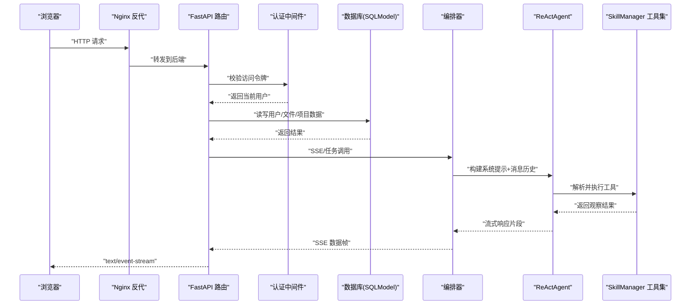
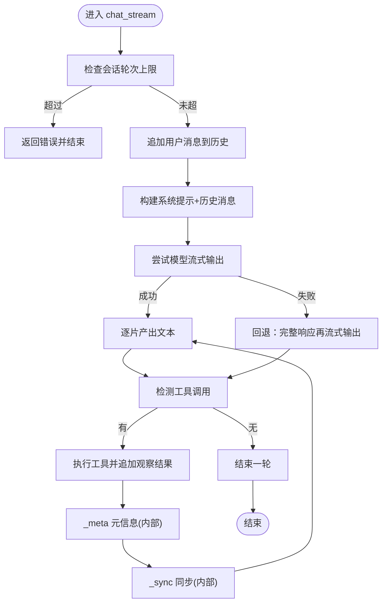
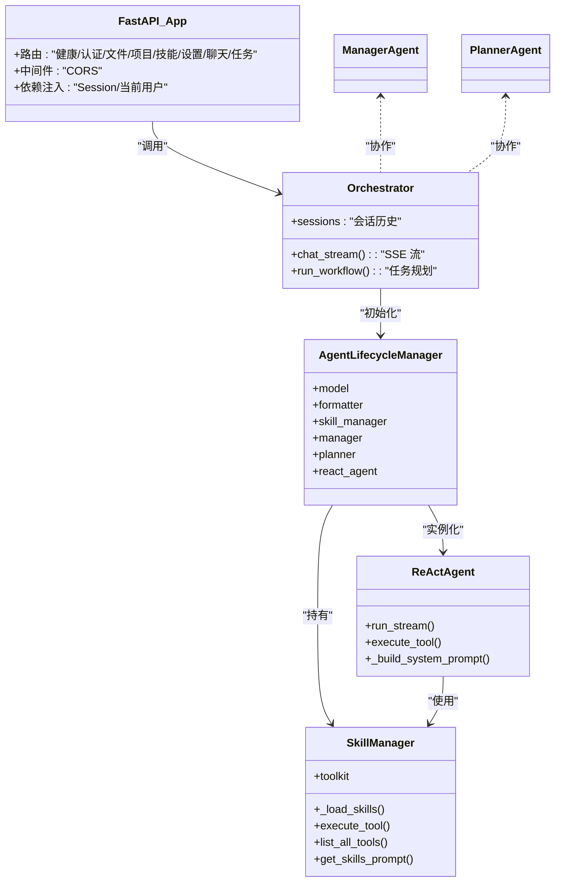
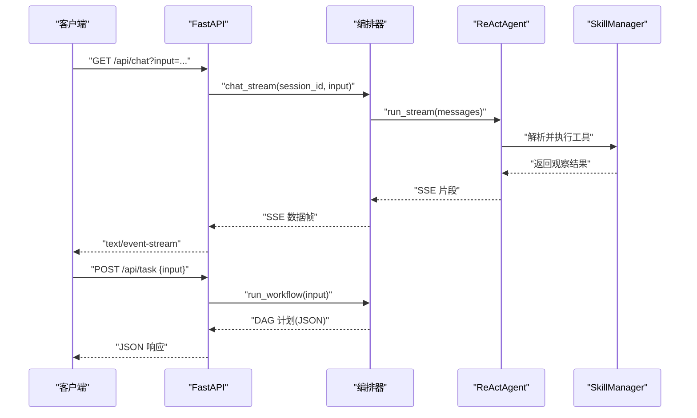
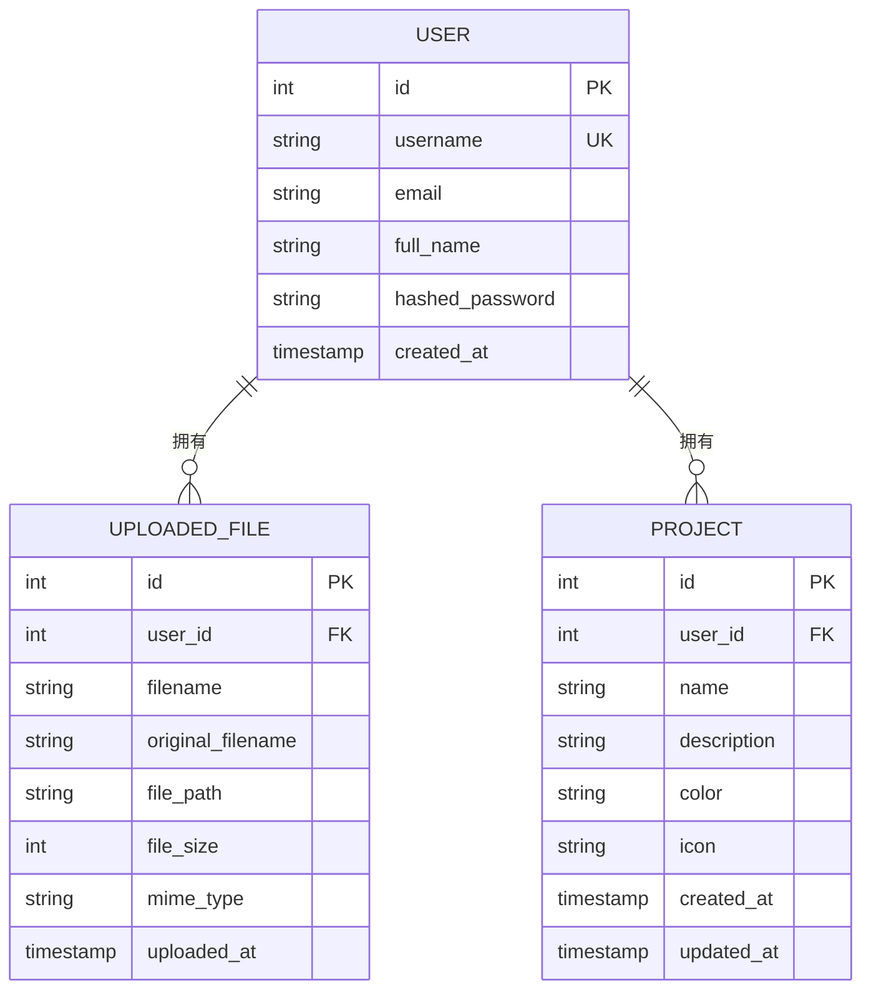

# 数据流架构设计

<cite>
**本文引用的文件**
- [main.py](file://localmanus-backend/main.py)
- [orchestrator.py](file://localmanus-backend/core/orchestrator.py)
- [agent_manager.py](file://localmanus-backend/core/agent_manager.py)
- [skill_manager.py](file://localmanus-backend/core/skill_manager.py)
- [react_agent.py](file://localmanus-backend/agents/react_agent.py)
- [base_agents.py](file://localmanus-backend/agents/base_agents.py)
- [models.py](file://localmanus-backend/core/models.py)
- [auth.py](file://localmanus-backend/core/auth.py)
- [config.py](file://localmanus-backend/core/config.py)
- [.env.example](file://localmanus-backend/.env.example)
- [requirements.txt](file://localmanus-backend/requirements.txt)
- [docker-compose.yml](file://docker-compose.yml)
- [package.json](file://localmanus-ui/package.json)
- [test_orchestration.py](file://localmanus-backend/scripts/test_orchestration.py)
</cite>

## 目录
1. [引言](#引言)
2. [项目结构](#项目结构)
3. [核心组件](#核心组件)
4. [架构总览](#架构总览)
5. [详细组件分析](#详细组件分析)
6. [依赖关系分析](#依赖关系分析)
7. [性能考量](#性能考量)
8. [故障排查指南](#故障排查指南)
9. [结论](#结论)
10. [附录](#附录)

## 引言
本文件面向 LocalManus 的数据流架构，从前端用户交互到后端处理再到数据库存储的完整链路进行系统化说明。重点覆盖以下方面：
- 请求路由与中间件处理
- 数据验证与安全认证
- 异步处理模式与并发控制
- 事务管理与数据一致性
- 缓存策略与数据同步
- 错误传播路径与可观测性
- 微服务间通信与 API 网关作用
- 负载均衡策略、性能监控指标、容量规划与故障恢复机制

## 项目结构
LocalManus 采用前后端分离的单仓多模块组织方式：
- 后端（FastAPI）：提供 REST/SSE/WebSocket 接口，负责用户认证、文件上传与管理、项目管理、技能管理、任务编排与 ReAct 流水线等。
- 前端（Next.js）：提供用户界面，通过环境变量配置 API 地址，与后端通过反向代理通信。
- 部署（Docker Compose）：包含 Nginx 反向代理、后端服务、前端服务以及共享网络与持久卷。

图表来源
- [docker-compose.yml](file://docker-compose.yml#L1-L88)
- [main.py](file://localmanus-backend/main.py#L34-L477)
- [orchestrator.py](file://localmanus-backend/core/orchestrator.py#L11-L150)
- [agent_manager.py](file://localmanus-backend/core/agent_manager.py#L11-L49)
- [skill_manager.py](file://localmanus-backend/core/skill_manager.py#L18-L143)
- [models.py](file://localmanus-backend/core/models.py#L1-L80)

章节来源
- [docker-compose.yml](file://docker-compose.yml#L1-L88)
- [package.json](file://localmanus-ui/package.json#L1-L34)

## 核心组件
- FastAPI 应用与路由层：定义健康检查、认证、文件上传下载、项目管理、技能管理、聊天 SSE、任务执行等接口；内置 CORS 中间件；使用依赖注入获取数据库会话与当前用户。
- 编排器 Orchestrator：维护会话历史、封装 ReAct 流水线、处理内部协议（同步事件与元数据）、生成 SSE 流。
- 智能体生命周期管理 AgentLifecycleManager：初始化模型、格式化器、内存与技能管理器，并实例化 Manager、Planner、ReAct 三个智能体。
- 技能管理 SkillManager：扫描 skills 目录，注册工具函数与 AgentSkill，支持动态加载与执行工具。
- 认证与授权：基于 JWT 的 OAuth2 密码流，密码哈希与校验，访问令牌过期时间配置。
- 数据模型与事务：SQLModel 定义用户、文件、项目实体，接口内使用 Session 进行增删改查与提交。

章节来源
- [main.py](file://localmanus-backend/main.py#L34-L477)
- [orchestrator.py](file://localmanus-backend/core/orchestrator.py#L11-L150)
- [agent_manager.py](file://localmanus-backend/core/agent_manager.py#L11-L49)
- [skill_manager.py](file://localmanus-backend/core/skill_manager.py#L18-L143)
- [auth.py](file://localmanus-backend/core/auth.py#L1-L82)
- [models.py](file://localmanus-backend/core/models.py#L1-L80)

## 架构总览
下图展示从浏览器到后端、再到智能体与工具的端到端数据流：

图表来源
- [main.py](file://localmanus-backend/main.py#L392-L420)
- [orchestrator.py](file://localmanus-backend/core/orchestrator.py#L16-L96)
- [react_agent.py](file://localmanus-backend/agents/react_agent.py#L53-L215)
- [skill_manager.py](file://localmanus-backend/core/skill_manager.py#L90-L135)
- [auth.py](file://localmanus-backend/core/auth.py#L55-L82)
- [models.py](file://localmanus-backend/core/models.py#L29-L80)

## 详细组件分析

### 1) 请求路由与中间件
- 路由层：定义健康检查、注册/登录、个人信息、文件上传/下载/删除、项目 CRUD、技能查询/配置更新、设置读取/更新、聊天 SSE、任务计划与 ReAct 执行、WebSocket 任务流等。
- 中间件：启用 CORS，允许任意源、方法与头，便于前端跨域访问。
- 依赖注入：通过 Depends 获取数据库 Session 与当前用户，确保每个请求的上下文一致。

章节来源
- [main.py](file://localmanus-backend/main.py#L52-L59)
- [main.py](file://localmanus-backend/main.py#L74-L110)
- [main.py](file://localmanus-backend/main.py#L112-L215)
- [main.py](file://localmanus-backend/main.py#L288-L391)
- [main.py](file://localmanus-backend/main.py#L392-L439)

### 2) 数据验证与安全认证
- 注册：用户名唯一性校验，密码经哈希后入库。
- 登录：OAuth2 密码流，成功后签发带过期时间的访问令牌。
- 当前用户：通过 JWT 解析与数据库查询确认身份，支持查询参数传递令牌（SSE 支持）。
- 密码策略：优先 bcrypt，兼容旧版 SHA-256 哈希。

章节来源
- [main.py](file://localmanus-backend/main.py#L74-L90)
- [main.py](file://localmanus-backend/main.py#L92-L106)
- [auth.py](file://localmanus-backend/core/auth.py#L20-L53)
- [auth.py](file://localmanus-backend/core/auth.py#L55-L82)

### 3) 文件上传与存储
- 用户专属目录：按用户 ID 创建独立上传目录，避免冲突。
- 唯一文件名：UUID 化文件名，保留原始扩展名。
- 元数据记录：数据库记录文件名、路径、大小、类型与上传时间。
- 下载/删除：鉴权后读取磁盘文件并返回，或删除磁盘文件与数据库记录。

章节来源
- [main.py](file://localmanus-backend/main.py#L46-L50)
- [main.py](file://localmanus-backend/main.py#L112-L152)
- [main.py](file://localmanus-backend/main.py#L153-L188)
- [main.py](file://localmanus-backend/main.py#L189-L215)
- [models.py](file://localmanus-backend/core/models.py#L29-L47)

### 4) 项目管理
- 列表/创建/读取/更新/删除：基于用户维度过滤，更新时自动刷新更新时间。
- 数据一致性：每个操作在同一个 Session 中完成，保证事务边界。

章节来源
- [main.py](file://localmanus-backend/main.py#L288-L391)
- [models.py](file://localmanus-backend/core/models.py#L48-L80)

### 5) 技能管理与工具注册
- 动态加载：扫描 skills 目录，注册 AgentSkill（含 SKILL.md 的目录）与工具函数（.py 文件中的公开函数）。
- 工具执行：根据签名注入 user_id 与 user_context，统一通过 Toolkit 调用，聚合响应内容。

章节来源
- [skill_manager.py](file://localmanus-backend/core/skill_manager.py#L29-L89)
- [skill_manager.py](file://localmanus-backend/core/skill_manager.py#L90-L135)

### 6) 编排器与 ReAct 流水线
- 会话管理：按 session_id 维护消息历史，限制最大轮次。
- 系统提示构建：结合用户上下文与可用工具元数据，动态生成系统提示。
- 流式输出：支持直接模型流式与回退模式，边生成边发送；检测工具调用并实时反馈。
- 内部协议：_sync 用于同步新增消息至历史，_meta 用于运行元信息（日志）。

图表来源
- [orchestrator.py](file://localmanus-backend/core/orchestrator.py#L16-L96)
- [react_agent.py](file://localmanus-backend/agents/react_agent.py#L53-L215)

章节来源
- [orchestrator.py](file://localmanus-backend/core/orchestrator.py#L16-L96)
- [react_agent.py](file://localmanus-backend/agents/react_agent.py#L53-L215)

### 7) 智能体生命周期与模型配置
- AgentScope 初始化：创建模型、格式化器与内存，实例化 Manager/Planner/ReActAgent。
- 模型配置：支持本地 Ollama 或云端模型，通过环境变量覆盖默认值。
- ReActAgent：继承自 AgentScope ReActAgent，集成 Toolkit，实现流式响应与工具调用。

章节来源
- [agent_manager.py](file://localmanus-backend/core/agent_manager.py#L11-L49)
- [config.py](file://localmanus-backend/core/config.py#L8-L17)
- [.env.example](file://localmanus-backend/.env.example#L1-L4)
- [react_agent.py](file://localmanus-backend/agents/react_agent.py#L20-L35)

### 8) 数据模型与事务
- 用户、文件、项目三类实体，外键关联用户 ID。
- 事务：每个接口在 Session 中执行，提交后刷新对象状态，确保一致性。

章节来源
- [models.py](file://localmanus-backend/core/models.py#L1-L80)
- [main.py](file://localmanus-backend/main.py#L74-L90)
- [main.py](file://localmanus-backend/main.py#L300-L318)

### 9) API 网关与反向代理
- Nginx：作为统一入口，监听 80 端口，健康检查后将请求转发给后端与前端。
- 前端环境：NEXT_PUBLIC_API_URL 指向前端可访问的地址，SSR 通过内部网络直连后端。

章节来源
- [docker-compose.yml](file://docker-compose.yml#L2-L23)
- [docker-compose.yml](file://docker-compose.yml#L56-L76)

### 10) 并发控制与异步处理
- SSE：StreamingResponse 输出 text/event-stream，逐块推送。
- WebSocket：接收客户端动作，触发 ReAct 执行并回传阶段性结果。
- 事件循环：在工具执行与流式输出中适时让出控制，避免阻塞。

章节来源
- [main.py](file://localmanus-backend/main.py#L392-L420)
- [main.py](file://localmanus-backend/main.py#L440-L473)
- [react_agent.py](file://localmanus-backend/agents/react_agent.py#L152-L162)

### 11) 错误传播与可观测性
- 异常捕获：文件上传、技能列表、项目查询等接口均捕获异常并返回 HTTP 500。
- 日志：全局与各模块日志器记录错误堆栈，便于定位问题。
- SSE 错误：编排器在异常时返回错误消息，前端可感知。

章节来源
- [main.py](file://localmanus-backend/main.py#L149-L151)
- [main.py](file://localmanus-backend/main.py#L226-L231)
- [orchestrator.py](file://localmanus-backend/core/orchestrator.py#L92-L96)

## 依赖关系分析

图表来源
- [main.py](file://localmanus-backend/main.py#L34-L41)
- [orchestrator.py](file://localmanus-backend/core/orchestrator.py#L11-L150)
- [agent_manager.py](file://localmanus-backend/core/agent_manager.py#L11-L49)
- [skill_manager.py](file://localmanus-backend/core/skill_manager.py#L18-L143)
- [react_agent.py](file://localmanus-backend/agents/react_agent.py#L20-L35)
- [base_agents.py](file://localmanus-backend/agents/base_agents.py#L6-L42)

章节来源
- [requirements.txt](file://localmanus-backend/requirements.txt#L1-L14)

## 性能考量
- 流式输出：SSE 与模型流式返回降低首字延迟，提升用户体验。
- 工具调用：在流式片段中识别工具调用，减少二次解析成本。
- 会话限制：固定轮次上限防止历史无限增长导致性能下降。
- 并发与让出：在工具执行与字符级流式输出中适时 asyncio.sleep(0)，避免阻塞事件循环。
- 存储与缓存：文件上传采用磁盘直写，建议在生产环境引入对象存储与 CDN；数据库层面可考虑索引优化与连接池配置。
- 模型选择：根据吞吐与延迟需求选择本地 Ollama 或云端模型，合理设置超时与重试。

## 故障排查指南
- 认证失败：检查访问令牌是否过期、密钥是否正确、用户是否存在。
- 文件上传失败：确认上传目录权限、磁盘空间、文件大小限制与 MIME 类型。
- 技能加载失败：检查 skills 目录结构与函数签名，确保具备文档字符串；查看日志中注册失败信息。
- SSE/WS 不工作：确认 Nginx 是否转发到后端、后端健康检查是否通过、WebSocket/Stream 是否被阻断。
- 数据不一致：检查接口是否在 Session 中提交、是否存在并发写入竞争。

章节来源
- [auth.py](file://localmanus-backend/core/auth.py#L55-L82)
- [main.py](file://localmanus-backend/main.py#L149-L151)
- [skill_manager.py](file://localmanus-backend/core/skill_manager.py#L57-L89)
- [docker-compose.yml](file://docker-compose.yml#L18-L23)

## 结论
LocalManus 的数据流架构以 FastAPI 为核心，结合 AgentScope 的智能体能力与动态工具注册，实现了从用户输入到工具执行的端到端流式处理。通过 SSE 与 WebSocket 提供实时反馈，借助 SQLModel 实现轻量级事务管理。部署上通过 Nginx 提供统一入口与健康检查，具备良好的可运维性。后续可在缓存、CDN、连接池与限流等方面进一步优化，以满足更高并发与可靠性要求。

## 附录

### A. 关键流程时序图：聊天与任务执行

图表来源
- [main.py](file://localmanus-backend/main.py#L392-L439)
- [orchestrator.py](file://localmanus-backend/core/orchestrator.py#L97-L112)
- [react_agent.py](file://localmanus-backend/agents/react_agent.py#L53-L215)

### B. 数据模型关系图

图表来源
- [models.py](file://localmanus-backend/core/models.py#L10-L80)

### C. 配置与环境变量
- 模型配置：通过环境变量覆盖默认模型名称、基础 URL 与密钥。
- 上传限制：可通过环境变量设置上传大小限制。
- 数据库：默认 SQLite，持久化于容器卷。

章节来源
- [.env.example](file://localmanus-backend/.env.example#L1-L4)
- [config.py](file://localmanus-backend/core/config.py#L8-L17)
- [docker-compose.yml](file://docker-compose.yml#L32-L46)

### D. 示例测试脚本
- 提供了工作流测试脚本，演示无 API Key 时的模拟输出结构，便于开发调试。

章节来源
- [test_orchestration.py](file://localmanus-backend/scripts/test_orchestration.py#L12-L56)