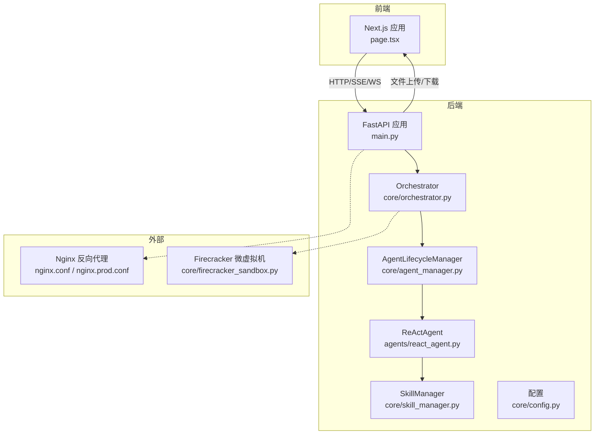
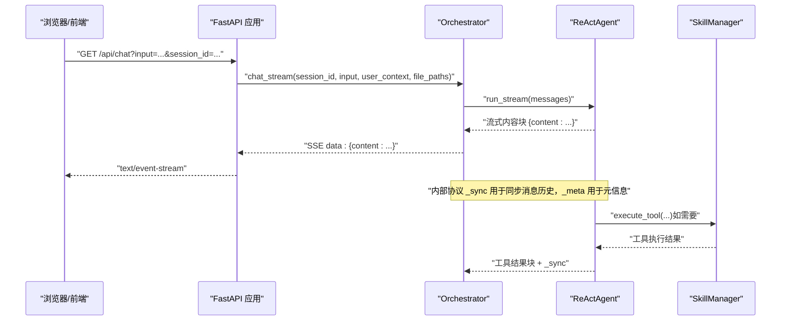
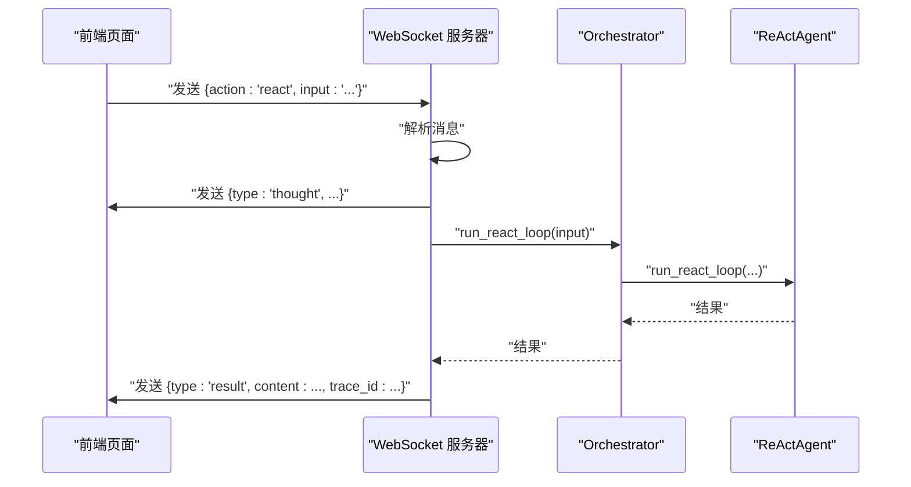
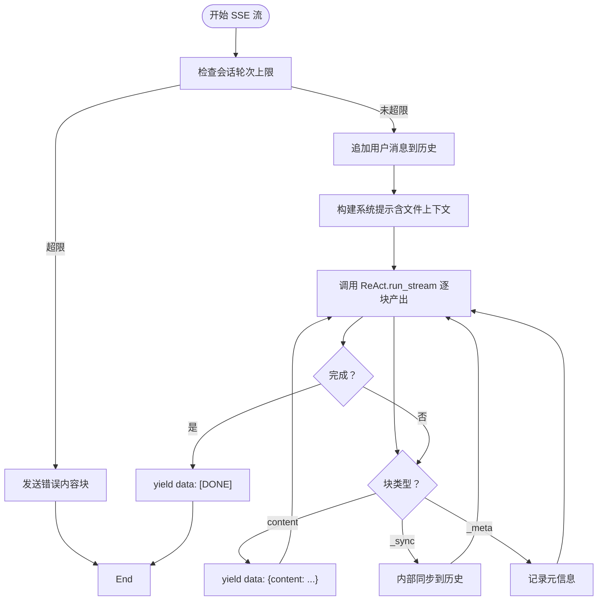
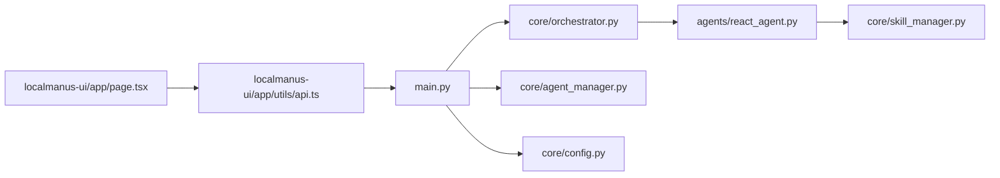

# 通信机制与数据流

<cite>
**本文引用的文件**
- [main.py](file://localmanus-backend/main.py)
- [orchestrator.py](file://localmanus-backend/core/orchestrator.py)
- [agent_manager.py](file://localmanus-backend/core/agent_manager.py)
- [react_agent.py](file://localmanus-backend/agents/react_agent.py)
- [base_agents.py](file://localmanus-backend/agents/base_agents.py)
- [skill_manager.py](file://localmanus-backend/core/skill_manager.py)
- [config.py](file://localmanus-backend/core/config.py)
- [file_ops.py](file://localmanus-backend/skills/file-operations/file_ops.py)
- [firecracker_sandbox.py](file://localmanus-backend/core/firecracker_sandbox.py)
- [localmanus_architecture.md](file://localmanus_architecture.md)
- [requirements.txt](file://localmanus-backend/requirements.txt)
- [page.tsx](file://localmanus-ui/app/page.tsx)
- [api.ts](file://localmanus-ui/app/utils/api.ts)
- [nginx.conf](file://nginx/nginx.conf)
- [nginx.prod.conf](file://nginx/nginx.prod.conf)
- [PRODUCTION_DEPLOYMENT.md](file://PRODUCTION_DEPLOYMENT.md)
- [FIRECRACKER_TROUBLESHOOTING.md](file://localmanus-backend/scripts/FIRECRACKER_TROUGHTSHOOTING.md)
</cite>

## 目录
1. [引言](#引言)
2. [项目结构](#项目结构)
3. [核心组件](#核心组件)
4. [架构总览](#架构总览)
5. [详细组件分析](#详细组件分析)
6. [依赖关系分析](#依赖关系分析)
7. [性能考量](#性能考量)
8. [故障排查指南](#故障排查指南)
9. [结论](#结论)
10. [附录](#附录)

## 引言
本文件面向 LocalManus 后端与前端的通信机制与数据流，系统性梳理以下方面：
- WebSocket 实时通信：连接管理、消息格式、事件处理与 UI 交互
- SSE（Server-Sent Events）流式传输：实现原理、客户端重连与错误恢复
- HTTP API：请求-响应模式、RESTful 设计、状态码规范
- VSOCK 与 MMDS：宿主机-虚拟机通信、AF_VSOCK 协议特性、元数据服务
- 性能优化、安全考虑、监控指标与故障诊断

## 项目结构
后端采用 FastAPI 提供 HTTP/SSE/WebSocket 接口，结合 AgentScope 的 ReActAgent 实现多轮对话与工具调用；前端使用 Next.js，通过 SSE 接收流式消息。



图表来源
- [main.py](file://localmanus-backend/main.py#L1-L477)
- [orchestrator.py](file://localmanus-backend/core/orchestrator.py#L1-L150)
- [agent_manager.py](file://localmanus-backend/core/agent_manager.py#L1-L49)
- [react_agent.py](file://localmanus-backend/agents/react_agent.py#L1-L349)
- [skill_manager.py](file://localmanus-backend/core/skill_manager.py#L1-L143)
- [config.py](file://localmanus-backend/core/config.py#L1-L22)
- [nginx.conf](file://nginx/nginx.conf#L1-L50)
- [nginx.prod.conf](file://nginx/nginx.prod.conf#L48-L87)
- [firecracker_sandbox.py](file://localmanus-backend/core/firecracker_sandbox.py#L1-L193)

章节来源
- [main.py](file://localmanus-backend/main.py#L1-L477)
- [localmanus_architecture.md](file://localmanus_architecture.md#L1-L172)

## 核心组件
- FastAPI 应用与路由
  - 健康检查、认证、文件管理、项目管理、技能管理、设置管理等 HTTP 接口
  - SSE 聊天接口与 WebSocket 任务流接口
- Orchestrator：会话管理、SSE 数据格式化、历史同步
- AgentLifecycleManager：AgentScope 初始化、模型与格式化器、技能管理器装配
- ReActAgent：ReAct 循环、流式输出、工具调用、内部协议（_sync/_meta）
- SkillManager：技能注册、工具函数加载、工具执行
- 前端集成：SSE 解析、消息拼接、错误处理

章节来源
- [main.py](file://localmanus-backend/main.py#L61-L477)
- [orchestrator.py](file://localmanus-backend/core/orchestrator.py#L11-L150)
- [agent_manager.py](file://localmanus-backend/core/agent_manager.py#L11-L49)
- [react_agent.py](file://localmanus-backend/agents/react_agent.py#L20-L349)
- [skill_manager.py](file://localmanus-backend/core/skill_manager.py#L18-L143)
- [page.tsx](file://localmanus-ui/app/page.tsx#L101-L137)

## 架构总览
下图展示从用户输入到流式响应的关键路径，以及与 Firecracker 的潜在集成点。



图表来源
- [main.py](file://localmanus-backend/main.py#L392-L421)
- [orchestrator.py](file://localmanus-backend/core/orchestrator.py#L16-L96)
- [react_agent.py](file://localmanus-backend/agents/react_agent.py#L53-L215)
- [skill_manager.py](file://localmanus-backend/core/skill_manager.py#L90-L134)

## 详细组件分析

### WebSocket 实时通信
- 连接管理
  - 路由：/ws/task/{trace_id}
  - 接受连接后进入循环，接收客户端文本消息，解析为 JSON
  - 支持 action=start 与 action=react 等动作（当前示例中对 start 保留占位）
- 消息格式
  - 客户端发送：{"action": "react", "input": "..."}
  - 服务端发送：{"type": "thought", "content": "...", "agent": "..."} 与 {"type": "result", "content": "...", "trace_id": "..."}
- 事件处理机制
  - 当 action=react 时，先发送一次“思考”提示，再调用 run_react_loop 并回传最终结果
  - 断开捕获：WebSocketDisconnect 记录断开日志
- UI 侧交互
  - 前端页面监听 WebSocket，解析消息类型并更新界面状态



图表来源
- [main.py](file://localmanus-backend/main.py#L440-L473)
- [page.tsx](file://localmanus-ui/app/page.tsx#L101-L137)

章节来源
- [main.py](file://localmanus-backend/main.py#L440-L473)
- [page.tsx](file://localmanus-ui/app/page.tsx#L101-L137)

### SSE（Server-Sent Events）流式传输
- 实现原理
  - FastAPI 返回 StreamingResponse，媒体类型为 text/event-stream
  - Orchestrator.chat_stream 作为异步生成器，逐块产出数据
  - 内部协议：
    - {"content": "..."}：前端 SSE 数据块
    - {"_sync": [...]}：内部同步消息到会话历史（不发给前端）
    - {"_meta": {...}}：内部元信息（不发给前端）
- 客户端重连策略
  - 前端按行解析 data: 块，忽略 [DONE] 标记
  - 出错时追加一条 bot 错误消息，避免 UI 卡死
- 错误恢复机制
  - 会话上限保护：超过最大轮次返回错误提示并结束
  - 异常捕获：记录错误并返回错误内容块
  - 文件路径上下文：支持传入逗号分隔的文件路径列表，构建系统提示



图表来源
- [orchestrator.py](file://localmanus-backend/core/orchestrator.py#L16-L96)
- [react_agent.py](file://localmanus-backend/agents/react_agent.py#L53-L215)
- [main.py](file://localmanus-backend/main.py#L392-L421)

章节来源
- [main.py](file://localmanus-backend/main.py#L392-L421)
- [orchestrator.py](file://localmanus-backend/core/orchestrator.py#L16-L96)
- [page.tsx](file://localmanus-ui/app/page.tsx#L101-L137)

### HTTP API 请求-响应模式与 RESTful 设计
- 认证与授权
  - 登录：OAuth2 密码模式，返回访问令牌
  - 用户信息：基于依赖注入获取当前用户
- 文件管理
  - 上传：multipart/form-data，保存到用户专属目录，记录数据库
  - 下载：FileResponse 返回文件
  - 删除：删除磁盘文件与数据库记录
- 项目管理
  - 列表、创建、查询、更新、删除，遵循 REST 资源命名
- 技能管理
  - 列出技能、获取详情、更新配置、启用/禁用
- 设置管理
  - 获取与更新系统配置
- 状态码规范
  - 成功：200/201
  - 未找到：404
  - 认证失败：401
  - 参数错误/业务异常：400
  - 服务器错误：500

章节来源
- [main.py](file://localmanus-backend/main.py#L74-L477)

### VSOCK 与 MMDS：宿主机-虚拟机通信
- AF_VSOCK 协议特性
  - 高性能、安全的宿主机与虚拟机间通信，绕过传统 TCP/IP
  - 适合实时数据流与命令下发
- MMDS 元数据服务
  - 用于初始技能注入与环境变量传递，无需配置网络即可通信
- Firecracker 集成
  - 宿主机通过 Unix Socket 控制 Firecracker API
  - 管理 VM 生命周期、网络（TAP/NAT）、可视化（VNC）与安全（Jailer/seccomp）
  - 与后端网关协同，实现“恢复快照 -> 执行 -> 销毁”的零持久化执行链路

```mermaid
graph TB
subgraph "宿主机"
GW["API 网关"]
FCM["Firecracker 管理器"]
VSOCK["AF_VSOCK 通道"]
end
subgraph "微虚拟机"
GUEST["Guest Agent"]
TOOLS["技能执行环境"]
end
GW --> |"VSOCK"/"MMDS"| FCM
FCM --> |"Unix Socket"| VSOCK
VSOCK --> |"高速/安全"| GUEST
GUEST --> TOOLS
```

图表来源
- [localmanus_architecture.md](file://localmanus_architecture.md#L101-L110)
- [firecracker_sandbox.py](file://localmanus-backend/core/firecracker_sandbox.py#L1-L193)

章节来源
- [localmanus_architecture.md](file://localmanus_architecture.md#L101-L110)
- [firecracker_sandbox.py](file://localmanus-backend/core/firecracker_sandbox.py#L1-L193)

## 依赖关系分析
- 后端依赖
  - FastAPI、Uvicorn、AgentScope、Pydantic、Websockets、SQLModel、Passlib、Jose、Requests、BeautifulSoup、DuckDuckGo Search 等
- 组件耦合
  - main.py 依赖 Orchestrator、AgentLifecycleManager、SkillRegistry、ConfigManager
  - Orchestrator 依赖 ReActAgent 与 SkillManager
  - ReActAgent 依赖 SkillManager 工具集
  - 前端通过 API 工具获取后端地址，区分 SSR 与浏览器环境



图表来源
- [requirements.txt](file://localmanus-backend/requirements.txt#L1-L14)
- [main.py](file://localmanus-backend/main.py#L1-L40)
- [orchestrator.py](file://localmanus-backend/core/orchestrator.py#L1-L150)
- [react_agent.py](file://localmanus-backend/agents/react_agent.py#L1-L349)
- [skill_manager.py](file://localmanus-backend/core/skill_manager.py#L1-L143)
- [agent_manager.py](file://localmanus-backend/core/agent_manager.py#L1-L49)
- [config.py](file://localmanus-backend/core/config.py#L1-L22)
- [page.tsx](file://localmanus-ui/app/page.tsx#L1-L165)
- [api.ts](file://localmanus-ui/app/utils/api.ts#L1-L16)

章节来源
- [requirements.txt](file://localmanus-backend/requirements.txt#L1-L14)
- [main.py](file://localmanus-backend/main.py#L1-L40)

## 性能考量
- SSE 流式渲染
  - ReActAgent 优先使用模型原生流式输出，字符级增量推送，降低首 token 延迟
  - 若模型不支持流式，则回退为完整响应字符级推送
- WebSocket 实时反馈
  - 在 action=react 场景中，先发送“思考”提示，提升感知速度
- 反向代理优化
  - Nginx 关闭代理缓冲以支持 SSE，设置长读超时
  - 对 /api/ 开启限流与连接数限制，登录端点单独限流
- 前端缓存与解析
  - 前端按行解析 SSE，避免阻塞主线程
- 安全与隔离
  - Firecracker Jailer + seccomp + 只读根 + overlayfs
  - VSOCK 通道绕过网络栈，降低被探测风险

章节来源
- [react_agent.py](file://localmanus-backend/agents/react_agent.py#L53-L215)
- [nginx.conf](file://nginx/nginx.conf#L34-L50)
- [nginx.prod.conf](file://nginx/nginx.prod.conf#L58-L87)
- [localmanus_architecture.md](file://localmanus_architecture.md#L168-L172)

## 故障排查指南
- WebSocket 连接问题
  - 检查路由与跨域配置，确认客户端与服务端版本一致
  - 查看断开日志，定位异常关闭原因
- SSE 流中断
  - 确认 Nginx 未启用代理缓冲，读超时足够长
  - 前端解析错误时应显示兜底消息，避免 UI 卡死
- 文件上传/下载异常
  - 检查用户目录权限与磁盘空间
  - 数据库记录与磁盘文件一致性校验
- Firecracker VSOCK/MMDS
  - 清理遗留 socket 与 TAP 设备，检查 KVM 权限
  - 使用自动化清理脚本与预检清单，避免“Failed to open the API socket”
- 生产部署
  - 开放必要端口，配置反向代理与健康检查
  - 使用环境变量区分浏览器与 SSR 的 API 地址

章节来源
- [main.py](file://localmanus-backend/main.py#L52-L59)
- [page.tsx](file://localmanus-ui/app/page.tsx#L101-L137)
- [PRODUCTION_DEPLOYMENT.md](file://PRODUCTION_DEPLOYMENT.md#L161-L224)
- [FIRECRACKER_TROUBLESHOOTING.md](file://localmanus-backend/scripts/FIRECRACKER_TROUBLESHOOTING.md#L1-L129)

## 结论
LocalManus 的通信体系以 FastAPI 为核心，结合 SSE 与 WebSocket 提供低延迟的实时体验；通过 AgentScope 的 ReActAgent 实现多轮对话与工具调用；在生产环境中，Nginx 反向代理与 Firecracker 安全沙箱共同保障性能与安全。建议持续关注流式协议兼容性、前端解析健壮性与 VSOCK/MMDS 的稳定性，以获得最佳用户体验。

## 附录
- 前端 API 地址解析：根据执行环境（浏览器/SSR）选择不同后端地址
- 技能工具：文件操作类技能通过 SkillManager 注册，支持用户目录读写与列表

章节来源
- [api.ts](file://localmanus-ui/app/utils/api.ts#L1-L16)
- [skill_manager.py](file://localmanus-backend/core/skill_manager.py#L18-L143)
- [file_ops.py](file://localmanus-backend/skills/file-operations/file_ops.py#L1-L165)