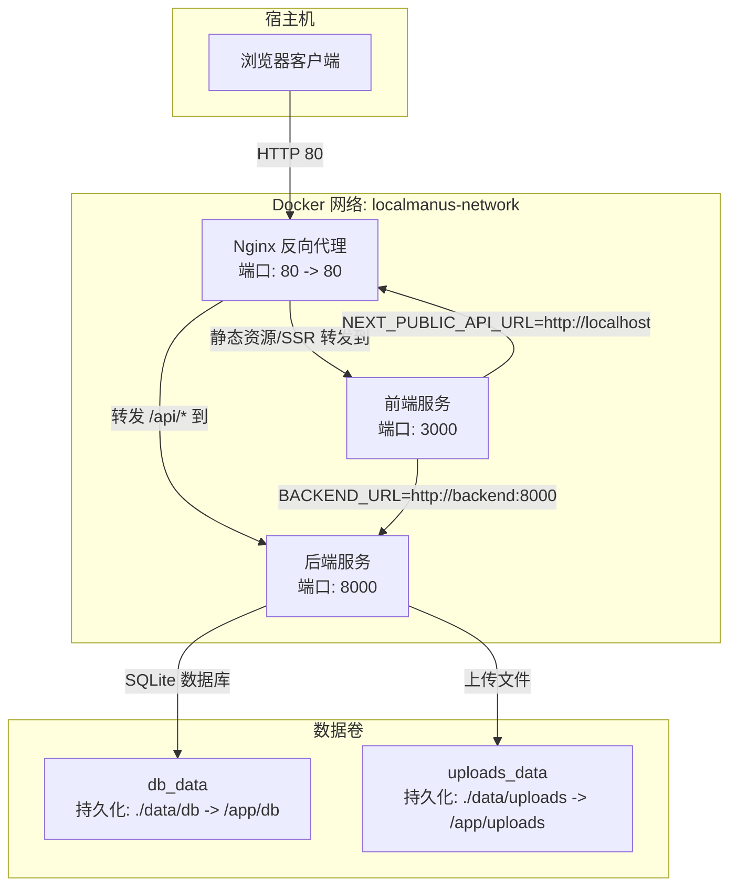
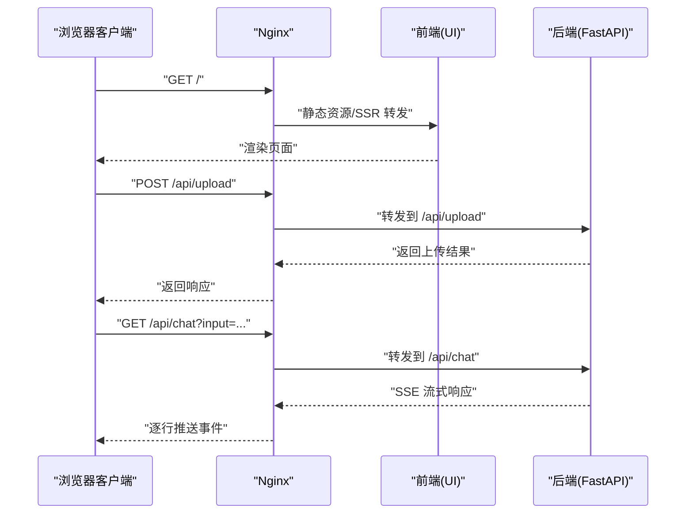
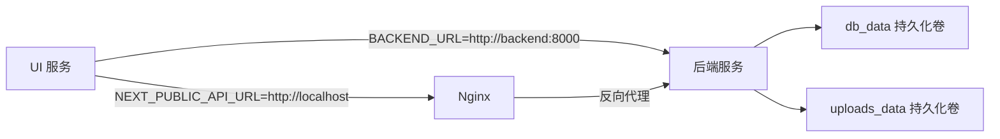

# Docker 容器化部署

<cite>
**本文档引用的文件**
- [docker-compose.yml](file://docker-compose.yml)
- [docker-compose.prod.yml](file://docker-compose.prod.yml)
- [localmanus-backend/Dockerfile](file://localmanus-backend/Dockerfile)
- [localmanus-ui/Dockerfile](file://localmanus-ui/Dockerfile)
- [localmanus-backend/.dockerignore](file://localmanus-backend/.dockerignore)
- [localmanus-ui/.dockerignore](file://localmanus-ui/.dockerignore)
- [.env.docker.example](file://.env.docker.example)
- [localmanus-backend/.env.example](file://localmanus-backend/.env.example)
- [localmanus-ui/.env.production](file://localmanus-ui/.env.production)
- [localmanus-ui/.env.local](file://localmanus-ui/.env.local)
- [setup-docker.sh](file://setup-docker.sh)
- [setup-docker.bat](file://setup-docker.bat)
- [deploy-production.sh](file://deploy-production.sh)
- [deploy-production.bat](file://deploy-production.bat)
- [start-local-dev.sh](file://start-local-dev.sh)
- [start-local-dev.bat](file://start-local-dev.bat)
</cite>

## 更新摘要
**所做更改**
- 移除了对已删除的 DOCKER_DEPLOYMENT.md 和 PRODUCTION_DEPLOYMENT.md 文档的引用
- 更新了部署脚本中的文档链接引用
- 修正了部署步骤说明，移除了不再存在的特定文档引用
- 更新了故障排除指南中的参考文件，确保与实际存在的文件对应

## 目录
1. [简介](#简介)
2. [项目结构](#项目结构)
3. [核心组件](#核心组件)
4. [架构总览](#架构总览)
5. [详细组件分析](#详细组件分析)
6. [依赖关系分析](#依赖关系分析)
7. [性能考虑](#性能考虑)
8. [故障排除指南](#故障排除指南)
9. [结论](#结论)
10. [附录](#附录)

## 简介
本文件面向 LocalManus 项目的 Docker 容器化部署，系统性解析 docker-compose.yml 的服务编排与网络配置，详解 UI 与后端的构建流程与运行参数，并提供从镜像构建到服务上线的完整步骤、网络通信机制、数据持久化策略以及常见问题排查方法。读者无需深厚的容器背景即可完成生产级部署。

## 项目结构
LocalManus 采用多服务编排：Nginx 反向代理、FastAPI 后端服务、Next.js 前端应用，通过自定义桥接网络实现服务间通信；数据库与上传目录通过命名卷持久化，确保重启不丢失数据。

**图表来源**
- [docker-compose.yml](file://docker-compose.yml#L1-L88)

**章节来源**
- [docker-compose.yml](file://docker-compose.yml#L1-L88)

## 核心组件
- Nginx 反向代理：负责端口暴露（80）、健康检查、请求路由至 UI 与后端。
- 后端服务（FastAPI）：提供 API 网关、文件上传下载、聊天流式响应等能力，内置健康检查端点。
- 前端服务（Next.js）：基于多阶段构建的 Node.js 应用，生产模式运行于 3000 端口。
- 数据卷：分别挂载 SQLite 数据库目录与上传文件目录，保证数据持久化。
- 自定义网络：所有服务加入同一桥接网络，便于内部 DNS 解析与通信。

**章节来源**
- [docker-compose.yml](file://docker-compose.yml#L1-L88)
- [localmanus-backend/Dockerfile](file://localmanus-backend/Dockerfile#L44-L49)

## 架构总览
下图展示容器间交互与数据流向：浏览器通过 Nginx 访问 UI；UI 在浏览器上下文通过 Nginx 的反向代理访问后端 API，在 SSR 上下文中直接访问 backend 服务；后端使用持久化卷存储数据库与上传文件。

**图表来源**
- [docker-compose.yml](file://docker-compose.yml#L3-L15)
- [docker-compose.yml](file://docker-compose.yml#L24-L55)
- [docker-compose.yml](file://docker-compose.yml#L56-L76)
- [localmanus-backend/Dockerfile](file://localmanus-backend/Dockerfile#L44-L49)

## 详细组件分析

### Nginx 反向代理服务
- 镜像与端口映射：使用官方 alpine 镜像，将宿主 80 映射到容器 80。
- 卷挂载：挂载本地 Nginx 配置文件到容器只读路径。
- 健康检查：对本地回环健康端点进行轮询检测。
- 依赖关系：先等待后端健康，再启动自身，确保上游可用。
- 网络：加入自定义桥接网络，便于内部服务发现。

**章节来源**
- [docker-compose.yml](file://docker-compose.yml#L3-L23)

### 后端服务（FastAPI）
- 构建上下文：以 localmanus-backend 为构建根目录，使用同目录 Dockerfile。
- 暴露端口：容器内监听 8000。
- 环境变量：
  - 模型与大模型服务：MODEL_NAME、OPENAI_API_KEY、OPENAI_API_BASE。
  - 内部配置：AGENT_MEMORY_LIMIT、UPLOAD_SIZE_LIMIT。
  - 数据库连接：DATABASE_URL 使用 SQLite 文件路径。
- 数据卷：
  - ./data/db -> /app/db：持久化 SQLite 数据库。
  - ./data/uploads -> /app/uploads：持久化用户上传文件。
  - ./localmanus-backend/.env -> /app/.env：挂载环境变量文件（只读）。
- 健康检查：对 /api/health 进行轮询检测，启动延时配置避免过早失败。
- 网络：加入 localmanus-network，内部通过服务名 backend 访问。

**章节来源**
- [docker-compose.yml](file://docker-compose.yml#L24-L55)
- [localmanus-backend/Dockerfile](file://localmanus-backend/Dockerfile#L32-L38)
- [.env.docker.example](file://.env.docker.example#L1-L25)
- [localmanus-backend/.env.example](file://localmanus-backend/.env.example#L1-L12)

### 前端服务（Next.js）
- 构建阶段：
  - 基础镜像：node:20-alpine。
  - 多阶段构建：builder 阶段安装依赖、复制源码并执行生产构建；runner 阶段仅拷贝构建产物与必要依赖。
- 环境变量：
  - NODE_ENV=production。
  - NEXT_PUBLIC_API_URL=http://localhost（浏览器上下文）。
  - BACKEND_URL=http://backend:8000（SSR 上下文）。
- 端口暴露与启动：容器暴露 3000，使用 npm start 启动生产服务。
- 忽略文件：.dockerignore 排除 node_modules、.next、out、.env* 等构建产物与日志。

**章节来源**
- [docker-compose.yml](file://docker-compose.yml#L56-L76)
- [localmanus-ui/Dockerfile](file://localmanus-ui/Dockerfile#L1-L35)
- [localmanus-ui/.dockerignore](file://localmanus-ui/.dockerignore#L1-L12)
- [localmanus-ui/.env.production](file://localmanus-ui/.env.production#L1-L10)
- [localmanus-ui/.env.local](file://localmanus-ui/.env.local#L1-L8)

### 数据持久化与网络
- 数据卷：
  - db_data：用于 SQLite 数据库文件持久化。
  - uploads_data：用于用户上传文件持久化。
- 网络：localmanus-network 为 bridge 类型，容器间可通过服务名相互访问。

**章节来源**
- [docker-compose.yml](file://docker-compose.yml#L77-L88)

## 依赖关系分析
- 服务耦合度：Nginx 依赖后端健康状态；UI 依赖后端可达；后端依赖数据库与上传目录。
- 外部依赖：后端通过 OPENAI_API_BASE 访问外部大模型服务（默认指向本地 Ollama 服务）。
- 内部依赖：UI 通过 BACKEND_URL 直连 backend:8000；浏览器上下文通过 Nginx 代理访问 API。

**图表来源**
- [docker-compose.yml](file://docker-compose.yml#L24-L76)

**章节来源**
- [docker-compose.yml](file://docker-compose.yml#L24-L76)

## 性能考虑
- 多阶段构建：UI 使用两阶段镜像，减少最终镜像体积，提升拉取与启动速度。
- 健康检查间隔：后端与 Nginx 的健康检查间隔为 30 秒，避免频繁探测造成资源浪费。
- 端口暴露策略：后端与 UI 仅暴露必要端口，降低攻击面。
- 数据卷分离：数据库与上传目录独立挂载，便于容量监控与备份策略制定。

## 故障排除指南
- 健康检查失败
  - 现象：容器反复重启或被标记为 unhealth。
  - 排查：查看后端 /api/health 是否可达；确认环境变量是否正确注入；检查数据库初始化是否成功。
  - 参考
    - [docker-compose.yml](file://docker-compose.yml#L49-L54)
    - [localmanus-backend/Dockerfile](file://localmanus-backend/Dockerfile#L44-L49)
- 端口冲突
  - 现象：启动时报端口 80/8000/3000 已占用。
  - 排查：停止占用进程或修改 docker-compose 中的端口映射。
  - 参考
    - [docker-compose.yml](file://docker-compose.yml#L6-L7)
    - [docker-compose.yml](file://docker-compose.yml#L30-L31)
    - [docker-compose.yml](file://docker-compose.yml#L62-L63)
- 环境变量未生效
  - 现象：后端无法连接大模型服务或数据库异常。
  - 排查：确认 .env.docker.example 中的关键变量已按需设置；检查 compose 中环境变量覆盖是否正确。
  - 参考
    - [.env.docker.example](file://.env.docker.example#L1-L25)
    - [docker-compose.yml](file://docker-compose.yml#L32-L38)
    - [localmanus-backend/Dockerfile](file://localmanus-backend/Dockerfile#L32-L38)
- 文件上传失败或找不到文件
  - 现象：上传成功但下载失败，或数据库记录存在但磁盘缺失。
  - 排查：确认 uploads_data 卷挂载有效；检查后端上传目录权限；核对文件路径一致性。
  - 参考
    - [docker-compose.yml](file://docker-compose.yml#L39-L45)
    - [localmanus-backend/Dockerfile](file://localmanus-backend/Dockerfile#L37-L38)
- UI 无法访问后端 API
  - 现象：浏览器控制台报跨域错误或接口 404。
  - 排查：确认 NEXT_PUBLIC_API_URL 与 Nginx 配置一致；确认 BACKEND_URL 指向 backend:8000；检查 Nginx upstream 配置。
  - 参考
    - [docker-compose.yml](file://docker-compose.yml#L64-L69)
    - [docker-compose.yml](file://docker-compose.yml#L8-L9)

## 结论
通过 docker-compose.yml 的清晰编排与多阶段构建的 UI 镜像，LocalManus 实现了前后端与代理的一体化部署。结合数据卷与健康检查机制，可在开发与生产环境中快速、稳定地运行。建议在生产中进一步完善 Nginx 配置、证书与安全策略，并对数据库与上传目录制定定期备份方案。

## 附录

### 部署步骤
- 准备工作
  - 确保已安装 Docker 与 docker-compose。
  - 准备 .env 文件（可参考 .env.docker.example），设置 OPENAI_API_KEY、OPENAI_API_BASE、MODEL_NAME 等。
- 镜像构建与启动
  - 在项目根目录执行：docker compose up -d
  - 查看服务状态：docker compose ps
- 服务验证
  - 访问 http://localhost（或宿主机 IP）查看首页。
  - 访问 http://localhost/api/health 验证后端健康。
  - 在 UI 中尝试上传文件与发起对话，观察 SSE 流式响应。
- 停止与清理
  - 停止：docker compose down
  - 清理数据卷（谨慎操作）：docker volume rm db_data uploads_data

**章节来源**
- [docker-compose.yml](file://docker-compose.yml#L1-L88)
- [.env.docker.example](file://.env.docker.example#L1-L25)

### 关键配置要点
- 环境变量
  - 后端：MODEL_NAME、OPENAI_API_KEY、OPENAI_API_BASE、AGENT_MEMORY_LIMIT、UPLOAD_SIZE_LIMIT、DATABASE_URL。
  - 前端：NODE_ENV、NEXT_PUBLIC_API_URL、BACKEND_URL。
- 端口映射
  - Nginx: 80 -> 80
  - 后端: 8000
  - UI: 3000
- 数据卷
  - db_data -> /app/db
  - uploads_data -> /app/uploads
  - .env -> /app/.env（只读）

**章节来源**
- [docker-compose.yml](file://docker-compose.yml#L6-L45)
- [localmanus-ui/Dockerfile](file://localmanus-ui/Dockerfile#L22-L30)
- [localmanus-backend/Dockerfile](file://localmanus-backend/Dockerfile#L32-L38)

### 开发环境设置
- Linux/Mac 环境
  - 运行：bash setup-docker.sh
  - 该脚本会自动创建数据目录、复制环境模板并提示下一步操作
- Windows 环境
  - 运行：setup-docker.bat
  - 该脚本会自动创建数据目录、复制环境模板并提示下一步操作

**章节来源**
- [setup-docker.sh](file://setup-docker.sh#L1-L52)
- [setup-docker.bat](file://setup-docker.bat#L1-L55)

### 生产环境部署
- Linux/Mac 环境
  - 运行：bash deploy-production.sh
  - 该脚本会自动配置生产环境、构建镜像并启动服务
- Windows 环境
  - 运行：deploy-production.bat
  - 该脚本会自动配置生产环境、构建镜像并启动服务

**章节来源**
- [deploy-production.sh](file://deploy-production.sh#L1-L196)
- [deploy-production.bat](file://deploy-production.bat#L1-L131)

### 本地开发模式
- Linux/Mac 环境
  - 运行：bash start-local-dev.sh
  - 该脚本会自动设置 Python 和 Node.js 环境，启动后端和前端服务
- Windows 环境
  - 运行：start-local-dev.bat
  - 该脚本会自动设置 Python 和 Node.js 环境，启动后端和前端服务

**章节来源**
- [start-local-dev.sh](file://start-local-dev.sh#L1-L130)
- [start-local-dev.bat](file://start-local-dev.bat#L1-L139)