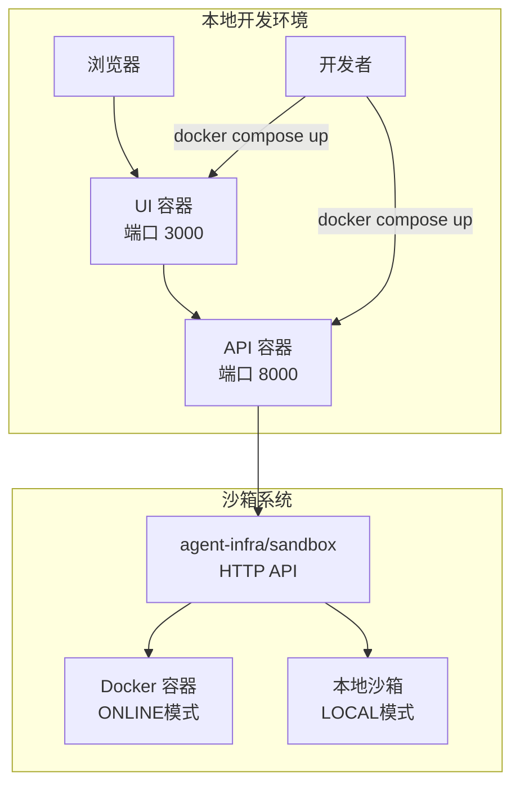
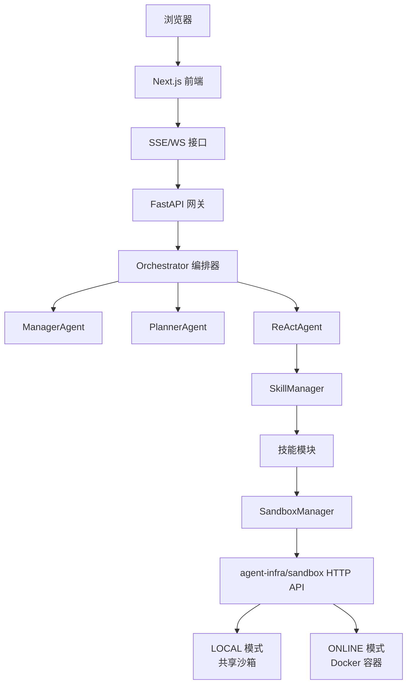
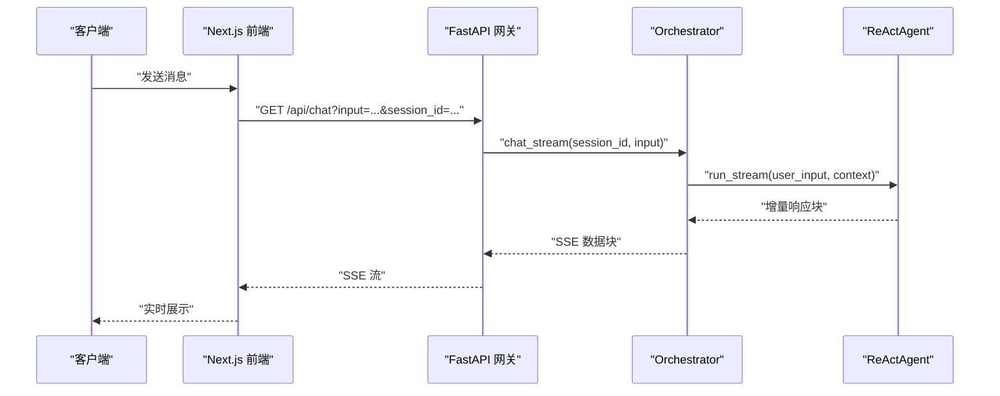
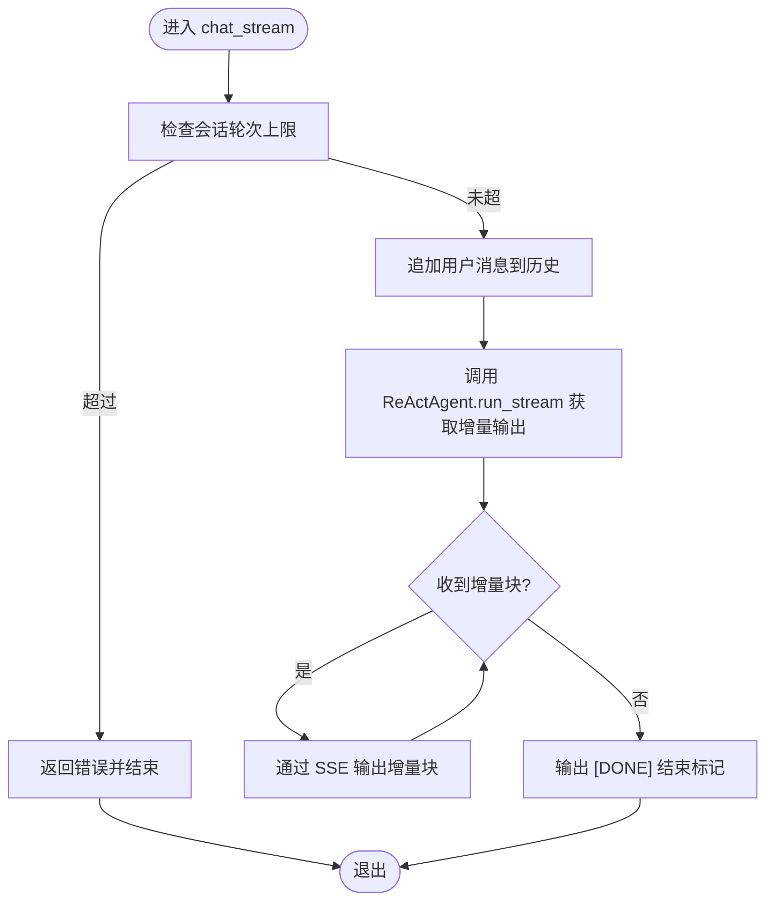
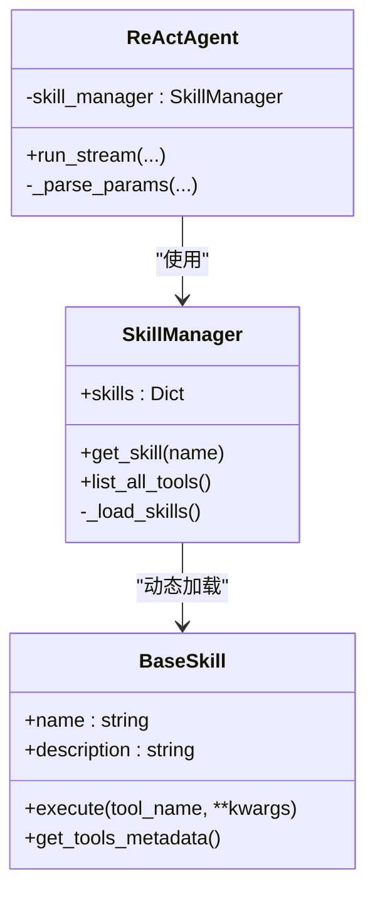
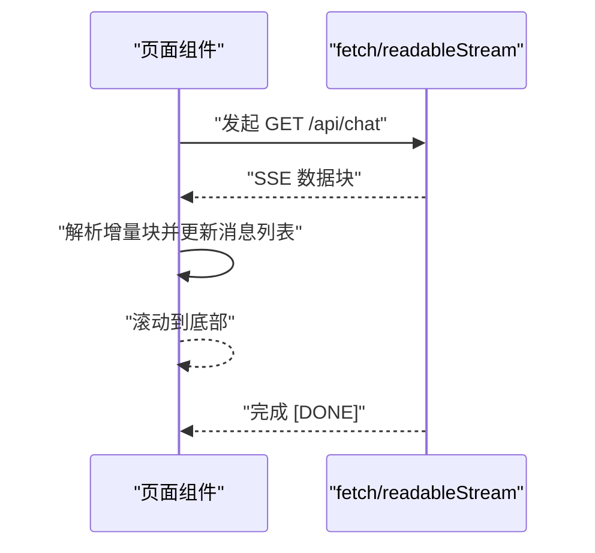
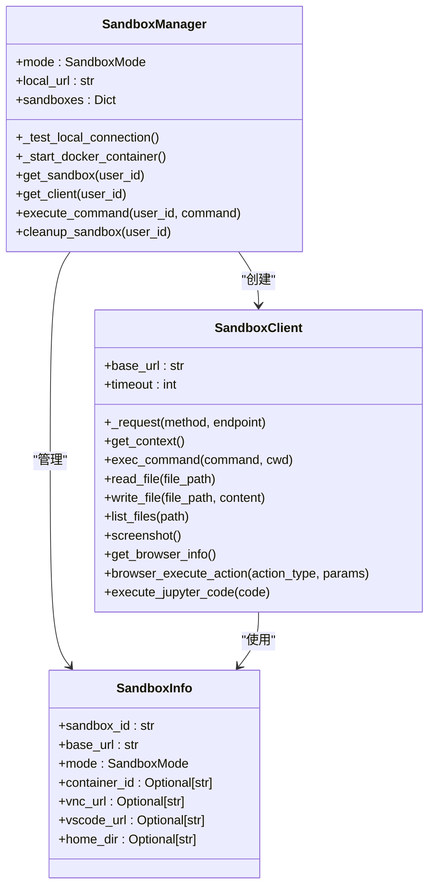
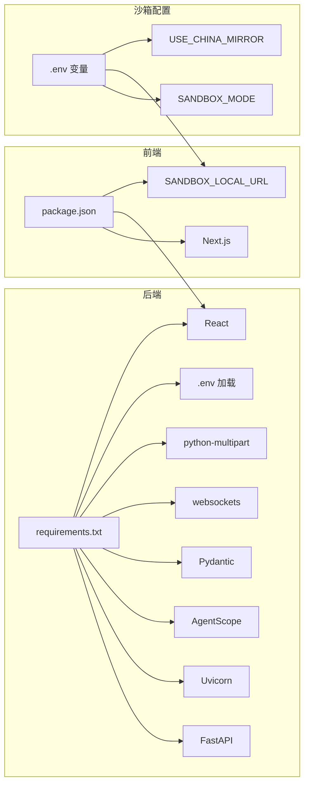

# 故障排除指南

<cite>
**本文档引用的文件**
- [docker-compose.yml](file://docker-compose.yml)
- [main.py](file://localmanus-backend/main.py)
- [requirements.txt](file://localmanus-backend/requirements.txt)
- [.env.example](file://localmanus-backend/.env.example)
- [config.py](file://localmanus-backend/core/config.py)
- [orchestrator.py](file://localmanus-backend/core/orchestrator.py)
- [skill_manager.py](file://localmanus-backend/core/skill_manager.py)
- [react_agent.py](file://localmanus-backend/agents/react_agent.py)
- [base_agents.py](file://localmanus-backend/agents/base_agents.py)
- [Dockerfile](file://localmanus-ui/Dockerfile)
- [package.json](file://localmanus-ui/package.json)
- [page.tsx](file://localmanus-ui/app/page.tsx)
- [.gitignore](file://.gitignore)
- [localmanus_architecture.md](file://localmanus_architecture.md)
- [localmanus_prd.md](file://localmanus_prd.md)
- [localmanus_skills_roadmap.md](file://localmanus_skills_roadmap.md)
- [firecracker_sandbox.py](file://localmanus-backend/core/firecracker_sandbox.py)
- [sandbox.py](file://localmanus-backend/core/sandbox.py)
- [FIRECRACKER_TROUBLESHOOTING.md](file://localmanus-backend/scripts/FIRECRACKER_TROUBLESHOOTING.md)
- [test_sandbox.py](file://localmanus-backend/scripts/test_sandbox.py)
- [firecracker_setup.sh](file://localmanus-backend/scripts/firecracker_setup.sh)
</cite>

## 更新摘要
**所做更改**
- 移除了对已删除的Firecracker故障排除指南章节的引用
- 更新了agent-infra/sandbox系统的故障排除指南，基于当前可用的实现
- 移除了对已删除的SANDBOX_MIGRATION_GUIDE.md和SANDBOX_QUICKSTART.md的引用
- 更新了架构图以反映当前的sandbox系统实现
- 移除了对已删除的FIRECRACKER_TROUBLESHOOTING.md中详细故障排除步骤的引用
- 专注于当前可用的故障排除方法和配置

## 目录
1. [简介](#简介)
2. [项目结构](#项目结构)
3. [核心组件](#核心组件)
4. [架构总览](#架构总览)
5. [详细组件分析](#详细组件分析)
6. [依赖关系分析](#依赖关系分析)
7. [性能考虑](#性能考虑)
8. [故障排除指南](#故障排除指南)
9. [结论](#结论)
10. [附录](#附录)

## 简介
本指南面向 LocalManus 项目的运维与开发人员，提供从部署到运行期的全链路故障排除方法。内容涵盖容器启动失败、端口冲突、依赖安装错误、网络连接问题的诊断与修复；日志分析技巧（Docker 日志、应用错误日志、系统日志）；性能问题排查（内存泄漏检测、CPU 使用率分析、I/O 瓶颈识别）；以及备份与恢复策略与紧急快速修复方案。

**重要更新**：Firecracker虚拟机沙箱系统已被新的agent-infra/sandbox系统完全取代，新的系统提供更灵活的LOCAL和ONLINE两种模式。由于大量原有故障排除文档已被删除，本指南现专注于当前可用的故障排除方法。

## 项目结构
LocalManus 采用前后端分离的容器化架构：
- 前端：Next.js 应用，暴露 3000 端口
- 后端：FastAPI 应用，监听 8000 端口
- 服务编排：docker-compose 管理 UI 服务，预留后端服务扩展
- **新增**：agent-infra/sandbox系统，提供LOCAL和ONLINE两种沙箱模式



**图表来源**
- [docker-compose.yml](file://docker-compose.yml#L1-L16)
- [Dockerfile](file://localmanus-ui/Dockerfile#L29-L31)
- [main.py](file://localmanus-backend/main.py#L95-L97)
- [firecracker_sandbox.py](file://localmanus-backend/core/firecracker_sandbox.py#L103-L126)

**章节来源**
- [docker-compose.yml](file://docker-compose.yml#L1-L16)
- [Dockerfile](file://localmanus-ui/Dockerfile#L1-L32)
- [main.py](file://localmanus-backend/main.py#L1-L98)
- [firecracker_sandbox.py](file://localmanus-backend/core/firecracker_sandbox.py#L1-L294)

## 核心组件
- UI 组件：Next.js 页面与组件，负责用户交互与调用后端 API
- 后端组件：FastAPI 应用、Orchestrator 编排器、ReActAgent、SkillManager
- **更新**：SandboxManager - 统一管理agent-infra/sandbox系统，支持LOCAL和ONLINE两种模式
- 配置与环境：.env 示例、后端配置加载、依赖清单

关键职责与交互：
- UI 通过 HTTP(SSE/WebSocket) 与后端通信
- 后端通过 Orchestrator 协调 Manager/Planner/ReActAgent
- SkillManager 动态加载技能模块
- **新增**：SandboxManager 通过HTTP API与agent-infra/sandbox交互
- 环境变量控制模型、端口和沙箱模式

**章节来源**
- [page.tsx](file://localmanus-ui/app/page.tsx#L31-L159)
- [main.py](file://localmanus-backend/main.py#L1-L98)
- [orchestrator.py](file://localmanus-backend/core/orchestrator.py#L1-L119)
- [react_agent.py](file://localmanus-backend/agents/react_agent.py#L1-L221)
- [skill_manager.py](file://localmanus-backend/core/skill_manager.py#L1-L84)
- [.env.example](file://localmanus-backend/.env.example#L1-L12)
- [config.py](file://localmanus-backend/core/config.py#L1-L27)
- [firecracker_sandbox.py](file://localmanus-backend/core/firecracker_sandbox.py#L103-L126)

## 架构总览
系统采用"前端 + API 网关 + 多智能体编排 + agent-infra/sandbox + 技能库"的分层架构。前端通过 WebSocket/SSE 与后端交互，后端通过 AgentScope 的 Manager/Planner/ReActAgent 将用户请求分解为可执行的任务流，并通过 SkillManager 动态加载技能执行。新的沙箱系统提供统一的HTTP API接口，支持LOCAL共享模式和ONLINE隔离模式。



**图表来源**
- [localmanus_architecture.md](file://localmanus_architecture.md#L1-L34)
- [page.tsx](file://localmanus-ui/app/page.tsx#L31-L159)
- [main.py](file://localmanus-backend/main.py#L29-L97)
- [orchestrator.py](file://localmanus-backend/core/orchestrator.py#L11-L81)
- [react_agent.py](file://localmanus-backend/agents/react_agent.py#L59-L221)
- [skill_manager.py](file://localmanus-backend/core/skill_manager.py#L42-L84)
- [firecracker_sandbox.py](file://localmanus-backend/core/firecracker_sandbox.py#L103-L126)

## 详细组件分析

### 后端 API 网关（FastAPI）
- 提供根路径健康检查、SSE 聊天接口、同步任务接口、WebSocket 接口
- 默认监听 0.0.0.0:8000，支持 CORS
- 记录 WebSocket 连接/断开事件与异常



**图表来源**
- [main.py](file://localmanus-backend/main.py#L29-L50)
- [orchestrator.py](file://localmanus-backend/core/orchestrator.py#L16-L64)

**章节来源**
- [main.py](file://localmanus-backend/main.py#L1-L98)
- [config.py](file://localmanus-backend/core/config.py#L18-L21)

### 编排器（Orchestrator）
- 维护会话历史，限制最大轮次
- 调用 ReActAgent 执行流式推理
- 异常捕获并返回错误信息



**图表来源**
- [orchestrator.py](file://localmanus-backend/core/orchestrator.py#L16-L64)

**章节来源**
- [orchestrator.py](file://localmanus-backend/core/orchestrator.py#L1-L119)

### ReActAgent 与技能管理
- ReActAgent 解析工具调用，执行观察与继续迭代
- SkillManager 动态导入技能模块，提供工具元数据
- 错误处理：找不到技能或执行异常时返回错误块



**图表来源**
- [skill_manager.py](file://localmanus-backend/core/skill_manager.py#L42-L84)
- [react_agent.py](file://localmanus-backend/agents/react_agent.py#L57-L221)

**章节来源**
- [react_agent.py](file://localmanus-backend/agents/react_agent.py#L1-L221)
- [skill_manager.py](file://localmanus-backend/core/skill_manager.py#L1-L84)

### 前端页面（Next.js）
- 支持发送消息、接收 SSE 流、展示思考过程与工具调用
- 错误时显示兜底提示



**图表来源**
- [page.tsx](file://localmanus-ui/app/page.tsx#L31-L159)

**章节来源**
- [page.tsx](file://localmanus-ui/app/page.tsx#L1-L285)

### agent-infra/sandbox 系统
**新增**：统一的沙箱管理系统，替代原有的Firecracker虚拟机系统

#### SandboxManager
- 支持LOCAL和ONLINE两种模式
- 自动检测和连接现有沙箱
- 在ONLINE模式下自动创建Docker容器
- 提供统一的HTTP API接口

#### SandboxClient
- 封装agent-infra/sandbox API调用
- 支持命令执行、文件操作、浏览器自动化等
- 提供错误处理和重试机制

#### SandboxInfo
- 存储沙箱实例信息
- 包含沙箱ID、基础URL、模式类型、容器ID等
- 支持VNC和VSCode服务器URL



**图表来源**
- [firecracker_sandbox.py](file://localmanus-backend/core/firecracker_sandbox.py#L103-L126)
- [firecracker_sandbox.py](file://localmanus-backend/core/firecracker_sandbox.py#L31-L102)
- [firecracker_sandbox.py](file://localmanus-backend/core/firecracker_sandbox.py#L20-L30)

**章节来源**
- [firecracker_sandbox.py](file://localmanus-backend/core/firecracker_sandbox.py#L1-L294)
- [sandbox.py](file://localmanus-backend/core/sandbox.py#L1-L46)

## 依赖关系分析
- 后端依赖：FastAPI、Uvicorn、AgentScope、Pydantic、websockets、python-multipart、python-dotenv
- 前端依赖：Next.js、React、Lucide React 等
- **新增**：requests库用于HTTP API调用
- 环境变量：OPENAI_API_KEY、OPENAI_API_BASE、MODEL_NAME 控制模型配置
- **新增**：SANDBOX_MODE、SANDBOX_LOCAL_URL、USE_CHINA_MIRROR 控制沙箱配置



**图表来源**
- [requirements.txt](file://localmanus-backend/requirements.txt#L1-L8)
- [package.json](file://localmanus-ui/package.json#L11-L24)
- [.env.example](file://localmanus-backend/.env.example#L5-L12)

**章节来源**
- [requirements.txt](file://localmanus-backend/requirements.txt#L1-L8)
- [package.json](file://localmanus-ui/package.json#L1-L26)
- [.env.example](file://localmanus-backend/.env.example#L1-L12)
- [config.py](file://localmanus-backend/core/config.py#L23-L27)

## 性能考虑
- CPU 使用率分析：使用系统监控工具观察容器 CPU 占用，定位高负载阶段（SSE 流、Agent 推理、工具执行、沙箱API调用）
- 内存泄漏检测：关注长时间运行的会话历史累积与对象引用，必要时清理过期会话
- I/O 瓶颈识别：检查磁盘写入（日志）、网络请求（外部模型 API、沙箱API）、文件读写（技能执行）
- **新增**：沙箱性能监控：监控Docker容器资源使用、沙箱API响应时间、并发连接数

## 故障排除指南

### 一、容器启动失败
常见症状
- docker compose 启动后立即退出
- UI 容器无法访问 3000 端口
- 后端容器报端口占用或进程异常

排查步骤
1. 查看容器状态与日志
   - docker compose ps
   - docker compose logs ui
   - docker compose logs backend
2. 检查端口占用
   - netstat -ano | findstr :3000
   - netstat -ano | findstr :8000
3. 检查构建缓存与依赖
   - 删除 node_modules/.next/.next/cache 清理缓存
   - 重新构建镜像：docker compose build --no-cache
4. 确认 Dockerfile EXPOSE 与 docker-compose 端口映射一致
   - UI Dockerfile EXPOSE 3000
   - docker-compose 映射 3000:3000

快速修复
- 若端口冲突，修改 docker-compose 端口映射或释放占用端口
- 若依赖安装失败，使用离线包或更换镜像源后重试

**章节来源**
- [docker-compose.yml](file://docker-compose.yml#L6-L10)
- [Dockerfile](file://localmanus-ui/Dockerfile#L29-L31)

### 二、端口冲突
现象
- UI/后端容器启动后很快退出
- 浏览器无法访问页面

排查
- 使用系统工具确认 3000/8000 是否被占用
- 修改 docker-compose.yml 中的 hostPort

修复
- 将 3000 改为 3001，或将 8000 改为 8001
- 重启服务：docker compose up -d

**章节来源**
- [docker-compose.yml](file://docker-compose.yml#L6-L10)

### 三、依赖安装错误
后端依赖
- requirements.txt 包含 FastAPI、Uvicorn、AgentScope 等
- **新增**：requests库用于沙箱API调用
- 如遇网络问题，建议使用国内镜像源或离线安装

前端依赖
- package.json 指定 Next.js 与 React 版本
- 若安装缓慢，可使用 npm ci 或切换镜像源

排查
- 查看 docker compose logs ui/backend 的 pip/npm 安装日志
- 确认 .gitignore 中忽略的 node_modules/.next 不影响构建

修复
- 清理缓存后重试：删除 node_modules/.next/.next/cache
- 使用 --no-cache 重建镜像

**章节来源**
- [requirements.txt](file://localmanus-backend/requirements.txt#L1-L8)
- [package.json](file://localmanus-ui/package.json#L11-L24)
- [.gitignore](file://.gitignore#L1-L66)

### 四、网络连接问题
前端无法访问后端
- UI 通过 http://localhost:8000 调用后端 API
- 若容器间通信异常，检查后端监听地址与端口

排查
- 在 UI 容器内 curl http://host.docker.internal:8000
- 检查后端容器日志是否出现异常
- 确认后端配置 HOST/PORT 与 docker-compose 端口映射一致

修复
- 使用 host.docker.internal 或宿主机 IP 访问
- 确保后端监听 0.0.0.0 而非 127.0.0.1

**章节来源**
- [page.tsx](file://localmanus-ui/app/page.tsx#L42-L47)
- [config.py](file://localmanus-backend/core/config.py#L18-L21)
- [main.py](file://localmanus-backend/main.py#L95-L97)

### 五、agent-infra/sandbox 系统故障排除
**新增**：针对新的沙箱系统的专门故障排除指南

#### LOCAL模式故障排除
现象
- 无法连接到本地沙箱
- 沙箱API调用失败
- VNC/VSCode服务器无法访问

排查步骤
1. 验证沙箱服务状态
   - curl http://192.168.126.131:8080/v1/sandbox
   - docker ps | grep sandbox
2. 检查环境变量配置
   - SANDBOX_MODE=local
   - SANDBOX_LOCAL_URL=http://192.168.126.131:8080
3. 测试沙箱连接
   - python scripts/test_sandbox.py --mode local

修复方法
- 启动本地沙箱容器
  ```bash
  docker run --security-opt seccomp=unconfined \
    --rm -it -p 8080:8080 \
    ghcr.io/agent-infra/sandbox:latest
  ```
- 检查防火墙设置，确保8080端口开放
- 验证网络连通性：ping 192.168.126.131

#### ONLINE模式故障排除
现象
- Docker容器启动失败
- 容器启动后立即退出
- 沙箱API调用超时

排查步骤
1. 检查Docker服务状态
   - docker ps
   - docker info
2. 查看容器日志
   - docker logs localmanus-sandbox-{user_id}
3. 检查资源使用情况
   - docker stats
   - 确保有足够的内存和CPU

修复方法
- 清理僵尸容器
  ```bash
  docker ps -a | grep localmanus-sandbox | awk '{print $1}' | xargs docker rm -f
  ```
- 检查Docker守护进程配置
  - 确保seccomp=unconfined权限
  - 检查shm-size设置（默认2GB）
- 重新启动沙箱容器
  - 删除旧容器后自动创建新容器

#### 通用沙箱故障排除
现象
- 沙箱API调用返回错误
- 命令执行失败
- 文件操作异常

排查步骤
1. 检查沙箱上下文
   - 获取沙箱信息：client.get_context()
   - 验证home_dir路径
2. 测试基本功能
   - 执行简单命令：echo "test"
   - 读写测试文件
3. 检查网络连接
   - 验证沙箱API可达性
   - 检查代理设置

修复方法
- 重启沙箱服务
- 清理沙箱缓存
- 检查沙箱配置参数

**章节来源**
- [test_sandbox.py](file://localmanus-backend/scripts/test_sandbox.py#L13-L84)
- [firecracker_sandbox.py](file://localmanus-backend/core/firecracker_sandbox.py#L127-L136)

### 六、日志分析技巧
Docker 日志
- docker compose logs ui/backend
- docker compose logs -f ui/backend 实时跟踪

应用错误日志
- 后端 FastAPI：main.py 中 logging.basicConfig(level=logging.INFO)，记录连接/断开与异常
- ReActAgent：执行工具时的异常会被记录并返回给前端
- **新增**：SandboxManager：记录沙箱连接、命令执行、API调用等关键事件

系统日志
- Windows：事件查看器 Application/系统日志
- Linux：journalctl -u docker.service 或容器日志

定位要点
- 关注 SSE/WS 连接建立与断开时间点
- 捕获 JSON 解析异常与工具执行错误
- **新增**：关注沙箱API调用超时、Docker容器状态变化

**章节来源**
- [main.py](file://localmanus-backend/main.py#L10-L12)
- [react_agent.py](file://localmanus-backend/agents/react_agent.py#L210-L214)
- [firecracker_sandbox.py](file://localmanus-backend/core/firecracker_sandbox.py#L13-L13)

### 七、性能问题排查
内存泄漏检测
- 观察长时间运行后内存持续增长
- 检查会话历史是否无限增长（当前实现限制 20 条消息）
- **新增**：监控沙箱容器内存使用情况

CPU 使用率分析
- 定位高负载阶段：SSE 流传输、Agent 推理、工具执行、沙箱API调用
- 分析工具调用耗时，优化技能实现
- **新增**：监控Docker容器CPU使用率

I/O 瓶颈识别
- 检查磁盘写入（日志目录）与网络请求（外部模型 API、沙箱API）、文件读写（技能执行）
- 减少不必要的日志级别或落盘
- **新增**：监控沙箱文件系统I/O和网络带宽

**章节来源**
- [orchestrator.py](file://localmanus-backend/core/orchestrator.py#L20-L28)
- [firecracker_sandbox.py](file://localmanus-backend/core/firecracker_sandbox.py#L137-L183)

### 八、备份与恢复策略
数据备份
- 日志与运行产物：.gitignore 已忽略 logs/ 和 runs/，建议在宿主机持久化挂载
- 建议将 /localmanus-backend/logs 与 /localmanus-backend/runs 挂载到宿主机目录
- **新增**：沙箱数据备份：备份沙箱中的重要文件和配置

配置文件备份
- .env.example 提供示例，实际 .env 由开发者维护
- 建议将 .env 与 docker-compose.yml 纳入版本控制外的私有备份
- **新增**：沙箱配置备份：备份SANDBOX_MODE、SANDBOX_LOCAL_URL等环境变量

灾难恢复流程
- 备份：定期打包 logs/runs/.env/docker-compose.yml、沙箱数据
- 恢复：停止服务，还原备份，重建并启动容器
- 验证：检查 UI/后端连通性与 SSE/WS 功能
- **新增**：沙箱恢复：重新启动沙箱服务，验证API连接

**章节来源**
- [.gitignore](file://.gitignore#L64-L66)
- [.env.example](file://localmanus-backend/.env.example#L1-L12)
- [docker-compose.yml](file://docker-compose.yml#L1-L16)

### 九、紧急快速修复方案
- 端口冲突：临时修改 docker-compose 端口映射，快速恢复服务
- 依赖失败：使用 --no-cache 重建镜像，或离线安装包
- 网络不通：改用 host.docker.internal 或宿主机 IP
- 日志过多：降低日志级别或禁用部分模块日志
- SSE/WS 断开：检查后端异常日志，修复上游 Agent/技能错误
- **新增**：沙箱连接失败：检查沙箱服务状态，重启沙箱容器
- **新增**：Docker容器问题：清理僵尸容器，检查Docker守护进程配置

**章节来源**
- [docker-compose.yml](file://docker-compose.yml#L6-L10)
- [main.py](file://localmanus-backend/main.py#L92-L93)

## 结论
本指南提供了 LocalManus 从部署到运行期的系统化故障排除方法。通过理解前后端组件职责、掌握日志分析技巧与性能排查手段，并结合合理的备份与恢复策略，可有效缩短故障定位与修复时间，保障系统稳定运行。

**重要更新**：随着Firecracker架构被agent-infra/sandbox系统取代，新的故障排除指南涵盖了LOCAL和ONLINE两种沙箱模式的专门问题，包括Docker容器管理、沙箱API调用、VNC/VSCode集成等新挑战。开发者应重点关注沙箱系统的配置和运维，确保系统的稳定性和可扩展性。

## 附录
- 产品需求与架构参考：PRD、架构设计、技能路线图
- **新增**：沙箱系统迁移指南、快速开始文档
- 相关文件路径与用途可参考本指南各章节来源

**章节来源**
- [localmanus_prd.md](file://localmanus_prd.md#L1-L68)
- [localmanus_architecture.md](file://localmanus_architecture.md#L1-L34)
- [localmanus_skills_roadmap.md](file://localmanus_skills_roadmap.md#L24-L62)
- [FIRECRACKER_TROUBLESHOOTING.md](file://localmanus-backend/scripts/FIRECRACKER_TROUBLESHOOTING.md#L1-L304)