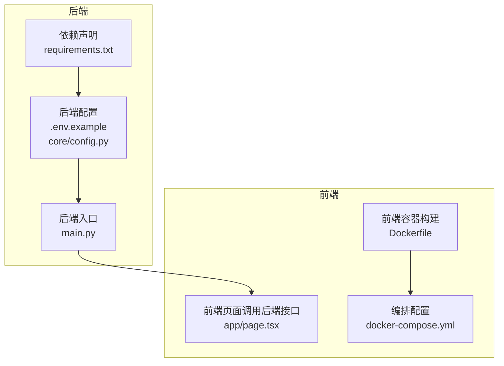
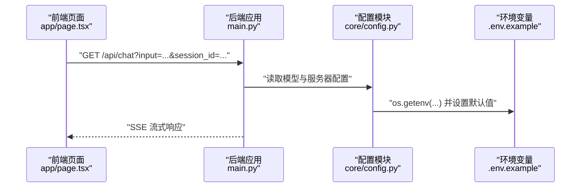
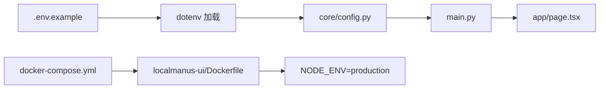

# 环境变量配置

<cite>
**本文引用的文件**
- [localmanus-backend/.env.example](file://localmanus-backend/.env.example)
- [localmanus-backend/core/config.py](file://localmanus-backend/core/config.py)
- [localmanus-backend/main.py](file://localmanus-backend/main.py)
- [localmanus-backend/requirements.txt](file://localmanus-backend/requirements.txt)
- [localmanus-ui/Dockerfile](file://localmanus-ui/Dockerfile)
- [docker-compose.yml](file://docker-compose.yml)
- [localmanus-ui/app/page.tsx](file://localmanus-ui/app/page.tsx)
</cite>

## 目录
1. [简介](#简介)
2. [项目结构](#项目结构)
3. [核心组件](#核心组件)
4. [架构总览](#架构总览)
5. [详细组件分析](#详细组件分析)
6. [依赖关系分析](#依赖关系分析)
7. [性能考虑](#性能考虑)
8. [故障排查指南](#故障排查指南)
9. [结论](#结论)
10. [附录](#附录)

## 简介
本文件为 LocalManus 项目的环境变量配置指南，聚焦于后端与前端在环境变量上的差异、默认值与验证策略、以及在不同运行环境（开发、测试、生产）下的最佳实践。内容基于仓库中实际存在的配置文件与代码实现进行整理，确保可操作性与一致性。

## 项目结构
- 后端（Python/FastAPI）通过 dotenv 加载环境变量，并将其注入到模型配置与服务器监听端口等关键路径。
- 前端（Next.js）当前未直接读取运行时环境变量；容器构建阶段会注入 NODE_ENV=production。
- docker-compose 定义了 UI 服务的端口映射与环境变量，便于统一管理。

**图表来源**
- [localmanus-backend/.env.example](file://localmanus-backend/.env.example#L1-L4)
- [localmanus-backend/core/config.py](file://localmanus-backend/core/config.py#L1-L21)
- [localmanus-backend/main.py](file://localmanus-backend/main.py#L1-L95)
- [localmanus-backend/requirements.txt](file://localmanus-backend/requirements.txt#L1-L8)
- [localmanus-ui/Dockerfile](file://localmanus-ui/Dockerfile#L1-L32)
- [docker-compose.yml](file://docker-compose.yml#L1-L16)
- [localmanus-ui/app/page.tsx](file://localmanus-ui/app/page.tsx#L36-L40)

**章节来源**
- [localmanus-backend/.env.example](file://localmanus-backend/.env.example#L1-L4)
- [localmanus-backend/core/config.py](file://localmanus-backend/core/config.py#L1-L21)
- [localmanus-backend/main.py](file://localmanus-backend/main.py#L92-L95)
- [localmanus-backend/requirements.txt](file://localmanus-backend/requirements.txt#L1-L8)
- [localmanus-ui/Dockerfile](file://localmanus-ui/Dockerfile#L1-L32)
- [docker-compose.yml](file://docker-compose.yml#L1-L16)
- [localmanus-ui/app/page.tsx](file://localmanus-ui/app/page.tsx#L36-L40)

## 核心组件
- 后端环境变量加载与使用
  - dotenv 在启动时加载 .env 文件，随后通过 os.getenv 获取键值并设置默认值。
  - 关键键名：OPENAI_API_KEY、OPENAI_API_BASE、MODEL_NAME。
  - 默认值策略：当键不存在时，使用明确的默认值（如 EMPTY、gpt-4、http://localhost:11434/v1）。
- 前端环境变量现状
  - 当前未在前端代码中显式读取运行时环境变量；容器镜像构建时设置 NODE_ENV=production。
  - 页面中对后端的调用使用硬编码的本地地址 http://localhost:8000，建议通过运行时变量或反向代理统一管理。
- 服务器监听端口
  - 后端默认监听 0.0.0.0:8000；docker-compose 中 UI 映射 3000:3000，未暴露后端端口。

**章节来源**
- [localmanus-backend/core/config.py](file://localmanus-backend/core/config.py#L1-L21)
- [localmanus-backend/.env.example](file://localmanus-backend/.env.example#L1-L4)
- [localmanus-backend/main.py](file://localmanus-backend/main.py#L92-L95)
- [localmanus-ui/Dockerfile](file://localmanus-ui/Dockerfile#L20-L20)
- [docker-compose.yml](file://docker-compose.yml#L6-L10)
- [localmanus-ui/app/page.tsx](file://localmanus-ui/app/page.tsx#L36-L40)

## 架构总览
下图展示了后端如何从环境变量加载配置，并被前端通过本地回环地址访问：

**图表来源**
- [localmanus-ui/app/page.tsx](file://localmanus-ui/app/page.tsx#L36-L83)
- [localmanus-backend/main.py](file://localmanus-backend/main.py#L30-L47)
- [localmanus-backend/core/config.py](file://localmanus-backend/core/config.py#L8-L21)
- [localmanus-backend/.env.example](file://localmanus-backend/.env.example#L1-L4)

## 详细组件分析

### 后端环境变量清单与用途
- OPENAI_API_KEY
  - 用途：用于认证外部大模型服务（例如 OpenAI 兼容接口）。
  - 默认值：EMPTY（由配置模块提供）。
  - 风险：若为空或不正确，可能导致推理失败或鉴权错误。
- OPENAI_API_BASE
  - 用途：指定大模型服务的基础 URL（支持本地 Ollama 或远程服务）。
  - 默认值：http://localhost:11434/v1（本地 Ollama 示例）。
  - 风险：若地址不可达或路径不匹配，会导致请求超时或 404。
- MODEL_NAME
  - 用途：选择具体模型名称（如 gpt-4）。
  - 默认值：gpt-4。
  - 风险：若模型不存在或不兼容，将导致推理异常。

上述键名与默认值均来自后端配置模块与示例文件，dotenv 在启动时加载 .env 文件以覆盖默认值。

**章节来源**
- [localmanus-backend/.env.example](file://localmanus-backend/.env.example#L1-L4)
- [localmanus-backend/core/config.py](file://localmanus-backend/core/config.py#L8-L16)

### 前端环境变量差异与现状
- 运行时环境变量
  - 当前未在前端代码中读取运行时环境变量；容器镜像构建时设置 NODE_ENV=production。
- 接口调用地址
  - 前端页面直接调用 http://localhost:8000/api/chat，未使用 NEXT_PUBLIC_ 前缀的公开变量。
  - 建议：将后端地址抽象为运行时变量（例如 NEXT_PUBLIC_BACKEND_URL），并在不同环境注入不同值。
- 容器与编排
  - docker-compose 将 UI 暴露至 3000:3000，未暴露后端端口；若前后端分离部署，需通过反向代理或服务发现统一入口。

**章节来源**
- [localmanus-ui/Dockerfile](file://localmanus-ui/Dockerfile#L20-L20)
- [docker-compose.yml](file://docker-compose.yml#L6-L10)
- [localmanus-ui/app/page.tsx](file://localmanus-ui/app/page.tsx#L36-L40)

### 配置验证与错误处理
- 验证策略
  - 后端通过 os.getenv 提供默认值，避免因缺少键而崩溃；但未进行类型或格式校验。
  - 建议：在配置模块中增加校验函数，对必填项进行非空检查、URL 合法性校验、模型存在性检查等。
- 错误处理
  - 前端在 fetch 失败时记录日志并提示用户“抱歉，发生了错误。请稍后再试。”
  - 建议：区分网络错误、HTTP 状态码错误与解析错误，返回更具体的错误信息。
- 默认值设置
  - OPENAI_API_KEY 默认为 EMPTY，MODEL_NAME 默认为 gpt-4，OPENAI_API_BASE 默认为本地 Ollama 地址。
  - 建议：为每个关键配置项提供明确的默认值与注释，便于新成员快速上手。

**章节来源**
- [localmanus-backend/core/config.py](file://localmanus-backend/core/config.py#L12-L16)
- [localmanus-ui/app/page.tsx](file://localmanus-ui/app/page.tsx#L84-L89)

### 不同环境的配置模板与最佳实践
- 开发环境
  - 使用本地 Ollama 或远程服务作为推理后端。
  - 示例键值：OPENAI_API_KEY=EMPTY（或留空）、OPENAI_API_BASE=http://localhost:11434/v1、MODEL_NAME=gpt-4。
  - 前端：保持 http://localhost:8000 的本地调用，或通过反向代理统一域名。
- 测试环境
  - 使用受控的测试模型与服务地址，确保稳定性与可重复性。
  - 建议：为测试环境单独维护 .env.test，并在 CI 中注入对应变量。
- 生产环境
  - 使用官方或企业级大模型服务，启用 HTTPS 与鉴权。
  - 建议：通过密钥管理服务（如 KMS/HashiCorp Vault）注入敏感变量，避免明文写入 .env。
  - 前端：通过 NEXT_PUBLIC_ 前缀暴露只读配置，其余敏感配置仅在后端生效。

**章节来源**
- [localmanus-backend/.env.example](file://localmanus-backend/.env.example#L1-L4)
- [localmanus-ui/Dockerfile](file://localmanus-ui/Dockerfile#L20-L20)

### 安全存储、加密传输与权限控制
- 安全存储
  - 敏感变量（如 OPENAI_API_KEY）不应提交到版本库；使用 .gitignore 已屏蔽 .env 文件。
  - 建议：在 CI/CD 中使用机密变量或密钥管理服务注入，避免硬编码。
- 加密传输
  - 建议：后端与前端之间通过 HTTPS 通信；在反向代理层启用 TLS 终止。
- 权限控制
  - 限制 .env 文件的文件系统权限，仅允许运行账户读取。
  - 对容器镜像与编排文件进行最小权限原则配置。

**章节来源**
- [localmanus-backend/.env.example](file://localmanus-backend/.env.example#L1-L4)
- [docker-compose.yml](file://docker-compose.yml#L8-L9)

## 依赖关系分析
- 后端依赖 dotenv 以加载 .env 文件；若未提供 .env，将使用配置模块中的默认值。
- 前端未直接读取运行时环境变量，但容器构建时设置了 NODE_ENV=production。
- docker-compose 为 UI 服务注入 NODE_ENV，未暴露后端端口。

**图表来源**
- [localmanus-backend/.env.example](file://localmanus-backend/.env.example#L1-L4)
- [localmanus-backend/core/config.py](file://localmanus-backend/core/config.py#L1-L4)
- [localmanus-backend/main.py](file://localmanus-backend/main.py#L1-L14)
- [localmanus-ui/app/page.tsx](file://localmanus-ui/app/page.tsx#L36-L40)
- [docker-compose.yml](file://docker-compose.yml#L8-L10)
- [localmanus-ui/Dockerfile](file://localmanus-ui/Dockerfile#L20-L20)

**章节来源**
- [localmanus-backend/requirements.txt](file://localmanus-backend/requirements.txt#L7-L7)
- [localmanus-backend/core/config.py](file://localmanus-backend/core/config.py#L1-L4)
- [docker-compose.yml](file://docker-compose.yml#L8-L10)
- [localmanus-ui/Dockerfile](file://localmanus-ui/Dockerfile#L20-L20)

## 性能考虑
- 环境变量读取成本极低，主要影响点在于模型服务的可用性与延迟。
- 建议：在生产环境为模型服务配置高可用与就近接入，减少跨地域请求带来的延迟。
- 前端直连 localhost:8000 的方式适合开发联调；生产环境应通过反向代理统一入口，便于缓存与限流。

[本节为通用指导，无需引用具体文件]

## 故障排查指南
- 后端无法连接模型服务
  - 检查 OPENAI_API_BASE 是否可达且路径正确；确认服务监听地址与端口一致。
  - 若使用本地 Ollama，请确认服务已启动且模型已拉取。
- 前端无法收到 SSE 数据
  - 确认后端已启动并监听 0.0.0.0:8000；浏览器控制台查看网络错误与跨域设置。
  - 若通过容器访问，请确认端口映射与防火墙策略。
- 环境变量未生效
  - 确认 .env 文件位于后端根目录且未被 .gitignore 屏蔽；
  - 确认 dotenv 已在启动时加载（配置模块中已包含 load_dotenv 调用）。

**章节来源**
- [localmanus-backend/core/config.py](file://localmanus-backend/core/config.py#L1-L4)
- [localmanus-ui/app/page.tsx](file://localmanus-ui/app/page.tsx#L84-L89)
- [docker-compose.yml](file://docker-compose.yml#L6-L10)

## 结论
- 后端通过 dotenv 与 os.getenv 实现灵活的配置注入，默认值策略降低了初始配置门槛。
- 前端当前未读取运行时环境变量，建议引入 NEXT_PUBLIC_ 变量并统一通过反向代理访问后端。
- 建议在生产环境采用密钥管理服务、HTTPS 与最小权限原则，完善配置验证与错误处理流程。

[本节为总结，无需引用具体文件]

## 附录

### 环境变量对照表（后端）
- OPENAI_API_KEY
  - 类型：字符串
  - 必填：否（默认 EMPTY）
  - 用途：模型服务鉴权
- OPENAI_API_BASE
  - 类型：URL 字符串
  - 必填：否（默认 http://localhost:11434/v1）
  - 用途：模型服务基础地址
- MODEL_NAME
  - 类型：字符串
  - 必填：否（默认 gpt-4）
  - 用途：选择具体模型

**章节来源**
- [localmanus-backend/.env.example](file://localmanus-backend/.env.example#L1-L4)
- [localmanus-backend/core/config.py](file://localmanus-backend/core/config.py#L12-L16)

### 前端环境变量建议
- NEXT_PUBLIC_BACKEND_URL
  - 类型：URL 字符串
  - 必填：是（开发/测试/生产分别注入）
  - 用途：统一后端接口访问地址，便于跨环境切换
- NODE_ENV
  - 类型：枚举（development/production）
  - 必填：是（构建时设置为 production）
  - 用途：控制构建优化与运行时行为

**章节来源**
- [localmanus-ui/Dockerfile](file://localmanus-ui/Dockerfile#L20-L20)
- [localmanus-ui/app/page.tsx](file://localmanus-ui/app/page.tsx#L36-L40)