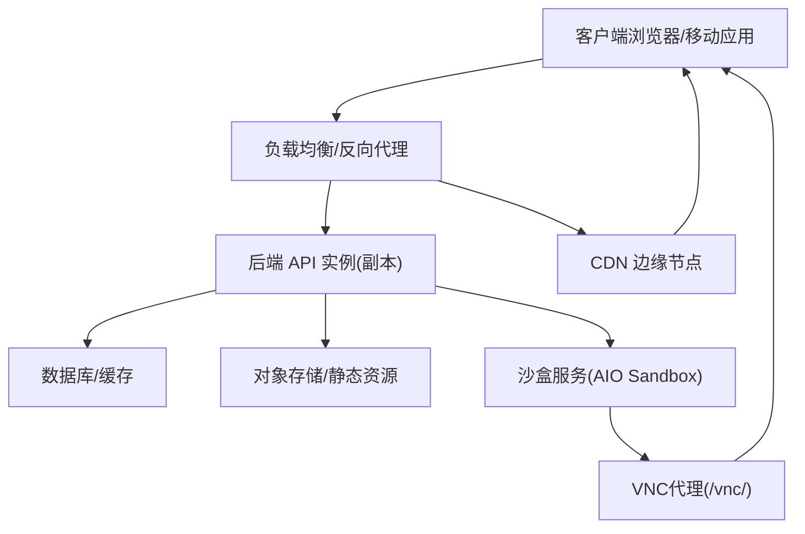
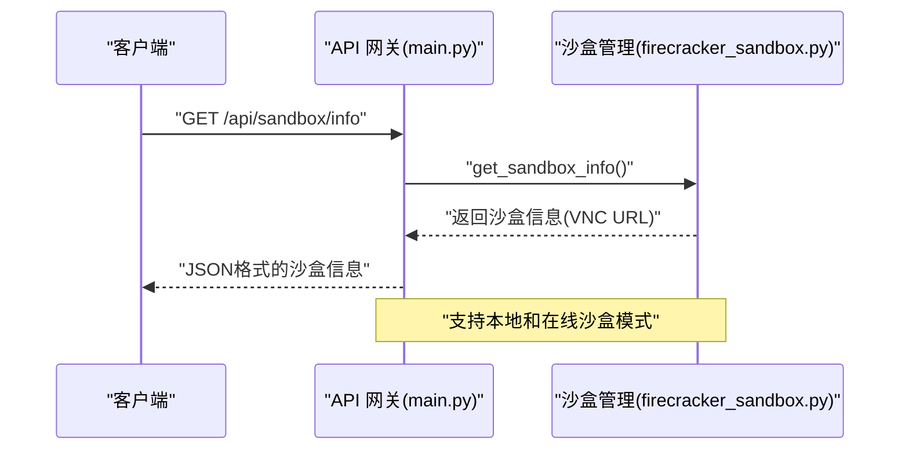
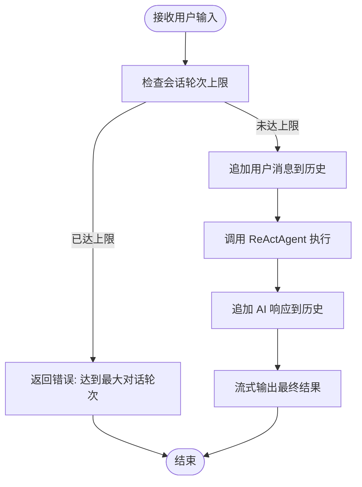
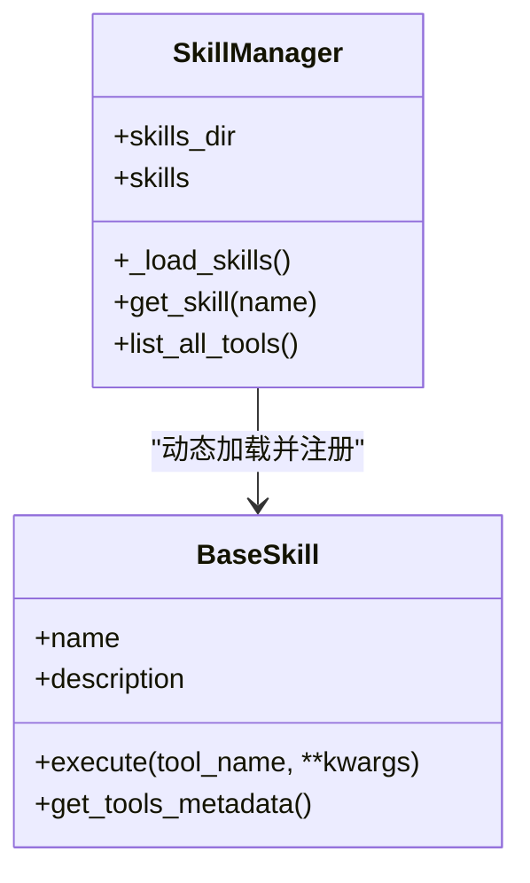
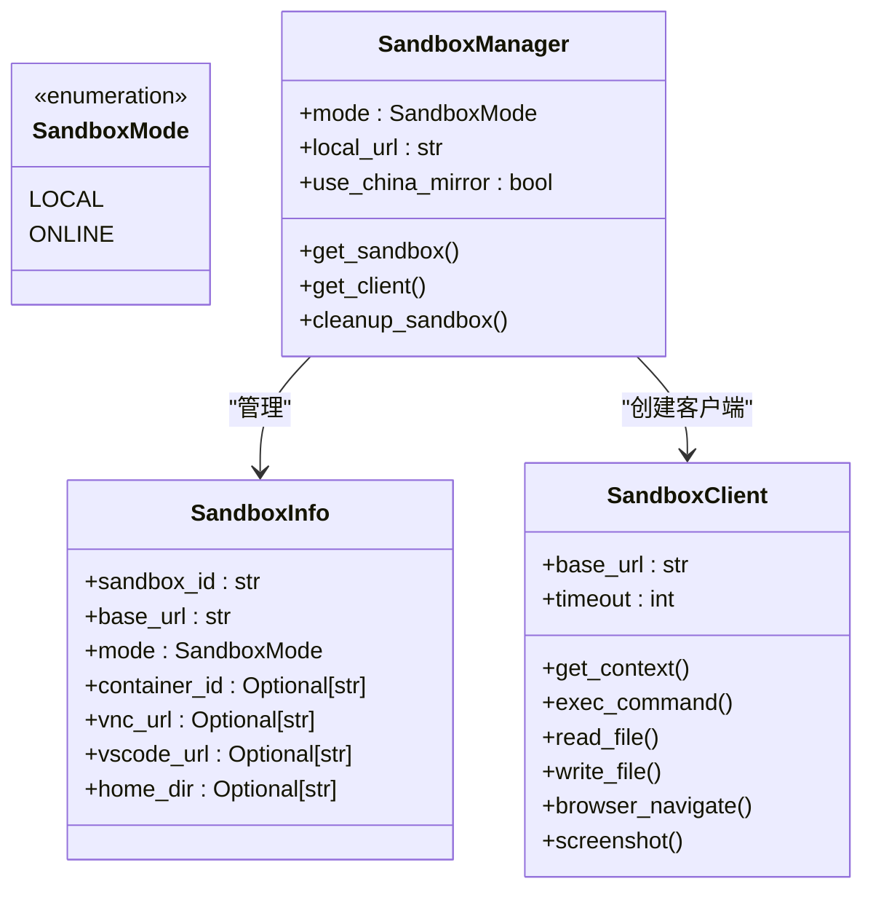
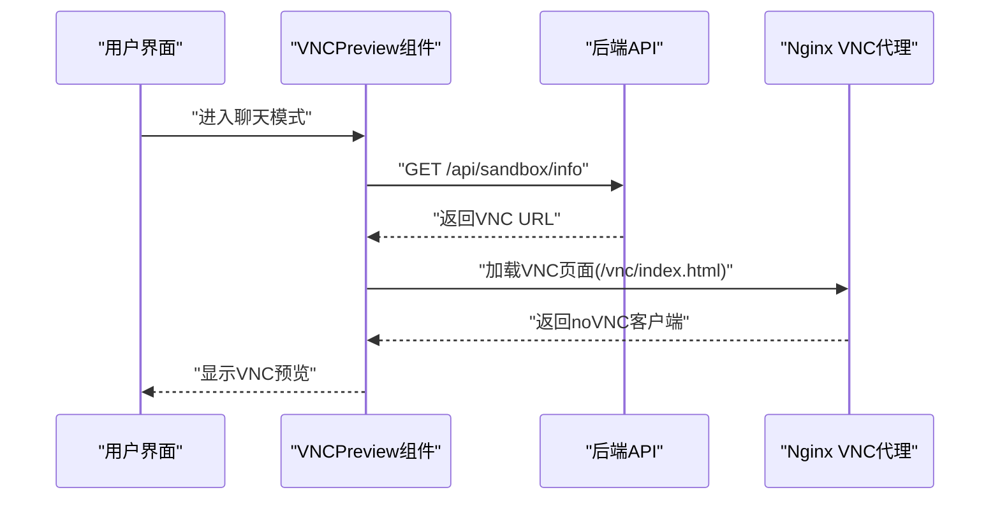
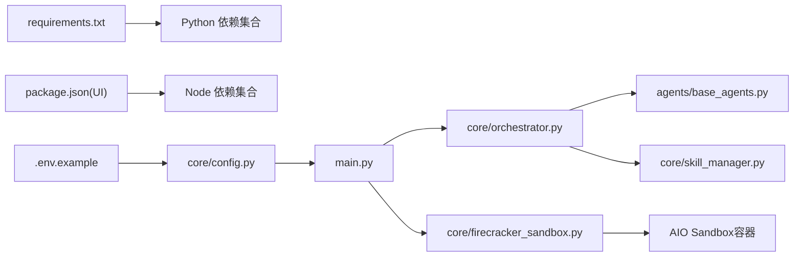

# 生产环境优化

<cite>
**本文引用的文件**
- [main.py](file://localmanus-backend/main.py)
- [requirements.txt](file://localmanus-backend/requirements.txt)
- [config.py](file://localmanus-backend/core/config.py)
- [.env.example](file://localmanus-backend/.env.example)
- [orchestrator.py](file://localmanus-backend/core/orchestrator.py)
- [skill_manager.py](file://localmanus-backend/core/skill_manager.py)
- [base_agents.py](file://localmanus-backend/agents/base_agents.py)
- [firecracker_sandbox.py](file://localmanus-backend/core/firecracker_sandbox.py)
- [docker-compose.yml](file://docker-compose.yml)
- [docker-compose.prod.yml](file://docker-compose.prod.yml)
- [Dockerfile（UI）](file://localmanus-ui/Dockerfile)
- [package.json（UI）](file://localmanus-ui/package.json)
- [next.config.ts（UI）](file://localmanus-ui/next.config.ts)
- [page.tsx（UI）](file://localmanus-ui/app/page.tsx)
- [layout.tsx（UI）](file://localmanus-ui/app/layout.tsx)
- [VNCPreview.tsx](file://localmanus-ui/app/components/VNCPreview.tsx)
- [vncPreview.module.css](file://localmanus-ui/app/components/vncPreview.module.css)
- [nginx.conf](file://nginx/nginx.conf)
- [nginx.prod.conf](file://nginx/nginx.prod.conf)
- [README.md](file://nginx/README.md)
- [localmanus_prd.md](file://localmanus_prd.md)
</cite>

## 更新摘要
**变更内容**
- 新增VNC代理支持章节，详细说明VNC预览功能的实现与配置
- 更新Nginx配置章节，重点介绍生产环境的VNC代理配置
- 增强沙盒管理章节，说明AIO Sandbox服务的部署与使用
- 补充VNC预览组件的技术实现细节
- 更新生产部署能力，包括在线沙盒模式的支持

## 目录
1. [简介](#简介)
2. [项目结构](#项目结构)
3. [核心组件](#核心组件)
4. [架构总览](#架构总览)
5. [详细组件分析](#详细组件分析)
6. [依赖关系分析](#依赖关系分析)
7. [性能考量](#性能考量)
8. [故障排查指南](#故障排查指南)
9. [结论](#结论)
10. [附录](#附录)

## 简介
本指南面向 LocalManus 项目的生产部署与运维优化，聚焦于性能调优（内存、CPU、并发）、负载均衡与健康检查、自动重启策略、监控与日志、缓存与静态资源优化、CDN、安全加固、防火墙与 SSL、以及容量规划与扩展性建议。内容基于仓库现有实现与配置文件进行提炼，并给出可落地的工程化实践。

**更新** 本次更新特别关注Nginx配置的增强，包括VNC代理支持和生产部署能力提升，以及相关的沙盒管理和前端VNC预览功能。

## 项目结构
LocalManus 采用前后端分离架构：
- 后端（FastAPI + Uvicorn）：提供 API 网关与编排服务，负责对话流式输出、任务编排、ReAct 循环等。
- 前端（Next.js）：提供用户界面、模板展示与聊天交互，通过本地回环地址调用后端接口。
- 容器编排：使用 docker-compose 管理 UI 服务；后端容器化与编排待扩展。
- **沙盒服务**：集成 AIO Sandbox 服务，提供VNC代理和浏览器沙盒功能。

```mermaid
graph TB
subgraph "前端(UI)"
UI_Page["app/page.tsx"]
UI_Layout["app/layout.tsx"]
UI_NextCfg["next.config.ts"]
UI_Docker["Dockerfile(UI)"]
UI_Pkg["package.json(UI)"]
UI_VNC["VNCPreview.tsx"]
end
subgraph "后端(Backend)"
BE_Main["main.py"]
BE_Req["requirements.txt"]
BE_Config["core/config.py"]
BE_Env[".env.example"]
BE_Orchestrator["core/orchestrator.py"]
BE_SkillMgr["core/skill_manager.py"]
BE_Agents["agents/base_agents.py"]
BE_Sandbox["core/firecracker_sandbox.py"]
end
subgraph "编排"
Compose["docker-compose.yml"]
ComposeProd["docker-compose.prod.yml"]
end
subgraph "反向代理(Nginx)"
NginxDev["nginx.conf"]
NginxProd["nginx.prod.conf"]
end
UI_Page --> |"HTTP(SSE/WebSocket)"| BE_Main
UI_VNC --> |"VNC代理" --> NginxProd
BE_Main --> BE_Orchestrator
BE_Orchestrator --> BE_Agents
BE_Orchestrator --> BE_SkillMgr
BE_Sandbox --> NginxProd
BE_Config --> BE_Main
BE_Env --> BE_Config
Compose --> UI_Docker
Compose --> BE_Main
ComposeProd --> NginxProd
ComposeProd --> BE_Sandbox
```

**图表来源**
- [main.py](file://localmanus-backend/main.py#L1-L95)
- [config.py](file://localmanus-backend/core/config.py#L1-L21)
- [.env.example](file://localmanus-backend/.env.example#L1-L4)
- [orchestrator.py](file://localmanus-backend/core/orchestrator.py#L1-L118)
- [skill_manager.py](file://localmanus-backend/core/skill_manager.py#L1-L84)
- [base_agents.py](file://localmanus-backend/agents/base_agents.py#L1-L42)
- [firecracker_sandbox.py](file://localmanus-backend/core/firecracker_sandbox.py#L1-L312)
- [docker-compose.yml](file://docker-compose.yml#L1-L16)
- [docker-compose.prod.yml](file://docker-compose.prod.yml#L1-L51)
- [nginx.conf](file://nginx/nginx.conf#L1-L69)
- [nginx.prod.conf](file://nginx/nginx.prod.conf#L1-L137)
- [VNCPreview.tsx](file://localmanus-ui/app/components/VNCPreview.tsx#L1-L152)

**章节来源**
- [docker-compose.yml](file://docker-compose.yml#L1-L88)
- [docker-compose.prod.yml](file://docker-compose.prod.yml#L1-L51)
- [Dockerfile（UI）](file://localmanus-ui/Dockerfile#L1-L32)
- [main.py](file://localmanus-backend/main.py#L1-L95)
- [config.py](file://localmanus-backend/core/config.py#L1-L21)
- [requirements.txt](file://localmanus-backend/requirements.txt#L1-L8)
- [orchestrator.py](file://localmanus-backend/core/orchestrator.py#L1-L118)
- [skill_manager.py](file://localmanus-backend/core/skill_manager.py#L1-L84)
- [base_agents.py](file://localmanus-backend/agents/base_agents.py#L1-L42)
- [firecracker_sandbox.py](file://localmanus-backend/core/firecracker_sandbox.py#L1-L312)
- [page.tsx（UI）](file://localmanus-ui/app/page.tsx#L1-L184)

## 核心组件
- API 网关与路由：提供根路径、SSE 对话流、同步任务与 ReAct 循环接口，启用 CORS。
- 编排器（Orchestrator）：维护会话历史、限制轮次、调用管理/规划/ReAct Agent、JSON 解析与错误回传。
- 技能管理（SkillManager）：动态加载技能模块，暴露工具元数据，支持按需扩展。
- 基础 Agent：Manager/Planner 基于 ReActAgent 封装，承载系统提示词与模型配置。
- **沙盒管理**：统一管理本地和在线沙盒，提供VNC代理和浏览器沙盒功能。
- 配置与环境：模型与服务器参数通过环境变量注入，支持本地/远程推理后端切换。
- 前端交互：Next.js 页面通过 fetch 与 SSE 接收后端流式响应，WebSocket 用于任务流式传输。

**更新** 新增沙盒管理组件，支持VNC代理和浏览器沙盒功能。

**章节来源**
- [main.py](file://localmanus-backend/main.py#L1-L95)
- [orchestrator.py](file://localmanus-backend/core/orchestrator.py#L1-L118)
- [skill_manager.py](file://localmanus-backend/core/skill_manager.py#L1-L84)
- [base_agents.py](file://localmanus-backend/agents/base_agents.py#L1-L42)
- [config.py](file://localmanus-backend/core/config.py#L1-L21)
- [.env.example](file://localmanus-backend/.env.example#L1-L4)
- [page.tsx（UI）](file://localmanus-ui/app/page.tsx#L1-L184)
- [firecracker_sandbox.py](file://localmanus-backend/core/firecracker_sandbox.py#L1-L312)

## 架构总览
下图展示生产环境典型拓扑：反向代理/负载均衡前置，后端由多个实例组成，数据库/缓存/对象存储按需接入，前端静态资源经 CDN 分发，**沙盒服务通过Nginx VNC代理提供实时浏览器预览**。



**说明**
- 负载均衡：支持健康检查与会话亲和（如需），自动剔除不健康实例并重试。
- 后端：多副本部署，结合进程/线程池与异步 I/O，控制并发与资源占用。
- 存储：会话历史、中间产物与导出文件落盘/对象存储，缓存热点数据。
- 前端：静态构建产物与 CDN 加速，减少后端压力。
- **沙盒服务**：通过Nginx VNC代理提供实时浏览器预览，支持WebSocket长连接。

**更新** 新增沙盒服务架构，通过Nginx VNC代理提供实时浏览器预览功能。

（本图为概念性架构示意，不对应具体源码文件）

## 详细组件分析

### API 网关与路由（FastAPI/Uvicorn）
- 功能要点
  - 根路径健康检查与版本信息。
  - SSE 对话流：支持多轮历史与上限保护。
  - 同步任务与 ReAct 循环：面向演示与编排入口。
  - WebSocket 任务流：用于实时反馈与结果推送。
  - CORS 允许跨域，便于前端直连。
  - **VNC沙盒信息**：提供沙盒信息API，支持VNC预览功能。
- 生产优化建议
  - 限流与配额：对 SSE/WS 接口实施速率限制与并发上限，避免资源耗尽。
  - 超时与取消：为长时间运行的 ReAct 循环设置超时与取消信号。
  - 日志脱敏：对请求体与响应体中的敏感字段进行脱敏记录。
  - 健康检查端点：新增 /healthz 与 /readyz，区分存活与就绪状态。
  - 自动重启：容器层面使用 restart: always 或 systemd 服务自启。
- 关键路径参考
  - [main.py](file://localmanus-backend/main.py#L26-L95)
  - [main.py](file://localmanus-backend/main.py#L476-L514)



**图表来源**
- [main.py](file://localmanus-backend/main.py#L476-L514)
- [firecracker_sandbox.py](file://localmanus-backend/core/firecracker_sandbox.py#L223-L251)

**章节来源**
- [main.py](file://localmanus-backend/main.py#L1-L95)
- [orchestrator.py](file://localmanus-backend/core/orchestrator.py#L1-L118)

### 编排器（Orchestrator）
- 功能要点
  - 会话历史管理：按 session_id 维护消息列表，限制最大轮次。
  - 工作流编排：Manager → Planner → DAG 生成，附加 trace_id。
  - JSON 提取：从模型输出中提取 JSON 结构，失败时返回兜底。
- 生产优化建议
  - 内存控制：定期清理过期会话，限制单会话最大长度与保留时间。
  - 异常隔离：捕获并上报异常，避免影响其他会话。
  - 上下文压缩：对历史消息进行摘要或截断，降低上下文开销。
- 关键路径参考
  - [orchestrator.py](file://localmanus-backend/core/orchestrator.py#L8-L80)



**图表来源**
- [orchestrator.py](file://localmanus-backend/core/orchestrator.py#L13-L60)

**章节来源**
- [orchestrator.py](file://localmanus-backend/core/orchestrator.py#L1-L118)

### 技能管理（SkillManager）
- 功能要点
  - 动态加载技能模块，反射获取工具方法，汇总元数据。
  - 支持异步/同步工具方法，统一执行入口。
- 生产优化建议
  - 插件沙箱：在独立进程中加载第三方技能，防止异常扩散。
  - 依赖隔离：为每个技能维护独立的依赖清单与安装流程。
  - 元数据缓存：缓存工具元数据，减少反射扫描成本。
- 关键路径参考
  - [skill_manager.py](file://localmanus-backend/core/skill_manager.py#L42-L84)



**图表来源**
- [skill_manager.py](file://localmanus-backend/core/skill_manager.py#L6-L84)

**章节来源**
- [skill_manager.py](file://localmanus-backend/core/skill_manager.py#L1-L84)

### 基础 Agent（Manager/Planner）
- 功能要点
  - Manager：标准化输入、维护 TraceID。
  - Planner：根据分析结果生成动态 DAG 与工具选择。
- 生产优化建议
  - 模型路由：按区域/SLA 选择不同推理后端，实现就近与弹性。
  - 流控与退避：对上游模型调用增加指数退避与熔断。
  - 输出校验：对 Planner 的 JSON 输出进行结构校验。
- 关键路径参考
  - [base_agents.py](file://localmanus-backend/agents/base_agents.py#L6-L41)

**章节来源**
- [base_agents.py](file://localmanus-backend/agents/base_agents.py#L1-L42)

### 沙盒管理（Firecracker Sandbox）
- 功能要点
  - **本地模式**：连接到现有的本地沙盒服务。
  - **在线模式**：按需启动Docker容器，支持多用户隔离。
  - **VNC代理**：提供VNC连接URL，支持实时浏览器预览。
  - **VSCode集成**：提供VSCode Server连接URL。
  - **浏览器操作**：支持页面导航、截图、JavaScript执行等。
- 生产优化建议
  - **容器管理**：自动清理停止的容器，避免资源泄漏。
  - **端口管理**：为不同用户分配不同的端口，确保隔离。
  - **镜像管理**：支持国内外镜像源，提高部署成功率。
  - **安全配置**：使用seccomp配置，限制容器权限。
- 关键路径参考
  - [firecracker_sandbox.py](file://localmanus-backend/core/firecracker_sandbox.py#L121-L257)



**图表来源**
- [firecracker_sandbox.py](file://localmanus-backend/core/firecracker_sandbox.py#L15-L30)
- [firecracker_sandbox.py](file://localmanus-backend/core/firecracker_sandbox.py#L31-L120)
- [firecracker_sandbox.py](file://localmanus-backend/core/firecracker_sandbox.py#L121-L257)

**章节来源**
- [firecracker_sandbox.py](file://localmanus-backend/core/firecracker_sandbox.py#L1-L312)

### VNC预览组件（前端）
- 功能要点
  - **实时预览**：通过iframe嵌入noVNC客户端，实现实时浏览器预览。
  - **响应式设计**：支持展开/折叠、放大/缩小等多种显示模式。
  - **智能URL处理**：根据环境自动选择直接VNC URL或Nginx代理URL。
  - **错误处理**：提供降级方案，确保用户体验。
- 生产优化建议
  - **缓存策略**：对VNC资源进行适当的缓存控制。
  - **加载优化**：提供加载状态指示，改善用户体验。
  - **安全配置**：确保iframe的安全属性配置正确。
- 关键路径参考
  - [VNCPreview.tsx](file://localmanus-ui/app/components/VNCPreview.tsx#L12-L69)
  - [vncPreview.module.css](file://localmanus-ui/app/components/vncPreview.module.css#L1-L221)



**图表来源**
- [VNCPreview.tsx](file://localmanus-ui/app/components/VNCPreview.tsx#L19-L69)
- [nginx.prod.conf](file://nginx/nginx.prod.conf#L89-L100)

**章节来源**
- [VNCPreview.tsx](file://localmanus-ui/app/components/VNCPreview.tsx#L1-L152)
- [vncPreview.module.css](file://localmanus-ui/app/components/vncPreview.module.css#L1-L221)

### 前端交互（Next.js）
- 功能要点
  - 使用 fetch 与 SSE 获取流式对话结果。
  - WebSocket 用于任务流式传输与实时反馈。
  - **VNC预览**：集成沙盒浏览器实时预览功能。
- 生产优化建议
  - 静态资源优化：开启压缩与哈希命名，配合 CDN。
  - 错误重试：对网络异常与 SSE 断连进行指数退避重连。
  - 本地缓存：对常用模板与用户偏好进行本地持久化。
- 关键路径参考
  - [page.tsx（UI）](file://localmanus-ui/app/page.tsx#L24-L90)
  - [layout.tsx（UI）](file://localmanus-ui/app/layout.tsx#L1-L20)

**章节来源**
- [page.tsx（UI）](file://localmanus-ui/app/page.tsx#L1-L184)
- [layout.tsx（UI）](file://localmanus-ui/app/layout.tsx#L1-L20)

## 依赖关系分析
- 运行时依赖：FastAPI、Uvicorn、AgentScope、Pydantic、websockets、python-multipart、python-dotenv。
- 前端依赖：Next.js、React、TypeScript、ESLint。
- 配置与环境：通过 dotenv 注入模型与服务器参数，支持本地/远程推理后端切换。
- **沙盒依赖**：AIO Sandbox容器镜像，支持VNC代理和浏览器沙盒功能。



**图表来源**
- [requirements.txt](file://localmanus-backend/requirements.txt#L1-L8)
- [package.json（UI）](file://localmanus-ui/package.json#L1-L26)
- [.env.example](file://localmanus-backend/.env.example#L1-L4)
- [config.py](file://localmanus-backend/core/config.py#L1-L21)
- [main.py](file://localmanus-backend/main.py#L1-L15)
- [orchestrator.py](file://localmanus-backend/core/orchestrator.py#L1-L12)
- [skill_manager.py](file://localmanus-backend/core/skill_manager.py#L1-L14)
- [base_agents.py](file://localmanus-backend/agents/base_agents.py#L1-L5)
- [firecracker_sandbox.py](file://localmanus-backend/core/firecracker_sandbox.py#L1-L312)

**章节来源**
- [requirements.txt](file://localmanus-backend/requirements.txt#L1-L8)
- [package.json（UI）](file://localmanus-ui/package.json#L1-L26)
- [config.py](file://localmanus-backend/core/config.py#L1-L21)
- [main.py](file://localmanus-backend/main.py#L1-L15)

## 性能考量

### 内存使用优化
- 会话历史控制
  - 限制每会话最大消息数与保留时间，定期清理过期会话。
  - 对历史消息进行摘要或截断，降低上下文长度。
- 技能加载与缓存
  - 缓存已加载技能的元数据与模块引用，避免重复反射。
  - 在独立进程中加载第三方技能，异常隔离。
- **沙盒资源管理**
  - **容器清理**：自动清理停止的沙盒容器，避免资源泄漏。
  - **内存限制**：为沙盒容器设置内存限制，防止资源耗尽。
  - **端口复用**：合理管理沙盒端口，避免端口冲突。
- 前端静态资源
  - 开启 Next.js 构建优化与压缩，利用 CDN 缓存。
  - 对模板与媒体资源进行版本化与懒加载。

**更新** 新增沙盒资源管理优化建议，包括容器清理、内存限制和端口复用。

**章节来源**
- [orchestrator.py](file://localmanus-backend/core/orchestrator.py#L17-L25)
- [skill_manager.py](file://localmanus-backend/core/skill_manager.py#L48-L71)
- [firecracker_sandbox.py](file://localmanus-backend/core/firecracker_sandbox.py#L263-L287)
- [next.config.ts（UI）](file://localmanus-ui/next.config.ts#L1-L8)

### CPU 资源分配
- 异步 I/O 优先：SSE/WS 与模型调用采用异步，减少阻塞。
- 进程/线程池：Uvicorn 默认使用多进程，结合业务 I/O 密集特性合理设置 worker 数量。
- 模型推理：将模型调用下沉至专用推理服务，后端仅做编排与编解码。
- **沙盒负载控制**
  - **并发限制**：限制同时运行的沙盒数量，避免CPU过载。
  - **容器调度**：合理分配CPU份额给沙盒容器。
  - **VNC性能**：优化VNC代理的性能，减少额外开销。

**更新** 新增沙盒负载控制优化建议，包括并发限制、容器调度和VNC性能优化。

**章节来源**
- [main.py](file://localmanus-backend/main.py#L1-L15)
- [requirements.txt](file://localmanus-backend/requirements.txt#L1-L8)

### 并发连接数配置
- Uvicorn 参数：设置合适的 workers、threads、backlog，结合 CPU 核心数与内存上限。
- Nginx/HAProxy：配置连接上限、队列长度与超时，启用 keepalive。
- 应用层：对 SSE/WS 增加并发上限与配额，避免单实例被拖垮。
- **VNC代理配置**
  - **WebSocket支持**：确保VNC代理支持WebSocket升级。
  - **长连接管理**：合理设置VNC连接的超时和保活机制。
  - **并发控制**：限制同时连接的VNC客户端数量。

**更新** 新增VNC代理配置优化建议，包括WebSocket支持、长连接管理和并发控制。

**章节来源**
- [docker-compose.yml](file://docker-compose.yml#L1-L16)
- [main.py](file://localmanus-backend/main.py#L92-L95)
- [nginx.prod.conf](file://nginx/nginx.prod.conf#L89-L100)

### 负载均衡与健康检查
- 负载均衡
  - 使用 Nginx/HAProxy/Traefik，支持基于权重的多副本分发。
  - 会话亲和：若需要保持 SSE/WS 连接稳定，可启用基于 Cookie/源 IP 的亲和。
- 健康检查
  - /healthz：存活探针，快速判断进程是否存活。
  - /readyz：就绪探针，检查依赖（数据库/缓存/模型服务）可用性。
  - **沙盒健康检查**：新增沙盒服务的健康检查端点。
- 自动重启
  - 容器：restart: always 或 systemd 服务自启。
  - 进程：Supervisor/Circus 等进程守护。
  - **沙盒自动恢复**：容器停止时自动重启，确保服务连续性。

**更新** 新增沙盒健康检查和自动恢复机制。

**章节来源**
- [docker-compose.yml](file://docker-compose.yml#L10-L10)
- [main.py](file://localmanus-backend/main.py#L26-L28)
- [docker-compose.prod.yml](file://docker-compose.prod.yml#L25-L30)

### 监控与日志
- 应用日志
  - 后端：统一结构化日志，包含 trace_id、会话 ID、耗时、错误码。
  - 前端：浏览器控制台与埋点上报，区分用户行为与错误事件。
  - **沙盒日志**：记录沙盒容器的启动、停止和错误信息。
- 指标监控
  - 指标：QPS、P95/P99 延迟、并发连接数、会话轮次分布、ReAct 循环耗时。
  - 告警：阈值告警与趋势告警，结合 SLA 设置。
  - **VNC监控**：监控VNC连接数、延迟和错误率。
- 错误追踪
  - 结构化错误上报与聚合，定位慢查询与异常 Agent。
  - **沙盒错误追踪**：跟踪沙盒操作失败和容器异常。

**更新** 新增沙盒监控和VNC监控指标。

**章节来源**
- [main.py](file://localmanus-backend/main.py#L10-L12)
- [page.tsx（UI）](file://localmanus-ui/app/page.tsx#L84-L86)

### 缓存策略与静态资源优化
- 缓存
  - L1：Redis/内存缓存热点会话与工具元数据。
  - L2：分布式缓存（如 Memcached）缓存近期生成物摘要。
- 静态资源
  - Next.js 构建产物与 public 目录交由 CDN 分发，开启 gzip/br 压缩与缓存头。
  - 模板与媒体资源版本化，短 TTL + ETag/Cache-Control。
- **VNC资源优化**
  - **noVNC资源**：优化noVNC客户端资源的缓存策略。
  - **VNC会话缓存**：缓存VNC会话状态，减少重新连接开销。

**更新** 新增VNC资源优化策略。

**章节来源**
- [Dockerfile（UI）](file://localmanus-ui/Dockerfile#L23-L27)
- [package.json（UI）](file://localmanus-ui/package.json#L5-L10)

### CDN 配置
- 域名与证书：为静态域名申请并部署 SSL 证书。
- 缓存策略：区分 HTML、JS/CSS、图片/字体的不同缓存策略与失效机制。
- 回源策略：配置回源头与缓存穿透防护。
- **VNC资源加速**
  - **noVNC资源**：通过CDN加速noVNC客户端资源的分发。
  - **静态资源优化**：优化VNC相关的静态资源缓存策略。

**更新** 新增VNC资源加速配置建议。

**章节来源**
- [Dockerfile（UI）](file://localmanus-ui/Dockerfile#L29-L31)
- [next.config.ts（UI）](file://localmanus-ui/next.config.ts#L1-L8)

### Nginx配置增强
- **开发配置**：基础反向代理，支持API路由和静态资源。
- **生产配置**：增强的反向代理，支持VNC代理、安全头和性能优化。
- **VNC代理支持**：
  - **WebSocket升级**：支持VNC连接的WebSocket升级。
  - **长连接超时**：设置86400秒的超时，支持长时间VNC会话。
  - **代理头配置**：正确传递VNC客户端的头部信息。
- **安全增强**：
  - **安全头**：添加X-Frame-Options、X-Content-Type-Options等安全头。
  - **连接限制**：限制每IP的并发连接数。
  - **速率限制**：针对不同端点设置不同的速率限制。
- **性能优化**：
  - **Keep-Alive**：启用upstream的keepalive连接。
  - **Gzip压缩**：启用Gzip压缩，减少带宽使用。
  - **缓存策略**：针对静态资源设置长期缓存。

**更新** 新增详细的Nginx配置增强说明，重点介绍VNC代理支持和生产部署能力提升。

**章节来源**
- [nginx.conf](file://nginx/nginx.conf#L1-L69)
- [nginx.prod.conf](file://nginx/nginx.prod.conf#L1-L137)

### 安全加固、防火墙与 SSL
- 防火墙
  - 仅开放必要端口（80/443/反代端口），内网访问后端与数据库。
  - **VNC端口**：在生产环境中通过Nginx代理VNC，避免直接暴露8080端口。
- 传输安全
  - 强制 HTTPS，禁用弱密码套件与旧协议。
  - HSTS、CSP、X-Frame-Options 等安全头。
  - **VNC安全**：通过Nginx代理提供安全的VNC访问。
- 访问控制
  - API 限流与 WAF，对异常请求进行封禁与审计。
  - **沙盒访问控制**：限制沙盒的访问权限和操作范围。
- 证书
  - 使用 Let's Encrypt 或企业 CA，自动续期。

**更新** 新增VNC端口安全和沙盒访问控制建议。

**章节来源**
- [main.py](file://localmanus-backend/main.py#L18-L24)
- [nginx.prod.conf](file://nginx/nginx.prod.conf#L42-L46)

### 容量规划与扩展性
- 规模估算
  - QPS × 期望延迟 × 容灾冗余 × 缓存命中率 → 推算实例数与资源规格。
- 扩展策略
  - 垂直扩展：提升 CPU/内存与磁盘 IO。
  - 水平扩展：多副本 + 负载均衡，按会话亲和或无状态拆分。
  - **沙盒扩展**：支持多用户隔离的沙盒扩展。
- 弹性伸缩
  - 基于 CPU/内存/请求排队长度触发扩缩容。
  - **VNC弹性**：根据VNC连接数动态调整资源。
- 数据层
  - 读写分离、分库分表、冷热数据分层存储。
- **生产部署能力**
  - **AIO Sandbox**：支持在线模式的沙盒管理，无需手动部署。
  - **容器化部署**：通过Docker Compose简化部署流程。
  - **环境配置**：支持开发和生产的环境切换。

**更新** 新增沙盒扩展、VNC弹性、AIO Sandbox和容器化部署能力。

**章节来源**
- [localmanus_prd.md](file://localmanus_prd.md#L1-L76)
- [docker-compose.prod.yml](file://docker-compose.prod.yml#L12-L31)

## 故障排查指南
- 常见问题
  - SSE/WS 连接中断：检查反代超时、Nginx keepalive、后端心跳与配额。
  - ReAct 循环超时：增加超时阈值与重试，必要时拆分子任务。
  - 技能加载失败：确认模块路径、依赖安装与权限，启用沙箱隔离。
  - **VNC连接失败**：检查Nginx VNC代理配置、WebSocket支持和沙盒服务状态。
  - **沙盒启动失败**：确认Docker环境、镜像拉取和端口占用情况。
- 日志定位
  - 后端：查看 trace_id 串联请求链路，定位异常 Agent 与工具。
  - 前端：捕获网络错误与 SSE 断连事件，上报堆栈与参数。
  - **Nginx**：检查VNC代理和沙盒服务的日志。
  - **沙盒**：查看沙盒容器的启动日志和错误信息。
- 快速恢复
  - 灰度降级：关闭高开销功能（如工具调用），优先保障核心对话。
  - 临时扩容：紧急增加副本数，释放缓存与数据库压力。
  - **沙盒恢复**：重启沙盒容器，清理异常状态。
  - **VNC修复**：检查Nginx配置，重启VNC代理服务。

**更新** 新增VNC连接失败和沙盒启动失败的故障排查指南。

**章节来源**
- [main.py](file://localmanus-backend/main.py#L89-L90)
- [page.tsx（UI）](file://localmanus-ui/app/page.tsx#L84-L86)

## 结论
通过合理的并发与资源控制、完善的负载均衡与健康检查、可观测性体系与安全加固，LocalManus 可在生产环境中稳定支撑多模态与工具增强的 Agent 工作流。**本次更新特别强调了VNC代理支持和生产部署能力的提升**，包括AIO Sandbox服务的集成、Nginx VNC代理配置、前端VNC预览组件的实现，以及相关的安全和性能优化策略。建议以渐进方式推进优化，先完成监控与限流，再逐步引入缓存、CDN 与弹性扩缩容，持续迭代以匹配业务增长。

## 附录
- 产品背景与用户路径参考：[localmanus_prd.md](file://localmanus_prd.md#L69-L76)
- **Nginx配置参考**：[nginx/README.md](file://nginx/README.md#L1-L155)
- **沙盒管理参考**：[firecracker_sandbox.py](file://localmanus-backend/core/firecracker_sandbox.py#L1-L312)
- **VNC预览组件参考**：[VNCPreview.tsx](file://localmanus-ui/app/components/VNCPreview.tsx#L1-L152)