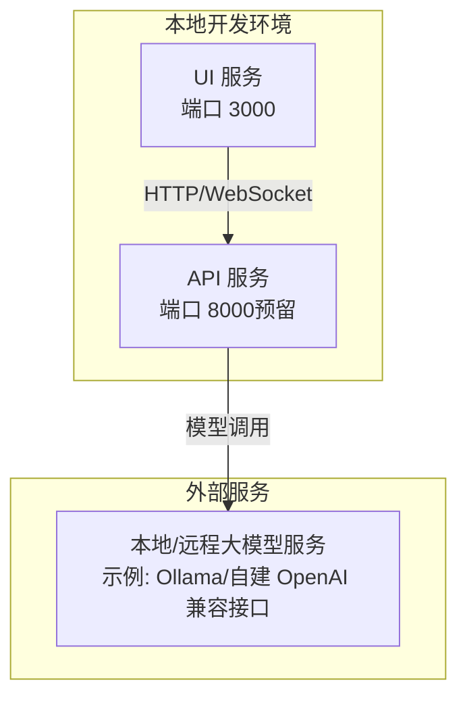
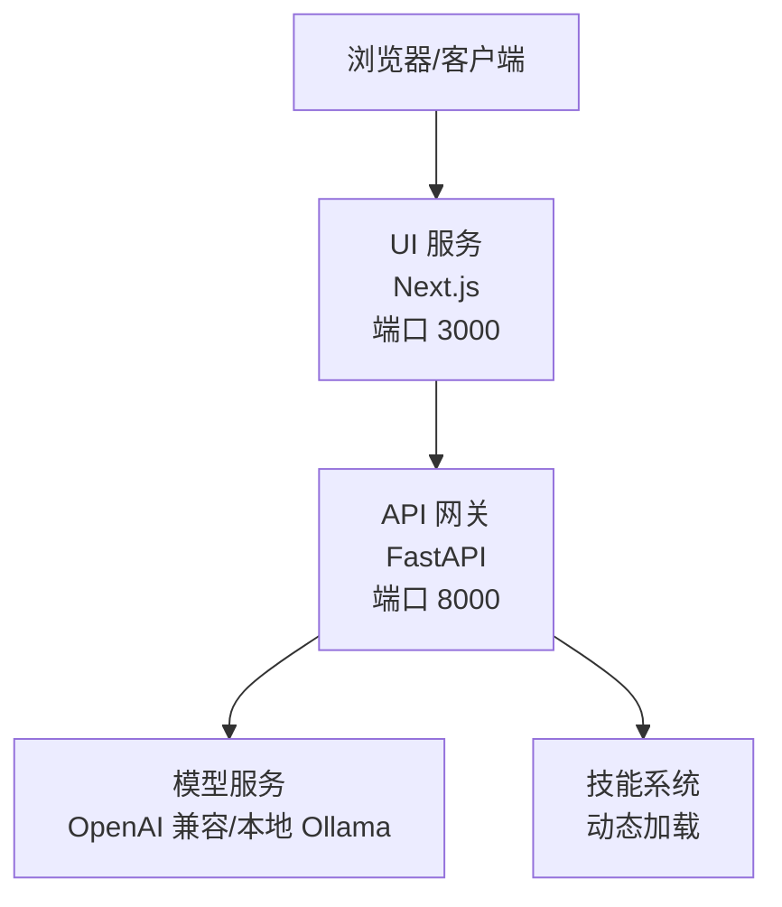
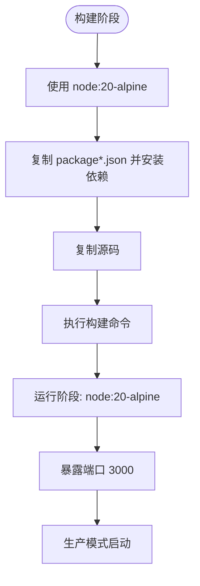
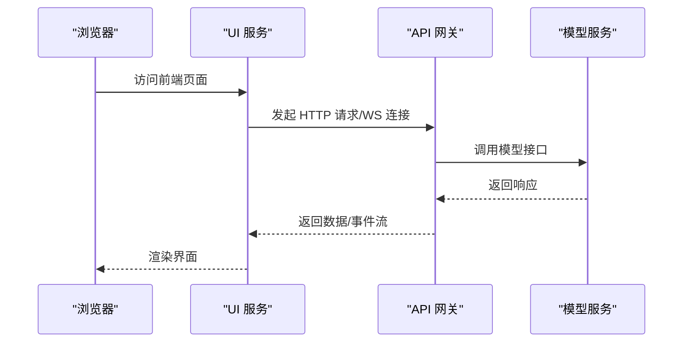
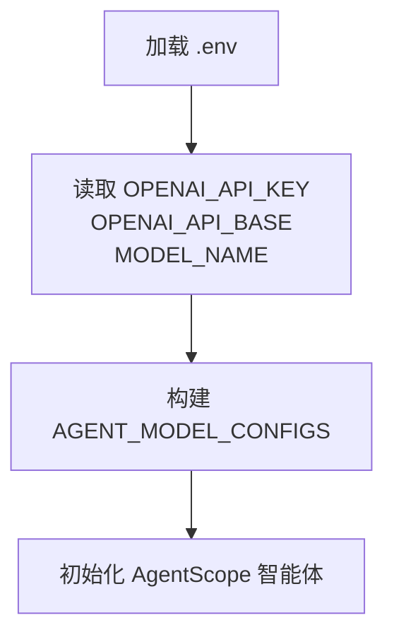
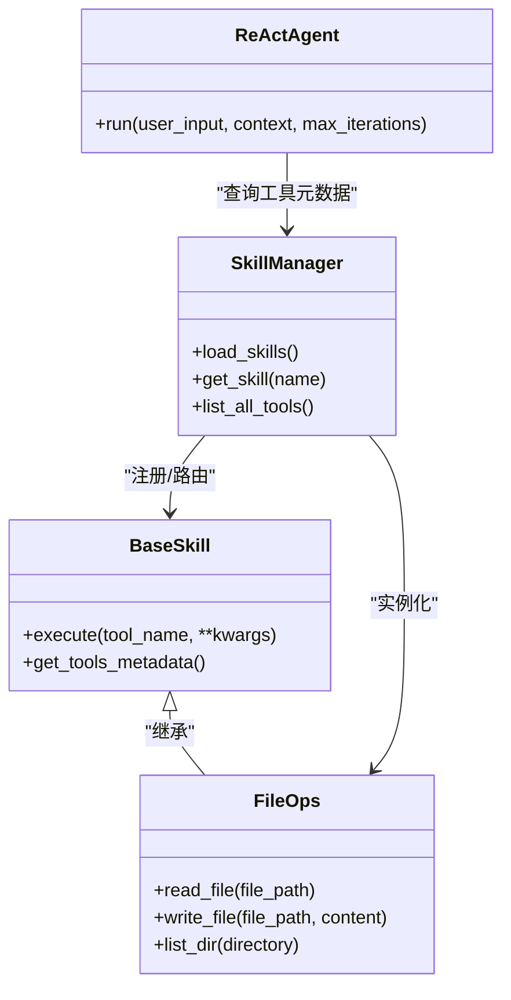
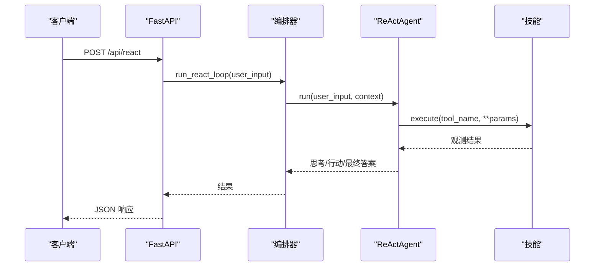
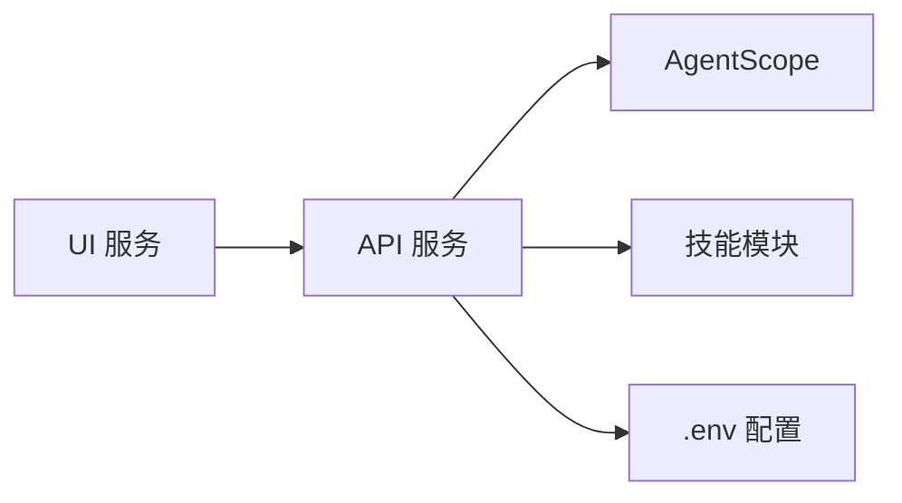

# 部署与配置

<cite>
**本文引用的文件**
- [docker-compose.yml](file://docker-compose.yml)
- [Dockerfile（UI）](file://localmanus-ui/Dockerfile)
- [package.json（UI）](file://localmanus-ui/package.json)
- [main.py（后端）](file://localmanus-backend/main.py)
- [requirements.txt（后端）](file://localmanus-backend/requirements.txt)
- [.env.example（后端）](file://localmanus-backend/.env.example)
- [config.py（后端核心配置）](file://localmanus-backend/core/config.py)
- [orchestrator.py（后端编排器）](file://localmanus-backend/core/orchestrator.py)
- [react_agent.py（后端 ReAct 智能体）](file://localmanus-backend/agents/react_agent.py)
- [skill_manager.py（后端技能管理）](file://localmanus-backend/core/skill_manager.py)
- [file_ops.py（后端文件操作技能）](file://localmanus-backend/skills/file_ops.py)
- [prompts.py（后端提示词）](file://localmanus-backend/core/prompts.py)
- [localmanus_architecture.md（架构设计）](file://localmanus_architecture.md)
- [localmanus_prd.md（产品需求）](file://localmanus_prd.md)
- [localmanus_skills_roadmap.md（技能路线图）](file://localmanus_skills_roadmap.md)
</cite>

## 目录
1. [简介](#简介)
2. [项目结构](#项目结构)
3. [核心组件](#核心组件)
4. [架构总览](#架构总览)
5. [详细组件分析](#详细组件分析)
6. [依赖关系分析](#依赖关系分析)
7. [性能考虑](#性能考虑)
8. [故障排除指南](#故障排除指南)
9. [结论](#结论)
10. [附录](#附录)

## 简介
本文件面向运维与开发团队，提供 LocalManus 项目的部署与配置指南。内容覆盖：
- Docker 容器化与服务编排
- 环境变量与模型配置
- 后端 API 与前端 UI 的端口与网络
- 生产环境优化、性能调优与监控
- 开发/测试/生产三类部署场景
- 故障排除、日志分析与备份恢复
- 安全配置、防火墙与 SSL 证书

## 项目结构
LocalManus 采用前后端分离的双仓库结构，通过 Docker Compose 进行编排：
- 前端 UI：Next.js 应用，使用独立 Dockerfile 构建与运行
- 后端 API：FastAPI 应用，当前 compose 中未启用，但已具备完整依赖与配置
- 顶层编排：docker-compose.yml 管理 UI 服务

**图表来源**
- [docker-compose.yml](file://docker-compose.yml#L1-L16)
- [Dockerfile（UI）](file://localmanus-ui/Dockerfile#L1-L32)
- [main.py（后端）](file://localmanus-backend/main.py#L1-L95)
- [.env.example（后端）](file://localmanus-backend/.env.example#L1-L4)

**章节来源**
- [docker-compose.yml](file://docker-compose.yml#L1-L16)
- [Dockerfile（UI）](file://localmanus-ui/Dockerfile#L1-L32)
- [main.py（后端）](file://localmanus-backend/main.py#L1-L95)

## 核心组件
- UI 服务（Next.js）
  - 使用 Node.js Alpine 基础镜像，分阶段构建与运行
  - 暴露 3000 端口，生产模式启动
- API 服务（FastAPI）
  - 支持 SSE、WebSocket、同步任务接口
  - 默认监听 0.0.0.0:8000（compose 中未启用）
  - 通过环境变量配置模型与 API 基地址
- 技能系统
  - 动态加载技能模块，支持文件读写等基础能力
  - 通过 SkillManager 注册与路由

**章节来源**
- [Dockerfile（UI）](file://localmanus-ui/Dockerfile#L1-L32)
- [package.json（UI）](file://localmanus-ui/package.json#L1-L26)
- [main.py（后端）](file://localmanus-backend/main.py#L1-L95)
- [requirements.txt（后端）](file://localmanus-backend/requirements.txt#L1-L8)
- [config.py（后端核心配置）](file://localmanus-backend/core/config.py#L1-L21)
- [skill_manager.py（后端技能管理）](file://localmanus-backend/core/skill_manager.py#L1-L84)
- [file_ops.py（后端文件操作技能）](file://localmanus-backend/skills/file_ops.py#L1-L41)

## 架构总览
下图展示了 UI、API、模型服务之间的交互关系，以及当前 compose 中的可用服务。

**图表来源**
- [docker-compose.yml](file://docker-compose.yml#L1-L16)
- [main.py（后端）](file://localmanus-backend/main.py#L1-L95)
- [config.py（后端核心配置）](file://localmanus-backend/core/config.py#L1-L21)
- [localmanus_architecture.md（架构设计）](file://localmanus_architecture.md#L1-L137)

## 详细组件分析

### UI 服务（Next.js）容器化
- 构建阶段
  - 基于 node:20-alpine
  - 安装依赖并构建应用
- 运行阶段
  - 使用生产模式启动
  - 暴露 3000 端口
- 环境变量
  - NODE_ENV=production
  - 可通过 compose 的 environment 字段注入

**图表来源**
- [Dockerfile（UI）](file://localmanus-ui/Dockerfile#L1-L32)

**章节来源**
- [Dockerfile（UI）](file://localmanus-ui/Dockerfile#L1-L32)
- [package.json（UI）](file://localmanus-ui/package.json#L1-L26)
- [docker-compose.yml](file://docker-compose.yml#L1-L16)

### API 服务（FastAPI）容器化与网络
- 当前 compose 中未启用 API 服务，但已具备：
  - 依赖清单（FastAPI、Uvicorn、AgentScope 等）
  - 环境变量示例（OPENAI_API_KEY、OPENAI_API_BASE、MODEL_NAME）
  - 主程序入口（监听 0.0.0.0:8000）
- 网络与端口
  - UI: 3000
  - API: 8000（预留）
- CORS 已启用，允许任意来源访问

**图表来源**
- [main.py（后端）](file://localmanus-backend/main.py#L1-L95)
- [config.py（后端核心配置）](file://localmanus-backend/core/config.py#L1-L21)
- [docker-compose.yml](file://docker-compose.yml#L1-L16)

**章节来源**
- [requirements.txt（后端）](file://localmanus-backend/requirements.txt#L1-L8)
- [.env.example（后端）](file://localmanus-backend/.env.example#L1-L4)
- [main.py（后端）](file://localmanus-backend/main.py#L1-L95)
- [config.py（后端核心配置）](file://localmanus-backend/core/config.py#L1-L21)
- [docker-compose.yml](file://docker-compose.yml#L1-L16)

### 环境变量与模型配置
- 关键变量
  - OPENAI_API_KEY：模型服务密钥
  - OPENAI_API_BASE：模型服务基地址（可指向本地 Ollama 或自建兼容接口）
  - MODEL_NAME：模型名称
- 配置加载
  - 通过 python-dotenv 加载 .env
  - AGENT_MODEL_CONFIGS 读取上述变量并注入 AgentScope

**图表来源**
- [.env.example（后端）](file://localmanus-backend/.env.example#L1-L4)
- [config.py（后端核心配置）](file://localmanus-backend/core/config.py#L1-L21)

**章节来源**
- [.env.example（后端）](file://localmanus-backend/.env.example#L1-L4)
- [config.py（后端核心配置）](file://localmanus-backend/core/config.py#L1-L21)

### 技能系统与工具路由
- 动态加载
  - SkillManager 扫描 skills 目录，按类名注册
  - BaseSkill 提供工具方法路由与元数据导出
- 示例技能
  - file_ops：文件读写、目录列表
- ReAct 智能体
  - 依据工具元数据生成系统提示
  - 解析 Action 行并执行对应工具

**图表来源**
- [skill_manager.py（后端技能管理）](file://localmanus-backend/core/skill_manager.py#L1-L84)
- [file_ops.py（后端文件操作技能）](file://localmanus-backend/skills/file_ops.py#L1-L41)
- [react_agent.py（后端 ReAct 智能体）](file://localmanus-backend/agents/react_agent.py#L1-L107)

**章节来源**
- [skill_manager.py（后端技能管理）](file://localmanus-backend/core/skill_manager.py#L1-L84)
- [file_ops.py（后端文件操作技能）](file://localmanus-backend/skills/file_ops.py#L1-L41)
- [react_agent.py（后端 ReAct 智能体）](file://localmanus-backend/agents/react_agent.py#L1-L107)

### API 接口与编排流程
- SSE 聊天流：/api/chat
- 同步任务：/api/task
- ReAct 执行：/api/react
- WebSocket：/ws/task/{trace_id}
- 编排器 Orchestrator
  - 会话管理与轮次限制
  - JSON 提取与 DAG 规划
  - 与智能体协作

**图表来源**
- [main.py（后端）](file://localmanus-backend/main.py#L40-L56)
- [orchestrator.py（后端编排器）](file://localmanus-backend/core/orchestrator.py#L65-L80)
- [react_agent.py（后端 ReAct 智能体）](file://localmanus-backend/agents/react_agent.py#L52-L107)

**章节来源**
- [main.py（后端）](file://localmanus-backend/main.py#L1-L95)
- [orchestrator.py（后端编排器）](file://localmanus-backend/core/orchestrator.py#L1-L118)
- [react_agent.py（后端 ReAct 智能体）](file://localmanus-backend/agents/react_agent.py#L1-L107)

## 依赖关系分析
- 组件耦合
  - UI 与 API 通过 HTTP/WS 交互
  - API 依赖 AgentScope 与模型服务
  - API 通过 SkillManager 与技能模块解耦
- 外部依赖
  - FastAPI/Uvicorn：Web 服务
  - AgentScope：智能体框架
  - python-dotenv：环境变量加载

**图表来源**
- [requirements.txt（后端）](file://localmanus-backend/requirements.txt#L1-L8)
- [config.py（后端核心配置）](file://localmanus-backend/core/config.py#L1-L21)
- [skill_manager.py（后端技能管理）](file://localmanus-backend/core/skill_manager.py#L1-L84)

**章节来源**
- [requirements.txt（后端）](file://localmanus-backend/requirements.txt#L1-L8)
- [config.py（后端核心配置）](file://localmanus-backend/core/config.py#L1-L21)
- [skill_manager.py（后端技能管理）](file://localmanus-backend/core/skill_manager.py#L1-L84)

## 性能考虑
- 构建与运行
  - UI 使用分阶段 Dockerfile，减少镜像体积
  - API 使用 Uvicorn 生产级 ASGI 服务器
- 网络与并发
  - FastAPI 原生支持异步与并发
  - WebSocket 适合实时状态与日志流
- 模型调用
  - 通过 OPENAI_API_BASE 指向本地/远程服务，降低延迟
  - 合理设置超时与重试策略
- 技能执行
  - 动态加载减少冷启动成本
  - 仅在需要时加载工具，避免不必要的依赖

**章节来源**
- [Dockerfile（UI）](file://localmanus-ui/Dockerfile#L1-L32)
- [main.py（后端）](file://localmanus-backend/main.py#L1-L95)
- [config.py（后端核心配置）](file://localmanus-backend/core/config.py#L1-L21)

## 故障排除指南
- 常见问题定位
  - 端口占用：确认 3000/8000 未被占用
  - CORS 错误：检查前端与后端域名与协议
  - 模型连接失败：验证 OPENAI_API_KEY 与 OPENAI_API_BASE
- 日志分析
  - 后端日志：INFO 级别记录连接与断开
  - WebSocket：trace_id 有助于追踪会话
- 备份与恢复
  - 前端静态产物：.next 目录与 public 资源
  - 后端会话：当前实现为内存会话，建议持久化到外部存储
  - 技能模块：动态加载，注意版本与依赖一致性

**章节来源**
- [main.py（后端）](file://localmanus-backend/main.py#L58-L91)
- [docker-compose.yml](file://docker-compose.yml#L1-L16)

## 结论
本指南提供了 LocalManus 的容器化部署与配置要点，明确了 UI 与 API 的职责边界、环境变量与模型配置、技能系统的扩展方式，并给出了生产环境优化与故障排除建议。后续可在 compose 中启用后端服务，并结合外部模型与安全加固策略，逐步完善生产部署。

## 附录

### A. 部署场景指引
- 开发环境
  - 使用 compose 启动 UI
  - 本地模型服务（如 Ollama）作为 OPENAI_API_BASE
  - 便于联调与调试
- 测试环境
  - 与开发一致，但使用独立 .env 与较小规模资源
- 生产环境
  - 反向代理（Nginx/Traefik）前置，开启 HTTPS
  - API 服务独立容器，配置健康检查与重启策略
  - 使用只读文件系统与最小权限运行

**章节来源**
- [docker-compose.yml](file://docker-compose.yml#L1-L16)
- [.env.example（后端）](file://localmanus-backend/.env.example#L1-L4)

### B. 安全配置与 SSL
- 防火墙
  - 仅开放 80/443（反向代理）与 22（SSH）
- SSL 证书
  - 使用 Let’s Encrypt 或企业 CA
  - 反向代理终止 TLS，后端保持 HTTP
- 环境变量
  - 通过 compose secrets 或外部密钥管理服务注入
- 网络
  - 将 API 服务置于内网子网，限制对外暴露

**章节来源**
- [docker-compose.yml](file://docker-compose.yml#L1-L16)
- [config.py（后端核心配置）](file://localmanus-backend/core/config.py#L1-L21)

### C. 监控与可观测性
- 日志
  - UI：stdout/stderr
  - API：Python logging + Structured JSON
- 指标
  - HTTP 请求耗时、错误率、并发数
  - WebSocket 连接数与断开率
- 告警
  - 基于阈值的告警与自动重启策略

**章节来源**
- [main.py（后端）](file://localmanus-backend/main.py#L10-L12)
- [docker-compose.yml](file://docker-compose.yml#L1-L16)