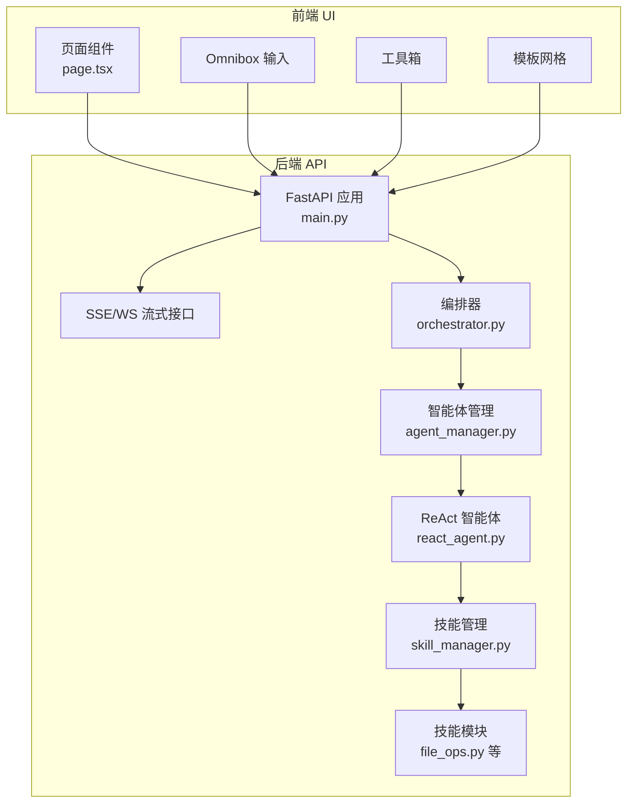
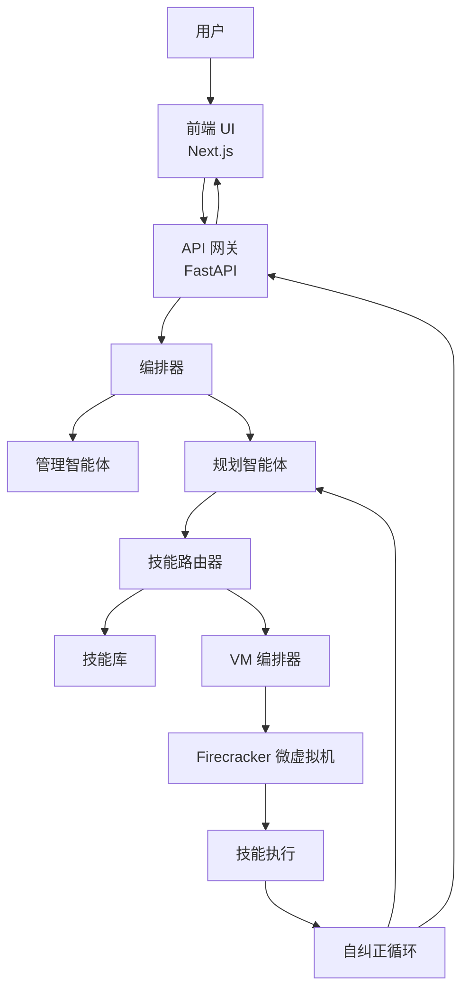
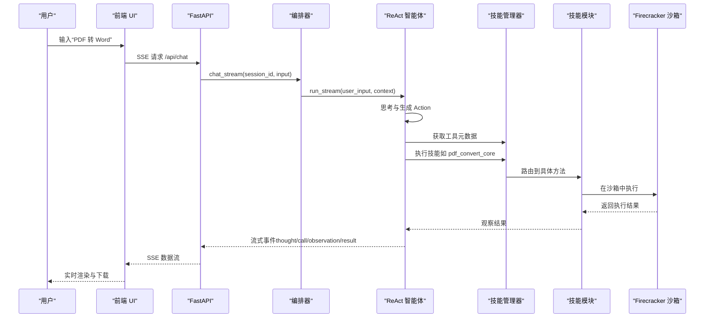
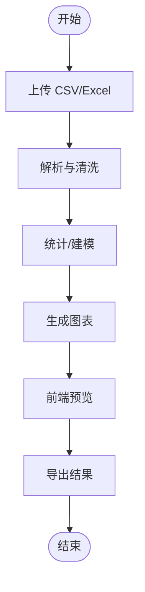
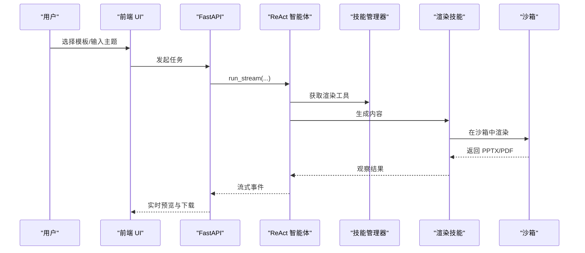
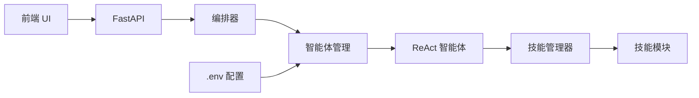

# 应用场景

<cite>
**本文引用的文件**
- [localmanus_prd.md](file://localmanus_prd.md)
- [localmanus_architecture.md](file://localmanus_architecture.md)
- [localmanus_skills_roadmap.md](file://localmanus_skills_roadmap.md)
- [main.py](file://localmanus-backend/main.py)
- [orchestrator.py](file://localmanus-backend/core/orchestrator.py)
- [agent_manager.py](file://localmanus-backend/core/agent_manager.py)
- [react_agent.py](file://localmanus-backend/agents/react_agent.py)
- [skill_manager.py](file://localmanus-backend/core/skill_manager.py)
- [file_ops.py](file://localmanus-backend/skills/file_ops.py)
- [page.tsx](file://localmanus-ui/app/page.tsx)
- [.env.example](file://localmanus-backend/.env.example)
</cite>

## 目录
1. [引言](#引言)
2. [项目结构](#项目结构)
3. [核心组件](#核心组件)
4. [架构总览](#架构总览)
5. [详细组件分析](#详细组件分析)
6. [依赖关系分析](#依赖关系分析)
7. [性能考量](#性能考量)
8. [故障排查指南](#故障排查指南)
9. [结论](#结论)
10. [附录](#附录)

## 引言
LocalManus 是一个面向专业人士的“通用 Agent”平台，通过自然语言指令驱动多智能体编排与沙箱执行，完成从文档创建、演示文稿生成、设计任务到调研与数据分析的复杂工作流。其核心价值在于：
- 将复杂任务拆解为可执行的子任务，并在隔离环境中安全执行；
- 以“Omnibox”为中心的自然语言交互，降低使用门槛；
- 通过“技能”模块化扩展能力，支持持续演进；
- 提供实时预览与导出，加速从创意到交付的闭环。

## 项目结构
LocalManus 采用前后端分离架构：
- 后端（FastAPI + AgentScope）：负责任务编排、ReAct 执行、技能调度与沙箱通信；
- 前端（Next.js）：提供“Omnibox”、工具箱、模板网格与聊天界面，支持实时流式响应；
- 技能系统：以模块化技能为基础，按需加载与执行。

图表来源
- [main.py](file://localmanus-backend/main.py#L1-L98)
- [page.tsx](file://localmanus-ui/app/page.tsx#L1-L285)
- [orchestrator.py](file://localmanus-backend/core/orchestrator.py#L1-L119)
- [agent_manager.py](file://localmanus-backend/core/agent_manager.py#L1-L44)
- [react_agent.py](file://localmanus-backend/agents/react_agent.py#L1-L272)
- [skill_manager.py](file://localmanus-backend/core/skill_manager.py#L1-L84)
- [file_ops.py](file://localmanus-backend/skills/file_ops.py#L1-L41)

章节来源
- [localmanus_prd.md](file://localmanus_prd.md#L1-L76)
- [localmanus_architecture.md](file://localmanus_architecture.md#L1-L137)
- [main.py](file://localmanus-backend/main.py#L1-L98)
- [page.tsx](file://localmanus-ui/app/page.tsx#L1-L285)

## 核心组件
- 编排器（Orchestrator）：负责会话管理、意图解析、DAG 规划与结果合成，支持流式输出。
- 智能体管理（AgentLifecycleManager）：初始化并提供 Manager、Planner、ReAct 智能体。
- ReAct 智能体：基于“思考-行动-观察-反思”的循环，支持工具调用与流式响应。
- 技能管理（SkillManager）：动态加载技能模块，提供工具元数据，路由到具体方法。
- 技能示例（FileOps）：文件读写与目录列表的基础能力，展示技能开发范式。
- 前端页面（page.tsx）：提供聊天界面、工具箱、模板网格与实时流式渲染。

章节来源
- [orchestrator.py](file://localmanus-backend/core/orchestrator.py#L1-L119)
- [agent_manager.py](file://localmanus-backend/core/agent_manager.py#L1-L44)
- [react_agent.py](file://localmanus-backend/agents/react_agent.py#L1-L272)
- [skill_manager.py](file://localmanus-backend/core/skill_manager.py#L1-L84)
- [file_ops.py](file://localmanus-backend/skills/file_ops.py#L1-L41)
- [page.tsx](file://localmanus-ui/app/page.tsx#L1-L285)

## 架构总览
LocalManus 采用“动态多智能体 + 沙箱执行”的架构，将用户请求实时分解为可执行子任务，并通过 AgentScope 的消息传递与工具检索器进行技能路由。执行阶段通过 Firecracker 微虚拟机实现硬件级隔离与快速恢复，确保安全与性能。

图表来源
- [localmanus_architecture.md](file://localmanus_architecture.md#L1-L137)
- [main.py](file://localmanus-backend/main.py#L1-L98)
- [orchestrator.py](file://localmanus-backend/core/orchestrator.py#L1-L119)
- [react_agent.py](file://localmanus-backend/agents/react_agent.py#L1-L272)

## 详细组件分析

### 场景一：文档转换（PDF 转 Word）
- 用户意图：将 PDF 文档转换为 Word 文档，保留原始排版。
- 前端交互：用户在 Omnibox 输入指令或上传文件，前端发起 SSE 请求。
- 后端处理：
  - 编排器接收输入，生成会话上下文；
  - ReAct 智能体解析任务，识别需要的技能（如 PDF 处理、Word 生成）；
  - 技能管理器动态加载并执行相应技能；
  - 执行结果通过流式事件返回前端，支持实时预览与下载。
- 技术要点：
  - 通过工具调用（Action）与观察（Observation）形成 ReAct 循环；
  - 沙箱执行确保安全与隔离；
  - 支持错误自纠正（如字体缺失时提示安装或回退）。

图表来源
- [page.tsx](file://localmanus-ui/app/page.tsx#L31-L159)
- [main.py](file://localmanus-backend/main.py#L33-L61)
- [orchestrator.py](file://localmanus-backend/core/orchestrator.py#L16-L64)
- [react_agent.py](file://localmanus-backend/agents/react_agent.py#L120-L242)
- [skill_manager.py](file://localmanus-backend/core/skill_manager.py#L15-L26)
- [file_ops.py](file://localmanus-backend/skills/file_ops.py#L1-L41)

章节来源
- [localmanus_architecture.md](file://localmanus_architecture.md#L71-L114)
- [localmanus_skills_roadmap.md](file://localmanus_skills_roadmap.md#L48-L55)
- [page.tsx](file://localmanus-ui/app/page.tsx#L31-L159)
- [main.py](file://localmanus-backend/main.py#L33-L61)
- [react_agent.py](file://localmanus-backend/agents/react_agent.py#L120-L242)

### 场景二：数据分析与可视化（CSV/Excel 处理）
- 用户意图：上传表格文件，进行清洗、统计与可视化。
- 前端交互：用户上传文件或在 Omnibox 输入分析需求，前端展示图表预览。
- 后端处理：
  - ReAct 智能体识别数据处理技能；
  - 技能在沙箱中执行 Python/R 代码，生成图表；
  - 通过 VSOCK 快速回传图片二进制流，前端直接预览。
- 技术要点：
  - 沙箱隔离保障执行安全；
  - 工具链自动安装，提升可用性；
  - 实时流式渲染提升交互效率。

图表来源
- [localmanus_skills_roadmap.md](file://localmanus_skills_roadmap.md#L24-L31)
- [page.tsx](file://localmanus-ui/app/page.tsx#L169-L180)

章节来源
- [localmanus_skills_roadmap.md](file://localmanus_skills_roadmap.md#L24-L31)
- [page.tsx](file://localmanus-ui/app/page.tsx#L169-L180)

### 场景三：内容生成与演示文稿（大纲到 PPTX/PDF）
- 用户意图：根据主题生成演示文稿，支持模板与实时编辑。
- 前端交互：用户选择模板或输入主题，前端展示模板网格与工具箱。
- 后端处理：
  - ReAct 智能体生成大纲与内容；
  - 渲染技能将结构化输出转化为 PPTX/PDF；
  - 用户可在聊天中提出修改意见，Agent 动态调整渲染代码。
- 技术要点：
  - 模板体系与渲染引擎结合；
  - “所见即所得”的编辑体验；
  - 导出多种格式，便于交付。

图表来源
- [localmanus_skills_roadmap.md](file://localmanus_skills_roadmap.md#L40-L47)
- [page.tsx](file://localmanus-ui/app/page.tsx#L167-L180)
- [react_agent.py](file://localmanus-backend/agents/react_agent.py#L120-L242)
- [skill_manager.py](file://localmanus-backend/core/skill_manager.py#L75-L83)

章节来源
- [localmanus_skills_roadmap.md](file://localmanus_skills_roadmap.md#L40-L47)
- [page.tsx](file://localmanus-ui/app/page.tsx#L167-L180)

### 场景四：全栈工程与本地预览（DevScope）
- 用户意图：在本地快速创建、修改与预览 Web 应用。
- 前端交互：用户在 Omnibox 输入需求，前端展示开发状态与预览链接。
- 后端处理：
  - ReAct 智能体识别工程技能；
  - 技能在沙箱中执行构建与预览；
  - 通过安全代理对外暴露本地服务，前端实时预览。
- 技术要点：
  - 快照保存开发状态，支持回滚与分支尝试；
  - Git 集成与规范提交记录；
  - 沙箱隔离避免宿主环境污染。

章节来源
- [localmanus_skills_roadmap.md](file://localmanus_skills_roadmap.md#L15-L23)
- [page.tsx](file://localmanus-ui/app/page.tsx#L167-L180)

### 场景五：研究与调研（IntelSearch）
- 用户意图：对复杂主题进行网络调研并生成综述报告。
- 前端交互：用户输入问题，前端展示搜索结果与摘要。
- 后端处理：
  - ReAct 智能体调用搜索技能；
  - 沙箱内抓取网页并解析正文，去除广告；
  - 生成结构化报告，支持进一步编辑与导出。
- 技术要点：
  - 沙箱内抓取确保宿主安全；
  - 搜索 API 集成与解析器组合；
  - 多轮对话与上下文记忆。

章节来源
- [localmanus_skills_roadmap.md](file://localmanus_skills_roadmap.md#L32-L39)
- [page.tsx](file://localmanus-ui/app/page.tsx#L167-L180)

## 依赖关系分析
- 前端依赖后端提供的 SSE/WS 接口，实时渲染 ReAct 循环中的思考、工具调用、观察与结果；
- 后端通过 AgentScope 初始化智能体，ReAct 智能体依赖技能管理器提供的工具元数据；
- 技能管理器动态加载技能模块，技能模块通过沙箱执行具体任务；
- 环境变量用于配置模型与 API 基地址，确保本地与远程推理的一致性。

图表来源
- [page.tsx](file://localmanus-ui/app/page.tsx#L31-L159)
- [main.py](file://localmanus-backend/main.py#L1-L98)
- [agent_manager.py](file://localmanus-backend/core/agent_manager.py#L1-L44)
- [react_agent.py](file://localmanus-backend/agents/react_agent.py#L1-L272)
- [skill_manager.py](file://localmanus-backend/core/skill_manager.py#L1-L84)
- [.env.example](file://localmanus-backend/.env.example#L1-L4)

章节来源
- [page.tsx](file://localmanus-ui/app/page.tsx#L31-L159)
- [main.py](file://localmanus-backend/main.py#L1-L98)
- [agent_manager.py](file://localmanus-backend/core/agent_manager.py#L1-L44)
- [react_agent.py](file://localmanus-backend/agents/react_agent.py#L1-L272)
- [skill_manager.py](file://localmanus-backend/core/skill_manager.py#L1-L84)
- [.env.example](file://localmanus-backend/.env.example#L1-L4)

## 性能考量
- 流式响应：SSE/WS 提供近实时的事件推送，减少等待时间；
- 沙箱快照：热快照恢复时间小于 10ms，显著降低任务切换开销；
- 延迟加载：技能仅在需要时注入，减少冷启动与资源占用；
- 依赖隔离：基础镜像预装常用库，任务特定依赖在执行期安装，避免全局污染。

章节来源
- [localmanus_architecture.md](file://localmanus_architecture.md#L50-L66)

## 故障排查指南
- 无法连接后端：检查 FastAPI 服务是否启动，确认端口与 CORS 配置；
- 无流式输出：确认前端已正确订阅 SSE/WS，查看后端日志与会话 ID；
- 工具调用失败：检查技能是否存在、参数是否匹配、沙箱是否正常；
- 环境变量未生效：确认 .env 文件路径与键名，确保模型与 API 基地址正确；
- 会话上限：超过最大对话轮次会被限制，需新建会话继续。

章节来源
- [main.py](file://localmanus-backend/main.py#L20-L27)
- [orchestrator.py](file://localmanus-backend/core/orchestrator.py#L25-L28)
- [react_agent.py](file://localmanus-backend/agents/react_agent.py#L195-L242)
- [.env.example](file://localmanus-backend/.env.example#L1-L4)

## 结论
LocalManus 通过“动态多智能体 + 沙箱执行”的架构，将自然语言指令转化为可执行的工作流，覆盖文档转换、数据分析、内容生成、工程开发与研究调研等高频场景。其模块化技能体系与实时交互体验，为专业人士提供了高效、安全、可扩展的“指挥中心”。

## 附录
- 适用行业：创意设计、教育培训、市场研究、产品管理、技术开发；
- 目标用户：需要快速完成复杂任务的专业人士与团队；
- 价值主张：降低门槛、提升效率、保障安全、持续演进。