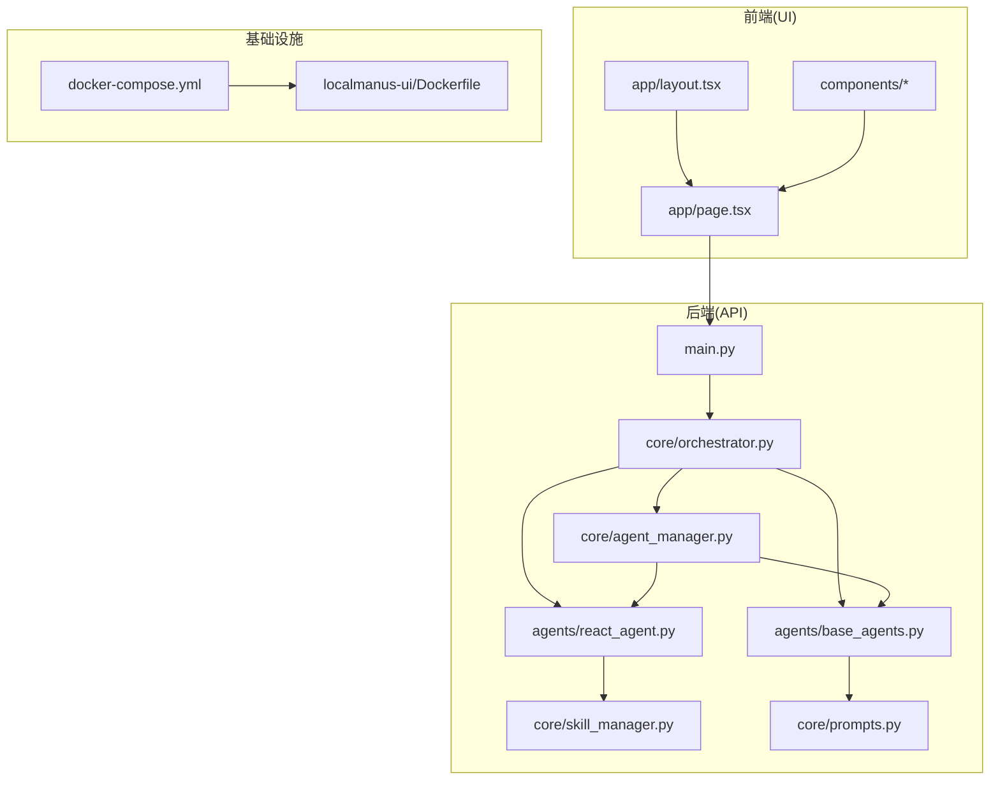
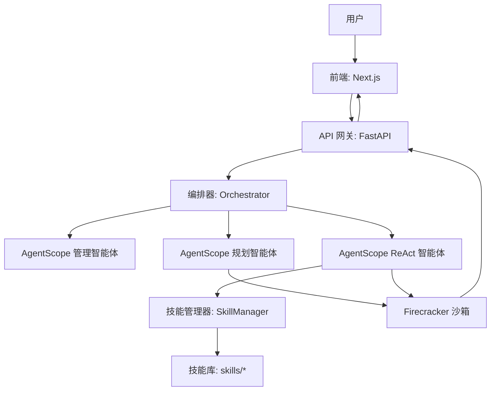
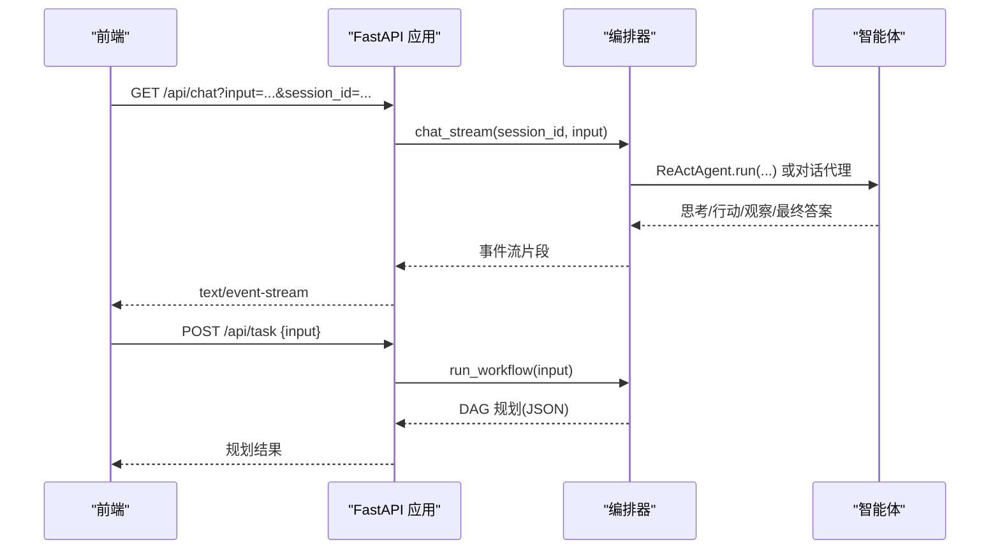
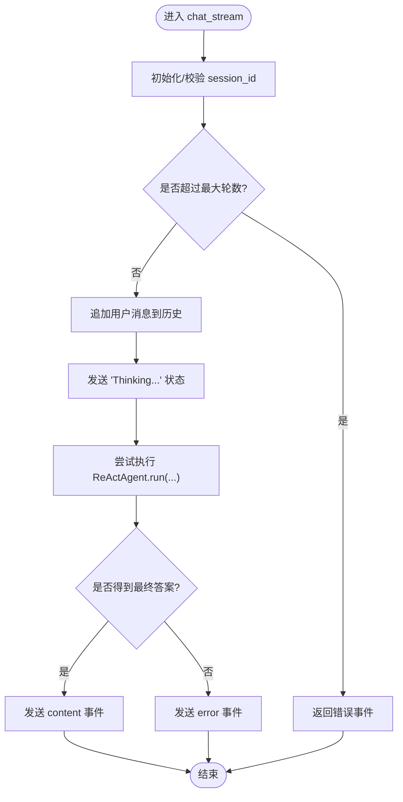
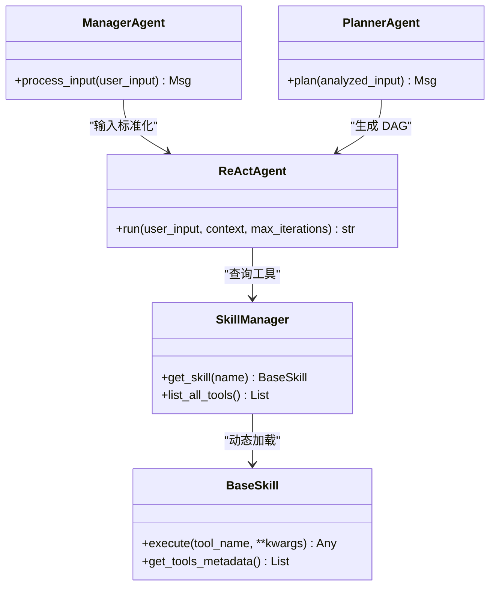
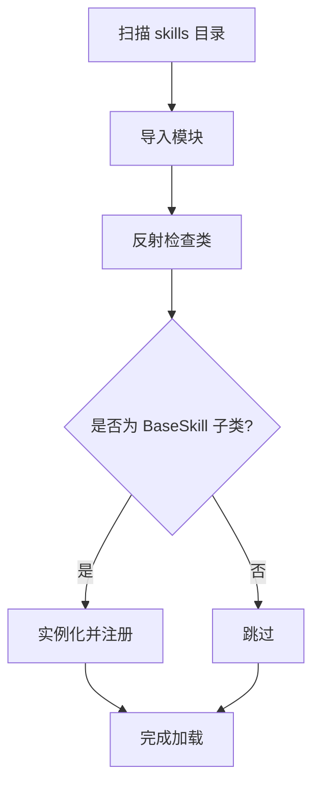
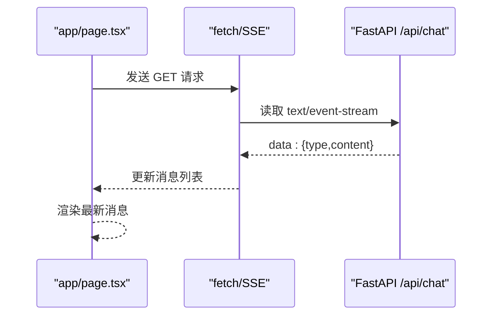
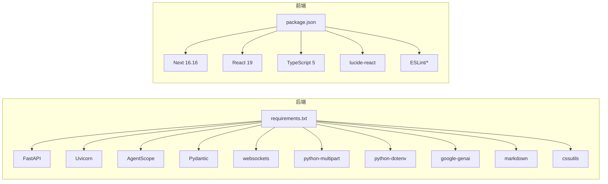

# 技术栈

<cite>
**本文引用的文件**
- [localmanus-backend/main.py](file://localmanus-backend/main.py)
- [localmanus-backend/requirements.txt](file://localmanus-backend/requirements.txt)
- [localmanus-backend/core/orchestrator.py](file://localmanus-backend/core/orchestrator.py)
- [localmanus-backend/core/agent_manager.py](file://localmanus-backend/core/agent_manager.py)
- [localmanus-backend/core/skill_manager.py](file://localmanus-backend/core/skill_manager.py)
- [localmanus-backend/agents/base_agents.py](file://localmanus-backend/agents/base_agents.py)
- [localmanus-backend/agents/react_agent.py](file://localmanus-backend/agents/react_agent.py)
- [localmanus-backend/core/prompts.py](file://localmanus-backend/core/prompts.py)
- [localmanus-ui/package.json](file://localmanus-ui/package.json)
- [localmanus-ui/next.config.ts](file://localmanus-ui/next.config.ts)
- [localmanus-ui/tsconfig.json](file://localmanus-ui/tsconfig.json)
- [localmanus-ui/Dockerfile](file://localmanus-ui/Dockerfile)
- [localmanus-ui/app/layout.tsx](file://localmanus-ui/app/layout.tsx)
- [localmanus-ui/app/page.tsx](file://localmanus-ui/app/page.tsx)
- [localmanus-ui/app/components/Omnibox.tsx](file://localmanus-ui/app/components/Omnibox.tsx)
- [localmanus-ui/app/components/Sidebar.tsx](file://localmanus-ui/app/components/Sidebar.tsx)
- [docker-compose.yml](file://docker-compose.yml)
- [localmanus_architecture.md](file://localmanus_architecture.md)
- [localmanus-backend/skills/wechat-article-formatter/requirements.txt](file://localmanus-backend/skills/wechat-article-formatter/requirements.txt)
</cite>

## 目录
1. [引言](#引言)
2. [项目结构](#项目结构)
3. [核心组件](#核心组件)
4. [架构总览](#架构总览)
5. [详细组件分析](#详细组件分析)
6. [依赖分析](#依赖分析)
7. [性能考量](#性能考量)
8. [故障排查指南](#故障排查指南)
9. [结论](#结论)
10. [附录](#附录)

## 引言
本文件系统性介绍 LocalManus 的技术栈与选型理由，覆盖后端（FastAPI + Python）、前端（Next.js + TypeScript）、AgentScope 多智能体框架以及 Firecracker 沙箱集成。文档从架构设计、组件职责、数据与控制流、依赖关系、版本与兼容性等方面展开，并提供可视化图示与排障建议，帮助开发者快速理解并高效参与开发。

**更新** 本次更新新增了 WeChat 生态系统相关依赖的详细说明，包括 google-genai 用于 Gemini 集成、markdown 用于内容处理、cssutils 用于 CSS 解析等关键组件。

## 项目结构
项目采用前后端分离的双仓库布局：
- 后端：localmanus-backend，基于 Python 与 FastAPI 提供 API 网关与编排能力，集成 AgentScope 多智能体与技能系统。
- 前端：localmanus-ui，基于 Next.js 16.16 与 TypeScript，提供聊天对话、模板与工具箱界面。
- 运维：docker-compose.yml 定义了 UI 服务的容器化运行方式；后续可扩展后端服务。

**图表来源**
- [localmanus-ui/app/page.tsx](file://localmanus-ui/app/page.tsx#L1-L184)
- [localmanus-backend/main.py](file://localmanus-backend/main.py#L1-L95)
- [localmanus-backend/core/orchestrator.py](file://localmanus-backend/core/orchestrator.py#L1-L118)
- [localmanus-backend/core/agent_manager.py](file://localmanus-backend/core/agent_manager.py#L1-L43)
- [localmanus-backend/core/skill_manager.py](file://localmanus-backend/core/skill_manager.py#L1-L84)
- [localmanus-backend/agents/base_agents.py](file://localmanus-backend/agents/base_agents.py#L1-L42)
- [localmanus-backend/agents/react_agent.py](file://localmanus-backend/agents/react_agent.py#L1-L108)
- [localmanus-ui/Dockerfile](file://localmanus-ui/Dockerfile#L1-L32)
- [docker-compose.yml](file://docker-compose.yml#L1-L16)

**章节来源**
- [docker-compose.yml](file://docker-compose.yml#L1-L16)
- [localmanus-ui/Dockerfile](file://localmanus-ui/Dockerfile#L1-L32)

## 核心组件
- 后端 API 网关（FastAPI）
  - 提供根路径、SSE 聊天、同步任务规划、ReAct 循环执行、WebSocket 任务流等接口，启用 CORS 支持跨域。
  - 使用 uvicorn 作为 ASGI 服务器运行。
- 编排器（Orchestrator）
  - 负责会话历史管理、多轮流式聊天、工作流规划、JSON 解析与错误回退。
- AgentScope 智能体
  - 管理智能体（ManagerAgent）、规划智能体（PlannerAgent）、ReAct 智能体（ReActAgent），统一通过 AgentScope 初始化与消息格式化。
- 技能系统（SkillManager）
  - 动态加载技能模块，反射生成工具元数据，支持异步工具执行与错误处理。
- 前端应用（Next.js）
  - 使用 app router、TypeScript、React 19，页面通过 fetch 与 SSE 访问后端 API，组件化组织 Omnibox、Sidebar、Toolbox、UserStatus。

**章节来源**
- [localmanus-backend/main.py](file://localmanus-backend/main.py#L1-L95)
- [localmanus-backend/core/orchestrator.py](file://localmanus-backend/core/orchestrator.py#L1-L118)
- [localmanus-backend/core/agent_manager.py](file://localmanus-backend/core/agent_manager.py#L1-L43)
- [localmanus-backend/core/skill_manager.py](file://localmanus-backend/core/skill_manager.py#L1-L84)
- [localmanus-backend/agents/base_agents.py](file://localmanus-backend/agents/base_agents.py#L1-L42)
- [localmanus-backend/agents/react_agent.py](file://localmanus-backend/agents/react_agent.py#L1-L108)
- [localmanus-ui/package.json](file://localmanus-ui/package.json#L1-L26)
- [localmanus-ui/tsconfig.json](file://localmanus-ui/tsconfig.json#L1-L35)

## 架构总览
整体架构围绕"多智能体 + 沙箱执行"的闭环展开：
- 前端通过 Next.js 与 FastAPI 交互，SSE 与 WebSocket 实时接收状态与结果。
- 后端通过 AgentScope 的 Manager/Planner/ReAct 智能体完成意图解析、任务规划与工具调用。
- 规划阶段产生的技能与参数，结合 Firecracker 沙箱进行受控执行，实现高性能与强隔离。

**图表来源**
- [localmanus_architecture.md](file://localmanus_architecture.md#L1-L137)
- [localmanus-backend/core/orchestrator.py](file://localmanus-backend/core/orchestrator.py#L1-L118)
- [localmanus-backend/agents/base_agents.py](file://localmanus-backend/agents/base_agents.py#L1-L42)
- [localmanus-backend/agents/react_agent.py](file://localmanus-backend/agents/react_agent.py#L1-L108)
- [localmanus-backend/core/skill_manager.py](file://localmanus-backend/core/skill_manager.py#L1-L84)

## 详细组件分析

### 后端 API 网关（FastAPI）
- 职责
  - 提供根路径健康检查、SSE 多轮聊天、同步任务规划、ReAct 循环执行、WebSocket 任务流。
  - 配置 CORS，便于前端直连。
- 关键点
  - SSE 使用 StreamingResponse 输出事件流，适合长连接与增量反馈。
  - WebSocket 用于实时状态推送与交互控制。
  - uvicorn 作为生产级 ASGI 服务器运行。

**图表来源**
- [localmanus-backend/main.py](file://localmanus-backend/main.py#L30-L56)
- [localmanus-backend/core/orchestrator.py](file://localmanus-backend/core/orchestrator.py#L13-L80)

**章节来源**
- [localmanus-backend/main.py](file://localmanus-backend/main.py#L1-L95)

### 编排器（Orchestrator）
- 职责
  - 维护会话历史，限制对话轮数，提供流式聊天输出。
  - 执行工作流：意图解析 → 规划 → 生成带 trace_id 的 DAG。
  - JSON 提取与错误兜底。
- 设计要点
  - 通过 AgentScope 的消息 Msg 传递上下文，支持 ReActAgent 的思考/行动循环。
  - 会话上限控制，避免无限增长的历史占用内存。

**图表来源**
- [localmanus-backend/core/orchestrator.py](file://localmanus-backend/core/orchestrator.py#L13-L64)

**章节来源**
- [localmanus-backend/core/orchestrator.py](file://localmanus-backend/core/orchestrator.py#L1-L118)

### AgentScope 智能体体系
- 管理智能体（ManagerAgent）
  - 标准化用户输入，输出结构化意图与实体，作为 Planner 的输入。
- 规划智能体（PlannerAgent）
  - 基于可用技能生成动态任务 DAG，包含依赖关系与参数映射。
- ReAct 智能体（ReActAgent）
  - 交替进行"思考-行动-观察"，按工具签名执行技能，直至得到最终答案。
  - 通过 SkillManager 注入工具元数据，实现工具发现与调用。

**图表来源**
- [localmanus-backend/agents/base_agents.py](file://localmanus-backend/agents/base_agents.py#L6-L41)
- [localmanus-backend/agents/react_agent.py](file://localmanus-backend/agents/react_agent.py#L32-L108)
- [localmanus-backend/core/skill_manager.py](file://localmanus-backend/core/skill_manager.py#L42-L84)

**章节来源**
- [localmanus-backend/agents/base_agents.py](file://localmanus-backend/agents/base_agents.py#L1-L42)
- [localmanus-backend/agents/react_agent.py](file://localmanus-backend/agents/react_agent.py#L1-L108)
- [localmanus-backend/core/prompts.py](file://localmanus-backend/core/prompts.py#L1-L53)

### 技能系统（SkillManager）
- 动态加载：扫描 skills 目录，导入模块并实例化继承自 BaseSkill 的类。
- 工具元数据：通过反射收集每个技能的公开方法，生成工具签名与描述。
- 执行路由：根据技能名与工具名分发到具体方法，支持异步与同步方法。

**图表来源**
- [localmanus-backend/core/skill_manager.py](file://localmanus-backend/core/skill_manager.py#L48-L71)

**章节来源**
- [localmanus-backend/core/skill_manager.py](file://localmanus-backend/core/skill_manager.py#L1-L84)

### 前端应用（Next.js + TypeScript）
- 页面与布局
  - app/layout.tsx 定义站点元数据与根布局。
  - app/page.tsx 实现聊天界面、消息列表滚动、SSE 读取与错误处理。
- 组件化
  - Omnibox.tsx 提供输入框与提交按钮，支持回车提交。
  - Sidebar.tsx 提供导航与最近活动展示。
- 构建与类型
  - package.json 指定 Next 16.16、React 19、TypeScript 5。
  - tsconfig.json 配置严格模式、Bundler 模式与路径别名。

**图表来源**
- [localmanus-ui/app/page.tsx](file://localmanus-ui/app/page.tsx#L24-L90)
- [localmanus-backend/main.py](file://localmanus-backend/main.py#L30-L38)

**章节来源**
- [localmanus-ui/app/layout.tsx](file://localmanus-ui/app/layout.tsx#L1-L20)
- [localmanus-ui/app/page.tsx](file://localmanus-ui/app/page.tsx#L1-L184)
- [localmanus-ui/app/components/Omnibox.tsx](file://localmanus-ui/app/components/Omnibox.tsx#L1-L63)
- [localmanus-ui/app/components/Sidebar.tsx](file://localmanus-ui/app/components/Sidebar.tsx#L1-L93)
- [localmanus-ui/package.json](file://localmanus-ui/package.json#L1-L26)
- [localmanus-ui/tsconfig.json](file://localmanus-ui/tsconfig.json#L1-L35)

## 依赖分析
- 后端依赖
  - FastAPI、Uvicorn：提供高性能异步 Web 服务与 ASGI 服务器。
  - AgentScope：多智能体通信、消息格式化、内存与模型封装。
  - Pydantic、websockets、python-multipart、python-dotenv：数据验证、WebSocket、表单解析、环境变量。
  - **新增** google-genai：Google Gemini AI 模型集成，支持多模态内容生成与处理。
  - **新增** markdown：Markdown 解析与转换，支持内容格式化与渲染。
  - **新增** cssutils：CSS 解析与处理，支持样式表的解析与操作。
- 前端依赖
  - Next 16.16、React 19、TypeScript 5：现代前端框架与类型系统。
  - lucide-react：图标库。
  - ESLint 与 @typescript-eslint：代码质量与风格规范。

**更新** 新增 WeChat 生态系统相关依赖，包括 google-genai 用于 Gemini 集成，markdown 用于内容处理，cssutils 用于 CSS 解析，这些依赖为微信公众号内容处理提供了强大的技术支持。

**图表来源**
- [localmanus-backend/requirements.txt](file://localmanus-backend/requirements.txt#L1-L17)
- [localmanus-ui/package.json](file://localmanus-ui/package.json#L1-L26)

**章节来源**
- [localmanus-backend/requirements.txt](file://localmanus-backend/requirements.txt#L1-L17)
- [localmanus-ui/package.json](file://localmanus-ui/package.json#L1-L26)

## 性能考量
- 后端
  - FastAPI 的异步 I/O 与 uvicorn 的高性能事件循环，适合高并发请求与长连接（SSE/WebSocket）。
  - Orchestrator 对会话轮数进行限制，避免历史累积导致内存膨胀。
  - **新增** google-genai 的集成优化了大模型调用性能，支持批量处理与缓存机制。
  - **新增** markdown 和 cssutils 的使用提升了内容处理效率，减少了重复解析开销。
- 前端
  - Next.js app router 与 React 19 的并发渲染能力，提升交互流畅度。
  - SSE 流式接收减少首屏等待时间，WebSocket 实现实时状态推送。
- 沙箱（Firecracker）
  - 架构文档指出热快照恢复时间小于 10ms，显著优于传统容器/虚拟机启动，满足低延迟与高吞吐需求。

**章节来源**
- [localmanus-backend/main.py](file://localmanus-backend/main.py#L1-L95)
- [localmanus-backend/core/orchestrator.py](file://localmanus-backend/core/orchestrator.py#L23-L25)
- [localmanus_architecture.md](file://localmanus_architecture.md#L52-L57)

## 故障排查指南
- 前端无法连接后端
  - 检查 CORS 配置与后端监听地址/端口。
  - 确认前端 fetch 地址与后端端口一致（默认 8000）。
- SSE 无数据
  - 确认后端 /api/chat 返回的媒体类型为 text/event-stream。
  - 检查浏览器网络面板与后端日志，确认流式响应未提前中断。
- WebSocket 断开
  - 查看后端日志中的连接/断开记录，确认客户端动作与后端处理分支。
- AgentScope 初始化失败
  - 检查 OPENAI_API_KEY、OPENAI_API_BASE、MODEL_NAME 等环境变量。
  - 确认 AgentScope 版本与模型适配（AgentScope 1.0 初始化方式）。
- 技能加载失败
  - 检查 skills 目录是否存在、模块导入是否报错、类是否继承 BaseSkill。
  - 确认工具方法签名与调用参数一致。
- **新增** WeChat 生态系统相关问题
  - google-genai 集成失败：检查 GOOGLE_API_KEY 环境变量配置。
  - markdown 处理异常：确认 markdown 版本兼容性和特殊字符处理。
  - cssutils 解析错误：检查 CSS 样式格式和编码问题。

**章节来源**
- [localmanus-backend/main.py](file://localmanus-backend/main.py#L18-L24)
- [localmanus-ui/app/page.tsx](file://localmanus-ui/app/page.tsx#L36-L90)
- [localmanus-backend/core/agent_manager.py](file://localmanus-backend/core/agent_manager.py#L10-L31)
- [localmanus-backend/core/skill_manager.py](file://localmanus-backend/core/skill_manager.py#L48-L71)

## 结论
LocalManus 的技术栈以 FastAPI + Python 作为高并发、可扩展的后端基石，结合 Next.js + TypeScript 构建现代化前端体验；通过 AgentScope 实现多智能体协作与动态任务规划；借助 Firecracker 沙箱实现高性能与强隔离的受控执行。**新增的 WeChat 生态系统依赖进一步增强了平台的内容处理能力，包括 google-genai 的 AI 内容生成、markdown 的内容格式化处理以及 cssutils 的样式解析功能，为微信公众号内容创作提供了完整的解决方案。** 整体架构清晰、边界明确、易于扩展，既满足当前功能需求，也为未来演进预留空间。

## 附录
- 版本与兼容性摘要
  - 后端：Python 生态（FastAPI、AgentScope、Uvicorn 等），AgentScope 1.0 初始化方式。
  - 前端：Next.js 16.16、React 19、TypeScript 5、ESLint。
  - 沙箱：Firecracker（架构文档描述），通过 AF_VSOCK/MMDS 与宿主机通信。
  - **新增** WeChat 生态系统：google-genai >= 0.5.0、markdown >= 3.4.0、cssutils >= 2.9.0。
- 运维
  - docker-compose.yml 当前仅定义 UI 服务；后续可按相同模式添加后端服务。

**章节来源**
- [localmanus-ui/package.json](file://localmanus-ui/package.json#L1-L26)
- [localmanus-ui/next.config.ts](file://localmanus-ui/next.config.ts#L1-L8)
- [localmanus-ui/tsconfig.json](file://localmanus-ui/tsconfig.json#L1-L35)
- [localmanus_architecture.md](file://localmanus_architecture.md#L119-L131)
- [docker-compose.yml](file://docker-compose.yml#L1-L16)
- [localmanus-backend/skills/wechat-article-formatter/requirements.txt](file://localmanus-backend/skills/wechat-article-formatter/requirements.txt#L1-L19)