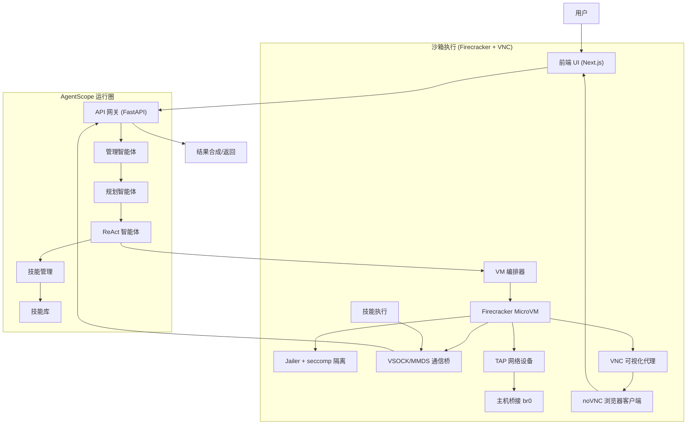
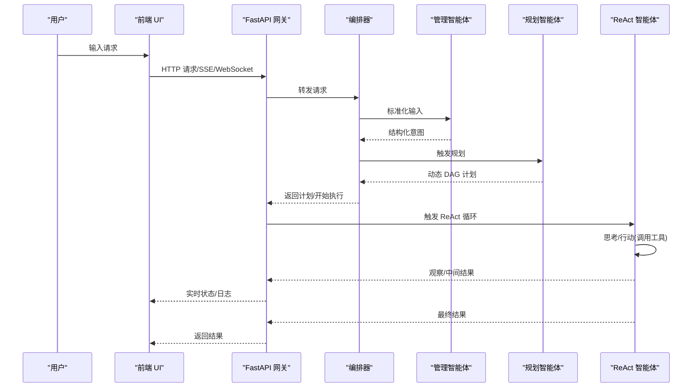
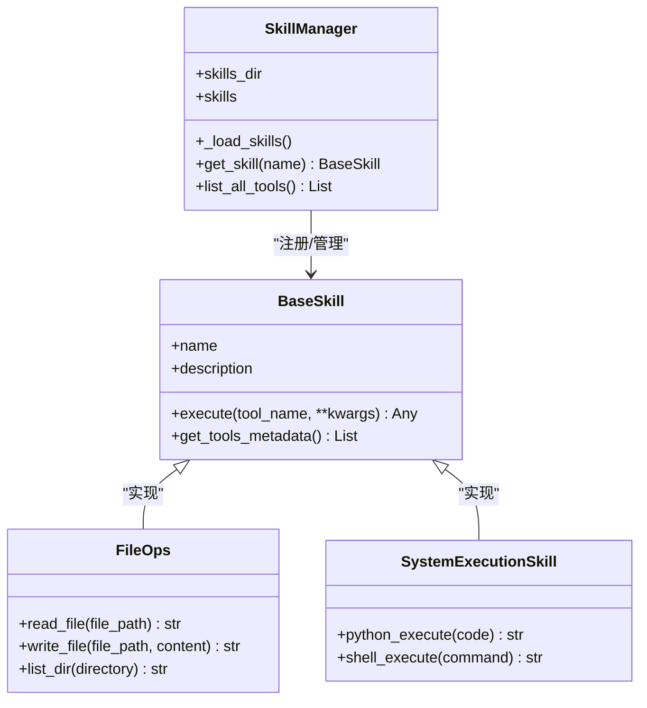
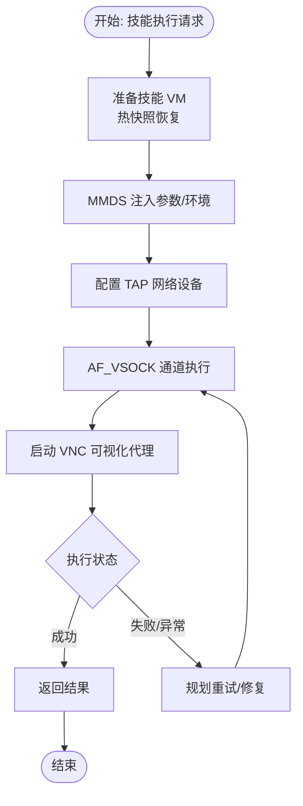
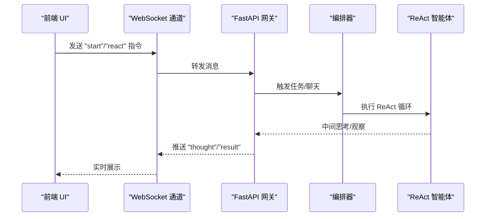
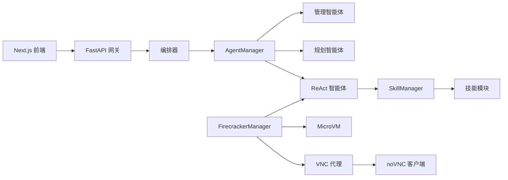

# 架构概览

<cite>
**本文引用的文件**
- [localmanus_architecture.md](file://localmanus_architecture.md)
- [main.py](file://localmanus-backend/main.py)
- [orchestrator.py](file://localmanus-backend/core/orchestrator.py)
- [agent_manager.py](file://localmanus-backend/core/agent_manager.py)
- [prompts.py](file://localmanus-backend/core/prompts.py)
- [base_agents.py](file://localmanus-backend/agents/base_agents.py)
- [react_agent.py](file://localmanus-backend/agents/react_agent.py)
- [skill_manager.py](file://localmanus-backend/core/skill_manager.py)
- [firecracker_sandbox.py](file://localmanus-backend/core/firecracker_sandbox.py)
- [sandbox.py](file://localmanus-backend/core/sandbox.py)
- [file_ops.py](file://localmanus-backend/skills/file-operations/file_ops.py)
- [system_tools.py](file://localmanus-backend/skills/system-execution/system_tools.py)
- [gen_web.py](file://localmanus-backend/skills/gen_web.py)
- [firecracker_setup.sh](file://localmanus-backend/scripts/firecracker_setup.sh)
- [test_orchestration.py](file://localmanus-backend/scripts/test_orchestration.py)
- [layout.tsx](file://localmanus-ui/app/layout.tsx)
- [package.json](file://localmanus-ui/package.json)
- [Dockerfile](file://localmanus-ui/Dockerfile)
- [docker-compose.yml](file://docker-compose.yml)
</cite>

## 目录
1. [引言](#引言)
2. [项目结构](#项目结构)
3. [核心组件](#核心组件)
4. [架构总览](#架构总览)
5. [详细组件分析](#详细组件分析)
6. [依赖分析](#依赖分析)
7. [性能考虑](#性能考虑)
8. [故障排查指南](#故障排查指南)
9. [结论](#结论)
10. [附录](#附录)

## 引言
本文件面向 LocalManus 项目的架构概览与实现说明，围绕从静态工作流到动态多智能体系统的演进，系统性阐述以下要点：
- 基于 AgentScope 的动态多智能体协作模式：管理智能体、规划智能体、ReAct 智能体的职责与交互。
- **新增** Firecracker 微虚拟机沙箱执行的架构设计与安全隔离机制：硬件级隔离、热快照恢复、AF_VSOCK 通信、Jailer 权限剥离与 seccomp 过滤，以及 VNC 可视化支持。
- 前后端分离架构与实时通信：FastAPI + WebSockets、Next.js 前端、Docker 化部署。
- 从用户输入到任务规划、技能路由、受控执行与结果合成的完整链路。

## 项目结构
LocalManus 采用前后端分离的双仓库布局：
- 后端（FastAPI + AgentScope + Firecracker 集成点）：负责多智能体编排、任务规划、技能路由与实时通信。
- 前端（Next.js）：提供用户界面与实时交互，通过 WebSocket 与后端通信。
- 部署：使用 docker-compose 管理 UI 服务，后续可扩展后端服务。

```mermaid
graph TB
subgraph "前端(UI)"
UI["Next.js 应用<br/>端口 3000"]
end
subgraph "后端(Backend)"
API["FastAPI 网关<br/>端口 8000"]
ORCH["编排器 Orchestrator"]
AGM["Agent 生命周期管理"]
MGR["管理智能体 Manager"]
PLN["规划智能体 Planner"]
RACT["ReAct 智能体"]
SKM["技能管理 SkillManager"]
SK["技能模块 FileOps 等"]
end
subgraph "沙箱(Firecracker)"
VM["MicroVM"]
JAIL["Jailer + seccomp"]
VSOCK["AF_VSOCK 通道"]
MMDS["MMDS 元数据服务"]
TAP["TAP 网络设备"]
BR["主机桥接 br0"]
VNC["VNC 可视化代理"]
NOVNC["noVNC 浏览器客户端"]
END
UI --> |"HTTP/SSE/WebSocket"| API
API --> ORCH
ORCH --> AGM
AGM --> MGR
AGM --> PLN
AGM --> RACT
ORCH --> SKM
SKM --> SK
RACT --> |"工具调用"| SK
RACT --> |"VSOCK/MMDS"| VM
VM --> JAIL
VM --> VSOCK
VM --> MMDS
VM --> TAP
TAP --> BR
VM --> VNC
VNC --> NOVNC
```

**图表来源**
- [main.py](file://localmanus-backend/main.py#L1-L153)
- [orchestrator.py](file://localmanus-backend/core/orchestrator.py#L1-L108)
- [agent_manager.py](file://localmanus-backend/core/agent_manager.py#L1-L44)
- [react_agent.py](file://localmanus-backend/agents/react_agent.py#L1-L221)
- [skill_manager.py](file://localmanus-backend/core/skill_manager.py#L1-L125)
- [firecracker_sandbox.py](file://localmanus-backend/core/firecracker_sandbox.py#L1-L170)
- [file_ops.py](file://localmanus-backend/skills/file-operations/file_ops.py#L1-L114)
- [system_tools.py](file://localmanus-backend/skills/system-execution/system_tools.py#L1-L78)
- [gen_web.py](file://localmanus-backend/skills/gen_web.py#L1-L59)

**章节来源**
- [docker-compose.yml](file://docker-compose.yml#L1-L16)
- [Dockerfile](file://localmanus-ui/Dockerfile#L1-L32)
- [package.json](file://localmanus-ui/package.json#L1-L26)
- [layout.tsx](file://localmanus-ui/app/layout.tsx#L1-L20)

## 核心组件
- 管理智能体（Manager Agent）
  - 负责标准化用户输入、维护会话 TraceID，并为规划智能体提供上下文。
- 规划智能体（Planner Agent）
  - 基于可用技能生成动态任务 DAG，明确步骤、参数与依赖关系。
- ReAct 智能体（ReAct Agent）
  - 依据工具元数据执行"思考-行动-观察"循环，按需调用技能完成任务。
- 技能管理（SkillManager）
  - 动态加载技能模块，提供工具元数据与执行入口。
- 编排器（Orchestrator）
  - 协调管理/规划/ReAct 智能体，串联任务规划与实时通信。
- 前端（Next.js）
  - 提供页面布局与交互，通过 WebSocket 与后端进行实时状态与日志推送。
- **新增** Firecracker 沙箱管理器（FirecrackerManager）
  - 负责微虚拟机的生命周期管理、网络配置与命令执行，支持 VNC 可视化代理。

**章节来源**
- [base_agents.py](file://localmanus-backend/agents/base_agents.py#L1-L42)
- [prompts.py](file://localmanus-backend/core/prompts.py#L1-L53)
- [react_agent.py](file://localmanus-backend/agents/react_agent.py#L1-L221)
- [skill_manager.py](file://localmanus-backend/core/skill_manager.py#L1-L125)
- [orchestrator.py](file://localmanus-backend/core/orchestrator.py#L1-L108)
- [firecracker_sandbox.py](file://localmanus-backend/core/firecracker_sandbox.py#L1-L170)

## 架构总览
LocalManus 从静态工作流演进为基于 AgentScope 的动态多智能体系统（MAS），核心思想是"意图解析 → 动态规划 → 技能路由 → 受控执行 → 结果合成"，并引入 Firecracker 微虚拟机实现硬件级隔离与高性能启动，**新增** VNC 可视化支持以实现实时监控和调试。



**图表来源**
- [localmanus_architecture.md](file://localmanus_architecture.md#L6-L31)
- [main.py](file://localmanus-backend/main.py#L58-L91)
- [orchestrator.py](file://localmanus-backend/core/orchestrator.py#L65-L80)
- [react_agent.py](file://localmanus-backend/agents/react_agent.py#L32-L108)
- [firecracker_sandbox.py](file://localmanus-backend/core/firecracker_sandbox.py#L79-L137)
- [gen_web.py](file://localmanus-backend/skills/gen_web.py#L40-L44)

## 详细组件分析

### 多智能体协作机制（管理/规划/ReAct）
- 管理智能体：接收原始用户输入，标准化为结构化意图与实体列表，形成可被规划智能体消费的上下文。
- 规划智能体：根据可用技能集合生成动态 DAG，明确步骤、参数与依赖；同时注入 trace_id 以便端到端追踪。
- ReAct 智能体：在工具元数据驱动下，执行"思考-行动-观察"循环，将技能调用结果回填到上下文中，直至得到最终答案。



**图表来源**
- [base_agents.py](file://localmanus-backend/agents/base_agents.py#L11-L40)
- [prompts.py](file://localmanus-backend/core/prompts.py#L3-L52)
- [orchestrator.py](file://localmanus-backend/core/orchestrator.py#L65-L80)
- [react_agent.py](file://localmanus-backend/agents/react_agent.py#L53-L108)

**章节来源**
- [base_agents.py](file://localmanus-backend/agents/base_agents.py#L1-L42)
- [prompts.py](file://localmanus-backend/core/prompts.py#L1-L53)
- [orchestrator.py](file://localmanus-backend/core/orchestrator.py#L1-L108)

### 技能系统与自动安装
- 技能粒度化：每个技能封装为独立模块，提供工具方法与元数据。
- 动态加载：SkillManager 在运行时扫描 skills 目录，导入类并注册为可调用工具。
- 延迟加载与依赖隔离：技能仅在需要时注入；常用依赖预装于基础镜像，任务特定依赖在执行期安装于临时层。



**图表来源**
- [skill_manager.py](file://localmanus-backend/core/skill_manager.py#L18-L125)
- [file_ops.py](file://localmanus-backend/skills/file-operations/file_ops.py#L5-L114)
- [system_tools.py](file://localmanus-backend/skills/system-execution/system_tools.py#L6-L78)

**章节来源**
- [skill_manager.py](file://localmanus-backend/core/skill_manager.py#L1-L125)
- [file_ops.py](file://localmanus-backend/skills/file-operations/file_ops.py#L1-L114)
- [system_tools.py](file://localmanus-backend/skills/system-execution/system_tools.py#L1-L78)

### Firecracker 微虚拟机沙箱执行与安全隔离
- **新增** 生命周期与延迟优化：热快照池、内存快照恢复（<10ms）、临时生命周期（零持久状态）。
- **新增** 安全通信：MMDS 用于初始注入与环境变量传递；AF_VSOCK 为主通道，绕过传统协议栈；串口控制台作为内核错误的后备。
- **新增** 安全实现：Jailer + seccomp，chroot/cgroups/网络命名空间剥离权限，限制 CPU/内存与网络流出。
- **新增** 网络配置：TAP 设备与主机桥接 br0 实现 VM 网络访问。
- **新增** VNC 可视化支持：Xvfb 虚拟帧缓冲器、x11vnc 服务器和 Websockify 代理，实现浏览器端实时可视化监控。



**图表来源**
- [localmanus_architecture.md](file://localmanus_architecture.md#L96-L115)
- [firecracker_sandbox.py](file://localmanus-backend/core/firecracker_sandbox.py#L79-L137)
- [gen_web.py](file://localmanus-backend/skills/gen_web.py#L40-L44)

**章节来源**
- [localmanus_architecture.md](file://localmanus_architecture.md#L96-L115)
- [firecracker_sandbox.py](file://localmanus-backend/core/firecracker_sandbox.py#L1-L170)
- [firecracker_setup.sh](file://localmanus-backend/scripts/firecracker_setup.sh#L1-L105)
- [gen_web.py](file://localmanus-backend/skills/gen_web.py#L1-L59)

### 前后端分离与实时通信
- 后端（FastAPI）：提供 SSE 与 WebSocket 接口，支持多轮对话与任务流式输出。
- 前端（Next.js）：页面布局与组件，通过 WebSocket 接收后端推送的状态与日志。
- 部署：docker-compose 管理 UI 服务，前端暴露 3000 端口；后端服务可按需扩展。



**图表来源**
- [main.py](file://localmanus-backend/main.py#L116-L149)
- [orchestrator.py](file://localmanus-backend/core/orchestrator.py#L16-L54)

**章节来源**
- [main.py](file://localmanus-backend/main.py#L1-L153)
- [layout.tsx](file://localmanus-ui/app/layout.tsx#L1-L20)
- [package.json](file://localmanus-ui/package.json#L1-L26)
- [Dockerfile](file://localmanus-ui/Dockerfile#L1-L32)
- [docker-compose.yml](file://docker-compose.yml#L1-L16)

## 依赖分析
- 组件耦合与内聚
  - Orchestrator 对 AgentScope 的智能体实例进行组合与调度，保持较高内聚。
  - SkillManager 与技能模块松耦合，通过动态导入实现插拔式扩展。
  - **新增** FirecrackerManager 与技能执行模块松耦合，通过统一的 execute_in_vm 接口交互。
- 外部依赖与集成点
  - AgentScope：多智能体通信与编排。
  - **新增** Firecracker：硬件级隔离与高性能启动，支持 VNC 可视化。
  - **新增** Websockify：VNC 流量到 WebSocket 的代理转换。
  - FastAPI + WebSockets：实时状态与日志流传输。
- 潜在循环依赖
  - 当前结构未见循环依赖；若未来引入更复杂的技能依赖，建议在 SkillManager 中增加依赖解析与拓扑排序。



**图表来源**
- [agent_manager.py](file://localmanus-backend/core/agent_manager.py#L1-L44)
- [orchestrator.py](file://localmanus-backend/core/orchestrator.py#L1-L108)
- [react_agent.py](file://localmanus-backend/agents/react_agent.py#L1-L221)
- [skill_manager.py](file://localmanus-backend/core/skill_manager.py#L1-L125)
- [main.py](file://localmanus-backend/main.py#L1-L153)
- [firecracker_sandbox.py](file://localmanus-backend/core/firecracker_sandbox.py#L1-L170)
- [gen_web.py](file://localmanus-backend/skills/gen_web.py#L1-L59)

**章节来源**
- [agent_manager.py](file://localmanus-backend/core/agent_manager.py#L1-L44)
- [orchestrator.py](file://localmanus-backend/core/orchestrator.py#L1-L108)
- [firecracker_sandbox.py](file://localmanus-backend/core/firecracker_sandbox.py#L1-L170)

## 性能考虑
- 启动延迟：通过 Firecracker 热快照实现亚秒级恢复，显著优于传统容器/虚拟机启动。
- 通信开销：AF_VSOCK 绕过 TCP/IP 协议栈，降低网络攻击面与延迟。
- 计算资源：在 microVM 层面强制内存/CPU 硬限制，避免资源滥用。
- I/O 与并发：后端使用异步接口与流式响应，前端通过 WebSocket 实时渲染，提升用户体验。
- 网络性能：TAP 设备与主机桥接提供高效的网络通信路径。
- **新增** VNC 性能：Websockify 代理将 VNC 流量转换为 WebSocket，支持浏览器端实时可视化，但可能增加额外的 CPU 开销。

## 故障排查指南
- API 端点问题
  - 检查 CORS 配置与端口映射，确认前端与后端连通性。
- 多智能体执行异常
  - 查看编排器的日志与 JSON 解析逻辑，确认管理/规划阶段输出格式正确。
- ReAct 循环卡滞
  - 检查工具元数据格式与参数解析，确保 Action 行为可被正确拆解与执行。
- 技能加载失败
  - 确认技能模块位于 skills 目录且继承 BaseSkill，检查动态导入与方法签名。
- 沙箱通信异常
  - 核对 MMDS/VSOCK 配置与权限设置，验证 Jailer 是否启用以及 seccomp 规则是否过严。
- **新增** Firecracker 启动失败
  - 检查 KVM 支持、内核版本要求和网络配置，确认 TAP 设备正确创建。
- **新增** VNC 可视化问题
  - 验证 Xvfb、x11vnc 和 websockify 服务是否正常运行，检查 VNC 代理端口（6080+）是否开放，确认 noVNC 客户端连接正常。
- **新增** 网络连接问题
  - 验证 br0 桥接设备存在且配置正确，检查 iptables NAT 规则，确认 TAP 设备与 VM 的网络连通性。

**章节来源**
- [main.py](file://localmanus-backend/main.py#L17-L24)
- [orchestrator.py](file://localmanus-backend/core/orchestrator.py#L82-L97)
- [react_agent.py](file://localmanus-backend/agents/react_agent.py#L77-L105)
- [skill_manager.py](file://localmanus-backend/core/skill_manager.py#L48-L71)
- [firecracker_sandbox.py](file://localmanus-backend/core/firecracker_sandbox.py#L66-L78)
- [firecracker_setup.sh](file://localmanus-backend/scripts/firecracker_setup.sh#L30-L34)
- [gen_web.py](file://localmanus-backend/skills/gen_web.py#L40-L44)

## 结论
LocalManus 通过 AgentScope 的动态多智能体编排与 Firecracker 的硬件级沙箱执行，实现了从静态工作流到可自适应、可修复的智能体系统的跃迁。**新增的 VNC 可视化支持**进一步增强了系统的可观测性和调试能力，使用户能够实时监控微虚拟机中的执行状态。前后端分离与实时通信架构提升了交互体验，而完整的微VM生命周期管理和安全隔离机制确保了系统的可靠性和安全性。该架构在安全性、性能与可扩展性之间取得平衡，为复杂任务的可靠执行提供了坚实基础。

## 附录
- 示例测试脚本展示了从用户输入到任务规划的端到端流程，便于快速验证系统链路。

**章节来源**
- [test_orchestration.py](file://localmanus-backend/scripts/test_orchestration.py#L1-L57)