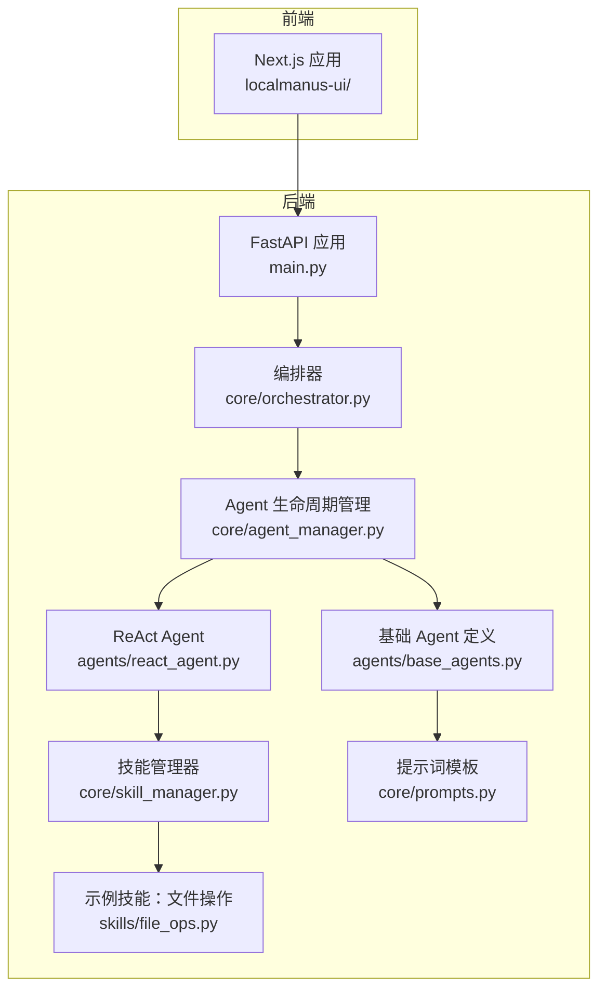
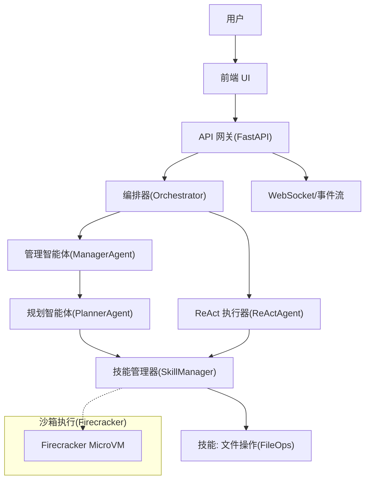
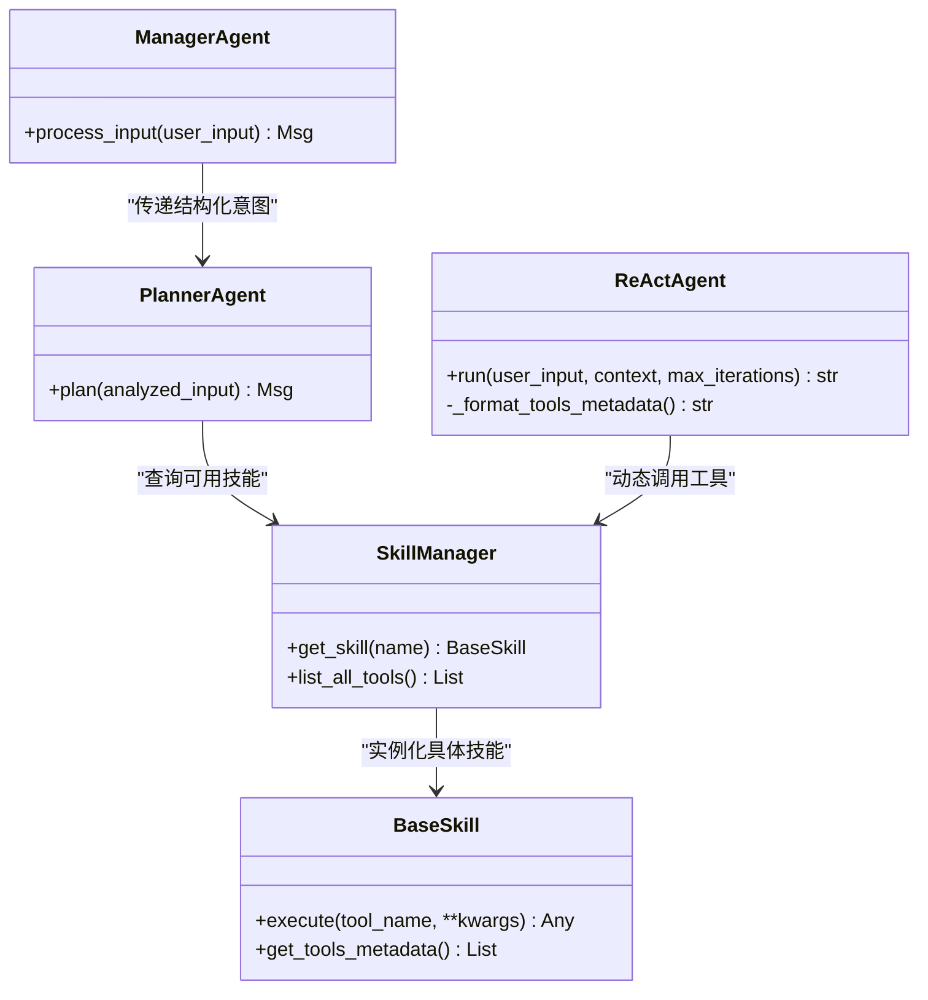
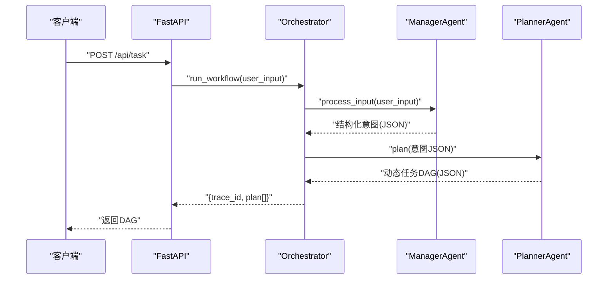
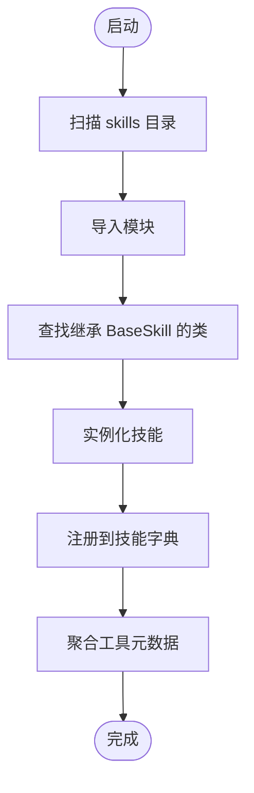
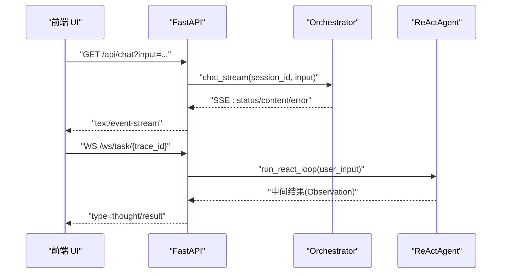
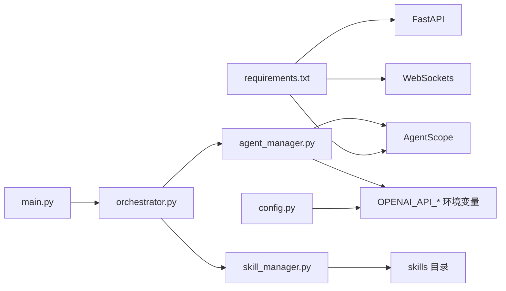

# 核心特性

<cite>
**本文引用的文件**
- [main.py](file://localmanus-backend/main.py)
- [orchestrator.py](file://localmanus-backend/core/orchestrator.py)
- [agent_manager.py](file://localmanus-backend/core/agent_manager.py)
- [skill_manager.py](file://localmanus-backend/core/skill_manager.py)
- [base_agents.py](file://localmanus-backend/agents/base_agents.py)
- [react_agent.py](file://localmanus-backend/agents/react_agent.py)
- [prompts.py](file://localmanus-backend/core/prompts.py)
- [file_ops.py](file://localmanus-backend/skills/file_ops.py)
- [test_orchestration.py](file://localmanus-backend/scripts/test_orchestration.py)
- [requirements.txt](file://localmanus-backend/requirements.txt)
- [config.py](file://localmanus-backend/core/config.py)
- [localmanus_architecture.md](file://localmanus_architecture.md)
- [localmanus_skills_roadmap.md](file://localmanus_skills_roadmap.md)
- [localmanus_prd.md](file://localmanus_prd.md)
</cite>

## 目录
1. [引言](#引言)
2. [项目结构](#项目结构)
3. [核心组件](#核心组件)
4. [架构总览](#架构总览)
5. [详细组件分析](#详细组件分析)
6. [依赖关系分析](#依赖关系分析)
7. [性能考量](#性能考量)
8. [故障排查指南](#故障排查指南)
9. [结论](#结论)
10. [附录](#附录)

## 引言
本文件聚焦 LocalManus 的核心特性，面向开发者与业务人员，系统阐述以下能力的技术实现与业务价值：多智能体编排系统、基于 AgentScope 的动态规划、技能动态加载机制、实时交互能力、模板系统（提示词与工作流）、以及面向未来的 Firecracker 沙箱执行能力。我们将解释这些特性如何协同工作，形成“意图解析—动态规划—技能路由—执行反馈—结果合成”的闭环，并给出典型使用场景与效果预期。

## 项目结构
后端采用 FastAPI 提供 API 网关，核心编排逻辑集中在 Orchestrator，Agent 初始化与生命周期由 AgentLifecycleManager 管理，技能系统通过 SkillManager 动态加载，ReActAgent 基于 AgentScope 实现推理与工具调用。前端为 Next.js 应用，二者通过 WebSocket 实现实时交互。

**图表来源**
- [main.py](file://localmanus-backend/main.py#L1-L95)
- [orchestrator.py](file://localmanus-backend/core/orchestrator.py#L1-L118)
- [agent_manager.py](file://localmanus-backend/core/agent_manager.py#L1-L44)
- [skill_manager.py](file://localmanus-backend/core/skill_manager.py#L1-L84)
- [base_agents.py](file://localmanus-backend/agents/base_agents.py#L1-L42)
- [react_agent.py](file://localmanus-backend/agents/react_agent.py#L1-L108)
- [prompts.py](file://localmanus-backend/core/prompts.py#L1-L53)
- [file_ops.py](file://localmanus-backend/skills/file_ops.py#L1-L41)

**章节来源**
- [main.py](file://localmanus-backend/main.py#L1-L95)
- [requirements.txt](file://localmanus-backend/requirements.txt#L1-L8)

## 核心组件
- 多智能体编排系统：由 ManagerAgent、PlannerAgent、ReActAgent 组成，分别负责意图标准化、动态规划与推理执行。
- 基于 AgentScope 的动态规划：通过系统提示词与消息上下文，生成可执行的动态任务 DAG。
- 技能动态加载机制：SkillManager 动态扫描 skills 目录，按需加载技能模块，提供工具元数据给 Agent。
- 实时交互能力：SSE 与 WebSocket 支持多轮对话与 ReAct 执行的实时反馈。
- 模板系统：提示词模板与工作流模板（PRD 中描述）支撑可复用的业务流程。
- Firecracker 沙箱执行：架构文档提出以 Firecracker 提供硬件级隔离与超低启动延迟的执行环境。

**章节来源**
- [base_agents.py](file://localmanus-backend/agents/base_agents.py#L1-L42)
- [prompts.py](file://localmanus-backend/core/prompts.py#L1-L53)
- [skill_manager.py](file://localmanus-backend/core/skill_manager.py#L1-L84)
- [react_agent.py](file://localmanus-backend/agents/react_agent.py#L1-L108)
- [orchestrator.py](file://localmanus-backend/core/orchestrator.py#L1-L118)
- [main.py](file://localmanus-backend/main.py#L1-L95)
- [localmanus_architecture.md](file://localmanus_architecture.md#L1-L137)
- [localmanus_prd.md](file://localmanus_prd.md#L1-L76)

## 架构总览
整体架构围绕“意图—规划—路由—执行—反馈”闭环展开，AgentScope 负责智能体间的消息传递与规划，FastAPI 提供实时交互接口，技能通过动态加载注入，最终通过 Firecracker 沙箱实现安全可控的执行。

**图表来源**
- [main.py](file://localmanus-backend/main.py#L1-L95)
- [orchestrator.py](file://localmanus-backend/core/orchestrator.py#L1-L118)
- [agent_manager.py](file://localmanus-backend/core/agent_manager.py#L1-L44)
- [skill_manager.py](file://localmanus-backend/core/skill_manager.py#L1-L84)
- [react_agent.py](file://localmanus-backend/agents/react_agent.py#L1-L108)
- [file_ops.py](file://localmanus-backend/skills/file_ops.py#L1-L41)
- [localmanus_architecture.md](file://localmanus_architecture.md#L1-L137)

## 详细组件分析

### 多智能体编排系统
- 管理智能体（ManagerAgent）：接收用户输入，标准化为结构化意图，维护会话上下文与 TraceID，供后续规划使用。
- 规划智能体（PlannerAgent）：基于可用技能与系统提示词，生成动态任务 DAG，包含步骤、依赖与参数映射。
- ReAct 执行器（ReActAgent）：在推理循环中交替“思考—行动—观察”，根据工具返回更新上下文，直至得到最终答案。

**图表来源**
- [base_agents.py](file://localmanus-backend/agents/base_agents.py#L1-L42)
- [react_agent.py](file://localmanus-backend/agents/react_agent.py#L1-L108)
- [skill_manager.py](file://localmanus-backend/core/skill_manager.py#L1-L84)

**章节来源**
- [base_agents.py](file://localmanus-backend/agents/base_agents.py#L1-L42)
- [prompts.py](file://localmanus-backend/core/prompts.py#L1-L53)

### 基于 AgentScope 的动态规划
- 系统提示词模板定义了 Manager 与 Planner 的职责边界与输出格式，确保结构化输入与可解析的 JSON 输出。
- Orchestrator 在运行时调用 Manager 与 Planner，抽取 JSON 并生成带 trace_id 的动态任务 DAG，随后可交由 ReActAgent 或外部执行器执行。

**图表来源**
- [main.py](file://localmanus-backend/main.py#L40-L47)
- [orchestrator.py](file://localmanus-backend/core/orchestrator.py#L65-L80)
- [base_agents.py](file://localmanus-backend/agents/base_agents.py#L1-L42)

**章节来源**
- [prompts.py](file://localmanus-backend/core/prompts.py#L1-L53)
- [orchestrator.py](file://localmanus-backend/core/orchestrator.py#L65-L80)

### 技能动态加载机制
- SkillManager 动态扫描 skills 目录，导入继承自 BaseSkill 的类，注册为可调用技能。
- BaseSkill 提供统一的工具分发 execute 与元数据收集 get_tools_metadata，便于 Agent 查询可用工具签名与描述。
- 示例技能 FileOps 提供文件读写、目录列举等基础能力，展示如何扩展新技能。

**图表来源**
- [skill_manager.py](file://localmanus-backend/core/skill_manager.py#L48-L83)
- [file_ops.py](file://localmanus-backend/skills/file_ops.py#L1-L41)

**章节来源**
- [skill_manager.py](file://localmanus-backend/core/skill_manager.py#L1-L84)
- [file_ops.py](file://localmanus-backend/skills/file_ops.py#L1-L41)

### 实时交互能力
- SSE：/api/chat 提供多轮对话流式输出，支持会话历史与轮次上限控制。
- WebSocket：/ws/task/{trace_id} 接收客户端动作，支持 ReAct 执行的实时状态推送（如“思考/结果”）。
- API 网关统一处理 CORS、日志与异常，保证前后端稳定交互。

**图表来源**
- [main.py](file://localmanus-backend/main.py#L30-L91)
- [orchestrator.py](file://localmanus-backend/core/orchestrator.py#L13-L64)
- [react_agent.py](file://localmanus-backend/agents/react_agent.py#L53-L108)

**章节来源**
- [main.py](file://localmanus-backend/main.py#L1-L95)
- [orchestrator.py](file://localmanus-backend/core/orchestrator.py#L1-L118)

### 模板系统
- 提示词模板（prompts.py）：定义 Manager 与 Planner 的系统提示词，约束输出格式与职责边界，保障结构化产物。
- 工作流模板（PRD 描述）：提供可复用的业务流程与界面布局，支持“演示文稿生成”“文档转换”“数据分析”等高频场景。

**章节来源**
- [prompts.py](file://localmanus-backend/core/prompts.py#L1-L53)
- [localmanus_prd.md](file://localmanus_prd.md#L1-L76)

### Firecracker 沙箱执行（未来能力）
- 架构文档提出以 Firecracker 提供硬件级隔离与超低启动延迟的执行环境，结合 VSOCK/MMDS 实现宿主机与虚拟机的高效通信。
- 通过“热快照—恢复—执行—销毁”的生命周期，确保零持久状态与强隔离。
- 与当前技能系统结合，可在需要时将技能注入沙箱执行，提升安全性与可扩展性。

**章节来源**
- [localmanus_architecture.md](file://localmanus_architecture.md#L1-L137)

## 依赖关系分析
- 后端依赖：FastAPI、AgentScope、Pydantic、WebSockets、python-dotenv。
- Agent 初始化依赖 OPENAI_API_* 环境变量与本地/远程模型服务。
- 技能系统依赖 Python 动态导入与反射机制，确保运行时可扩展。

**图表来源**
- [requirements.txt](file://localmanus-backend/requirements.txt#L1-L8)
- [config.py](file://localmanus-backend/core/config.py#L1-L21)
- [agent_manager.py](file://localmanus-backend/core/agent_manager.py#L1-L44)
- [skill_manager.py](file://localmanus-backend/core/skill_manager.py#L1-L84)
- [orchestrator.py](file://localmanus-backend/core/orchestrator.py#L1-L118)
- [main.py](file://localmanus-backend/main.py#L1-L95)

**章节来源**
- [requirements.txt](file://localmanus-backend/requirements.txt#L1-L8)
- [config.py](file://localmanus-backend/core/config.py#L1-L21)

## 性能考量
- 启动与通信：WebSocket 与 SSE 提供低延迟实时反馈；AgentScope 的消息传递减少重复序列化开销。
- 计算与并发：ReAct 循环限制最大迭代次数，避免长时间阻塞；SSE 分块输出提升感知性能。
- 扩展性：技能动态加载降低冷启动成本，按需注入；未来结合 Firecracker 快照可进一步缩短热启动时间。
- 安全与隔离：沙箱执行与 Jailer 隔离降低风险，适合执行不受信任的代码或第三方依赖。

[本节为通用指导，无需特定文件分析]

## 故障排查指南
- API 未响应或 CORS 问题：检查 CORS 配置与前端域名设置。
- ReAct 执行卡住：确认工具名称与参数签名匹配，查看日志中的 Action/Thought/Final Answer 标记。
- 技能未加载：确认 skills 目录存在且类名继承 BaseSkill，检查动态导入异常日志。
- 会话上限：SSE 对话超过轮次限制会返回错误，需清理历史或增加上限。
- 环境变量缺失：OPENAI_API_KEY/OPENAI_API_BASE 未正确配置会导致 Agent 初始化失败。

**章节来源**
- [main.py](file://localmanus-backend/main.py#L17-L24)
- [react_agent.py](file://localmanus-backend/agents/react_agent.py#L73-L107)
- [skill_manager.py](file://localmanus-backend/core/skill_manager.py#L69-L70)
- [orchestrator.py](file://localmanus-backend/core/orchestrator.py#L22-L25)
- [config.py](file://localmanus-backend/core/config.py#L12-L16)

## 结论
LocalManus 通过“多智能体编排 + 动态规划 + 技能动态加载 + 实时交互 + 模板系统 + 沙箱执行”的组合，构建了可扩展、可解释、可落地的通用 Agent 平台。当前实现已具备从意图到可执行 DAG 的闭环与 ReAct 执行能力；未来结合 Firecracker 沙箱，将进一步强化安全性与性能，满足复杂工程与数据处理场景。

[本节为总结，无需特定文件分析]

## 附录

### 使用场景与效果
- 场景一：将 PPT 转 Word
  - 输入：用户上传 PPT 并发起转换请求。
  - 效果：Manager 标准化意图 → Planner 生成 DAG（读取 PPT → 写入 Word）→ ReAct 执行 → 返回结果。
- 场景二：实时 ReAct 对话
  - 输入：用户在聊天框输入复杂问题。
  - 效果：SSE/WS 实时返回“思考—观察—结果”，提升交互体验与可观测性。
- 场景三：技能扩展
  - 输入：新增 skills/file_ops.py 中的方法。
  - 效果：SkillManager 自动发现并注册新工具，Agent 可直接调用，无需重启。

**章节来源**
- [test_orchestration.py](file://localmanus-backend/scripts/test_orchestration.py#L12-L56)
- [file_ops.py](file://localmanus-backend/skills/file_ops.py#L1-L41)
- [main.py](file://localmanus-backend/main.py#L58-L91)