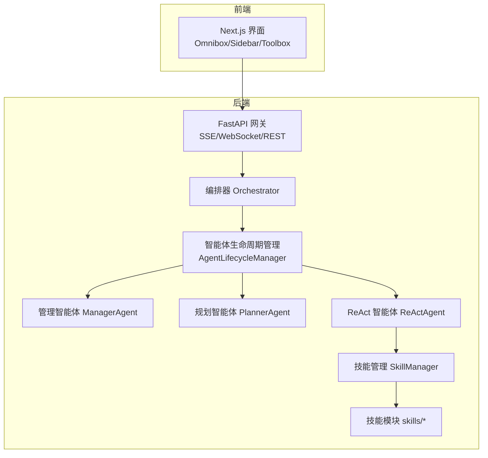
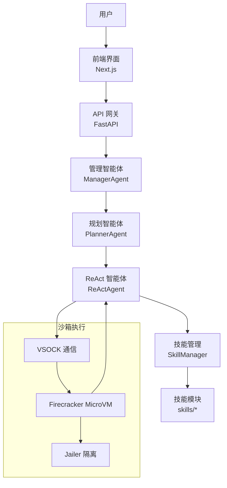
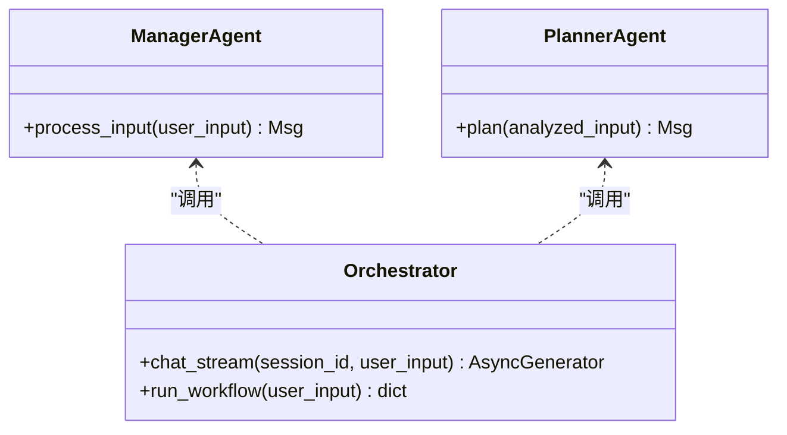
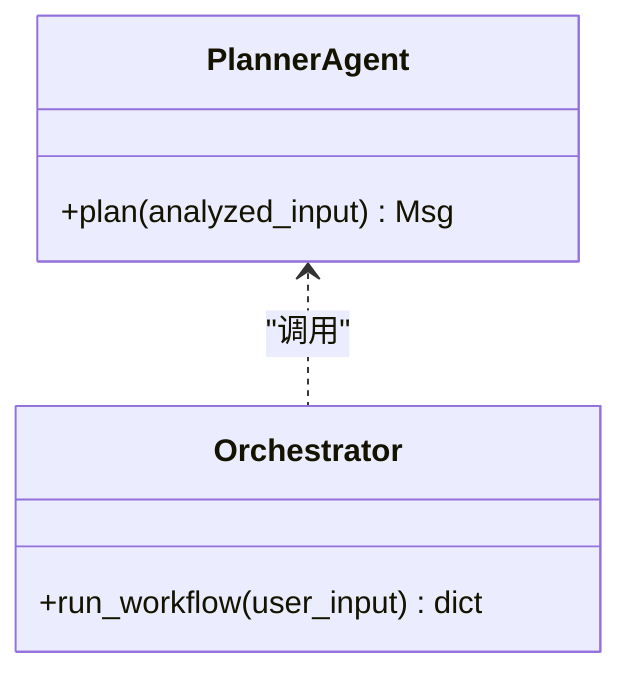
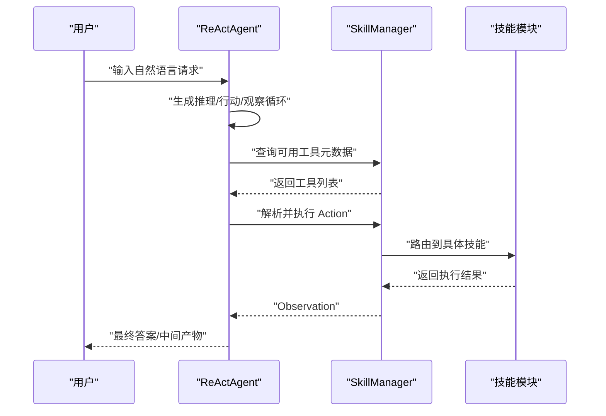
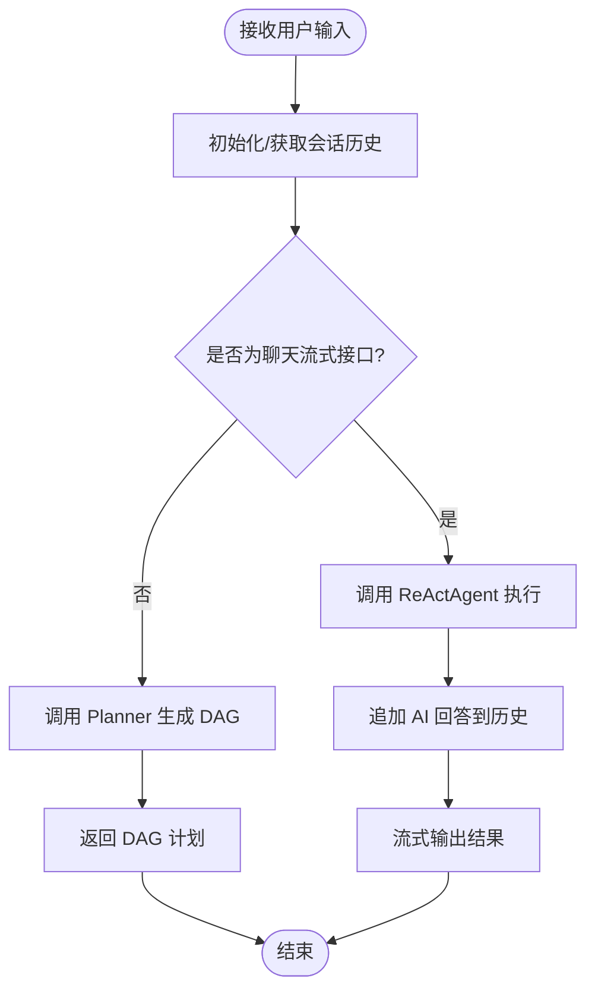
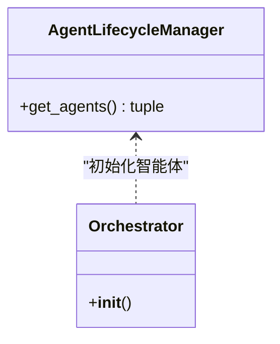
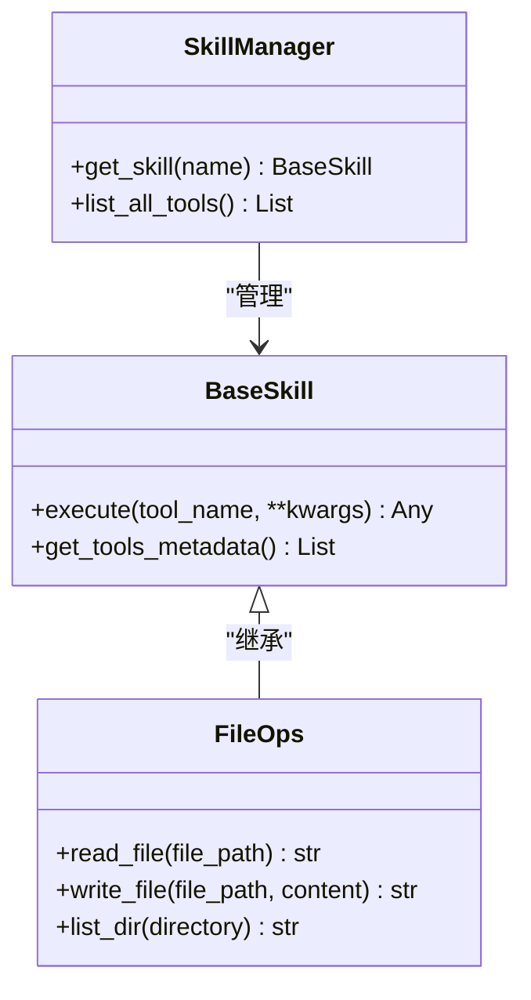
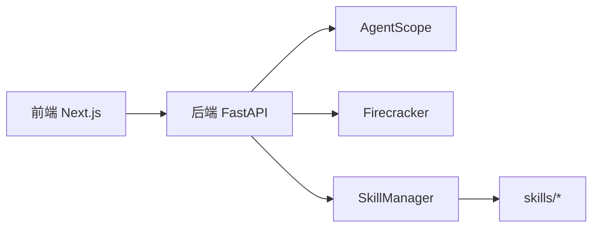

# 项目介绍

<cite>
**本文引用的文件**
- [main.py](file://localmanus-backend/main.py)
- [orchestrator.py](file://localmanus-backend/core/orchestrator.py)
- [agent_manager.py](file://localmanus-backend/core/agent_manager.py)
- [base_agents.py](file://localmanus-backend/agents/base_agents.py)
- [react_agent.py](file://localmanus-backend/agents/react_agent.py)
- [skill_manager.py](file://localmanus-backend/core/skill_manager.py)
- [file_ops.py](file://localmanus-backend/skills/file_ops.py)
- [prompts.py](file://localmanus-backend/core/prompts.py)
- [config.py](file://localmanus-backend/core/config.py)
- [localmanus_architecture.md](file://localmanus_architecture.md)
- [localmanus_skills_roadmap.md](file://localmanus_skills_roadmap.md)
- [package.json](file://localmanus-ui/package.json)
</cite>

## 目录
1. [引言](#引言)
2. [项目结构](#项目结构)
3. [核心组件](#核心组件)
4. [架构总览](#架构总览)
5. [详细组件分析](#详细组件分析)
6. [依赖关系分析](#依赖关系分析)
7. [性能考量](#性能考量)
8. [故障排查指南](#故障排查指南)
9. [结论](#结论)
10. [附录](#附录)

## 引言
LocalManus 是一个基于 AgentScope 的动态多智能体系统（Multi-Agent System, MAS），旨在将自然语言指令实时转换为复杂的数字化产出。它通过三个核心智能体的协作：管理智能体（Manager）、规划智能体（Planner）、ReAct 智能体（ReAct Agent），实现从意图解析、任务分解到工具执行的闭环。系统结合了高性能沙箱（Firecracker）与实时通信（WebSocket/SSE），在保证安全隔离的前提下，提供低延迟、可扩展的智能体编排能力。

LocalManus 的核心使命是：
- 将复杂、不可预测的用户请求，动态拆解为可执行的子任务，并在需要时自动选择合适的技能（Skill）执行。
- 通过上下文工程与状态记忆，确保每一步输出都能被后续步骤复用，从而在任意环节拦截并修复异常，避免重头开始。
- 以“所见即所得”的方式，将智能体的思考过程与中间产物实时反馈给用户，提升交互体验与信任度。

## 项目结构
LocalManus 采用前后端分离的双仓结构：
- 后端（localmanus-backend）：提供 API 网关、智能体编排、技能管理与沙箱集成。
- 前端（localmanus-ui）：基于 Next.js 的 Web 界面，负责用户交互与实时流式展示。

图表来源
- [main.py](file://localmanus-backend/main.py#L14-L95)
- [orchestrator.py](file://localmanus-backend/core/orchestrator.py#L8-L118)
- [agent_manager.py](file://localmanus-backend/core/agent_manager.py#L7-L31)
- [base_agents.py](file://localmanus-backend/agents/base_agents.py#L6-L40)
- [react_agent.py](file://localmanus-backend/agents/react_agent.py#L32-L107)
- [skill_manager.py](file://localmanus-backend/core/skill_manager.py#L42-L84)

章节来源
- [main.py](file://localmanus-backend/main.py#L1-L95)
- [package.json](file://localmanus-ui/package.json#L1-L26)

## 核心组件
- 管理智能体（ManagerAgent）
  - 负责标准化用户输入，生成可被规划智能体使用的意图摘要与实体列表，并维护会话上下文。
  - 输出格式遵循固定 JSON 结构，便于下游规划与执行。
- 规划智能体（PlannerAgent）
  - 基于可用技能集合，生成动态任务有向无环图（DAG），并为每个步骤指定依赖关系与参数。
  - 支持根据输入复杂度与约束条件，选择最优技能组合与执行顺序。
- ReAct 智能体（ReActAgent）
  - 使用“推理-行动-观察”循环，按步骤调用技能工具，逐步完成复杂任务。
  - 支持在多轮对话中携带历史上下文，实现更自然的交互体验。
- 编排器（Orchestrator）
  - 串联管理、规划与 ReAct 三个阶段，提供多轮对话流式接口与同步任务执行接口。
  - 负责会话状态管理、JSON 提取与错误处理。
- 智能体生命周期管理（AgentLifecycleManager）
  - 初始化 AgentScope 与模型配置，统一创建管理智能体、规划智能体与 ReAct 智能体。
- 技能管理（SkillManager）
  - 动态加载技能模块，提供工具元数据查询与技能执行路由。
  - 支持异步/同步工具方法的统一调度。

章节来源
- [base_agents.py](file://localmanus-backend/agents/base_agents.py#L6-L40)
- [react_agent.py](file://localmanus-backend/agents/react_agent.py#L32-L107)
- [orchestrator.py](file://localmanus-backend/core/orchestrator.py#L8-L118)
- [agent_manager.py](file://localmanus-backend/core/agent_manager.py#L7-L31)
- [skill_manager.py](file://localmanus-backend/core/skill_manager.py#L42-L84)

## 架构总览
LocalManus 的整体架构围绕“动态多智能体 + 沙箱执行 + 实时反馈”展开。系统通过 AgentScope 的消息传递与编排能力，将用户请求从“意图解析”逐步推进到“技能路由”与“受控执行”，并在执行过程中形成自纠正闭环。

图表来源
- [localmanus_architecture.md](file://localmanus_architecture.md#L1-L137)
- [main.py](file://localmanus-backend/main.py#L14-L95)
- [react_agent.py](file://localmanus-backend/agents/react_agent.py#L32-L107)
- [skill_manager.py](file://localmanus-backend/core/skill_manager.py#L42-L84)

## 详细组件分析

### 管理智能体（ManagerAgent）
- 职责
  - 将自然语言输入标准化为结构化意图，包含意图摘要、实体列表与上下文信息。
  - 为后续规划提供高质量输入，减少歧义与遗漏。
- 关键点
  - 使用系统提示词模板，约束输出格式，便于编排器解析。
  - 与会话历史结合，维持跨轮次一致性。

图表来源
- [base_agents.py](file://localmanus-backend/agents/base_agents.py#L6-L40)
- [prompts.py](file://localmanus-backend/core/prompts.py#L3-L16)
- [orchestrator.py](file://localmanus-backend/core/orchestrator.py#L65-L80)

章节来源
- [base_agents.py](file://localmanus-backend/agents/base_agents.py#L6-L40)
- [prompts.py](file://localmanus-backend/core/prompts.py#L3-L16)

### 规划智能体（PlannerAgent）
- 职责
  - 基于可用技能集合，生成动态任务 DAG，明确每一步的技能、参数与依赖关系。
  - 输出包含 trace_id，便于端到端追踪与日志关联。
- 关键点
  - 输出严格遵循 JSON Schema，便于编排器稳定解析。
  - 支持复杂场景下的多技能组合与条件路由。

图表来源
- [base_agents.py](file://localmanus-backend/agents/base_agents.py#L23-L40)
- [prompts.py](file://localmanus-backend/core/prompts.py#L18-L52)
- [orchestrator.py](file://localmanus-backend/core/orchestrator.py#L65-L80)

章节来源
- [base_agents.py](file://localmanus-backend/agents/base_agents.py#L23-L40)
- [prompts.py](file://localmanus-backend/core/prompts.py#L18-L52)

### ReAct 智能体（ReActAgent）
- 职责
  - 通过“推理-行动-观察”循环，按步骤调用技能工具，逐步完成复杂任务。
  - 支持多轮对话上下文，实现更自然的交互体验。
- 关键点
  - 工具元数据动态注入，支持灵活的技能扩展。
  - 行动解析与执行结果回传，形成闭环反馈。

图表来源
- [react_agent.py](file://localmanus-backend/agents/react_agent.py#L52-L107)
- [skill_manager.py](file://localmanus-backend/core/skill_manager.py#L75-L84)
- [file_ops.py](file://localmanus-backend/skills/file_ops.py#L4-L41)

章节来源
- [react_agent.py](file://localmanus-backend/agents/react_agent.py#L32-L107)
- [skill_manager.py](file://localmanus-backend/core/skill_manager.py#L42-L84)
- [file_ops.py](file://localmanus-backend/skills/file_ops.py#L4-L41)

### 编排器（Orchestrator）
- 职责
  - 串联管理、规划与 ReAct 三个阶段，提供多轮对话流式接口与同步任务执行接口。
  - 负责会话状态管理、JSON 提取与错误处理。
- 关键点
  - 支持最大对话轮数限制，避免无限增长的历史上下文。
  - 提供 JSON 块提取工具，增强鲁棒性。

图表来源
- [orchestrator.py](file://localmanus-backend/core/orchestrator.py#L13-L80)

章节来源
- [orchestrator.py](file://localmanus-backend/core/orchestrator.py#L8-L118)

### 智能体生命周期管理（AgentLifecycleManager）
- 职责
  - 初始化 AgentScope 与模型配置，统一创建管理智能体、规划智能体与 ReAct 智能体。
- 关键点
  - 通过全局单例模式，避免重复初始化。
  - 将技能管理器注入 ReAct 智能体，实现工具路由。

图表来源
- [agent_manager.py](file://localmanus-backend/core/agent_manager.py#L7-L31)
- [config.py](file://localmanus-backend/core/config.py#L8-L16)

章节来源
- [agent_manager.py](file://localmanus-backend/core/agent_manager.py#L7-L31)
- [config.py](file://localmanus-backend/core/config.py#L8-L16)

### 技能系统与自动安装
- 职责
  - 动态加载技能模块，提供工具元数据查询与技能执行路由。
  - 支持异步/同步工具方法的统一调度。
- 关键点
  - 技能模块以类为单位，每个方法代表一个可调用的工具。
  - 通过反射机制收集工具元数据，注入到 ReAct 智能体的系统提示词中。

图表来源
- [skill_manager.py](file://localmanus-backend/core/skill_manager.py#L6-L84)
- [file_ops.py](file://localmanus-backend/skills/file_ops.py#L4-L41)

章节来源
- [skill_manager.py](file://localmanus-backend/core/skill_manager.py#L42-L84)
- [file_ops.py](file://localmanus-backend/skills/file_ops.py#L4-L41)

## 依赖关系分析
- 后端依赖
  - FastAPI：提供 REST 与 WebSocket 接口，支持 SSE 流式输出。
  - AgentScope：提供智能体框架与消息传递能力。
  - Firecracker：提供高性能沙箱执行环境（架构文档描述）。
- 前端依赖
  - Next.js：提供现代化 Web 界面与实时通信能力。
  - React 生态：组件化 UI 开发。

图表来源
- [main.py](file://localmanus-backend/main.py#L1-L95)
- [localmanus_architecture.md](file://localmanus_architecture.md#L1-L137)
- [package.json](file://localmanus-ui/package.json#L11-L24)

章节来源
- [main.py](file://localmanus-backend/main.py#L1-L95)
- [package.json](file://localmanus-ui/package.json#L1-L26)

## 性能考量
- 低延迟交互
  - SSE 与 WebSocket 提供实时状态与日志流，显著改善用户体验。
  - 对话轮次上限控制，避免历史上下文无限增长导致的性能退化。
- 沙箱执行优化
  - 架构文档描述了热快照与快照恢复技术，可在毫秒级时间内恢复执行环境，降低启动开销。
- 工具路由与上下文工程
  - 通过将复杂任务拆解为细粒度步骤，可在任意环节拦截并修复异常，减少重试成本。

章节来源
- [localmanus_architecture.md](file://localmanus_architecture.md#L50-L114)
- [orchestrator.py](file://localmanus-backend/core/orchestrator.py#L23-L25)

## 故障排查指南
- 常见问题
  - JSON 解析失败：编排器提供 JSON 块提取工具，若解析失败，检查智能体输出是否符合预期格式。
  - 工具未找到：确认技能名称与工具名称拼写一致，检查技能模块是否正确加载。
  - 会话超限：超过最大对话轮数限制时，系统会返回错误提示，建议清理历史或开启新会话。
- 日志与调试
  - ReAct 智能体在每次迭代中记录响应与观察，便于定位问题。
  - WebSocket 与 SSE 接口提供实时状态反馈，便于前端调试。

章节来源
- [orchestrator.py](file://localmanus-backend/core/orchestrator.py#L82-L97)
- [react_agent.py](file://localmanus-backend/agents/react_agent.py#L97-L106)
- [main.py](file://localmanus-backend/main.py#L58-L91)

## 结论
LocalManus 通过“动态多智能体 + 沙箱执行 + 实时反馈”的架构，实现了从自然语言到复杂数字化产出的高效转化。管理智能体负责意图解析，规划智能体负责任务分解与技能路由，ReAct 智能体负责工具执行与结果生成。结合实时流式接口与上下文工程，系统在保证安全隔离的同时，提供了低延迟、可扩展且可解释的智能体编排体验。随着技能生态的不断完善，LocalManus 将在工程、数据、研究与文档处理等场景中持续创造价值。

## 附录
- 主要应用场景与用户价值
  - 工程自动化：在隔离环境中执行构建、测试与部署任务，降低风险并提升效率。
  - 数据分析：在沙箱中执行 Python/R 代码，进行数据清洗、可视化与报告生成。
  - 文档处理：跨格式文档转换与批量处理，支持多文件并行执行。
  - 研究与调研：安全抓取网页内容并生成综述报告，适合复杂问题的深度分析。
- 技能路线图（节选）
  - DevScope：全栈工程专家，支持多文件管理、全栈预览与 Git 集成。
  - DataScope：深度数据分析，支持 pandas、matplotlib/plotly 等生态。
  - IntelSearch：深度调研专家，集成搜索 API 与网页解析器。
  - Studio-Render：结构化文稿渲染，支持 PPTX/PDF 的模板化生成。
  - Doc-Transformer：全能文档处理，支持 PDF/视频字幕等多模态处理。

章节来源
- [localmanus_skills_roadmap.md](file://localmanus_skills_roadmap.md#L13-L62)