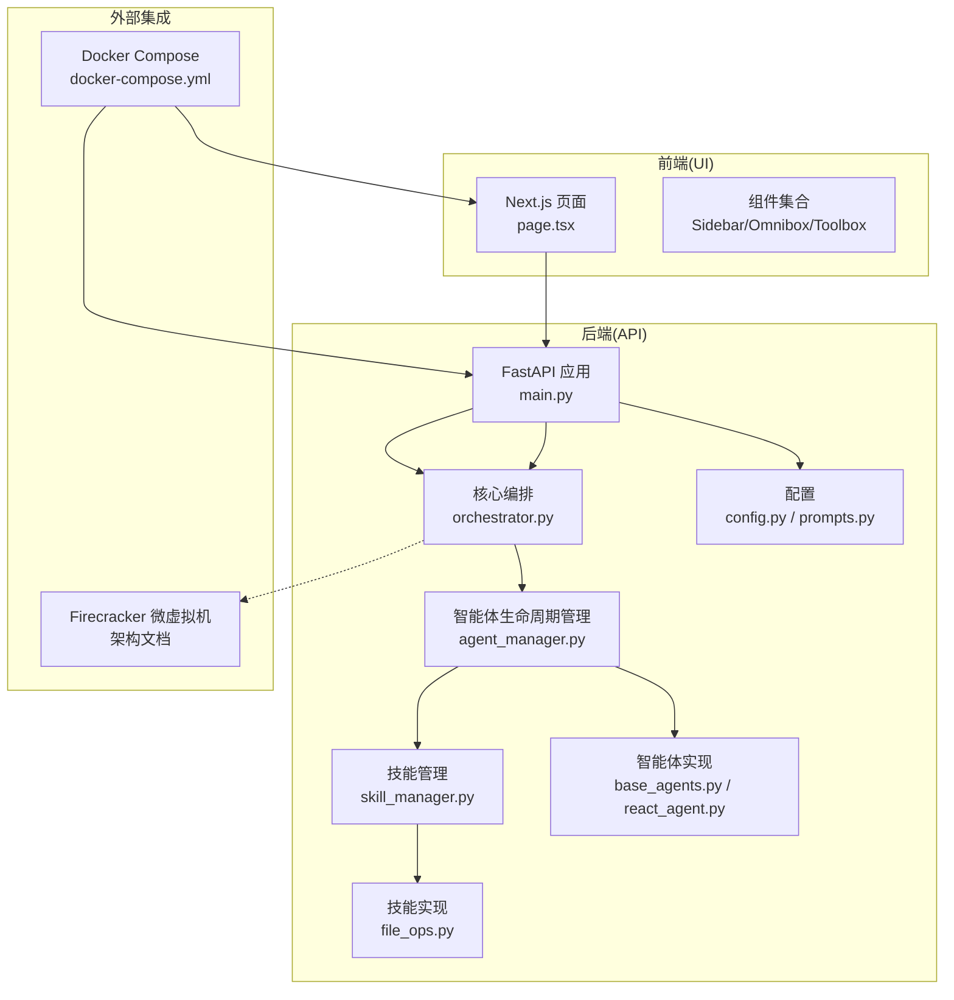
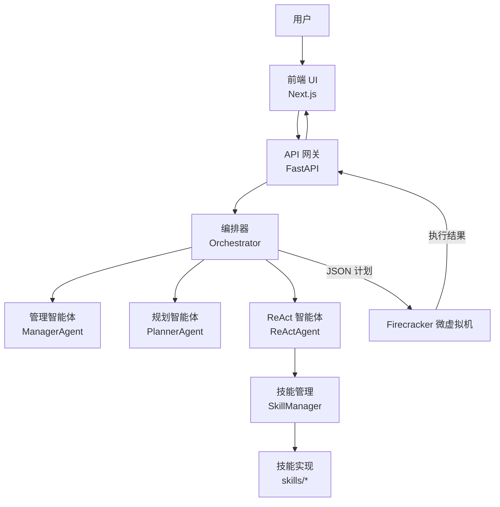
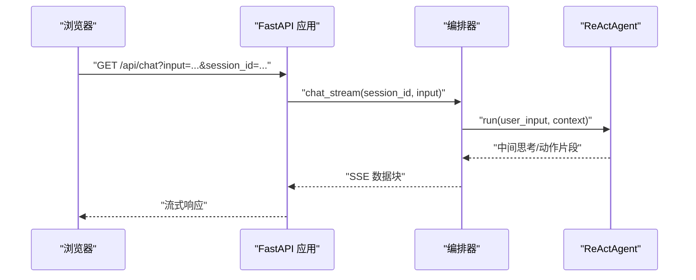
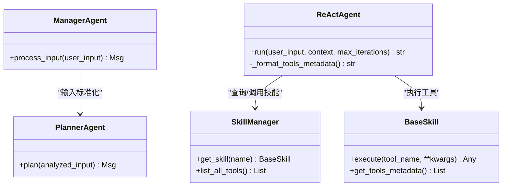
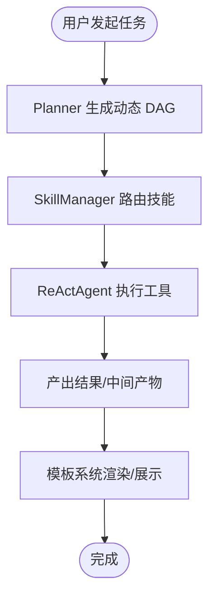
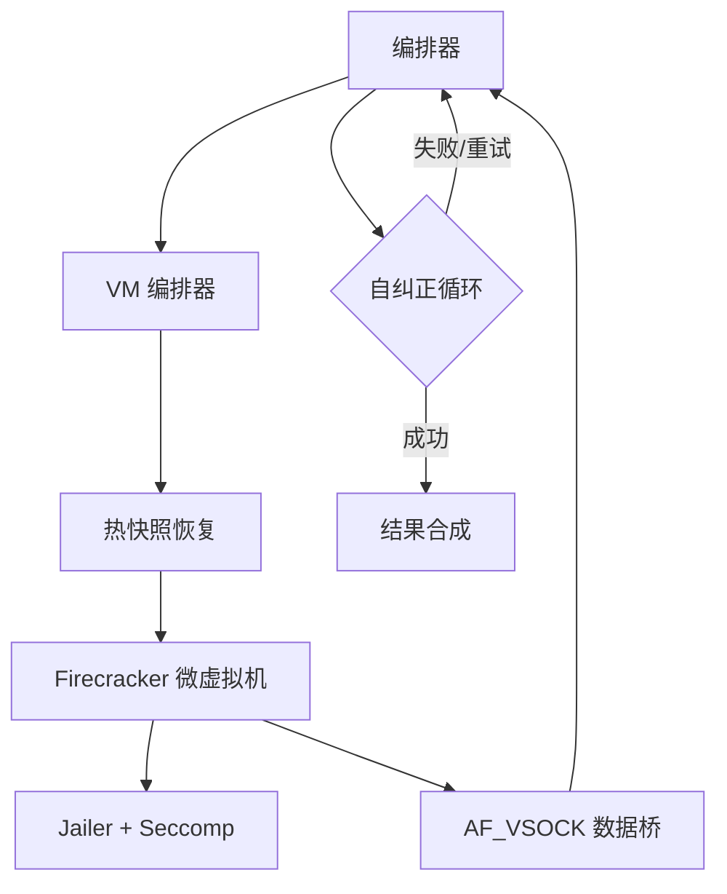
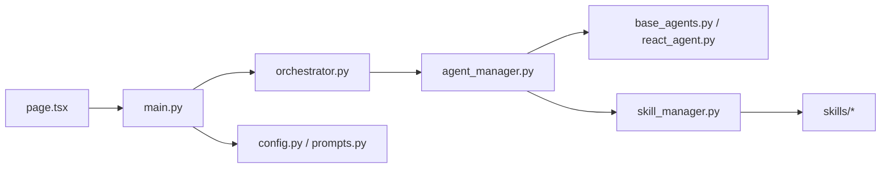

# 项目概述

<cite>
**本文引用的文件**
- [main.py](file://localmanus-backend/main.py)
- [orchestrator.py](file://localmanus-backend/core/orchestrator.py)
- [agent_manager.py](file://localmanus-backend/core/agent_manager.py)
- [react_agent.py](file://localmanus-backend/agents/react_agent.py)
- [base_agents.py](file://localmanus-backend/agents/base_agents.py)
- [skill_manager.py](file://localmanus-backend/core/skill_manager.py)
- [file_ops.py](file://localmanus-backend/skills/file_ops.py)
- [prompts.py](file://localmanus-backend/core/prompts.py)
- [config.py](file://localmanus-backend/core/config.py)
- [localmanus_architecture.md](file://localmanus_architecture.md)
- [docker-compose.yml](file://docker-compose.yml)
- [package.json](file://localmanus-ui/package.json)
- [page.tsx](file://localmanus-ui/app/page.tsx)
</cite>

## 目录
1. [引言](#引言)
2. [项目结构](#项目结构)
3. [核心组件](#核心组件)
4. [架构总览](#架构总览)
5. [详细组件分析](#详细组件分析)
6. [依赖分析](#依赖分析)
7. [性能考虑](#性能考虑)
8. [故障排查指南](#故障排查指南)
9. [结论](#结论)
10. [附录](#附录)

## 引言
LocalManus 是一个面向“自然语言到数字化产出”的实时转换平台，其核心价值在于通过“动态多智能体系统（MAS）+ 沙箱执行”的组合，将用户的自然语言请求即时转化为可交付的文档、演示文稿、网页等结构化产物。项目以 AgentScope 为基础，构建了“意图解析—任务规划—工具路由—沙箱执行—结果合成”的闭环流水线，并通过 Firecracker 微虚拟机提供高性能、强隔离的受控执行环境，确保复杂任务在安全可控的前提下稳定完成。

本项目旨在解决以下问题：
- 自然语言到结构化产出的端到端自动化
- 复杂任务的动态拆解与自纠错
- 多样化技能的按需加载与安全执行
- 实时交互体验与可观测性

技术愿景是：以多智能体为“大脑”，以技能为“手脚”，以沙箱为“执行器”，形成“可推理、可路由、可执行、可回溯”的智能工作流体系。

## 项目结构
项目采用前后端分离的双仓库结构：
- 后端（localmanus-backend）：基于 FastAPI 的 API 网关，负责多智能体编排、对话流式输出、WebSocket 实时交互、任务规划与 ReAct 执行。
- 前端（localmanus-ui）：基于 Next.js 的 Web 应用，提供聊天界面、模板展示与工具箱入口。
- 文档与编排：架构文档与 compose 文件描述了系统整体设计与部署形态。

图表来源
- [main.py](file://localmanus-backend/main.py#L1-L95)
- [orchestrator.py](file://localmanus-backend/core/orchestrator.py#L1-L118)
- [agent_manager.py](file://localmanus-backend/core/agent_manager.py#L1-L31)
- [react_agent.py](file://localmanus-backend/agents/react_agent.py#L1-L104)
- [base_agents.py](file://localmanus-backend/agents/base_agents.py#L1-L41)
- [skill_manager.py](file://localmanus-backend/core/skill_manager.py#L1-L84)
- [file_ops.py](file://localmanus-backend/skills/file_ops.py#L1-L41)
- [config.py](file://localmanus-backend/core/config.py#L1-L21)
- [prompts.py](file://localmanus-backend/core/prompts.py#L1-L53)
- [docker-compose.yml](file://docker-compose.yml#L1-L16)
- [page.tsx](file://localmanus-ui/app/page.tsx#L1-L184)

章节来源
- [main.py](file://localmanus-backend/main.py#L1-L95)
- [docker-compose.yml](file://docker-compose.yml#L1-L16)
- [package.json](file://localmanus-ui/package.json#L1-L26)

## 核心组件
- API 网关（FastAPI）
  - 提供根路径健康检查、SSE 对话接口、同步任务规划接口、ReAct 循环接口以及 WebSocket 实时流。
  - 支持跨域与日志记录，便于前端与 UI 的联调与观测。
- 多智能体编排（Orchestrator）
  - 维护会话历史、封装对话流式输出、执行任务规划与 ReAct 循环。
  - 内置 JSON 提取器，支持从多轮对话中抽取结构化计划。
- 智能体生命周期管理（AgentLifecycleManager）
  - 初始化 AgentScope、加载本地模型配置，构造 Manager、Planner、ReActAgent。
- 基础智能体（Manager/Planner）
  - Manager 负责标准化用户输入并维护 TraceID；Planner 负责生成动态 DAG 并检索可用技能。
- ReAct 智能体（ReActAgent）
  - 基于对话型智能体，遵循“思考—行动—观察”循环，解析并执行技能调用。
- 技能管理（SkillManager）
  - 动态扫描 skills 目录，加载技能类，统一暴露工具元数据，支持异步/同步工具执行。
- 技能示例（FileOps）
  - 提供文件读写、目录列举等基础能力，作为技能扩展的参考实现。
- 配置与提示词（config/prompts）
  - 统一管理模型配置与系统提示词模板，保证智能体行为一致性。

章节来源
- [main.py](file://localmanus-backend/main.py#L1-L95)
- [orchestrator.py](file://localmanus-backend/core/orchestrator.py#L1-L118)
- [agent_manager.py](file://localmanus-backend/core/agent_manager.py#L1-L31)
- [base_agents.py](file://localmanus-backend/agents/base_agents.py#L1-L41)
- [react_agent.py](file://localmanus-backend/agents/react_agent.py#L1-L104)
- [skill_manager.py](file://localmanus-backend/core/skill_manager.py#L1-L84)
- [file_ops.py](file://localmanus-backend/skills/file_ops.py#L1-L41)
- [prompts.py](file://localmanus-backend/core/prompts.py#L1-L53)
- [config.py](file://localmanus-backend/core/config.py#L1-L21)

## 架构总览
LocalManus 的整体架构围绕“AgentScope 动态多智能体 + Firecracker 沙箱执行”展开。前端通过 Next.js 与后端 FastAPI 交互，后端通过 Orchestrator 协调 Manager/Planner/ReActAgent，ReActAgent 通过 SkillManager 调用具体技能，最终由 Firecracker 微虚拟机在隔离环境中执行技能，实现“自然语言—任务规划—受控执行—结果合成”的闭环。

图表来源
- [localmanus_architecture.md](file://localmanus_architecture.md#L1-L137)
- [main.py](file://localmanus-backend/main.py#L1-L95)
- [orchestrator.py](file://localmanus-backend/core/orchestrator.py#L1-L118)
- [agent_manager.py](file://localmanus-backend/core/agent_manager.py#L1-L31)
- [react_agent.py](file://localmanus-backend/agents/react_agent.py#L1-L104)
- [skill_manager.py](file://localmanus-backend/core/skill_manager.py#L1-L84)

## 详细组件分析

### API 网关与实时交互
- GET /：健康检查与版本信息
- GET /api/chat：SSE 流式对话，支持多轮历史与错误处理
- POST /api/task：同步任务规划（演示用途）
- POST /api/react：同步 ReAct 循环执行
- WS /ws/task/{trace_id}：WebSocket 实时状态与结果推送，支持“thought/result”类型消息

图表来源
- [main.py](file://localmanus-backend/main.py#L30-L38)
- [orchestrator.py](file://localmanus-backend/core/orchestrator.py#L13-L60)
- [react_agent.py](file://localmanus-backend/agents/react_agent.py#L49-L68)

章节来源
- [main.py](file://localmanus-backend/main.py#L1-L95)
- [page.tsx](file://localmanus-ui/app/page.tsx#L24-L90)

### 多智能体编排（Manager/Planner/ReAct）
- Manager：将用户输入标准化为结构化意图，维护会话 TraceID，为 Planner 提供上下文。
- Planner：根据可用技能生成动态 DAG，包含步骤 ID、技能名、参数与依赖关系。
- ReAct：在“思考—行动—观察”循环中解析并执行技能调用，支持 Final Answer 结束条件。

图表来源
- [base_agents.py](file://localmanus-backend/agents/base_agents.py#L6-L40)
- [react_agent.py](file://localmanus-backend/agents/react_agent.py#L32-L104)
- [skill_manager.py](file://localmanus-backend/core/skill_manager.py#L42-L84)

章节来源
- [base_agents.py](file://localmanus-backend/agents/base_agents.py#L1-L41)
- [prompts.py](file://localmanus-backend/core/prompts.py#L1-L53)
- [react_agent.py](file://localmanus-backend/agents/react_agent.py#L1-L104)
- [skill_manager.py](file://localmanus-backend/core/skill_manager.py#L1-L84)

### 技能系统与模板系统
- 技能系统
  - BaseSkill：统一工具路由与元数据导出
  - SkillManager：动态扫描 skills 目录，加载技能类，聚合工具元数据
  - 示例技能：FileOps（文件读写/目录列举）
- 模板系统
  - 前端页面提供模板分类与卡片展示，支持上传、创建与模板使用入口
  - 与后端任务规划结合，可将模板作为“技能输入”或“产物目标”的一部分

图表来源
- [skill_manager.py](file://localmanus-backend/core/skill_manager.py#L48-L83)
- [file_ops.py](file://localmanus-backend/skills/file_ops.py#L4-L41)
- [page.tsx](file://localmanus-ui/app/page.tsx#L92-L178)

章节来源
- [skill_manager.py](file://localmanus-backend/core/skill_manager.py#L1-L84)
- [file_ops.py](file://localmanus-backend/skills/file_ops.py#L1-L41)
- [page.tsx](file://localmanus-ui/app/page.tsx#L1-L184)

### Firecracker 沙箱执行（架构视角）
- 生命周期与延迟优化：热快照池、内存快照恢复（<10ms）、临时生命周期
- 安全通信：MMDS（微元数据服务）与 AF_VSOCK（高速安全通道），串口控制台作为后备
- 安全实现：Jailer + seccomp，隔离层与权限降级
- 与编排器协作：规划阶段输出的技能调用在沙箱内执行，失败时进入自纠正循环

图表来源
- [localmanus_architecture.md](file://localmanus_architecture.md#L50-L66)

章节来源
- [localmanus_architecture.md](file://localmanus_architecture.md#L1-L137)

## 依赖分析
- 组件耦合与内聚
  - API 网关与编排器松耦合：通过 Orchestrator 统一调度智能体与技能
  - 智能体与技能解耦：ReActAgent 仅依赖 SkillManager 的抽象接口
  - 技能与执行环境解耦：技能在沙箱内执行，避免污染宿主环境
- 外部依赖与集成点
  - AgentScope：多智能体通信与编排
  - Firecracker：高性能、强隔离的微虚拟机执行环境
  - FastAPI/WebSocket：实时交互与流式输出
  - Next.js：前端 UI 与模板展示
- 潜在循环依赖
  - 当前结构清晰，未见直接循环导入；若未来扩展技能目录扫描逻辑，需注意相对导入与绝对导入的一致性

图表来源
- [main.py](file://localmanus-backend/main.py#L1-L95)
- [orchestrator.py](file://localmanus-backend/core/orchestrator.py#L1-L118)
- [agent_manager.py](file://localmanus-backend/core/agent_manager.py#L1-L31)
- [react_agent.py](file://localmanus-backend/agents/react_agent.py#L1-L104)
- [skill_manager.py](file://localmanus-backend/core/skill_manager.py#L1-L84)
- [page.tsx](file://localmanus-ui/app/page.tsx#L1-L184)

章节来源
- [main.py](file://localmanus-backend/main.py#L1-L95)
- [agent_manager.py](file://localmanus-backend/core/agent_manager.py#L1-L31)
- [skill_manager.py](file://localmanus-backend/core/skill_manager.py#L1-L84)

## 性能考虑
- 流式输出与低延迟
  - SSE 与 WebSocket 降低前端等待时间，提升交互体验
  - ReAct 循环中的“思考—行动—观察”可分片输出，前端逐步渲染
- 智能体与技能的异步化
  - 工具方法支持协程函数，便于 IO 密集型技能（如文件读写）并发执行
- 沙箱启动优化
  - 热快照恢复显著缩短 VM 启动时间，适合高频短生命周期任务
- 资源限制与隔离
  - Firecracker 层面的内存/CPU 硬限制与 Jailer 权限降级，避免资源滥用

## 故障排查指南
- 对话流式输出异常
  - 检查会话上限与错误返回逻辑，确认前端正确解析 SSE 数据块
- ReAct 循环执行失败
  - 关注工具参数解析与异常分支，确保工具名称与参数匹配
- 技能加载失败
  - 检查 skills 目录结构与类继承关系，确认动态导入路径
- WebSocket 断连
  - 查看连接日志与断开捕获，确认客户端与服务端握手与心跳机制
- 模板展示问题
  - 核对模板数据结构与前端渲染逻辑，确保标签与使用次数字段一致

章节来源
- [orchestrator.py](file://localmanus-backend/core/orchestrator.py#L13-L64)
- [react_agent.py](file://localmanus-backend/agents/react_agent.py#L73-L98)
- [skill_manager.py](file://localmanus-backend/core/skill_manager.py#L48-L71)
- [page.tsx](file://localmanus-ui/app/page.tsx#L84-L90)

## 结论
LocalManus 通过“AgentScope 动态多智能体 + Firecracker 沙箱执行”的组合，实现了从自然语言到结构化产出的实时转换。其核心特性包括：多智能体编排、技能路由与动态 DAG、ReAct 执行循环、实时交互与流式输出、模板系统与前端 UI。技术栈选择兼顾了灵活性与安全性：AgentScope 提供多智能体通信与规划能力，Firecracker 提供硬件级隔离与快速启动，FastAPI/WebSocket 提供实时可观测性，Next.js 提供现代化前端体验。对于初学者，建议先从前端模板与对话流式输出入手；对于开发者，可深入编排器、ReActAgent 与技能系统的扩展与优化。

## 附录
- 部署与运行
  - 使用 Docker Compose 启动前端服务（端口 3000），后端服务可在后续补充
- 开发建议
  - 新增技能时遵循 BaseSkill 接口，确保工具元数据与参数签名一致
  - 在编排器中增加更细粒度的日志与追踪（TraceID），便于问题定位
  - 在前端增加错误兜底与重试提示，提升用户体验

章节来源
- [docker-compose.yml](file://docker-compose.yml#L1-L16)
- [package.json](file://localmanus-ui/package.json#L1-L26)