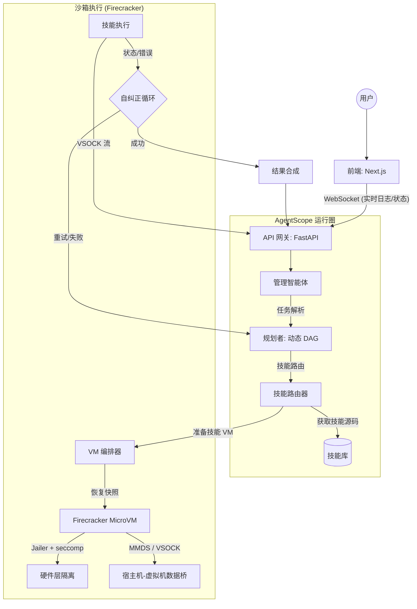

# LocalManus 架构设计文档 (修订版：Firecracker & AgentScope)

## 1. 系统架构概述
LocalManus 从静态工作流模型转型为基于 **AgentScope** 的 **动态多智能体系统 (MAS)**。该架构使平台能够将复杂的、不可预测的用户请求实时分解为一系列可执行的子任务。

### 1.1 高层流程 (Firecracker MicroVM 执行)

---

## 2. 核心组件

### 2.1 基于 AgentScope 的动态规划
LocalManus 利用 AgentScope 的消息传递和编排能力，而非预定义的路径：
- **管理智能体 (Manager Agent)**：标准化用户输入并维护会话 TraceID。
- **规划智能体 (Planner Agent)**：生成动态的任务有向无环图 (DAG)，并检索最合适的 **技能 (Skills)**。
- **自旋/反思 (Self-Spinning/Reflexion)**：来自 Firecracker 沙箱的实时反馈允许规划者精细化并重新运行子任务。

### 2.2 技能系统与自动安装
技能是粒度化的 Python/Node.js 模块。
- **延迟加载**：技能仅在需要时才注入到虚拟机中。
- **依赖隔离**：常用软件包预装在 **基础镜像** 中，而任务特定的依赖项则在执行期间安装到临时层中。

---

## 3. 高性能沙箱：Firecracker 集成

### 3.1 生命周期与延迟优化
1.  **热快照 (Warm Snapshotting)**：VM 编排器维护一个“热”快照池（预启动的内核及基础运行时）。
2.  **快照恢复**：从内存快照恢复虚拟机的速度 **<10ms**，远快于标准容器启动或完整虚拟机启动。
3.  **临时生命周期**：每次技能执行都会触发 `恢复快照 -> 执行 -> 销毁` 循环，确保零持久状态。

### 3.2 安全通信 (VSOCK & MMDS)
- **MMDS (微元数据服务)**：用于在不配置网络的情况下进行初始技能注入和环境变量传递。
- **AF_VSOCK**：主要数据通道。VSOCK 在宿主机（Agent 网关）和虚拟机（技能执行）之间提供高速、安全的套接字桥梁，绕过传统的 TCP/IP 协议栈，有效防御网络攻击。
- **串口控制台 (Serial Console)**：作为底层内核错误的后备捕获手段。

### 3.3 安全实现 (Jailer)
- **隔离层**：每个 Firecracker 进程都在 **Firecracker Jailer** 中运行。
- **权限降级**：Jailer 利用 `chroot`、cgroups 和网络命名空间剥离 VMM 进程的所有不必要权限。
- **Seccomp 过滤器**：自定义系统调用过滤，防止虚拟机与宿主机内核进行非必要的 I/O 交互。

---

## 4. 详细执行管道

### 4.1 从意图到执行
1.  **请求**：用户输入“分析此 CSV 并绘制图表”。
2.  **规划**：AgentScope 识别出 `data_analyzer` 技能。
3.  **VM 准备**：VM 管理器在 Firecracker microVM 中恢复 Python 运行时快照（~5ms）。
4.  **技能挂载**：`.py` 技能源码和 CSV 文件通过 virtio-blk 设备挂载，或通过 VSOCK 同步。

### 4.2 执行与自纠正
1.  **执行者 (虚拟机内)**：运行代码。
2.  **流传输**：标准输出通过 **VSOCK -> 网关 -> WebSocket** 实时传回前端。
3.  **错误处理**：如果执行失败（如缺少库），错误信息将反馈给 AgentScope 的规划者。
4.  **螺旋自纠正**：规划者可决定：
    - 更新 `requirements.txt` 并触发自动安装。
    - 选择备选技能。

---

## 5. 技术栈 (最终版)

| 层级 | 技术 | 理由 |
| :--- | :--- | :--- |
| **编排** | **AgentScope** | 多智能体通信与自主规划。 |
| **VMM (沙箱)** | **Firecracker** | AWS 级别的硬件隔离及服务器级启动速度。 |
| **全栈预览** | **Fireprox / Micro-Proxy** | 实现沙箱内部 Web 服务（localhost:3000 等）的安全对外暴露。 |
| **VM 管理** | **Firecracker-containerd** | 简化 Firecracker 的 OCI 兼容镜像管理。 |
| **桥接** | **AF_VSOCK** | 高性能、安全的宿主机-虚拟机通信。 |
| **隔离** | **Jailer + gVisor (可选)** | 深度防御的分层安全性。 |
| **实时 API** | **FastAPI + WebSockets** | 状态心跳与日志流传输。 |

---

## 6. 安全策略
- **根文件系统 (RootFS)**：只读根文件系统，配合 `overlayfs` 处理临时写入。
- **网络流出**：默认拒绝；仅允许白名单访问 LLM API 和必需的数据源。
- **实例限制**：在 Firecracker microVM 层面强制执行内存和 CPU 硬限制。
