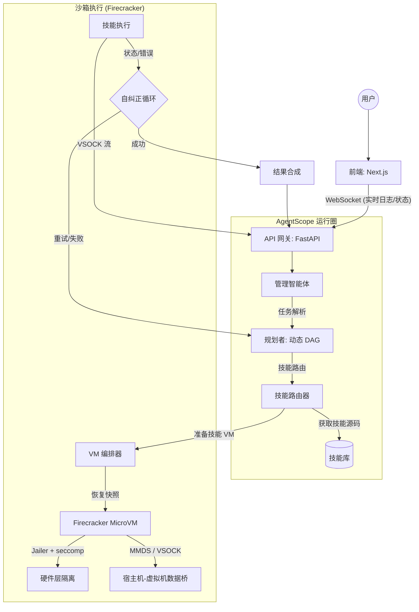
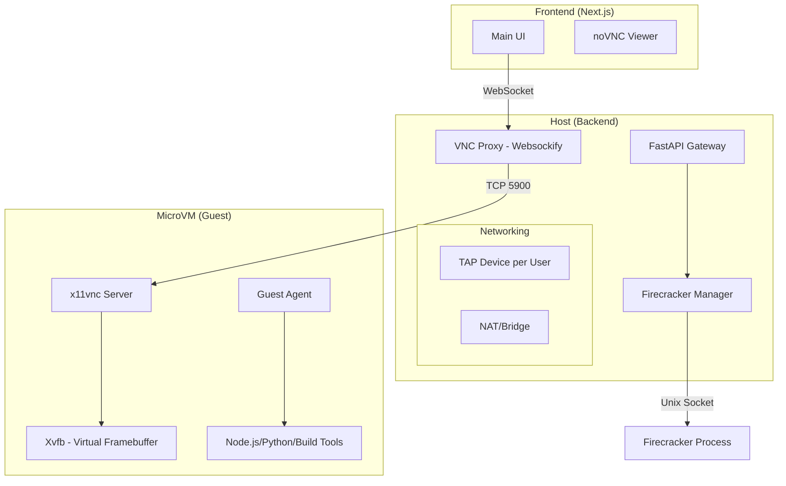

# LocalManus 架构设计文档 (修订版：Firecracker & AgentScope)

## 1. 系统架构概述
LocalManus 从静态工作流模型转型为基于 **AgentScope** 的 **动态多智能体系统 (MAS)**。该架构使平台能够将复杂的、不可预测的用户请求实时分解为一系列可执行的子任务。

### 1.1 高层流程 (Firecracker MicroVM 执行)


---

## 2. 核心组件

### 2.1 基于 AgentScope 的动态规划
LocalManus 利用 AgentScope 的消息传递和编排能力，而非预定义的路径：
- **管理智能体 (Manager Agent)**：标准化用户输入并维护会话 TraceID。
- **规划智能体 (Planner Agent)**：生成动态的任务有向无环图 (DAG)，并检索最合适的 **技能 (Skills)**。
- **自旋/反思 (Self-Spinning/Reflexion)**：来自 Firecracker 沙箱的实时反馈允许规划者精细化并重新运行子任务。

### 2.2 技能系统与自动安装
技能是粒度化的 Python/Node.js 模块。
- **延迟加载**：技能仅在需要时才注入到虚拟机中。
- **依赖隔离**：常用软件包预装在 **基础镜像** 中，而任务特定的依赖项则在执行期间安装到临时层中。

---

## 3. 高性能沙箱：Firecracker 集成

### 3.1 架构设计 (支持 VNC 可视化)
为了支持全栈生成、代码运行及实时视觉监控，LocalManus 采用基于 Firecracker 的微虚拟机架构：



### 3.2 核心组件
1.  **Firecracker Manager**: 管理 VM 的生命周期（初始化、资源分配、启动、销毁）。
2.  **TAP Networking**: 为每个 VM 分配独立的 IP 段，并通过主机的 TAP 设备进行通信。
3.  **VNC Visual Stream**: 
    - 虚拟机内部运行 Xvfb 和 x11vnc。
    - 主机端运行 Websockify 代理，将 VNC 的原始 TCP 流量转换为浏览器可识别的 WebSocket 流量。
4.  **Guest Agent**: 接收来自宿主机的执行指令并在 VM 内部触发全栈生成任务。

### 3.3 生命周期与延迟优化
1.  **热快照 (Warm Snapshotting)**：VM 编排器维护一个“热”快照池（预启动的内核及基础运行时）。
2.  **快照恢复**：从内存快照恢复虚拟机的速度 **<10ms**，远快于标准容器启动或完整虚拟机启动。
3.  **临时生命周期**：每次技能执行都会触发 `恢复快照 -> 执行 -> 销毁` 循环，确保零持久状态。

### 3.4 安全通信 (VSOCK & MMDS)
- **MMDS (微元数据服务)**：用于在不配置网络的情况下进行初始技能注入和环境变量传递。
- **AF_VSOCK**：主要数据通道。VSOCK 在宿主机（Agent 网关）和虚拟机（技能执行）之间提供高速、安全的套接字桥梁，绕过传统的 TCP/IP 协议栈，有效防御网络攻击。
- **串口控制台 (Serial Console)**：作为底层内核错误的后备捕获手段。

### 3.5 安全实现 (Jailer)
- **隔离层**：每个 Firecracker 进程都在 **Firecracker Jailer** 中运行。
- **权限降级**：Jailer 利用 `chroot`、cgroups 和网络命名空间剥离 VMM 进程的所有不必要权限。
- **Seccomp 过滤器**：自定义系统调用过滤，防止虚拟机与宿主机内核进行非必要的 I/O 交互。

---

## 4. 系统处理链路细节 (以 PDF 转 Word 为例)

为了确保复杂任务的高可靠性，LocalManus 采用三层递进的处理链路。

### 4.1 阶段一：Query 到规划 Agent (意图解析与环境对齐)
当用户输入 "帮我把这个 `proposal.pdf` 转换成 Word" 时：
1.  **Context 聚合**：Manager Agent 自动搜集环境元数据：
    *   **文件系统上下文**：`proposal.pdf` 的路径、大小、读写权限。
    *   **资源上下文**：当前宿主机的 CPU/内存剩余，是否已拉取相关基础镜像。
2.  **规划启动**：Planner Agent 接收到格式化的任务元组：
    *   `Goal`: Convert PDF to DOCX.
    *   `Constraint`: Local execution only, maintain original layout.
    *   `Knowledge`: 识别到 PDF 可能包含非搜索文本（需 OCR 判定）。

### 4.2 阶段二：规划 Agent 执行技能路由 (语义映射)
Planner 不直接操作文件，而是通过 **AgentScope 的工具检索器** 映射技能：
1.  **技能发现**：在 `SkillRegistry` 中检索符合 `pdf` 和 `word` 标签的模块。
2.  **逻辑路由决策**：
    *   如果文件 > 50MB，优先路由至 `system_native_converter`（高性能 C++ 封装）。
    *   如果文件涉及复杂排版，路由至 `python_layout_analyzer` + `docx_generator` 组合。
3.  **入参标准化**：生成符合技能 Schema 的 JSON：
    ```json
    {
      "skill": "pdf_convert_core",
      "params": {
        "input_path": "/mnt/data/proposal.pdf",
        "output_format": "docx",
        "ocr_fallback": true
      }
    }
    ```

### 4.3 阶段三：执行技能与入参 (受控执行)
1.  **执行环境注入**：VM 管理器通过 **VSOCK** 将入参 Payload 推送到 Firecracker 内部的监控进程。
2.  **数据挂载**：`proposal.pdf` 所在的目录映射为 VM 内的只读设备，确保安全性。
3.  **自纠正循环**：
    *   如果技能返回 `Error: Missing Font`, 规划智能体会捕获此上下文。
    *   **再次规划**：Planner 决定执行 `font_installer` 技能，或提示用户选择替代方案。

---

## 5. 技术栈 (最终版)

| 层级 | 技术 | 理由 |
| :--- | :--- | :--- |
| **编排** | **AgentScope** | 多智能体通信与自主规划。 |
| **VMM (沙箱)** | **Firecracker** | AWS 级别的硬件隔离及服务器级启动速度。 |
| **全栈预览** | **Fireprox / Micro-Proxy** | 实现沙箱内部 Web 服务（localhost:3000 等）的安全对外暴露。 |
| **VM 管理** | **Firecracker-containerd** | 简化 Firecracker 的 OCI 兼容镜像管理。 |
| **桥接** | **AF_VSOCK** | 高性能、安全的宿主机-虚拟机通信。 |
| **隔离** | **Jailer + gVisor (可选)** | 深度防御的分层安全性。 |
| **实时 API** | **FastAPI + WebSockets** | 状态心跳与日志流传输。 |

---

## 6. 安全策略
- **根文件系统 (RootFS)**：只读根文件系统，配合 `overlayfs` 处理临时写入。
- **网络流出**：默认拒绝；仅允许白名单访问 LLM API 和必需的数据源。
- **实例限制**：在 Firecracker microVM 层面强制执行内存和 CPU 硬限制。
